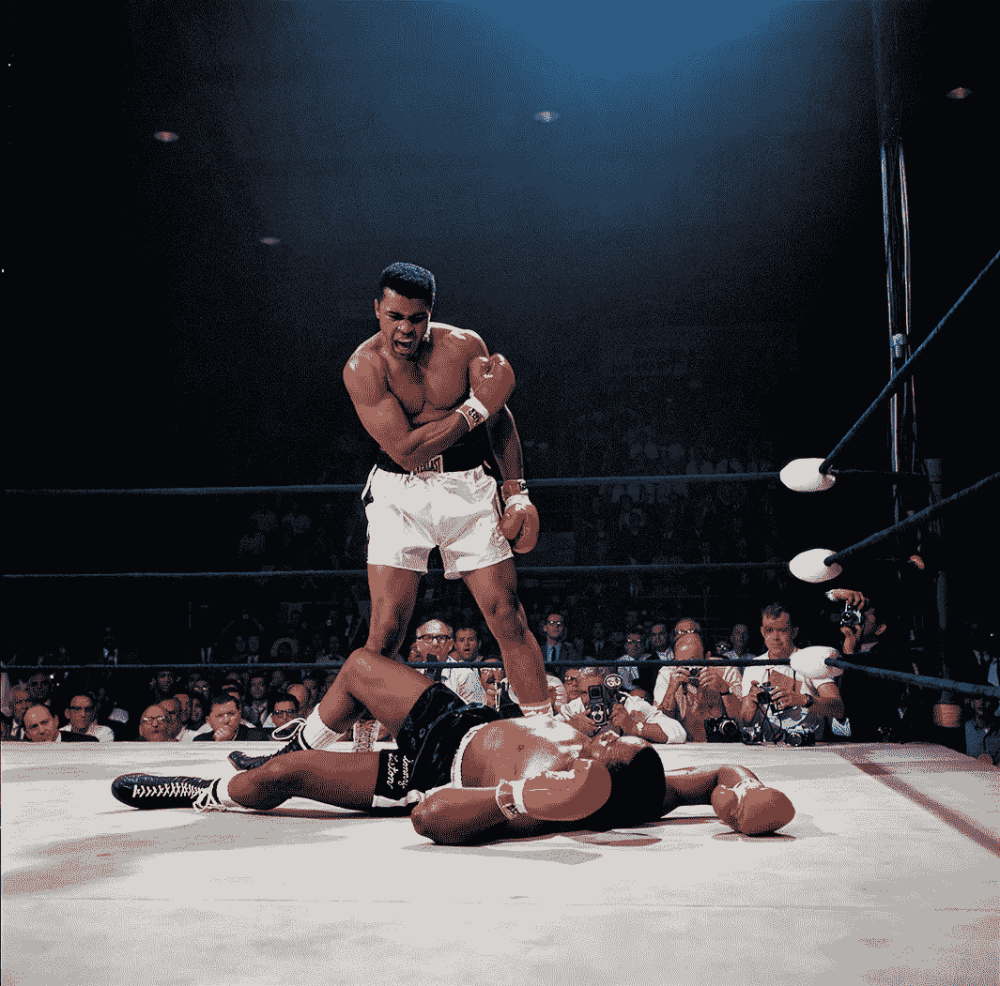

# 如何排除任何障碍

> 原文：<https://medium.com/hackernoon/how-to-knock-out-any-obstacle-598988b15748>

Getty Images

你将在生活中面临许多障碍。

在你的工作中，在你的创业中，在你的人际关系中。

障碍、壁垒和问题无处不在。

是你击倒他们还是你自己被击倒取决于你自己。

我一生都在努力研究伟人。

像查理·芒格、圣雄甘地、亚伯拉罕·林肯、雷伊·达里奥、史蒂夫·乔布斯甚至乔治·克鲁尼这样的人。

下面是他们为确保排除任何和所有可能出现在他们面前的障碍而做的事情。

# 非常合理:

最成功的人都是理智的。

有什么阻碍了你吗？

有没有你想要的东西不顺心？

> 第一步是要认识到，只有你才能决定这个障碍会如何影响你。

**科学家发现大多数人在遇到障碍时都会犯一个简单的错误:**

> 他们混淆了真实发生的事情和他们对它的理解。

作为人类，我们经常错误地感知事件，将我们的情感和错误的观念与它们联系在一起。

**下次当你遇到不好的事情时，保证保持冷静和理性。把这种情况简单地看作是已经发生的具体的、不连续的事情。**

不要从中建立一个想象事件的完整链条。

也许你今年没有得到晋升或者你没有得到你想要的项目。你可以相信你的老板不喜欢你，或者你只是不太擅长你的工作，或者你应该离开并加入一家新公司。

我看到并感受到了所有这些情绪。

> 2010 年没做 MD 的时候，我回家哭了。躺在黑暗中想放弃，怀疑自己是否浪费了生命。

过了几个星期才恢复。

我慢慢后退，明白自己做错了什么，计划好下一步，继续前进。

相反，我本可以做出不理智的决定并生气，但那能做什么呢？

**还记得查理·芒格(沃伦·巴菲特的合伙人)说过的话:**

> 很多其他人都试图变得聪明，而我们只是想变得理智。

# 成为血腥的解决方案:

当乔治·克鲁尼来到好莱坞时，他有一个选择。

他可以试着像其他演员一样，专注于推销他的经验和表演技巧，或者他可以专注于把自己推销成选角经理的完美解决方案。

**他了解选角经理面临的问题，并将自己定位为完美的解决方案。**

选角经理想要一个可靠且值得信赖的人。一个他们可以指望的人。这就是乔治·克鲁尼对自己的定位。**他没有突出自己的演技；他强调了自己为选角经理解决问题的能力。**

有趣的是，著名的哈佛教授克莱顿·克里斯滕森也在他的书《你将如何衡量你的生活》中谈到了这个想法。

下一次想做 MD 的时候看了这本书。

这一次，我没有让老板提拔我，而是花了一些时间去了解她需要什么，她的痛点是什么，她在努力做什么，她想要什么。

> 她雇我做什么工作？

**这里有一些关于如何理解问题并成为解决方案的想法:**

1.  花时间了解你工作的行业或业务，这个行业面临的问题是什么。
2.  了解在那里工作的人，他们的日常生活是什么样的。你如何能对他们有所帮助？你能增加什么价值？
3.  获取专注于你想做的工作的新技能——一些简单的想法:商业写作、说服和公共演讲。更多[创意在此](https://www.wilowallstreet.com/smarter/the-habits-of-winners/)。

**还记得圣雄甘地说过的话吗:**

> 找到自我的最好方法是在为他人服务中迷失自我。

# 要有战略眼光:

大多数人都想从紧闭的前门进去。他们想直接解决这个问题。你猜怎么着，前门通常是关着的，非常拥挤。

其他人也在网上申请工作，告诉他们的老板他们想要加薪或升职，或者追逐猎头。

如果你换个角度思考这个问题会怎么样？

如果你是战略型的，会怎么样？

> 如果你使用开放的后门呢？你可以直接走进去。

这是成功人士的做法。找一条更容易进去的路，一条别人看不到的路。

**这就是战略。以下是一些想法:**

与其在网上申请，也许你可以与你想加入的团队中的人建立关系，给他们发你的作品样本，并通过你认识的人介绍给他们。

也许你想办法找个非周期实习来积累经验，积累人脉。

你没有直接向老板要求加薪或升职，而是负责一个高调的项目，也许你找到了为公司建立新业务的方法，也许你只是带来了一两个新客户并引起了注意。

也许你开始在 LinkedIn 或 Mediu 上写在线文章，而不是打电话给猎头公司。建立追随者和影响力。

也许你开始给你钦佩的人发送你的工作或想法的硬拷贝，也许你向他们要求一份无薪实习来获得你的第一步。

> 问问你自己一个伟大的人在这种情况下会怎么做。对于有这种问题的朋友，我的建议是什么？

记得阿尔伯特·爱因斯坦说过的话吗

> 疯狂的定义是一遍又一遍地做同样的事情，却期待不同的结果。

# 万分感激:

2009 年，我所在的团队经历了一些变化。金融危机导致团队规模缩小，我有一种不好的感觉，我的职业生涯可能会因此放缓。

不仅危机让我感到紧张，而且现在想到如何在 2009 年找到一份新工作真的让我感到紧张。

我既害怕又沮丧。

如果这还不够的话，我刚刚结婚，31 岁还带着妻子失业更让人沮丧。

**但是我知道我必须迅速改变我的精神状态和信仰，否则我就完了。**

**改变你的状态的诀窍是问更好的问题，所以我选择颠倒一下情况。**

> 我问自己，有这个问题有什么好？

每当你跌倒时，试着问这个问题。

我意识到，有了这个问题，我就可以从头开始，寻找最好的机会，而不会被束缚在一个缓慢发展的业务中。

我意识到，我是多么幸运，仍然有一份工作，我的关系和我的技能。

这些见解足以打破我沮丧模式。

我发现他很感激我能和别人分享我在过去十年里学到的东西。我开始寻找可以涉足的新领域，并考虑银行中可以从我的技能中受益的其他部门。

几周之后，我在我们的伦敦办事处找到了一份工作。这是我过去几年梦寐以求的事情，但却没有勇气去做。

**还记得大哲学家柏拉图说过的话:**

> 一颗感恩的心是一颗伟大的心，它最终会吸引伟大的事物。

# 坚持不懈:

每当坏事发生，不要迷失在喧嚣中。

你可能想放弃。不要。

坚持这个问题。

也许你没有升职。

也许你只是被解雇了。

可能面试不顺利吧。

没关系。

你会没事的。

关注当下，记住这一刻不是你的生活，它只是你生命中的一瞬间！

你今天能用你所拥有的做什么？

要坚持。

如果你不采取任何行动，你就会失败。

不处理就不会好起来。

如果你真的想实现你的梦想，那就继续攻克难题。

**你会成功，你会实现你的目标，但你必须坚持不懈。**

**记得安·兰德斯说过的话:**

> 机会通常伪装成努力，所以大多数人认不出来。

# 下一个级别:

我们是一群致力于帮助下一代的金融老手。我在华尔街学到的是让你更聪明、更富有、更快乐。[注册](http://www.wilowallstreet.com)获取我们关于任何工作的网络电子书，并获得我们每周的 VIP 电子邮件。

**有很多书教我们如何制定战略和克服障碍，这里有几本书是必读的:**

[人类对意义的追寻](https://www.amazon.com/gp/product/080701429X/ref=as_li_tl?ie=UTF8&tag=whileonwast0b-20&camp=1789&creative=9325&linkCode=as2&creativeASIN=080701429X&linkId=92f6db23aaac93411a11bb5ac155deba)(维克多·弗兰克尔)——从生活在纳粹集中营中学到的教训。这是一本改变人生的书。

好策略坏策略这是一本更高层次的书，有很多关于在商业中制定和执行策略的复杂想法。

你将如何衡量你的生活(克莱顿·克里斯滕森)——这本书将告诉你哪些障碍值得克服，哪些不值得。

障碍是道路(Ryan Holiday)——这是一本伟大的书，涵盖了历史上的斯多葛派哲学，有许多鼓舞人心的故事。