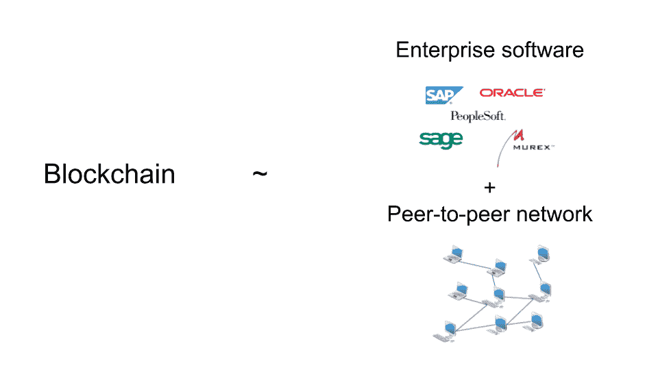

# 如何比全球 99%的人更了解区块链

> 原文：<https://medium.com/hackernoon/how-to-know-more-about-blockchain-than-99-of-the-world-1f4a0b0fccf2>

这篇文章的目的是确保区块链对你来说不再是一个可怕的单词。

*对那些不确定它是什么的人来说很可怕:他们害怕当这个词在会议或社交聚会上出现时，他们不知道该说什么。*

*对于那些确切知道它是什么，但需要在向同事的演示中解释、向上级/投资者推销或说服客户等时感到畏惧的人来说，这也很可怕。*

我觉得这是因为大多数时候，了解区块链的人会从一个技术定义开始描述它。相反，我的目标是在你的脑海中建立一个区块链的精神形象，一种对它的感觉。这样你就可以把它和你已经知道的东西联系起来。我花了很多时间和精力来建立自己的直觉，所以我希望能为你大大加快这个过程。

我决定选择简单而不是技术精确。因此，到本文结束时，初学者将非常熟悉区块链的概念，并能够用自己的话向同事和朋友轻松清晰地解释这个主题。

如果你是一名区块链专家，这件作品可能会让你一路上几次感到毛骨悚然。但是请原谅我。我希望你能找到一些有用的例子和类比，以一种通俗易懂、引人入胜的方式向你的专业观众解释区块链的概念。

# 社会压力和尴尬的会议

正如我所承诺的，我不会从任何定义或神秘的术语开始。正如你将看到的，那些定义会自然而然地出现在你面前。我个人保证你会对这篇文章中的观点感到满意。否则，(我很惭愧)我很乐意通过 LinkedIn 消息或电子邮件澄清你的任何问题。

为此，请把你自己放在一个非技术人员的位置上，这个人在过去的一两年里觉得她/他别无选择，只能理解每个人都在谈论的区块链这个词。

这一切都是从你越来越频繁地看到这个词开始的:从《时代》杂志的封面，福布斯，华尔街日报的头条，你的脸书和 Linkedin 订阅源。出于纯粹的好奇，你浏览了它们，心想“哇，它们说它将改变世界。一定是大事！”或者“自互联网以来最大的事情。Mmmh 这么大？真的吗？”。从仅仅是好奇，你开始变得好奇。然后你偶然看到一个小型区块链会议的广告。你决定尝试一下。

所以你参加了会议，会议以一位“区块链顾问”在这个问题上给出 101 分开始。你完全迷失了。在演讲结束的时候，你会感觉到剧烈的头痛。然后是一个网络会议。你并不热衷于交际，因为你唯一能想到的问题仍然是“嗯，区块链到底是什么？”。你觉得你不想让自己难堪所以你离开了。

为了确保你在区块链的时间不是完全浪费，你已经写下了演讲者提到的定义和几个关键词。

(比我的笔迹更易读的版本:

*   分布式分类帐，用于存储计算机网络中的交易/数据。
*   交易/数据以加密方式存储在一个块中。
*   每个新的积木都被添加到->区块链积木链中。
*   哈希、密码术
*   没有中央权威，不可信
*   共识、匿名、治理、公私区块链)

事后看来，你可以从智力上理解演讲中给出的一些定义，但你无法将它们联系起来。

# 你确定谷歌和维基百科会澄清这一切

后来，你想出了一个好主意，用谷歌搜索这个话题。维基百科的文章真的很可怕。然后，您浏览了许多文章、各种技术层面的博客帖子。

但是你累了。你想找到一篇梦寐以求的文章，它会轻轻地牵着你的手，带你顺利地了解你需要知道的事情。不用说，你永远也找不到这样的文章。

你脑子里的问题是:“区块链是什么？我可以把它下载到你的电脑上并开始使用吗？比如 Dropbox？或者它更像是一种在线服务，就像脸书，我在网上注册并开始工作？还是一种新的编程语言？或者这是一种像六适马一样高效组织流程的新方式？也可能是什么都有……？”

完全混乱。

你在收工前给了它最后一次机会。搜索了其他视频。最后，这个关于沃尔玛案例的视频出现了:

这是你脑海中的一个小小的“哈利路亚”时刻。这是它第一次给你带来灵感的地方。你终于感觉到你开始看到动物的一部分了！

什么成功了？嗯，你意识到了**区块链可能是某种企业软件，用来使现实生活中的流程更高效、更省时等等。**

这就是区块链的形象开始在你脑海中形成的地方。这种企业软件的形象适合你，因为你对它很熟悉。

你经历过的一个企业软件的情况是，你想在现在或以前的公司申请假期。最有可能的情况是，它的工作方式如下:

1.  你通过在线系统(人力资源部门在某个时候给你网络链接)申请。
2.  您的申请被发送到人力资源部门，并触发电子邮件通知，让您的上级在线批准(或不批准)。
3.  一旦你的上司批准，人力资源部可能也要批准。
4.  然后你会收到批准的电子邮件通知，你可以开始计划你的假期。

所以在你的公司里有一些软件解决方案来管理从你申请假期到你看到它被批准的整个人力资源过程。如果你回到沃尔玛的案例，类似地，区块链基本上是一个管理从生产到消费者的水果和蔬菜跟踪的软件解决方案。

好吧，所以你告诉自己:“让我们抓住这小小的直觉”。

在这个小小的顿悟之后，当一个同事或朋友随机问你关于区块链的问题时，你会说“哦，它就像一个 SAP 2.0”或者“它只是企业软件的未来”。大多数时候，它能很好地满足人们的好奇心。但是在内心深处，你对我的直觉并不是非常有信心，因为你对它的大部分仍然没有很好的感觉:*不可改变，没有中心权威，共识，散列等等。*

# BitTorrent 记忆

你还记得在 2000 年非法下载歌曲和电影，同时担心警察会不会有一天出现逮捕你吗？当你花 6 天时间等待一部电影完全下载完的时候，你觉得还好吗？当你祈祷进度条不要永远停留在 99%的时候？

这些记忆是在你的一个朋友推荐了电视连续剧*真正的侦探*之后出现在你脑海中的，因为它是“有史以来最好的电视剧！经典”。你尝试过了。不在网飞。所以你查了爆米花时间找到了它。

你把爆米花时间用于流媒体和下载电影和电视剧。它使用 BitTorrent 技术。与你在 2000 年使用的不同，爆米花时间非常用户友好，像网飞，苹果电视等。

当节目开始的时候，你的思想在游荡:

“哇，它装得真快！现在很多人都在给我发文件。很多人都在看这个。我很高兴爆米花时间的存在，它太好了。他们怎么还没被关闭？是的，关闭它们肯定很难，因为这是一个点对点的网络。这不像爆米花时间把所有的电影都保存在他们的服务器上…等等，对等网络…这就像是分散的…天哪！！！!"

一拍即合。这一次你的脑海里是一个大大的“哈利路亚”。

你立刻冲过去抓起你的笔记本，一头扎进你从会议上记下的笔记里。突然，“跨越计算机网络”的部分变得非常清晰。从某种意义上说，你终于可以把它和你熟悉的东西联系起来，那就是 BitTorrent。所以你脑海中对区块链的印象开始扩大:**你把它想象成某种安装在点对点网络上的企业软件。**

你开始用可怕的术语来测试你新的心理形象。你说到“跨越计算机网络”和“没有中央权威”。你都画了下划线。

你会想:“的确，爆米花时间没有中央权威，因为它是基于点对点的网络。网络中的对等点是用户的电脑，即下载电影的电脑。有些人可能没有意识到这一点，但是一旦你在你的计算机上下载了一部电影，该电影文件就被用来将它的副本发送给另一个想在你之后下载同一部电影的用户。"

“换句话说，从技术上来说，你并没有从爆米花时间下载*真正的侦探*，而是从其他用户那里下载的，他们的个人电脑上碰巧有这个软件。爆米花时间只是一个平台，把所有用户的电脑链接在一起。如果你把这和网飞(T2)的 100%中央集权(T3)相比，你就能看出区别。网飞独自决定哪些电影在哪些国家上映。当你开始一部电影时，是网飞给你发送电影，而不是其他用户。因此，如果网飞只有你作为用户，它仍然可以工作。另一方面，因为爆米花时间是*分散的，*如果它只有你一个用户，你就只能下载你已经有的电影——换句话说，爆米花时间将毫无用处。”

当时你还不知道，但与点对点 BitTorrent 的比较证明是一个很好的类比，有助于你理解区块链的其余部分。

为了测试你对“集权与分权”的直觉，你试图找出两者之间的另一个明显区别。

“例如，网飞可以完全控制电影的加载速度。如果他们希望加载速度更快，他们会增加基础设施的功率。另外请注意，所有电影的加载速度都是一样的。BitTorrent 不是这样的(和爆米花时间一样):最近流行的电影加载非常快，但是一些老的独立电影需要很长时间。这是因为它依赖于在电脑上播放电影的用户数量。完全没有依靠 BitTorrent 或者爆米花时间的善意。即使他们想，他们也没有办法强迫用户在电脑上保存老电影。在一个分散的系统中没有中央权威。

在这一点上，你觉得你对区块链的直觉是建立在对点对点/分散网络/无中央权威与集中网络的良好感觉上的。当你把它和“企业软件”结合起来时，你可以把区块链想象成某种位于对等网络上的企业软件，不是专门用于分享电影，而是用于企业活动，如跟踪水果和蔬菜或管理员工的假期。

顺便说一下，《真探》是一部很棒的电视剧。不过只有第一季。你会把它推荐给还没看过的人。

# **准备好弄脏你的手**

你很高兴你开始让我理解这只动物。差不多解脱了。

但是你一直想知道:为什么沃尔玛需要区块链跟踪新鲜农产品？从某种意义上说，肯定有一些现有的非区块链软件可以完成这项工作。

你的潜在问题实际上是:**与非区块链软件相比，区块链能带来什么额外的好处？**

至此，你在发布会后感受到的挫败感变成了兴奋。你真的想一劳永逸地找到答案。所以你决定认真对待它:你会把事情分解，研究每一部分，然后把整个故事放在一起。

所以你又拿走了我的笔记，从那些你还没有划线的概念中选了一个。然后你强行通过技术和非技术文章，白皮书，博客文章，视频等。当你觉得你对它感觉良好时，你会在笔记上画下划线，然后继续下一个。

这确实是你持续的、有意识的努力。你剩下的旅程与社会压力或你遇到的随机视频无关。当你在树下打盹时，没有苹果掉在你的头上。会议上不再有尴尬的经历。没有更多的电视节目推荐。不再有哈利路亚时刻。

这是纯粹的动机和毅力。多美啊！

所以你试图在区块链的*核心理念*上发展你的直觉:

*   滑轮和链条
*   分布式分类帐

# 滑轮和链条

到目前为止，你已经把精力集中在对区块链的整体感觉上了。这是非常高的水平，大画面。你知道它很可能看起来像某种位于对等网络上的企业软件。

从那一刻起，你会更靠近它，放大它的每一个组成部分，以获得更清晰的图像。

所以你从“滑轮和链条”开始。经过一些研究后，你试图在心里总结你的发现:

“所以区块链是由一个接一个的石块组成的。这里不耍花招。”

“每个块都是用来存储信息的。什么样的信息？任何一种都可以。如果你在餐馆工作，有人可以存储餐桌预订的信息。我公司的人力资源部可以把员工休假的所有信息储存在那里。沃尔玛可以存储从农场到消费者的芒果跟踪信息。几乎任何类型的信息—个人、医疗、财务、法律等。听起来很公平。”

然后，当一个块已满时，新信息将存储在新的块中。这两个积木是连在一起的。如果有人试图去掉一块积木或换上另一块，链条就断了，每个人都会清楚地看到它被篡改了。”

然后你的另一个天才时刻出现了:

“坚持住。如果区块链是某种笔记本会怎么样？一块就是一页。有人可以在上面写任何他们想要的信息。书页被装订在一起。如果他们撕掉一页，这将是相当明显的。如果他们想用另一个完美地替换它，他们可能不得不解开它(打破“链条”)，很可能它也会被注意到。不错……我真的是个天才！”

但是你意识到有些东西似乎与你的笔记本类比不太相符。回到街区，只有新的信息可以添加在上面。换句话说，先前块中存储的内容不能被删除或更改。因此，一旦信息被添加到数据块中，它就是永久的。

那么你会想:“区块链只是一个奇怪的笔记本:它是一个普通的笔记本，但只能使用永久墨水，没有铅笔，任何人都不可能改变之前页面上写的内容。”

没那么天才了，但你还是很为自己骄傲。

不会太久的。你实际上对在笔记本的前几页上写字的不可能性感到不舒服。对你来说只是有点肤浅。世界上没有这样的事！

经过几分钟紧张的皱眉，你突然想到:

“当有人在积木上写东西的时候，就像向全世界发布新闻稿一样。一旦发布，他们就无法更改。如果他们犯了一个错误，他们必须发布一个新的更新和准确的信息，但第一个版本仍然存在。”

真正的天才。呵呵。

(请从现在开始把自己从这个角色中去除。)

现在，**我想让你感受一下这个奇怪的笔记本可以派上用场的具体情况**。

为此，向后靠，深呼吸，忘记那个天才几分钟…快进，想象现在你刚刚退休。花一点时间想象成为那个更聪明、没有压力的你。如果你已经退休了，那就太好了！

所以你退休了，搬到了乡下的一个新社区。平和放松。你真的很喜欢你的空闲时间，但是你想做一些事情来更多地了解你的邻居并结交新朋友。

你有了一个想法:你一直对扑克充满热情，你决定在你的房子里举办扑克锦标赛，就像一个小赌场。为什么不呢？让我们看看它是否能帮助你开始新的社交生活。

(向那些阅读了[我关于加密货币的文章](/@jacquessun/how-to-know-more-about-cryptocurrencies-than-99-of-the-world-44bc27613077)的人眨眨眼。)

这(又)是一个天才的想法！你的每周锦标赛很快变得超级受欢迎。成百上千的人加入进来，玩得很开心。现在每个人都认识你。人们不赌大钱，每个 50 美元。因此，如果有 100 名玩家加入，那么在每场锦标赛中，你的家中就会有$5，000 的现金。

出于对牌友和你自己安全的考虑，你决定不再让任何人带现金来家里。取而代之的是，你将在一个笔记本上记录下每个人的账户，然后在每个月底用现金结算所有的事情。对你来说工作有点多，但是你不希望任何人被抢劫。

作为一个守旧派和聪明人，你决定把账目记在笔记本上。此外，你使用永久墨水，这样就没有人可以指责你改变了数字。事实上，如果你使用 Excel，你可以改变过去比赛的结果，没有人会知道。

在这里你开始看到使用这款笔记本相比 Excel 或者黑板的优势。一本笔记本自然提供了历史。如果你(神奇地)确保你不能在之前的页面上添加信息，历史会变得更加真实。这可以在你的牌友之间建立信任和透明度。

如果你只是把事情写在黑板或 Excel 上并每周更新，你将无法实现这些事情。只有当你所有的朋友百分百信任你，并且从未有过一丝一毫的怀疑时，黑板系统才是可能的——而不是在现实世界中。

有一天，你想知道:“如果你的笔记本丢了怎么办？这将是一个相当混乱…如果有人偷了笔记本，并设法完美地伪造它，这样就没有人可以告诉吗？你的笔记本系统肯定不是完美的。这真的会是一个巨大的混乱，你可能会永远失去你的新朋友……”

这时你就开始害怕了。

幸运的是，你想到了另一个(非传统的)想法。

# **分布式台账**

你的新想法是:你只需在每场锦标赛结束时复制你的笔记本，并给第一次加入俱乐部的 100 名球员——你自己和其他 99 人——一份副本。所以现在有 100 个相同的笔记本。

确实有很多额外的工作，但是你不能承担所有这些工作的压力。我的想法是让你放松，记得吗？所以额外的工作只是为了心安而付出的代价。

如果你仔细想想，这是你的另一个好主意！因为每个人都有笔记本的副本，没有人会或可能会认为你对记录做了什么。你不可能愚蠢到伪造你自己的笔记本，因为 99 个玩家可以很容易地分辨出来，因为他们现在自己有原始版本。你不需要再依赖他们的信任了。感觉又好又放松了。

此外，万一您的笔记本不见了，也不会丢失任何东西。还有 99 份拷贝。

如果有人偷了你的笔记本，完美地伪造了它，然后把它放回原处，你会把它和其他的进行比较，然后意识到它是伪造的。没人会反驳(是 99 比 1)。然后用准确的记录更新它。人们会相信不是你伪造的，因为这样做没有意义。

基本上没人需要再相信任何人。但是每个人都信任这个系统。那有多美？

缩小你的退休故事，你的第二个天才想法实际上是一个*分布式系统*。因为在这个系统中，许多参与者(这里有 100 人)每人都持有同一本笔记本的更新版本。与只有你一个人拿着笔记本的时候相比，那个系统那时是*集中的*。这个系统把你放在一个有责任和权力的位置，在那里你可以犯错误或做坏事而不被注意或抓住。这就是为什么你需要人们信任你去做正确的事情。

换句话说，通过进入一个分布式系统，你不再是“谁欠谁多少？”的中央权威。玩家之间不再需要信任，但是他们更加信任这个系统。

现在你可以看到这样一个系统有多强大了。你实际上用笔记本建立了一个*区块链式的*系统。区块链确实是一个分布式系统(而不是你基于 BitTorrent 的图像所暗示的点对点系统)。

这就是区块链力量的来源，人们经常称区块链不可信。演员们不需要互相信任，因为区块链的系统自然会在他们之间创造信任和透明度。

和 BitTorrent 的点对点系统有什么区别？每个用户的电脑上都有电影，但不是同一部。换句话说，他们有不同版本的笔记本。所以 BitTorrent 是去中心化的，而不是分布式的。所以用户之间没有信任:记住你害怕从其他用户那里下载病毒。

我想和你一起看的最后一个场景是:欺骗这个由 100 台笔记本组成的系统需要什么？

伪造一个笔记本是不够的。锻造 2 也不是。但是你可以看到，如果相当数量的笔记本呈现相同的版本 A，其余的是版本 B，人们就会开始争论哪个版本是正确的。这意味着，为了让人们认为你的伪造版本是真实的，你需要能够伪造至少 51 个笔记本——基本上是大多数。与只有一个笔记本的情况相比，这是一个巨大的工作量。伪造 51 笔记本甚至不能保证社区会同意你的版本。

说几句适当的区块链行话。这很重要，因为在现实世界中，所有的扑克锦标赛记录显然不会存储在笔记本上。相反，它们存储在相互连接的计算机上。这些计算机形成一个网络，每个计算机被称为一个节点。

与现实世界相比，还有另一个不同之处。在现实中，怀有恶意的人或黑客只需要同时攻击区块链[网络](https://hackernoon.com/tagged/network)的 51%的节点，他们的伪造版本就会被整个网络接受为真实版本。你可能认为这是可行的，所以不是很安全，但在实践中很难做到。例如，最著名的区块链——用于[比特币](https://hackernoon.com/tagged/bitcoin)的那个——有数千个节点。所以这几乎是不可能的，因为同时攻击其中的一半在经济上是没有意义的:它会比你所能得到的花费更多。

现在，将分布式的安全优势与上一节提到的“块和链”结构提供的安全性结合起来，您可以想象区块链系统有多安全。

主要缺点是必须维护 100 台笔记本电脑并不断更新。效率很低，但这是必须付出的代价。

关于行话的另一个说明。通常将区块链定义为*总账*，这是一个会计术语。原因大概是最著名的区块链被用于金融交易——比特币。

(需要 100%明确的是，比特币和区块链不是一回事。区块链是一种*技术*，可以用来以非常安全的方式存储任何类型的信息，因此有广泛的应用。比特币是用区块链技术构建的最著名的*应用*。你可以建立你自己的真正的区块链来取代 100 笔记本系统，你想怎么叫都行——也许是 Casinochain。我在之前关于加密货币的文章中更详细地解释了区块链和比特币的区别。)

# **现在我们来做个脑部按摩**

如果你能走到这一步，你应该为自己感到骄傲。我为你感到骄傲。

你现在差不多知道了我想在这篇文章中与你分享的一切。在这一点上，你应该对区块链有一定的直觉。(Yayyy！)

让我们简单地回顾和总结一下。

区块链始于一个数字笔记本，俗称账本，用来存储信息。这本书是由一个接一个的积木组成的。信息存储在这些块上。分类账本身存储在一个叫做节点的分布式计算机网络上。每个节点都包含相同的最新版本的分类帐。

因此，区块链基本上是一个用来存储信息的软件，安装在分布式节点网络上。

这符合我们的第一直觉，即它是位于对等网络上的某种企业软件。

实际上，如果你存储了人力资源信息或沃尔玛水果供应信息等，它可以是企业软件。也可以是面向大众的软件——比特币等。另外，网络不是点对点的，而是分布式的。

总的来说，主要的收获是区块链自然提供的高安全性和透明度。这是通过以下组合实现的:

*   块和链结构以及
*   分布式网络。

现在听起来很容易(或者更容易)吧？

# **沃尔玛和超越**

让我们简单地将我们所知道的应用到沃尔玛的案例中。**你想知道与非区块链软件相比，使用区块链会带来什么额外的好处。对于这个问题，你可能已经有了某种答案。但是让我们最后一次分解它。**

为了设置场景，以下关于芒果的信息将存储在区块链软件中:

1.  它来自哪个种植园，收获日期，是否有有机证书，
2.  哪个工厂包装的，需要多长时间，
3.  哪辆卡车、飞机或轮船运输它，行驶距离，需要多长时间，
4.  它什么时候到达超市，它在那里有多长时间了。

分类账存储在 4 个节点上，每个参与者拥有一个节点——一台计算机:种植园、工厂、运输公司和沃尔玛。因此，每个参与者添加与其活动相关的信息，其他 3 个分类帐会立即更新。

首先，加入区块链分布式网络的区块和链结构将使芒果的信息从种植园到消费者都非常透明和安全。消费者会立即知道哪个有机农场生产的，它们有多新鲜，运输了多远。今天，我们作为消费者肯定无法在超市获得如此多的信息。

此外，由于它是分布式的，包含在分类账中的所有信息不仅可供消费者使用。区块链让所有参与者都可以使用它。因此，供应链中存在透明度和内在信任。

例如，沃尔玛不需要在产品的有机来源上信任工厂。这条信息储存在分类账上。他们也不需要相信运输公司，他们有时声称他们迟到是因为工厂迟到了。因为每个人都可以在账本上清楚地看到运输公司从工厂收到产品的时间。

请注意，我们获得了时间戳和有机/非有机相关信息的透明度。如果演员想跟踪二氧化碳排放量，以向消费者展示产品的“绿色”，他们可以跟踪每一步的二氧化碳排放量，并将其添加到账本中。这可能有利于投资环保设备的工厂或航运公司。今天，这些公司没有办法向最终消费者传达他们的方法(这可能是他们大多数人不太关心环保的原因之一)。

现在，有没有可能用现有的非区块链技术建立一个系统，提供同样的安全性、透明性和不信任度(T2)？

我很确定如果你真的想要的话，你可以的。但我的猜测是，它会更乱，建设和维护成本更高，安全性也更低。想象一下，用黑板来做你的 100 个笔记本系统:你将不得不使用永久的白色墨水，并随着你的进展购买新的黑板，并在另外 99 个房子里发生同样的事情。你可以，但你不会。没有一个玩家会同意为此在家里存放一堆黑板。

不用走复制黑板的路线，你可以把笔记本存放在保险箱里。那谁来保管钥匙呢？我们要不要复制一份钥匙给每个人(顺便说一下，这是一个分布式的钥匙系统)？如果保险箱被偷了怎么办？你可以想象，关于安全和信任的问题会不断出现，直到你找到一个所有人都真正信任的人来掌握中央权力。

想想你的银行，你的政府，你的医生或者你的 Gmail 账户。你相信这些机构不会篡改你的个人信息:你的银行账户余额、税务记录、医疗记录和所有电子邮件。历史告诉我们，这些高度安全的组织很容易受到攻击。中央系统在本质上根本不安全*。它需要在其周围添加额外的安全层来确保安全。这就形成了一场与窃贼的竞赛，这些窃贼和黑客最终会找到方法穿过最新的层。*

因此，我相当有信心地说，今天要建立一个非区块链的体系，使其福利达到区块链的水平，是非常非常困难的。

这几乎就像试图让你的猫像狗一样吠叫。你应该离她/他远点，去养只狗！

区块链听起来很奇妙，但是有一个“但是”。

很抱歉让你失望了，但如果你真的仔细想想，区块链实际上并没有让沃尔玛案像扑克案那样安全。

我们看了供应链中时间戳的例子。这很自然，因为很难欺骗时间。事实上，如果种植园说芒果是在周一送到 5 分钟路程外的工厂的，那么对每个人来说，如果工厂说他们在两天后收到芒果，那显然是在撒谎。

但是，如果你想到有机标签，在许多阶段，演员可以很容易地欺骗和使用非有机芒果。种植园可以从一开始就撒谎，在非有机芒果上贴上标签，并在账本上声明它们是有机的。或者，工厂可以用非有机芒果替换有机芒果，并在账本上注明它们是有机的。所以区块链无法追踪这种情况下到底发生了什么。

我们在扑克故事中没有遇到同样问题的原因是，扑克记录是在一起的玩家面前更新的。于是就有了视觉上的制衡。为了在沃尔玛的案例中有同样的检查和平衡，我们需要在每个阶段都有一个沃尔玛代表，以及在每个阶段都有一个运输公司代表，等等。这在现实世界中是非常低效的。但是一个好的视频/闭路电视系统可以补充区块链。一个适应的视频/闭路电视系统可以做视觉检查和平衡的工作。这将“揭示”我们之前提到的区块链的内在优势。没有它，区块链解决方案不会增加多少价值来跟踪有机产品。

换句话说，区块链不会让你储存在账本上的东西是真实的。在区块链上写下“我是百万富翁”不会自动让你成为百万富翁。但是如果你在区块链主办的扑克锦标赛上赚了一百万，没人能挑战这个数字。

因为区块链的这种“局限性”，我看到一些文章声称区块链毫无用处，它不是媒体、区块链专家吹嘘的伟大技术。这些文章一开始让我真的非常非常困惑，因为他们没有说错区块链不能做什么。但是这个限制并没有使它变得无用。

总而言之，在很多情况下，区块链非常强大(金融交易、供应链等。).为了真正闪耀，区块链需要其他技术来补充(有机芒果的闭路电视系统)。最后，有很多地方根本不需要区块链，那会浪费你的时间和金钱。(对我来说，这在人力资源方面是一种浪费。非区块链系统足够安全，可以记录员工的休假情况。没必要过度。谁会黑进人力资源系统来改变休息日的平衡？)

我这么说是因为我遇到过这样的人，他们说区块链几乎什么都很棒:“让我区块链这个，区块链那个”。也有一些初创公司利用区块链的宣传将它添加到现有产品中，并声称它现在好了一千倍。并不总是如此。为了帮助你浏览这个，我在下面添加了链接，提供了两个很好的清单，看看一个场景是否真的能从区块链解决方案中受益。

为了总结区块链的本质，我借用克里斯·贝内特(Kris Bennett)的一个比喻，她是我推荐的一门在线课程的出色讲师(链接在最后):

**区块链就像辣酱。辣酱很棒。但有时加辣酱不好:冰淇淋、生日蛋糕上的辣酱等。有时候光有辣酱是不够的。当你将它与其他调味品和香料——大蒜、蛋黄酱、烧烤酱，你能想到的，和谐地结合在一起时，它就显示出了真正的潜力。**

# **现在这是官方消息:你对区块链的了解超过了世界上 99%的人**

我希望你现在对区块链有个好印象。理解和解释相当具有挑战性。

我也希望你喜欢这个旅程。

像区块链一样，我想再次变成 100%透明。这篇文章远非 100%准确。这不是我的意图，也不是我的目的。在每个阶段，它只关注故事的几个部分，我相信这足以让你很好地掌握它，并建立一个坚实的基础，以便你能够更容易地理解故事的其余部分。

即使我们回到我在会议上做的笔记，我们也涵盖了很多内容。但我没有涵盖所有内容。我没有涉及哈希、密码学、共识、匿名、治理、公私区块链。另一个我没有涉及的大话题是智能合约。

我没有涉及它们的另一个原因是伟大的内容已经存在。我添加了免费在线课程、文章和博客的链接:

*   解释这些概念
*   非常清晰和有才华地准确解释这篇文章中涉及的内容。

事实上，它们是我创作这篇作品的灵感来源。换一种说法，没有他们我也不会有今天:)

区块链是一种技术，有许多区块链平台存在。并且一系列的应用程序已经或正在基于它们中的每一个构建。这里有几个我(相当)熟悉的区块链平台。如果你想更仔细地看看，可以谷歌一下:

*   比特币——如果我没记错的话，区块链平台和应用程序都叫比特币
*   以太坊
*   IBM 的 Hyperledger Fabric 用于为沃尔玛构建应用程序
*   NEM NEM 基金会
*   Corda by R3——Corda 在技术上不是区块链，而是分布式分类帐(区块链是分布式分类帐的一种特殊类型)
*   一波接一波——与 Corda 的评论相同

我个人认为——很多人都这么认为——区块链可能会变得非常大，而我们才刚刚开始。正如您通过几个例子简要看到的，它可以使一些业务流程更加高效、安全和透明。事实上，世界上任何行业或政府都有区块链可以带来巨大价值的领域。正是这种认识让我想更多地了解区块链。

如果你在文章开始时对区块链了解不多，我希望头痛不要太严重，这个词对你来说不再那么可怕或陌生。

如果你已经熟悉了这个主题，我希望你喜欢这本书，它可能会给你一些想法，你可以用在你的演示，客户推销，营销材料等类比。

无论如何，如果你喜欢读这篇文章，请**给它一个大大的掌声，然后跟我来**。我希望能够就各种主题写类似的内容。如果你认为这篇文章可能会引起其他人的兴趣，请随意与**分享或发送到你的社交网络**。点赞和分享将有助于文章获得更多的读者，也有助于**民主化对区块链的理解！**

如果您有任何问题或意见，请在下面告诉我。

PS:我打赌在自己家里举办每周一次的扑克锦标赛是不合法的。所以这篇文章并不鼓励读者去追求这样的冒险。

PPS:哦，我也不鼓励使用非法的点对点平台来传输或下载创意内容。

************

*链接我推荐:*

*   [*由 Linux 基金会提供的关于区块链整体的免费在线课程*](https://www.edx.org/course/understanding-blockchain-and-its-implications) *:它包括一个有用的清单，供你回答“这需要区块链吗？”。*
*   [*吉迪恩·格林斯潘的博客*](https://www.linkedin.com/in/gidgreen/detail/recent-activity/posts/) *，区块链公司 Multichain 创始人:内容更高级但还是很清晰。我建议浏览一下，看看你想深入探讨什么话题。回答“这需要区块链吗？”这个问题还有另一个很好的清单。*
*   [*Antony Lewis 的博客*](https://bitsonblocks.net/) *，R3 的研究总监:R3 正在为金融业打造系统 Corda。因此，如果你想更好地了解银行业的区块链或了解 Corda，这里的内容很棒。还有一个更一般的系列叫做“温和介绍系列”，它以一种非常通俗易懂的方式涵盖了区块链的其他方面，智能合同等等。*
*   [*黑客正午*](https://hackernoon.com/blockchain/home) *，一个媒体出版物:一个伟大而广阔的文章来源。内容有不同程度的技术性。*