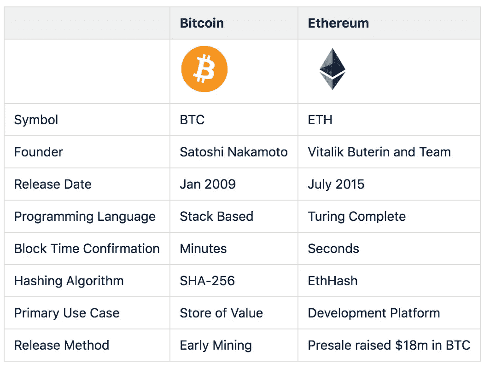

# 如何获得世界上最好的工作之一(区块链工程师)

> 原文：<https://medium.com/hackernoon/how-to-land-one-of-the-best-jobs-in-the-world-as-a-blockchain-engineer-1b4d29a0d7b4>

# Web 开发人员的终极指南—第 2 部分

*看完第一部* [*这里*](https://hackernoon.com/how-to-land-one-of-the-best-jobs-in-the-world-as-a-blockchain-engineer-87449e6a6ccf)

Credit: Jonatan Pie - Unsplash

> “当我想到以太坊时，我的第一个想法是，‘好吧，这东西太好了，不可能是真的。’事实证明，以太坊的核心理念是好的——从根本上说，完全合理。"
> 
> 维塔利克·布特林

The Cryto Space — Credit: *BTC Inc*

在之前的博文[中，我概述了区块链的革命性特征如何有潜力改变世界。](https://hackernoon.com/how-to-land-one-of-the-best-jobs-in-the-world-as-a-blockchain-engineer-87449e6a6ccf)

我们还看到**区块链开发人员需求量很大**——相关工作是当今劳动力市场中增长最快的:

> "目前，每个区块链开发商有 14 个职位空缺."

**随着资金涌入这个领域**以及仅在今年上半年就通过 ico 筹集了超过 60 亿美元，区块链的初创公司、大型科技公司、银行、支付和专业服务公司都在大举招聘。

所有这些都意味着，作为一名区块链开发者，你有**赚更多**的潜力，同时也可以利用更灵活的选择，例如增加**远程工作的机会**。

这篇文章旨在为有兴趣(也应该有兴趣)学习如何进入这个令人兴奋的 Web 3.0 新范式的 Web 开发人员和软件工程师提供一个介绍。

但是，尽管这项新生技术仍处于婴儿期，区块链的空间已经开始扩张了— **那么，你该如何开始呢？**

# 区块链生态系统

在我们进行更深的潜水之前，让我们先从 30，000 英尺的高度看一下生态系统。已经有数千个项目和数百家公司在该领域的各个垂直行业运营:

Credit: Josh Nussbaum / TechCrunch

有许多并行线程同时运行，例如:

*   排名第一的 C **加密货币**(如 BTC、BCH、LTC、DASH)、
*   排名第一的**“加密钱包”**(比如 OMG，MTL，PAY，MCO)，
*   排名第一的**分散交易所**(如 BTS、BNB、ZRX)、
*   排名第一的 **dApps 平台**(例如 ETH、NEO、LSK、QTUM)，

作为 web 开发人员和软件工程师，我们将把注意力集中在最后一个方面——DApps 平台或开发工具部分。

这一类别中的项目主要被开发人员用作“DApps”或**分散应用**的构建模块。

# 区块链 2.0:引入以太坊

> **不仅仅支持数字货币的区块链应用通常被称为区块链 2.0。**

[区块链技术](https://3iq.ca/3iq-research-group/blockchain-basics-2/)最初由比特币推出，作为一种通过共享账本以防篡改的方式跟踪数字现金所有权的方式。

然而，许多人很快意识到，这项技术并不局限于点对点数字现金系统，它可以用来存储任何有价值的信息。

这让区块链科技在数字货币之外有了更多的应用。

以太坊于 2014 年初在北美比特币大会上由前一年撰写了白皮书的 Vitalik Buterin 宣布。

该平台的开发通过 2014 年夏天大获成功的众筹获得了资金，以太坊于 2015 年 7 月 30 日上线。

虽然比特币是作为常规货币的替代物而产生的，因此是支付交易和价值储存的媒介，但以太坊是作为一个平台开发的**，它通过自己的货币载体或令牌促进点对点智能合同和应用**。

**以太是以太坊生态系统的原生货币**，用于促进和货币化以太坊的工作，使开发人员能够构建和运行分布式应用。

Comparison of Bitcoin and Ethereum

# 但是为什么是以太坊呢？

开发者堆栈中已经有大量的平台，每个平台都有自己特定的优势(和劣势)、自己的实现语言、智能契约语言、共识算法和目标市场。

**它们都以自己独特的方式解决特定类型的问题**,根据使用案例，将来您很可能会使用其中一种区块链。

Credit: [PrimeTrade.ai](https://primetrade.ai/blog/comparison-of-blockchain-platforms/)

> 然而，以太坊是进入区块链发展世界的事实上的入口

Credit: Etherscan.io

## 以太坊网络发展迅速

[以太节点](https://www.ethernodes.org/network/1)报道称，以太坊区块链有大约 17000 个节点，横跨六大洲，是现存最分散的区块链平台。

> 在 1 月 4 日的高峰期，该网络在 24 小时内处理了 130 万笔交易。

Source: [ethernodes.org](https://www.ethernodes.org/network/1)

> 以太坊开发者社区估计是世界上最大的区块链开发者社区，超过 250，000 人。

**它拥有超过 30x 的******下一个最受欢迎平台的开发者，**可以说是最强的开发者团队和最成熟的工具层。**

**大多数 ico 和项目都建立在它的基础上。**

**它还拥有最多的行业支持，以太坊企业联盟拥有数百家企业会员。如果你在做区块链开发，你很可能会从为以太坊智能合约编写代码开始。**

> **毫无疑问，以太坊区块链是现存最活跃的智能合约平台。**

**Github 吸引了来自世界各地的开源开发者，列出了 14000 个知识库和 220000 个涉及以太坊的提交**

****在市值排名前 100 的代币中，94%建立在以太坊之上**，而在排名前 800 的代币中， [87%建立在以太坊之上](https://eidoo.io/erc20-tokens-list/)。**

**因为如此多的代币是使用以太坊代币标准构建的，**以太坊区块链现在处理所有区块链平台上近一半的美元价值，远远超过比特币。****

# **初期问题**

**虽然以太坊围绕可伸缩性有一些广为人知的问题，但这些问题并不是唯一的，而是所有区块链都固有的，并且在任何潜在的解决方案中都有一个核心和必要的权衡。**

**这被 Vitalik 著名地描述为**[**可伸缩性三难困境**](https://github.com/ethereum/wiki/wiki/Sharding-FAQ) 它声称区块链系统最多只能有以下三个属性中的两个:****

1.  ******去中心化**(定义为系统能够在每个参与者只能访问 O(c)资源的场景下运行，即。普通笔记本电脑或小型 VPS)****
2.  ******可伸缩性**(定义为能够处理 O(n) > O(c)事务)****
3.  ******安全性**(定义为对拥有 O(n)资源的攻击者安全)****

> ****然而，我相信以太坊的核心团队和社区会及时找到解决所有现存问题的有效方法。****

****[以太坊主链网络的扩展解决方案](https://media.consensys.net/the-state-of-scaling-ethereum-b4d095dbafae)数量众多，预计今年将通过 **Casper** 协议的推出测试**利益证明**，而其他活跃项目如**等离子**旨在提供第 2 层解决方案，或“区块链间协议”****

# ****冒险深入兔子洞…****

# ****定义:什么是以太坊？****

*   ******以太坊是一个分散平台，在定制的区块链上运行智能合约。******
*   ****它使用这个区块链来加密存储、执行和保护这些合同。****
*   ****它形成了一个对等的虚拟机网络，任何开发者都可以用它来运行分布式应用。****
*   ****这个网络上的每台计算机都下载一个小的虚拟机 c **称为以太坊虚拟机(EVM)** 来与以太坊区块链同步以保持和改变它的状态。****
*   ******简而言之，以太坊可以被认为是一台“世界计算机”**，它提供了用遍布全球的数千台个人计算机(或“节点”)取代中央服务器的能力。****

****EVM 允许代码在区块链上验证和执行，保证它在每个人的机器上以同样的方式运行。****

****以太坊维持着区块链 EVM 的状态。所有节点都处理智能合约，以验证合约及其输出的完整性。****

****这个分布式计算机网络**方便地提供了自动执行用代码编写的合同所必需的安全性、可靠性和计算能力**。****

# ****以太——为网络提供动力的燃料****

****在以太坊平台中有一种叫做以太的本地货币，它被用来为构建在该平台上的应用程序提供燃料。****

> ****就像汽车需要汽油来驱动引擎一样，构建在以太坊平台上的应用需要 **ether** **来获得计算能力。******

******以太就像是在以太坊平台上移动的交通工具**，它被希望在以太坊内部开发和运行应用程序的开发人员所使用。****

****根据以太坊的说法，**它可以用来“编纂、分散、保护和交易任何东西。”******

****以太坊矿工在他们的计算机上运行网络节点，为 DApps 提供处理能力，作为回报，他们得到以太的补偿。****

# ****以太坊虚拟机****

****这是以太坊项目的主要创新之一，是一种虚拟机，设计为由对等网络中的所有参与者运行。****

> ****它可以读写区块链的可执行代码和数据，验证数字签名，并且能够以图灵完全的方式运行代码。****

****它只会在收到经过数字签名验证的消息时执行代码，并且存储在区块链上的信息告诉它这样做是合适的。****

# ****共识；一致****

****想象一个正常的集权组织。****

****所有的决定都是由领导者或决策者委员会做出的。****

******这在区块链是不可能的，因为区块链没有“领袖”。******

****为了让区块链做出决定，他们需要以另一种方式达成共识。****

> ****简而言之，共识是一种在群体中达成一致的动态方式。****

****达成共识的一个中心问题叫做**[**拜占廷将领问题**](https://en.wikipedia.org/wiki/Byzantine_fault_tolerance) **。**无需深入探讨，这可以通过描述“拜占庭军队”中的将军们来总结，他们想要进攻一座城市，并且必须商定一致的策略以避免灾难性的失败——当一些将军不可靠时。******

******共识机制可以解决拜占庭将军问题。**它可以确保他们的军队尽管遭遇这些挫折，但实际上可以作为一个单位进行攻击。****

****例如，假设左边的军队想要向右边的军队发送名为“拂晓进攻”的消息，他们可以使用以下步骤。****

1.  ******首先，他们将一个“nonce”**(只使用一次的数字)附加到原始文本上。随机数可以是任何随机的十六进制值。****
2.  ****在那之后，**他们散列附加了 nonce 的文本**以获得结果。假设军队已经决定只共享消息，该消息在散列时给出以 6 个零开始的结果。****
3.  ****如果满足散列条件，它们将**向信使发送消息的散列**。如果没有，那么他们将继续随机改变 nonce 的值，直到他们得到想要的结果。这个动作非常繁琐和耗时，并且需要大量的计算能力。****
4.  ****根据散列函数的性质，如果信使确实被城市抓住并且消息被篡改，散列本身将被彻底改变。****
5.  ****如果右边的将军们发现散列信息不是以所需数量的零开始，那么他们可以简单地取消攻击。****

> ****比特币的创造者中本聪发明了工作证明协议，从而绕过了这个问题。****

## ****工作证明协议工作原理概述****

*   ****矿工**解决这些密码难题**来“开采”一个区块，以便添加到区块链中。****
*   ****这些谜题被设计成一种使系统变得困难和费力的方式****
*   ****所以这个过程**需要巨大的能量**和计算量。****
*   ****当一个矿工解决了这个难题，他们就把他们的方块提交给网络进行验证。****

****尽管这解决了拜占庭将军的问题，但是，**工作证明机制仍然存在一些问题。******

*   ****首先也是最重要的，工作证明是**一个极其低效的过程**，因为它消耗了大量的能量和能量。****
*   ****能够负担更快和更强大的 ASICs 的组织比其他组织有更好的机会采矿，这导致更多的集中化。****

****作为上述问题的结果，Ethash，即**以太坊**中当前使用的工作证明机制将很快被**转移到利益证明。******

# ****后续步骤****

****在下一篇文章中，我们将通过设置必要的工具和环境，开始我们使用 Solidity 在以太坊中编码的旅程。****

****接下来，我推荐以下 Udemy 课程，它是让你开始学习的最佳入门课程之一。****

****[https://www.udemy.com/blockchain-developer/](https://www.udemy.com/blockchain-developer/)****

********

****如果你想找一份区块链工程师的工作，有一些额外的话题，比如**公钥密码学、Merkle Trees** 和**密码经济学**，我将在未来的帖子中详细探讨。****

****但是在下一篇文章中，我们将开始使用最好的最新工具在 Solidity 中编写以太坊代码，继续你从 Web 开发人员**到 Web 3.0 区块链工程师**的最佳道路。****

****与此同时，你可以前往 www.optimizme.com**的 [**，查看我们正在打造的平台，帮助你驾驭加速学习的力量，提升新经济的技能。**](http://optimizme.com/)******

********

****The OptmizMe Platform****