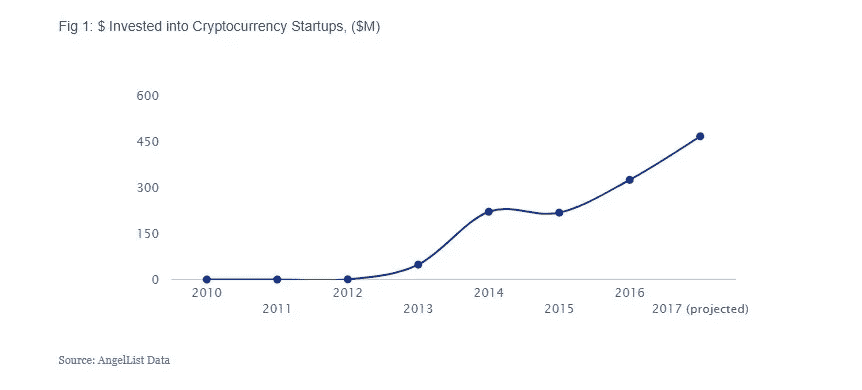
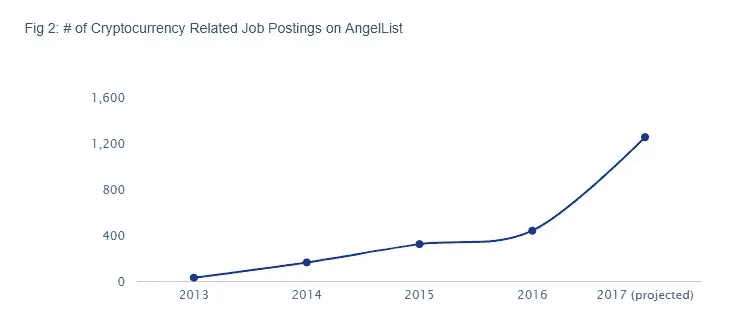
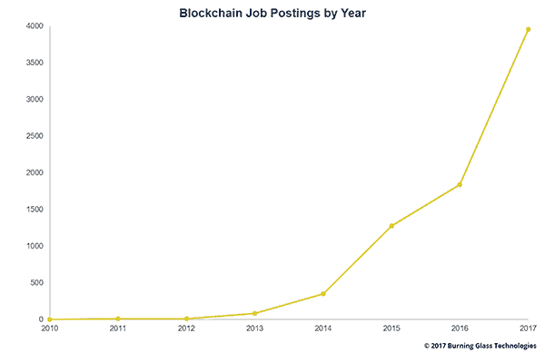
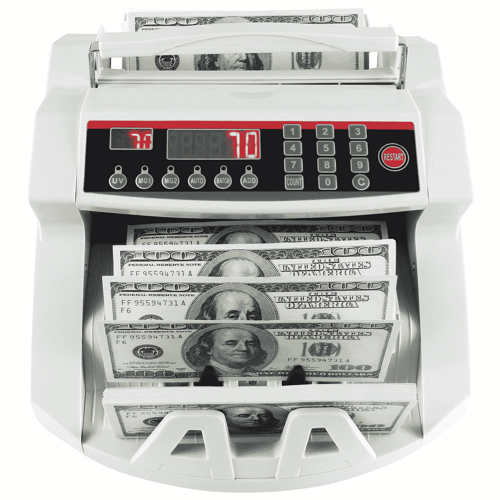
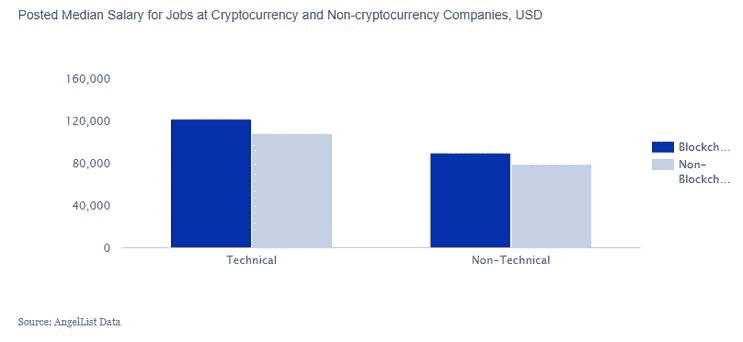
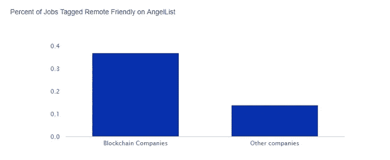

# 如何获得世界上最好的工作之一(区块链工程师)

> 原文：<https://medium.com/hackernoon/how-to-land-one-of-the-best-jobs-in-the-world-as-a-blockchain-engineer-87449e6a6ccf>

# Web 开发人员终极指南—第一部分。

*读第二部*[这里 T5*。*](https://hackernoon.com/how-to-land-one-of-the-best-jobs-in-the-world-as-a-blockchain-engineer-1b4d29a0d7b4)

Photo Credit: [Denys Nevozhai](https://unsplash.com/photos/2vmT5_FeMck?utm_source=unsplash&utm_medium=referral&utm_content=creditCopyText)

> “区块链不能仅仅被描述为一场革命。这是一种类似海啸的现象，缓慢推进，并以其前进的力量逐渐吞没沿途的一切。”
> 
> —威廉·穆加亚尔

# 起源故事

*   我们都知道每个超级英雄都有自己迷人的起源故事。从布鲁斯·韦恩如何在成为蝙蝠侠之前看到他的父母被谋杀，到彼得·帕克如何被一只放射性蜘蛛咬伤并获得超能力，帮助他成为你友好的邻居蜘蛛人。
*   区块链也不例外。毫无疑问，这是一个巧妙的发明，2008 年，一个叫做**中本聪** **的神秘人(或一群人)首次将其完整概念化。**
*   尽管现在人们认为他的身价可能超过 50 亿美元，但仍然没有人知道他是谁。
*   区块链在第二年由 Nakamoto 实现，作为加密货币**比特币**的核心组件，它充当网络上所有交易的**公共账本**。
*   但是从那以后，它已经进化成更伟大的东西——有些人甚至声称它将成为未来互联网的主干。
*   通过允许数字信息被分发但不被复制，区块链科技创造了一种新的更强大的去中心化互联网的主干。
*   当然，我们都知道——“权力越大，责任越大！”

Credit: Marvel Studios

# 第一，区块链这个东西是什么？

> 比特币的极端波动性使得预测其未来变得困难，但正是区块链——推动这种货币的技术——抓住了世界各地企业的想象力。

在未来的帖子中，我将深入探讨区块链及其实现的技术。然而，这篇文章旨在为对学习如何进入这个令人兴奋的 Web 3.0 新范例感兴趣的 Web 开发人员和软件工程师提供一个介绍。

因此，现在我们只需要一个简短的高层次概述，而 [***的这个精彩的 5 分钟介绍简单地解释了***](https://www.youtube.com/watch?v=SSo_EIwHSd4&feature=youtu.be) ***d*** 是直接切入主题的最佳方式之一…

Credit: [Simply Explained — Savjee](https://www.youtube.com/channel/UCnxrdFPXJMeHru_b4Q_vTPQ)

# 区块链的革命性特征

*   **分散化—** 没有一个人或团体拥有整个网络的权力。
*   **点对点—** 通过使用 P2P 网络协议(想想 Napster 这样的文件共享),不需要任何第三方参与
*   **不可变—** 一旦写入区块链，数据就无法轻易更改。即使一个数据块发生变化，也会改变它的哈希或“指纹”。由于每个块也存储其前一个块的散列，这也将导致链中所有后续块的剧烈变化。
*   **防篡改-** 不变性属性使得检测任何数据的篡改更加容易。即使是一个单独的块或散列的改变也可以被检测和处理。
*   因此，存储在区块链中的数据本质上是安全的，实际上是不受攻击的。

Credit: Bill Nye/Giphy

# 区块链技术有什么好处？

## 1.权力下放(治理)

不需要可信的第三方或中介来验证交易。

## 2.透明度和信任(出处和责任)

由于区块链是共享的，每个人都可以看到区块链上的内容，这使得系统变得透明，从而建立了信任。

## 3.不变性(可审计)

一旦数据被写入区块链，就很难对其进行修改或篡改。

## 4.高可用性(弹性)

由于该系统基于对等网络中的数千个分布式节点，其中数据在每个节点上被复制和更新，因此该系统变得高度可靠和可用。

## 5.高度安全(安全性)

区块链上的所有交易都受到密码保护，并提供完整性。

## 6.更快的交易结算(处理速度)

在金融行业，区块链可以通过允许更快的交易结算来发挥重要作用，因为它不需要正常的漫长的验证、对账和结算过程。

## 7.成本节约(效率)

由于在区块链模式中不需要第三方或清算所，这可以极大地消除管理费用和行政成本。

Photo credit: [NASA](https://unsplash.com/photos/Q1p7bh3SHj8?utm_source=unsplash&utm_medium=referral&utm_content=creditCopyText)

# 行业的潜在用例是什么？

除了区块链对加密货币的明显应用，还有许多潜在的使用案例。以下是目前正在探索的一些方法:

## 1.供应链管理。

自动区块链可用于可靠、透明地跟踪货物的移动、来源、数量等。

## 2.质量保证。

在食品和制药等行业，质量保证至关重要。如果在供应链的某个地方检测到异常，区块链系统可以一路引导您到达源头。

## 3.会计。

通过区块链记录交易几乎消除了人为错误，并保护数据免受可能的篡改。除了保证记录的准确性之外，这一过程还会留下高度可追踪的审计线索。

## 4.智能合同。

借助智能合同*，*协议可以通过区块链架构自动验证、签署和执行。这消除了对中介的需求，从而节省了公司的时间和金钱。

## 5.投票。

区块链在选举中的承诺归结为信任。它可以大大减少选举舞弊的可能性，这是当今世界民主的一个热点问题。

## 6.证券交易所。

澳洲的证券交易所已经瞄准了[转换到区块链供电的系统](https://futurism.com/australia-stock-exchange-blockchain/)，纳斯达克也开始了试点项目。与此同时，区块链上完全分散的交易所([如 0x](https://0xproject.com/) )已经成为现实。

## 7.能源供应。

传统上，可再生能源是通过电网使用政府颁发的可交易证书进行跟踪的，但有许多管理和信任问题，区块链将能够解决。

## 8.快速点对点全球交易。

当然，加密货币比特币、以太坊和 Ripple 在市场上的迅速崛起并非一无是处。除其他外，它实现了全球范围内快速、可靠、安全和廉价的资金转移。

> 所有这些看起来都很棒，但是这些有什么关系呢？…..

Credit: NASA — Requests for on-demand blockchain talent are skyrocketing.

# 1.加密货币领域正在快速发展

资金正在涌入加密货币初创公司。

仅在今年上半年，通过 ico 就筹集了超过 60 亿美元。

据 AngelList[称，2017 年上半年，投资于加密货币初创公司的资金比 2016 年全年的总和还要多。](https://angel.co/talent-hacks/how-to-get-a-job-at-a-crypto-startup)

随着加密货币公司的增长，筹集了更多的资金，他们寻找顶级人才的招聘需求也在增加。因此，对区块链人才的需求高得惊人。

TechCrunch 今年早些时候发表的一篇文章称，区块链工程师严重短缺:

> "目前,**每个区块链开发者有 14 个工作机会."**

> 区块链相关的工作是当今劳动力市场中增长最快的

在过去的六个月里，加密货币公司在 AngelList 上发布的**职位列表**数量几乎翻了一番。

Source: AngelList Data

目前，美国 LinkedIn 上有超过 200 万个区块链职位空缺广告，这一数字自 2017 年以来增长了 4 倍。

Upwork 是一个自由职业人才市场，去年它报道说区块链成为 5000 多种技能中增长最快的技能。连续三个季度增长超过 2000%。

根据对自由职业者增长最快的 20 项技能进行排名的 [Upwork Q1 2018 技能指数](https://www.upwork.com/press/2018/05/01/q1-2018-skills-index/)，区块链有望成为 21 世纪的新“云”。

> “区块链似乎是下一个未知的、被高度谈论的技术，类似于 2000 年代中期的“云”

根据 Burning Glass Technologies 的另一份报告，在过去的 12 个月里，有 5743 个需要区块链技能的全职职位空缺，增长了 320%。

Source: [burningglass.com](https://www.burningglass.com/blog/job-postings-blockchain-skills-double-2016/)

# 2.区块链工作:那么谁在招聘呢？

有迹象表明，各种行业和垂直行业的招聘都在增加。

> 大公司和初创公司都在美国、欧洲和世界各地寻找区块链开发领域的开发人员和建筑师，

虽然一些行业已经开始在其业务中采用区块链，但许多行业仍只是刚刚开始探索最佳的起步方式。

*   **区块链初创公司**填补了该领域最大数量的空缺——从那些提供该技术基础构件的公司，如**以太坊**到试图创建标准的财团，如总部位于纽约的 **R3** 。
*   像微软和 IBM 这样的大型科技公司已经在他们现有的云产品组合中创建了“区块链即服务”工具。其他公司也加入了开源的 Hyperledger 项目，包括富士通和英特尔。
*   像**巴克莱**和 **JP 摩根**这样的银行和支付公司在区块链领域尤其活跃，此外还有瑞士联合银行、桑坦德银行、**美国银行**和**万事达卡**。
*   **在政府**中，许多用例正在上工作，例如跟踪**学生贷款支付。**
*   **专业服务公司:**包括**埃森哲**、**普华永道**、**凯捷** 和毕马威在内的所有大型咨询公司都组建了区块链团队。
*   德勤是最早发现区块链潜力的公司之一。目前，该公司在美国的业务部门雇佣了一个由 1200 名专业人士组成的团队，并在都柏林设立了 EMEA 区块链实验室。
*   **Consensys，**业内最大的打击者之一是一家软件铸造公司，其成立的目的是促进和开发在以太坊区块链上运行的分散式软件服务和应用程序。它目前有数百个职位空缺广告。

与任何其他高增长创业公司类似，加密货币公司需要在整个组织内招聘职位，而且要快。在这些职位空缺中，有软件开发人员、联合创始人、技术总监和设计师的职位。

不言而喻，从事加密货币项目的经验丰富的工程师非常受欢迎，但对区块链技术感兴趣的天才工程师也是如此。

# 作为区块链开发者能赚多少钱？

Credit: Ebay

根据 AngelList 的一份[报告，加密货币初创公司的薪资普遍超出行业标准约 10-20%。同样值得注意的是，大多数加密货币公司都有很好的福利，包括利润分享安排。](https://angel.co/talent-hacks/how-to-get-a-job-at-a-crypto-startup)

Credit: AngelList

据 [Computerworld](https://www.computerworld.com/article/3235972/it-careers/blockchain-jobs-continue-to-explode-offer-salary-premiums.html) 估计，美国区块链开发人员的年薪高达**13 万美元**，而软件开发人员的平均年薪为 105 美元。在美国的高科技地区，如硅谷、纽约和波士顿，平均年薪为 15.8 万美元。

根据发布的数据 [Burning Glass Technologies](http://burning-glass.com/job-postings-blockchain-skills-double-2016/) ，区块链开发工程师顾问在自由职业市场的收入从**每小时 50 美元到 100 美元**不等。

**在瑞士，这些数字甚至更高。**由于监管机构对使用加密货币代币或“首次发行硬币”(ICOs)进行融资的新形式持宽容态度，中国在区块链开设店铺的公司数量激增。

总部位于瑞士的创业公司 Eidoo 的首席执行官托马斯·贝尔塔尼[告诉 Business Insider](http://uk.businessinsider.com/blockchain-developer-salaries-in-switzerland-raised-by-ico-boom-2017-12) ，拥有区块链技术专业知识的开发人员年薪可以达到 12 万到 18 万美元。

**更多远程灵活性**

在加密货币行业工作会让你获得远程工作的机会增加 22%。这并没有考虑到许多加密货币初创公司，他们有灵活的工作政策，只要求你在特定的日子里呆在办公室。

Credit: AngelList Data

与传统候选人相比，加密货币员工更有可能享受分布式工作安排，并且地理位置分散。有趣的是，在专注于分布式技术的公司中，候选人也是如此分散。

# 底线:一个勇敢的新世界

Canvas by Neil Hemsley

可以清楚地看到，我们正处于一种新范式的非常萌芽的阶段。虽然学习曲线可能很陡，但对于那些愿意接受这些新技术的人来说，机会是巨大的。

在未来的帖子中，我将深入探讨你需要掌握的技术栈和技能的更多细节，并深入探索共识算法、可扩展性三元悖论和 Solidity 编码等主题，以及所有可供你立即使用的最佳最新工具，以开始你从 Web 开发人员**到 Web 3.0 区块链工程师**的最佳道路。

与此同时，你可以去 www.optimizme.com****看看我们正在建设的平台，它将帮助你利用加速学习的力量来提升新经济的技能。****

********

****The OptmizMe Platform****

## ****继续读****

**** [## 如何获得世界上最好的工作之一(区块链工程师)

### Web 开发人员的终极指南—第 2 部分

hackernoon.com](https://hackernoon.com/how-to-land-one-of-the-best-jobs-in-the-world-as-a-blockchain-engineer-1b4d29a0d7b4)****