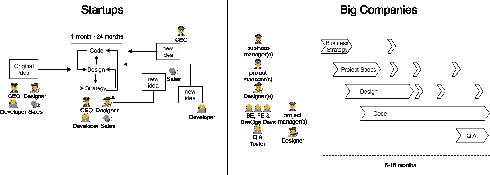
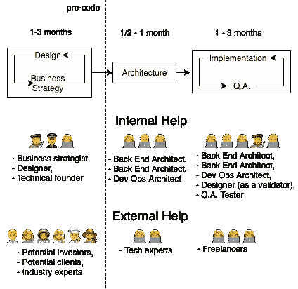

# 如何在 2 个月内更好地开展 6 个月的项目

> 原文：<https://medium.com/hackernoon/how-to-launch-6-month-projects-in-2-with-better-quality-1021dbe7ecb1>

## 或者:如何以最好的方式构建产品开发管道。

知道如何设计一个[产品开发](https://hackernoon.com/tagged/product-development)管道并不是显而易见的。这需要多年的经验，直到你开始找出主要的瓶颈，还需要多年的时间来尝试减少这些瓶颈的新方法。

这种知识不容易在网上开发，大多数行业专家没有掌握它，因为开发人员没有优先考虑它，并且[项目](https://hackernoon.com/tagged/project)经理很难理解开发人员。

这并不是说构建一个产品开发管道很难，相反，只要你知道它应该首先解决什么问题，哪里可能出错，并测量输出，它就可以很容易地完成和改进。

**你为什么要听我的？在我繁忙的职业生涯中，我积累了大约 8 年的开发/项目管理经验，创办了 4 家创业公司，与另外 4 家创业公司和 3 家软件公司合作。我也是一个痴迷的辩论者，我在这里讨论的所有话题(或我写的任何东西)都已经和许多专业人士彻底讨论过了。**

好吧，那我们就开始吧！

## **大多数公司如何设计他们的开发管道(meh):**

## 多产的产品开发管道应该是什么样子的(⚡️):

这篇文章关注的是让我倾向于上面推荐的管道(⚡️).
我很乐意再写一篇文章，重点介绍我喜欢的管道的复杂性。但是我认为最有用的是那些让我更喜欢它的原则。

# **架构**👩‍✈️与实施👨‍🔧

架构决策和实现个体特性是完全不同的精神挑战。由于它们紧密相连，很难同时进行，因此制定一个策略来最大限度地利用两者非常重要。

**架构**关注于使开发和维护容易顺利完成，在长时间内，不同的开发人员，产品迭代和软件更新。

它包括:

*   与非开发团队成员积极沟通，
*   业内专家的验证，
*   为发展*动机设置**基础**💪，速度🚄和质量💎*，
*   利用开发的反馈来改进基础，

> **基础**的概念在我之前的文章中大量提到: [**坏代码的成本及其预防**](https://hackernoon.com/the-cost-of-bad-code-and-preventing-it-aeabd3074fba) **。**

**实施**专注于推出新功能或修复或改进旧功能。

它包括:

*   个人特征
*   遵循风格指南和架构模式
*   以直接可见的方式高效工作

理解这两者的最大优势来自于理解如何利用它们:

**架构**提高了每个开发人员的速度和质量，并且只需要由一个人来管理，允许你授权给新的开发人员，让一个人负责所有贡献者的质量和速度。

**实现**可以分解成微小的任务，可以委托给不熟悉直接影响他们必须做的事情的开发人员。

# 分析产品开发的业务驱动力🔬

## 按照最重要的事情的顺序构建

使用[帕累托法则](https://en.wikipedia.org/wiki/Pareto_principle)，产品 20%的潜在特性满足了客户 80%的需求。
因此，从尽快交付开始，然后在后续产品创意中继续运用这一原则。

这对于任何从事技术工作的人来说都是显而易见的，但通常不会付诸行动。

## 注意机会成本

你应该希望你的产品/功能在⚡️.快速上线不是因为这样可以节省你的开发成本，而是因为你还没有从市场上获得价值。

如果你还没有这样想，你也可以:

*   没有对你的产品当前迭代做足够好的市场分析。在让一个非常专业的团队去做你还不确定的事情之前，你应该多考虑一下。
*   专注于解决一个没有收益递增的问题，而另一个问题就在他们身边。
    当然，降低开发产品的成本是值得考虑的事情，但是如果你的产品没有比开发成本更大的回报，那么降低开发成本就不会把它变成可扩展的业务。

# 在对🛸进行编码之前，用户体验/用户界面应该由所有人进行验证

为了达到最终产品的最终 UX/用户界面迭代，必须发生很多事情。

必须有不同意见，吸取教训，犯错误，有些人甚至会因为不能接受自己的想法而退出，被拒绝，有人会死😵。好吧，不会那么可怕，但它应该是最黑暗的部分，也是最有启发性的部分💡！
如果这一阶段没有彻底完成，概念问题只会在管道的更下游出现，此时重复这些问题的成本会高得多。

这是一个创造性的过程，就像所有的创造性过程一样，很难估计，也不应该操之过急。虽然可以通过理解什么是真正需要的并专注于此来加快速度，但最终，它不能太快。即使是微量给药或任何夸大其词的方法也不行。让你和你的团队睡个好觉，锻炼身体，并在一天中的几个小时里试着思考其他话题。

这是**最有效的**和**成本最低的**阶段，根据反馈进行迭代并寻求反馈。

# 由每个人不断问答📐

一旦首先开发的概念和特性被决定下来，开发人员已经开始工作，现在还不是想当然的时候。

每天致力于开发产品的人开始对它应该如何工作产生偏见，因为他们太了解它如何工作的全部细节。这几乎是一件不可阻挡的事情，甚至因团队规模而加剧。所以做好计划是个好主意。

当然，这方面有专业人士，他们是非常重要的。但是参与**销售产品**的**人员**也应该定期彻底测试，因为他们通常是反馈**最好的**。

# 有经验的专业人士要便宜得多

就成本而言**💵**按质量**💎**速度&速度**🚄**比率。让有经验的专业人士做出贡献可以保证行业最佳的质量和效率。他们可能比大学毕业生贵 10 倍，但这是有原因的。

编程和设计专业知识来自学习。从大量的混乱中学习，这将导致许多提高质量和速度的迭代。

一个人学得越多，他在同样长的时间里学到的就越多。这使得学习获得了指数级的回报。

然而，正如上面在**架构与实现**中所讨论的，并不是所有的开发人员都必须有经验。使用适当的架构是一种更有趣、更有效的学习方式，而不是偶然发现无效的做事方式。

# 产品所有者(架构师)是产品🛠

如果你有一个强大的核心团队，被激励留下来或至少不会灾难性地离开，知道如何分配工作和传递知识，你就有了一个可伸缩性和长寿产品的良好基础。

# 结束的

为了:

*   构建并维护产品
*   最快的，
*   拥有最高质量和
*   尽可能与市场需求相联系，

重要的是:

*   确定你想要什么，
*   要知道你想要的东西是值得付出代价的，
*   **根据什么能给你带来最大的回报**，****
*   **在开始开发之前，迭代潜在的概念和 UX/UI 解决方案，**
*   **注意 ***架构*** 和 ***开发*** 之间的职责、重点、利益和缺点的不同，**
*   **让**每个人定期测试**正在生产的产品，**
*   **有经验的人负责 ***架构*** 或者时间犯错误、**
*   **让易于管理的人对结果负责**

**研究开发管道证明了处理同一问题的不同方法会产生截然不同的结果，以及每个决策是如何相互关联的。以及所用方法的改进如何能产生指数级的更好性能。
优化管道很像微调发动机，在这里或那里进行小的螺丝调整，发动机的性能就会发生很大的变化，同时让你知道它听起来如何。**

> **仍然渴望项目管理思想吗？我以前写过一篇文章，里面充满了容易操作的建议:[代码项目管理快速但巨大的成功](https://hackernoon.com/code-project-management-quick-but-huge-wins-8f8065cc9269)。**

# **保持联络**

**我写作的目的是为了结识能与之进行有趣对话的人。所以，我最想从你的评论或推特上得到一条信息。**