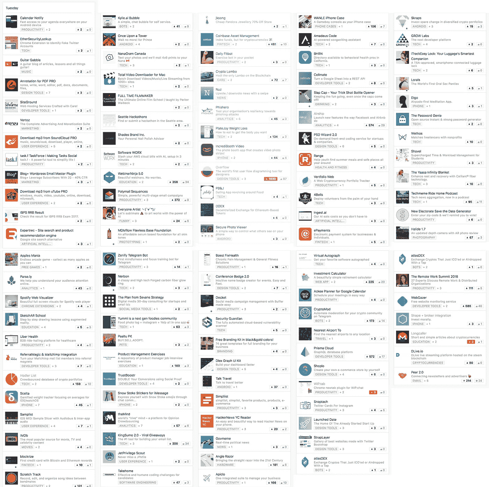

# 如何开始寻找产品并淹没在产品的海洋中

> 原文：<https://medium.com/hackernoon/how-to-launch-on-product-hunt-and-drown-in-the-sea-of-products-61fbabb8398>

3 月 6 日，星期二，我在[的产品搜索](https://hackernoon.com/tagged/product-hunt)上发起了长呼者，得到了 3 张赞成票，其中一张是我的。哦，好吧。

没有那么多 PH 发射失败的故事。发射失败后，我想我知道为什么了。

第一个原因很明显。那里有**关于失败的**故事，但是没有人读它们。因为人们不喜欢读失败者的故事。因为失败没有激励作用。虽然这部分是真的，但我认为这只是故事的一部分。我自己更喜欢阅读失败的故事，因为它们感觉更真实，也因为它们有助于更好地应对生存偏见。

第二个原因是，发射失败后，你会感到痛苦。你讨厌一切。你想死。“我为什么要开始呢？”在这种心情下，你最不愿意做的事情就是写出来。即使过了一段时间，你也不想在精神上回到那一天。大脑更喜欢尽快忘记失去的东西(实际上，这是一个聪明的举动，大脑先生)。

第三个也是最后一个原因是质疑。质疑你一开始是否做得很好。写机智文案，拍 UI 屏，真的付出了努力吗？你真的试着友好和感兴趣吗，或者你只是放上有趣的表情符号，然后就到此为止了？

所以，是的。我确实感到痛苦。我确实质疑过自己的努力。我几乎感觉到身体上的疼痛。但是我们不要过分夸张。没有人死亡。我现在感觉好多了。所以让我们试着找出那里发生了什么，下一步该做什么。

# 准备

我不想谈论我是如何为发布做准备的太多细节，因为这太无聊了。我做了其他人做的事。我现在在 PH 上挂了很长时间，思考什么是成功的，什么是失败的。我阅读了所有关于如何启动和成功案例的指南。我准备了文案和图片，做了 gif 和 logo。我发布了我的产品。我在 Twitter 和其他几个网站上分享了这个链接，他们应该会感兴趣。

事实上，我认为我做得很好。这不是一个完美的准备，但它仍然符合我读过的所有建议。

不过，我可以让两件事变得更好。我还没有很多追随者。许多电子邮件订阅者可以很容易地提供帮助，但不幸的是，我只是最近才开始收集电子邮件，所以我不能利用这一点。我可以做得更好的另一件事是发射时间。那一个不是那么明显，但是，我仍然不知道什么是最好的时间。我还是在午夜左右发射了。

# 害怕发射

我计划提前两周发布。没有准备 logo，决定等第二天，周三。那天我也没有做好充分的准备，不想在一周结束的时候发射，所以把发射推迟到了下一周。

然后我开始担心最佳发射时间。现在是午夜吗？还是应该再等一会儿？那一周，我试图找到发布时间、特色和 upvotes 之间的相关性，但也没有推出。

其实我只是害怕发射，找借口而已。但有趣的是，在我最终真正发射的那一天，我并不害怕。我非常冷静。

# 结果

好吧，我有 3 张赞成票。下一步是什么？

实际上，我收到了 48 次产品搜索的访问。还不错。

我也在 Reddit 上发布了，并获得了大约 30 次访问。很难给出一个准确的数字，因为我也在前一天发表了其中一篇文章，所以 Reddit 的流量是混合的。

我从 IndieHackers 和 Reddit 得到了一些反馈。令人惊讶的是，没有人抨击 UI 或可用性。

我还有别的东西。如果成功的话，我会写更多的。

# 结论

当你失败时，你会感觉很糟糕。但是你也学到了一些东西。

首先，你意识到很多其他产品也做不到。天哪，看看每天有多少产品发布:

Casual Tuesday on Product Hunt

其中有多少会被特别报道？有多少人会被注意到？他们中有多少人会去 PH 时事通讯或 twitter？可能不多。

我们转到第二点。你能依靠 PH launch，甚至是 launch 作为你的主要客户渠道吗？有很多人和产品仅仅通过成功的发布就建立了令人印象深刻的用户群，但并不是每个人都那么幸运。对大多数人来说，市场营销是一个缓慢而持续的过程，不断地强调渠道和转化率。

我想对于一些产品来说，糟糕的发布会是有害的，甚至是致命的。像 SaaS 这样的地方很难从零开始发展，所以缺乏最初的推动可能会令人沮丧。

对我来说，推出 PH 更像是一个正式的里程碑，而不是一种增长策略。我有几个工作频道，并计划尝试更多。

发射失败了吗？绝对的。那杀死了长呼者吗？差远了。

*感谢阅读。我偶尔会* [*写关于创业公司和创业的*](https://destiner.io/blog/) *。*