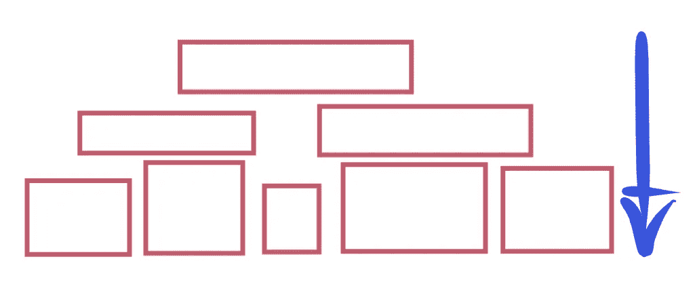
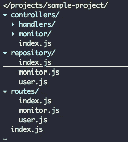
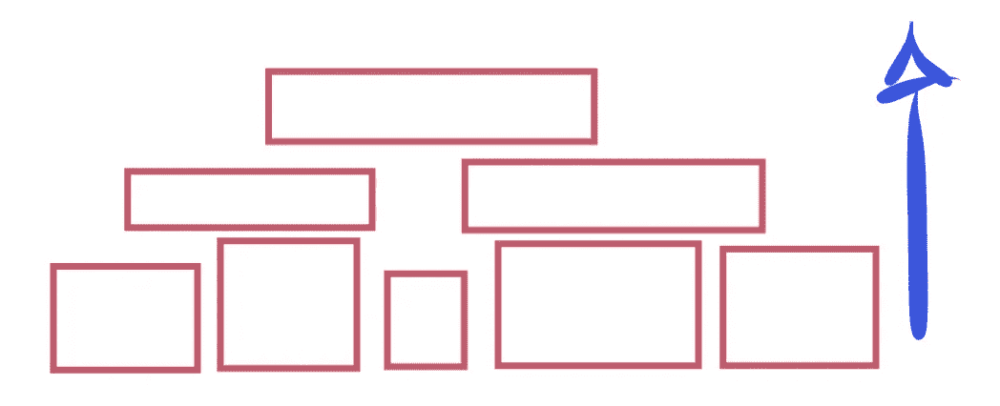
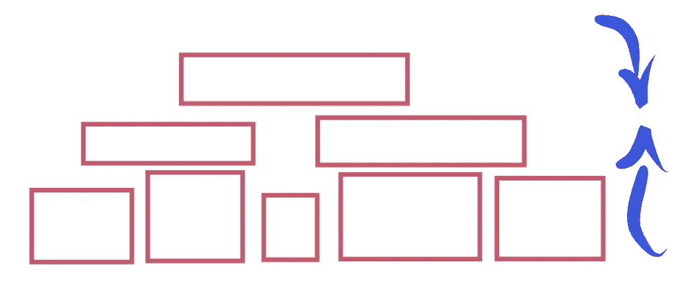
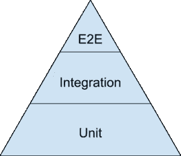

# 如何学习现有的代码库

> 原文：<https://medium.com/hackernoon/how-to-learn-an-existing-code-base-28b88d954bfd>

Photo by [Mikayla Mallek](https://unsplash.com/photos/3iT3dnmblGE?utm_source=unsplash&utm_medium=referral&utm_content=creditCopyText) on [Unsplash](https://unsplash.com/search/photos/macbook?utm_source=unsplash&utm_medium=referral&utm_content=creditCopyText)

无论是你工作的第一天，还是努力为任何项目做贡献，理解并掌握学习的艺术非常重要，这是成功适应项目的概念化和即兴技巧。特别是如果你不熟悉这些技术的话，应该小心地进行调整。

学习现有的[代码库](https://hackernoon.com/tagged/codebase)需要时间和耐心。你可能无法在几天甚至几周内掌握所有的概念和算法。但是，重要的是要遵循一个明确的计划，并相应地工作。这将确保你有目标导向并取得进步。设立里程碑有助于衡量进展并做出改变。这个过程类似于软件工程中使用的敏捷方法，在软件工程中，我们迭代地检查所遵循的过程，并在改进的过程中做出决策。

如果您对项目中使用的技术没有任何经验，那么熟悉技术堆栈应该是首要任务。这相当简单。通过阅读框架和库的文档，您应该能够对它们的用法和内部原理有一个大致的了解。

# 弄清楚架构和组件

在一个旨在满足企业需求的项目中，代码库被很好地构造并抽象成*逻辑*组件。这些组件试图补充代码库中遵循的特定架构。例如，MVC 架构将代码库分为三层(模型、视图、控制器)。在层本身中，可能已经根据用例应用了设计模式。

作为一名工程师，通过与同事交流来弄清楚架构非常重要，因为这提供了整个项目的鸟瞰图。根据应用程序的不同，组件被创建来适应用例以及不同的需求，如可维护性、可伸缩性和安全性。因此，当开始一个新项目时，了解确切的用例以及需求是必要的一步。一个经常犯的错误是，工程师假设了各种需求，并试图将项目中的抽象联系起来。这可以通过充分了解需求来避免。

# 方法

学习代码库有三种方法。自上而下的方法、自下而上的方法和混合方法。

## 自上而下的方法

Top-down approach illustrated

通过鸟瞰图了解项目对使用自上而下的方法有很大的帮助。可以从项目中选择一个主要的用例。例如，让我们假设一个场景，其中一个客户端应用程序向 REST API 中的一个端点发出 GET HTTP 请求，以检索数据库的健康状况。

Sample project structure

假设上面描述了项目结构，我们将遍历 HTTP 请求到一个端点。在运行时，我们可以使用调试器来定位代码的执行，并识别不同的层。根据项目，监控端点将执行 *routes/monitor.js.* 中的代码，这进而执行*控制器/monitor.js* 中的逻辑，随后控制器执行相关的存储库代码，即*存储库/monitor.js.* 存储库在这种情况下表示模型层。存储库代码可能被分割成不同的代码块，其中的逻辑是不同的。存储库的组合结果将向控制器提供来自数据库的结果，控制器负责逻辑并通过 HTTP 响应返回结果。

遵循这种从上到下逐行遍历代码的过程将为我们提供代码的执行流程以及识别逻辑层的机会。

## 自下而上的方法

Bottom-up approach illustrated

这种方法包括从逻辑堆栈的最低层到逻辑层的最高部分检查代码。与自顶向下的方法相同，选择一个用例并尝试绘制，这也是学习自底向上方法的理想方式。在这种特殊的情况下，我们真的没有一个坚实的想法要遵循的道路。因此，这将需要很少的试错尝试来找到自底向上的执行流。

在这里，使用基本直觉是找到起点并开始行动的最佳方式。在 monitor API 示例中，第一步是找到存储库层，然后遍历代码找到代码执行流的结尾。一开始，搞清楚逻辑层可能很有挑战性。对于一个助手 vs 处理程序的例子，它们可能意味着基于应用程序上下文的不同逻辑抽象。一旦找到了起点，跳到执行的顶部就相对容易了(在这种情况下是 route endpoint)。

## 混合方法

Mixed approach illustrated

在实际场景中，只使用上述方法中的一种对于快速学习是没有用的。混合这两种方法将会以更加直观和快速的方式产生对代码库的更好理解。混合方法没有什么神奇的。这都是关于结合自顶向下和自底向上的方法。在这两种方法之间切换提供了关于隐藏在代码中的抽象概念的更深更广的视角。

# 单元测试和集成测试

遵循测试金字塔是学习过程中不可或缺的一部分。如果项目已经实现了单元测试和集成测试，作为一个新手，你可以尝试改变测试并观察改变的结果。从单元测试开始提供了对特定抽象单元的期望结果的更深入的理解。集成测试通过多个单元的组合展示了一组抽象单元的总体预期结果。

如果项目中有可用的测试，最好的方法是执行不同类型的测试，观察结果，并尝试相应地映射代码库。

Testing pyramid, Photo by: [https://blog.primehammer.com/test-pyramid/](https://blog.primehammer.com/test-pyramid/)

# 打破东西

在一个完美的世界里，你将能够掌握所有的概念和算法，而不需要做任何修改。然而现实是不同的。按照上面提到的方法学，修补代码并进行修改是最好的方法。

当你遵循代码库的时候，试着改变代码片段，在执行之前，对想要的结果和执行后你得到的真实结果有一个想法。这将从整体上逐渐提高对整个代码库的了解。

# 最后的想法

学习新的代码库是一种技能。它是将理论知识与实际用例场景相结合的艺术。理解企业代码库需要时间和耐心。在遇到拦截者的情况下，与同行交流将非常有帮助。