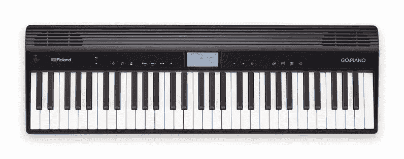
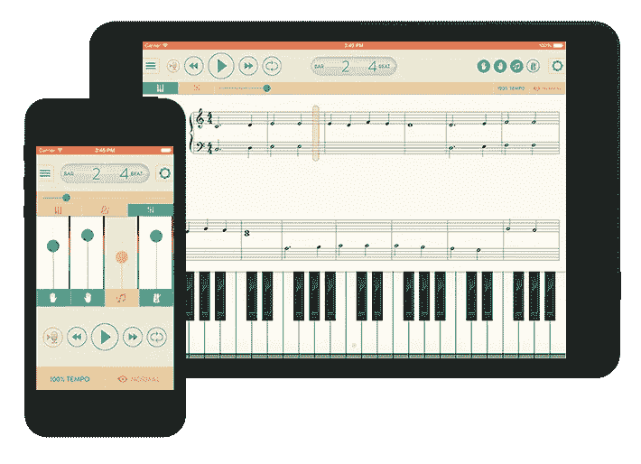
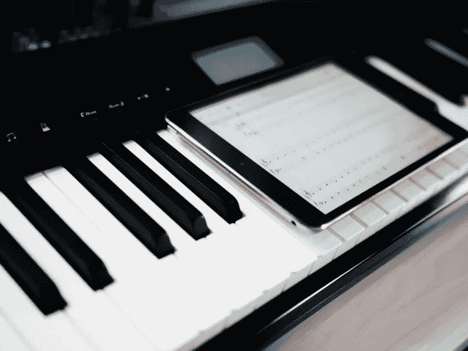

# 如何用技术学钢琴

> 原文：<https://medium.com/hackernoon/how-to-learn-piano-with-technology-923b6008cf7f>

过去几个月，我一直试图自学钢琴，基本上是从零开始。这是艰难的，有时令人沮丧，但也是巨大的回报。

你现在可能想知道一篇关于学习弹钢琴的文章怎么会出现在一个科技博客上。答案很简单:如果没有技术，我可能不会继续尝试。

虽然我偶尔会觉得自己从 27 岁开始就不知所措，传统方法仍然是这场音乐之旅的核心部分，但我很幸运生活在一个点击按钮就可以获得大量资源的时代。

这是学习钢琴的长期系列的第一部分。这主要是一个个人账户，但我希望它也能帮助其他人起步。

# 开始

这个个人目标已经到来很久了。虽然我没有正式的音乐背景，但我有相当多的非正式背景。我听的音乐有将近一半是古典的，一年去看几次现场演出。我在大学里学了几门音乐史课程，尽管我读谱的能力还不如一个三年级学生，更不用说演奏了。到目前为止，我所知道的关于音乐技术方面的一切都来自我偶尔在维基百科上看到的好奇心。

老实说，这个*严格来说*不是我第一次学钢琴；大约 11 岁时，我花了很多时间敲打廉价的键盘。我爸妈给我买了一台二手初学者卡西欧，内置游戏教你怎么玩的那种。

多亏了那些钢琴游戏，我可以弹奏一颗闪闪发光的小星星，还学会了一点皮毛。我对后一个事实感到非常自豪，因为我和贝多芬同一天生日。

这并不多，但我相信那些俗气的 MIDI 曲调激发了我对古典音乐的最初兴趣。但是后来我就不玩了。我的父母请不起老师，而且我搬来搬去太多了，课程也不可行。在一个没有智能手机、 [YouTube](https://thenextweb.com/topic/youtube/) 教程、电子书和现代信息获取手段的时代，试图自学钢琴似乎是一项艰巨的任务，我并不完全胜任。

大约 16 年后，我决定不仅仅是一个简单的听众；我真的很想理解我非常喜欢的音乐。或许还可以做自己的。

所以，我谷歌了一下。

# 钢琴

首先，我需要一些可以玩的东西。我在互联网社区寻找挑选钢琴和作为初学者开始的建议；Reddit 上的[/r/piano](https://www.reddit.com/r/piano/)成了特别有价值的资源。

经过大量的研究，我选定了罗兰的 GO:Piano，这是一款面向初学者的 61 键乐器，售价约为 329 美元。它很轻很小巧，有蓝牙，可以用 AA 电池工作，琴键和真正的钢琴一样宽。就其价格而言，我最喜欢罗兰的钢琴声音，额外的音调也很整齐。我特别喜欢爵士乐:

我唯一真正的烦恼是耳机端口在背面，对于一个旨在帮助初学者练习的键盘来说，这似乎是一个奇怪的选择。

值得一提的是，我的选择在某种程度上违背了许多钢琴论坛成员的建议，他们很快会给你指出一个完全“加权”的 88 键单元。

大多数数字键盘——包括 Go:Piano——都使用弹簧来推动按键。加重键试图复制三角钢琴键盘动作背后的复杂机制，以获得更灵敏的演奏，更好地转化为原声钢琴。Reddit 有一个很棒的推荐列表，但是几乎没有低于 400 美元的新数码钢琴有这个功能。

尽管如此，我还是选择了罗兰，因为它的便携性和多功能性，我想我会在必要时升级(稍后会有更多)。一套小公寓意味着我需要一些小巧且易于操作的东西。我通常把 Go:Piano 放在我的桌子下面，如果我的桌子上有太多的新玩意儿，我会经常在我的膝盖上弹奏键盘。

我的第一要务是得到一些实用的东西，这样我就能一直玩下去，在这方面。我想我做了正确的选择。

# 学问

在对一本好书做了一些研究后，我选定了费伯的成人钢琴冒险。

这部分是因为 Go:Piano 有折扣，但主要是因为 Faber 是一个知名品牌，也碰巧有一个漂亮的 iOS 应用程序(据报道，T2 的 Android 版本正在开发中)和课程视频。这正是我一直在寻找的传统与新奇的完美结合。

需要说明的是，我的大部分时间仍然花在了这本书上，这本书结合了理论、技术和经验教训，但这个应用程序对于我陷入困境的时刻来说是一个有用的资源，并且全面地使这个过程变得更有趣。

我通过蓝牙把这个应用程序连接到一个 [iPad](https://thenextweb.com/topic/ipad/) Mini 上，尽管有线连接也可以。有几个显著的特点:

*   您可以控制速度/节拍器，循环困难的部分，调整乐谱的大小。
*   可选的键盘视图可以让您准确地看到要敲击的音符，这帮助我更快地学习阅读音乐——我现在很少使用它
*   你可以把每只手的部分分离出来，或者只听伴奏。您还可以更改每个部分的音量。
*   你可以让音乐等待你弹奏正确的音符。动态速度模式改变音乐的速度，以配合你自己的演奏节奏。这是我更喜欢的学习伴奏，直到我让音乐达到默认的速度
*   有数百首不同级别的练习歌曲

当我对书中的某个片段或段落有困难时，我可以求助于应用程序来帮助我找出一个曲调，并一段一段地加强它。

为了补充我的钢琴演奏，我买了一本乐理入门书。我选择这本书没有特别的原因，除了这是我在 Audible 上能找到的极少数有声书版本之一。如今，我大部分的阅读都是通过有声读物来完成的，在做粗活的时候读一些有教育意义的东西可以节省大量的时间。

这些事情可能看起来与坚持看书、音频文件和节拍器没有什么区别，但正是蓝牙和应用程序的*便利性*帮助我确保几乎每天都在练习，并且能够切换事情让它变得有趣。这是因为我可以在去健身房的路上听有声读物，即使我不能练习，我也在学习。我一直在以一种近乎痴迷的专注学习，如果不是因为技术给我带来了额外的便利，我几乎肯定会落后几个单元。

# 缺点和资源

但是技术也可以压倒一切。在我的第一个月左右，我试图利用*那里的每一个*资源。我在 YouTube 上看教程，阅读各种音乐教育网站，在论坛上研究建议，使用学习应用程序，玩几个不同的钢琴“游戏”。

例如，有一个名为 Synthesia 的应用程序，它因帮助你以吉他英雄的风格弹奏钢琴而广受欢迎。我意识到很多人用它来学习个人歌曲，但我只是发现它对我更注重理论的目标产生了反作用。

这就是为什么，在所有事情上，适度是重要的。我最终意识到，仅仅通过我的两本书，Faber 应用程序和一个视觉阅读应用程序，我已经并正在取得持续的进步；如果我已经取得了进步，就没有必要增加多余的干扰。

如果你对自己创业感兴趣，我建议你坚持使用几个已有的资源，不要被大量的内容淹没。也就是说，除了上面提到的，我还在自己的实践中找到了一些有用的资源:

*   [Reddit 的钢琴常见问题和购买指南](https://www.reddit.com/r/piano/wiki/faq#wiki_choosing_a_keyboard)
*   MusicTheory.net:一个伟大的免费音乐理论资源
*   耳朵训练及节奏练习:[完美耳朵](https://play.google.com/store/apps/details?id=com.evilduck.musiciankit&hl=en)(安卓)或 [Tenuto](https://www.musictheory.net/products/tenuto) (iOS)
*   [活生生的钢琴视频](https://www.youtube.com/user/LivingPianosVideos):数百个有用的视频，涵盖了与钢琴相关的各种话题。
*   去看现场表演。说真的，没有什么比听一位杰出的钢琴家现场演奏更好的了。

# 下一步是什么

在科技媒体工作有时感觉科技总是让我们沮丧、生病或死亡。记住这一点很好，如果运用得当，它也会令人满足。

在前进的过程中，我打算做几件事。我开始使用全尺寸的加重键盘，让我的肌肉记忆更接近真正的钢琴。在接下来的几个月里，我会找一个真正的钢琴老师来确保我养成良好的习惯。

作为一个大学毕业后的成年人，最大的悲哀之一就是不觉得自己只是在学习新的东西。找回那种感觉真好。几个月后见。

> 这个故事是由纳皮尔·洛佩兹写的，最初发表在下一个网站上。
> 
> 要阅读黑客正午的每周趋势 TNW 故事，请访问[Hackernoon.com/tnw](http://hackernoon.com/tnw)。