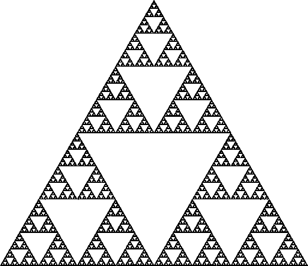
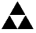
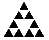

# 如何在朝着最终目标努力的同时保持动力

> 原文：<https://medium.com/hackernoon/how-to-maintain-motivation-while-working-toward-your-ultimate-goals-4373e478c0e5>

当人们谈论他们的“终极”目标时，他们是大胆的。

“治愈癌症。”

“组织全世界的信息。”

“制止恐怖主义。”

这些都是大目标。巨大的。令人畏惧。但是实现这些目标的道路是由成千上万个小步骤组成的。

> 我们倾向于关注我们现在所处的位置和我们今天能取得的成就。

但从长期来看，进步的速度(复利)比起点重要得多。

以下是如何提高你的配速并长期保持动力的方法:

# **优化你的增长率需要一个系统。**

为了看到整个系统——从大图一直到每一分钟的每一步——我着眼于物理学。

有一个叫做分形的概念。这是一种[数学](https://hackernoon.com/tagged/mathematical)建模结构的方式，其中整个图案由无限相似的图案以越来越小的比例组成。

有一种特殊的分形以第一个描述它的数学家的名字命名，叫做 [Sierpinski 三角形](https://blogs.scientificamerican.com/roots-of-unity/a-few-of-my-favorite-spaces-the-sierpinski-triangle/)。想象一个三角形。在它里面，你可以找到三个较小的三角形。在这些较小的三角形中，你可以找到更多相同的结构。诸如此类。

这是一个很好的模式。

## 它看起来是这样的:

Your big goal

The medium-range goals

All the way to important daily to-dos

And individual habits

# 这种分形模型可以代表各种各样的情况。

把它想象成从新手到专家的道路，需要越来越深的心智表征。你可以把它应用到你的工作中——从你今天的活动到你最终的职业道路。这是你最终公司目标的一个很好的模型。

> 你可能想要治愈癌症，但是你仍然必须坚持完成成千上万个更小的日常目标。

所有的小三角形都需要被填充，一次一个三角形。

你只是一步一步来，一天一天来，对吗？听起来很简单。但是大多数人不能有效地保持这种日复一日的专注来实现一个大目标。

这就是为什么这个分形如此有用。它通过给你一个关于整个过程的生动视角，以及所需的心态，分三个部分来增强动力。

# **1。变得痴迷。**

许多小目标合在一起，最终会成为伟大的事情。但是当你开始朝着一个新的目标努力时，你开始看到你还有多远要走。

大多数人最终会失去最初的兴奋。

也许你认为你想学习一门新的语言，但事实证明，动词变化和学习发音的日常工作并不像你希望的那样有趣。

> 达到你的最终目标需要执念。实现目标所需的长期强度很难保持，尤其是在几个月或几年内。

你需要对总体目标有一定程度的奉献，这将允许你度过困难和错误的转折。你必须足够痴迷于每天研究这些小三角形，而不会认为这种努力不值得。

# **2。想象你未来的自己。**

那么，你如何保持这种程度的奉献和动力呢？为你未来的自己创造一个生动的形象。

我们倾向于认为未来的自己是一个完全不同的人，这可能会扭曲我们对现在工作的看法。当我们认为这些小三角形会帮助别人时，它们就显得不那么重要了。

你现在的自己可能想跳过今天的训练。但是保持对未来自我的清晰愿景会不断提醒你所有的努力是为了什么。

> 它让你看到你的长期目标在大局中的位置。

未来的自己可以比你更好。它适用于合作伙伴、团队和公司。想想[软银关于他们想成为什么样的人的 300 年愿景](http://www.businessinsider.com/13-slides-softbanks-vision-for-next-300-years-2017-10)。

# **3。不断进行实时调整。**

着眼于现在和未来，您可以实时看到您的活动是否符合您期望的最终目标，并且您可以根据需要纠正过程。

当你继续朝着你的短期和长期目标前进时，你不可避免地会有航向修正。

> 你采取的每一个行动都会给你提供反馈，指引你前进，为你开辟新的道路。

这些不同路径的实验和测试将消除一些三角形并产生新的三角形。从小三角形到大三角形的路径将充当指南针，指引你走向最终目标。

例如，当考虑你的工作时，要明白随着你选择不同的道路，它会随着时间发生巨大的变化。这些是你开始时没有意识到的路径。就我个人而言，我过去常常整天埋头研究资料。现在，作为首席执行官，我的工作变得更加以人为本。我不得不改变方式，协调我的环境来适应我的新课程。

去年对你来说完美的策略今年可能对你不起作用。但是 Sierpinski 三角让你思考和组织你的目标，让你朝着正确的方向前进。

就我所知，这就是为什么 Sierpinski 三角是实现你最终目标的系统的最佳图示。