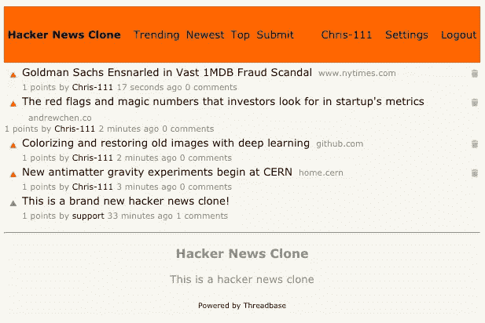
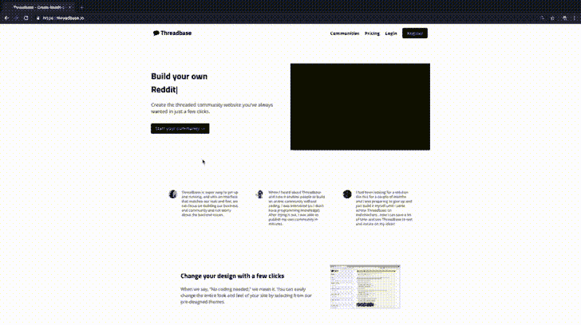
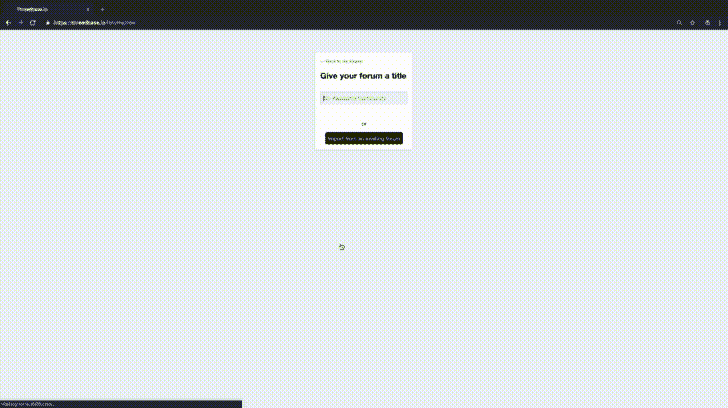
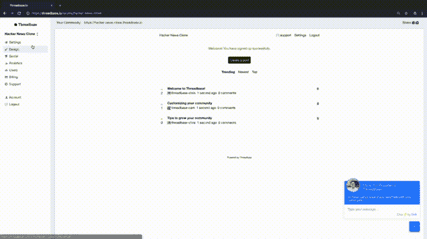
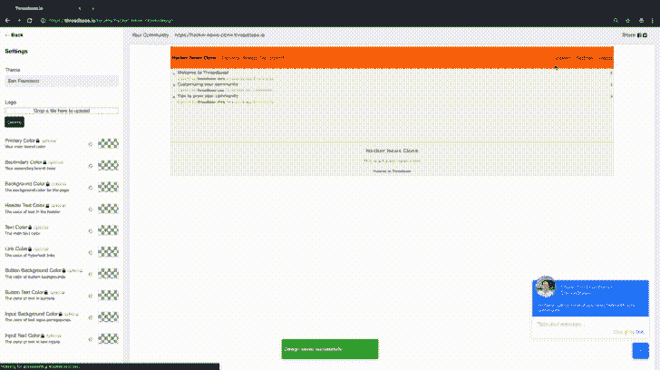
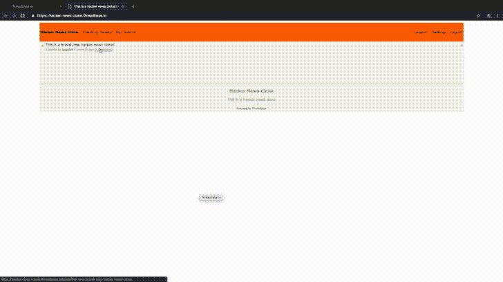

# 如何在不写任何代码的情况下，在一分钟内制作一个黑客新闻克隆

> 原文：<https://medium.com/hackernoon/how-to-make-a-hacker-news-clone-in-under-a-minute-without-writing-any-code-96fb15547677>

Check out the clone at [https://hacker-news-clone.threadbase.io/](https://hacker-news-clone.threadbase.io/)

Upvote 风格的社区非常受欢迎，因为它们…

1.  让社区的用户来决定什么是最好的内容，而不是朋友的朋友的算法或最新的排序。
2.  当发帖者和评论者的内容出现在顶部时，让他们有一种成就感。
3.  允许潜伏者在提要顶部立即看到与他们的社区相关的最重要的事情。

但是，如果你想创建一个像黑客新闻或产品搜索这样的 upvote 风格的社区，你需要学习如何编写一点程序来建立一些东西。

或者至少，你曾经需要一些编程经验。

今天，我将向你展示如何使用我们正在开发的名为 Threadbase 的产品在不到一分钟的时间内制作一个黑客新闻克隆。事实上，你可以向下滚动到底部来查看 59 秒的速度跑。

# 入门指南

I promise the password isn’t “password”.

其他制作黑客新闻克隆的教程需要你有一些编程经验，通常是安装了 Rails 或者 React，或者需要克隆一个 Github repo。

不是这个教程。

这就是你需要开始的全部内容:

1.  一台电脑
2.  互联网连接
3.  电子邮件地址

一旦你具备了这些先决条件，就去 [https://threadbase.io](https://threadbase.io) 注册一个账户。

# 获取您的社区链接

Ignore my over-eager chatbot (unless you have a question then message me!)

注册并命名社区后，Threadbase 会在一秒钟内创建新社区，并使用您提供的名称为其创建一个 URL。

对于我的演示社区，我将其命名为 Hacker News Clone，因此我自动生成的 URL 是 https://hacker-news-clone.threadbase.io/的。

要获得您的社区链接，请查看“您的社区”旁边的 iFrame 上方。

# 添加一些元数据并切换到 HN 主题

Fun fact: all our themes are named after our favorite cities.

从这里开始，您的社区将使用我们的通用模板，并在其中发布我们的入职帖子。稍后，我们将删除 onboarding 帖子，但重要的是添加一些元数据并切换到主题。

要添加将用于 SEO 的标语和描述，请访问设置部分。标语需要少于 50 个字符，但描述可以更长。

设置部分还有其他选项，如添加您自己的 Google Analytics pixel、隐藏广告和 Threadbase 品牌(如果您的社区是基本订阅，则可用)，如果您的社区订阅了 Plus，最终将允许您添加您自己的自定义域。

要将您的社区更改为黑客新闻主题，请访问设计部分，选择旧金山主题，然后单击保存。

你完了。你现在有一个黑客新闻克隆！

如果您想进一步自定义您的社区的颜色，您可以在基本层中解锁此功能。

# 删除和创建帖子

I create a post in the iFrame but you can also posts on the actual community link.

要删除 onboarding 帖子以准备好共享您的社区，请单击帖子右侧的垃圾桶图标。确认删除，帖子就会消失。

对于 Hacker News 克隆版，您需要单击导航栏中的 Submit 开始创建帖子。对于我们的主题，所有的帖子都需要一个标题和一些正文。

# 以评论结束

If you want to change the color of the text, upgrade to Basic. Customizing font families is coming soon!

在 Imgur 工作时，我们意识到有时最好的内容在评论中，所以评论是非常容易的。只需回复，然后点击提交，就大功告成了。

对评论的回复将像黑客新闻或 Reddit 一样，以线程/树型回复链的形式出现。

# 看我的速度跑

From nothing to Hacker News in 59 seconds.

随意参观这里的成品:[https://hacker-news-clone.threadbase.io/](https://hacker-news-clone.threadbase.io/)。

我希望这篇教程能启发你在 Threadbase 上创建自己的黑客新闻、产品搜索或 Reddit 风格的社区，如果你有任何问题，请随时在我们的[官方 Threadbase 支持社区](https://support.threadbase.io/?utm_source=social&utm_medium=medium&utm_campaign=181102_make_hacker_news)上发帖或发电子邮件至 support@threadbase.io

—

Chris 是 Threadbase 的联合创始人，Threadbase 是一个平台，非开发者只需点击几下鼠标就可以[建立自己的 Reddit 风格的社区。](https://threadbase.io/?utm_source=social&utm_medium=medium&utm_campaign=181102_make_hacker_news)如果你曾经想建立自己的在线社区，试试 [Threadbase](https://threadbase.io/?utm_source=social&utm_medium=medium&utm_campaign=181102_make_hacker_news) (完全免费开始！)并享受代码为 **TRY50** 的 1 个月付费计划的 50%优惠。

在 Threadbase 之前，Chris 在包括 Quidsi 和 ComiXology(均被亚马逊收购)和 Bonobos(被沃尔玛收购)在内的初创公司从事营销工作。