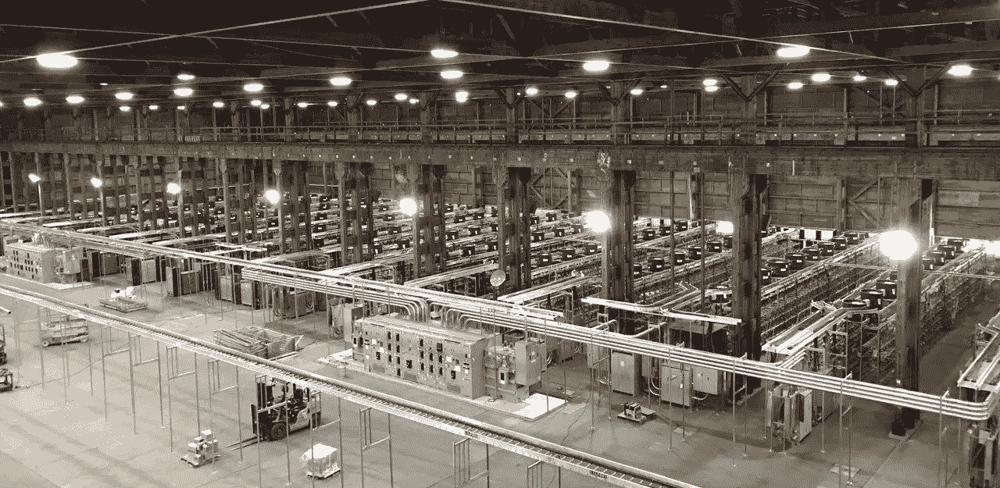
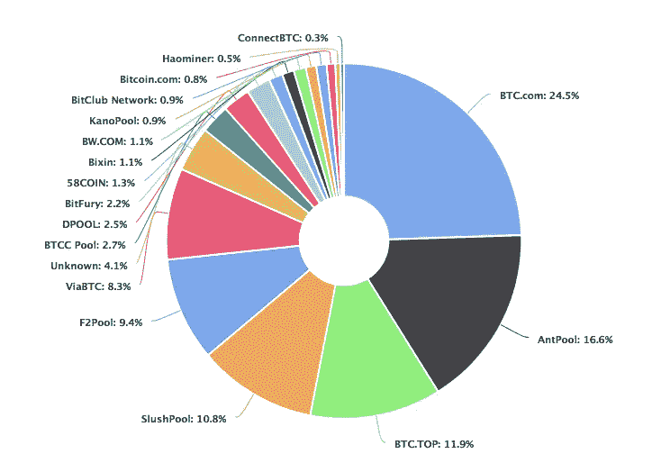
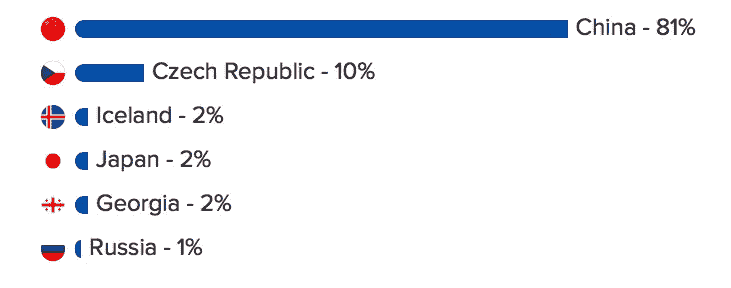

# 如何用 PoL 和 DASH7 做出更好的加密货币

> 原文：<https://medium.com/hackernoon/how-to-make-better-cryptocurrencies-with-pol-and-dash7-cccb8cf85e26>

*注意:这是关于使用 DASH7 实现位置证明的系列文章中的第二篇。你可以在这里找到第一个***。**

*我们正在围绕低功耗物联网[地理定位](http://bit.ly/2xuqQWv)在 Haystack 做令人兴奋的工作，最近已经开始了一个项目，使用运行在 LPWAN 上的 DASH7 开发[位置证明](http://bit.ly/2wJDLrJ) (PoL)。*

*PoL 的一个用例切中了许多加密货币架构的弱点:采矿力量的集中。(如果您对这意味着什么或如何工作不熟悉，请单击此处的。)为了简单起见，我将在本文中使用比特币，但这一论点也可以用于其他工作证明——或基于赌注的加密货币系统的证明。基本上，为比特币(和其他加密货币)组织 51%的采矿力量会带来严重的挑战:*

> *当单个政党控制了超过一半的采矿权力时，比特币网络受到 **51%的攻击**，因为单个政党可以在大多数时间创建区块。该单个挖掘器可以拒绝将有效交易放入在交易处理中创建**审查**的块中。矿工甚至可以通过重新计算可能让某人失去比特币的复杂数学方程来改变前一街区的记录。*

*首先，公司数量的采矿集中已经使比特币面临 51%的攻击风险:*

**

*Bitcoin mining concentration May 2018 (Source: [https://blockchain.info/pools](https://blockchain.info/pools))*

*有趣的是，BTC.com 和 AntPool 都由 BitMain 控制，而 BitMain 恰好也是世界上比特币挖矿硬件的主要供应商。所以没错，一家公司就控制了全球 41%的比特币矿池权力。当然，这是假设他们出售的采矿钻机没有后门或其他可能增加这种集中度的漏洞。*

*从地理上看，关于集中度的消息实际上更糟:中国控制了 80%以上的比特币矿池:*

**

*Top Bitcoin mining pools by location, April 2018 Estimate (Source: [https://www.buybitcoinworldwide.com/mining/pools/](https://www.buybitcoinworldwide.com/mining/pools/))*

*没有反对中国或其在区块链的成功，但 51%的攻击只是一个电话给一个矿业竞争对手了。随着加密货币架构师试图设计像“[抗 ASIC](http://bit.ly/2J53aOj)协议这样的解决方案，精通硬件和固件的工程师们智胜了他们……这种集中继续快速发展。*

*因此，对采矿集中化破坏加密货币未来的担忧是有道理的。我将让其他人来权衡 51%攻击/合作的概率，但一个入门级的博弈理论家可以假设。*

# *证明位置是采矿集中化的解决方案*

*虽然 PoL 不打算直接解决单个公司的采矿集中问题，但它可以验证给定矿工的地理位置，以允许比特币或其他加密货币的未来分支在奖励矿工时强制实现地理多样性。例如，比特币代码的未来分叉可以限制给定地理区域(国家、城市、纬度/经度等)允许的区块奖励数量。)以限制来自同一地理区域的 51%的攻击风险。*

*基于 GPS 的 PoL 在今天的[金融界](http://bit.ly/2I03VYo)出奇的普遍，但是很容易被伪造。LORAN 是一种被广泛讨论的 GPS 的地面备份，它很有意思，但与 GPS(或 GNSS)一样，它是一种单向信号，不支持公钥加密，因此是可欺骗的，还有其他缺点。因此，当我们寻找 PoL 的替代方法时，基本要求包括双向无线协议、分散式网络拓扑(即，非基于运营商)、极低的延迟以及对公钥加密的支持。*

# *低功耗在 PoL 中的重要性*

*虽然比特币采矿设备(显然)是由市电供电的，但许多其他需要 PoL 的物联网设备不是或不会是:例如无人机、Pokemon Go 腕带、门禁徽章、疫苗装运中的温度传感器等。因此，在低功率无线网络上实现 PoL 对于达到 PoL 标准是必不可少的。此外，基于 LPWAN 的移动终端将在获胜的 PoL 网络中扮演重要角色。*

*最终，我希望看到一个全球 PoL 网络——可能由 [FOAM](https://www.foam.space) 的团队在应用层领导——解决采矿集中化和许多其他用例。但是，创建这种全球性、分散式 PoL 网络的难题实际上存在于物理层和网络层。我们相信像 LoRa(和其他)这样的低功耗广域网无线电非常适合这项工作，像[这样的无线电不可知网络堆栈将成为 PoL 未来的基础。](http://bit.ly/2haytech)*