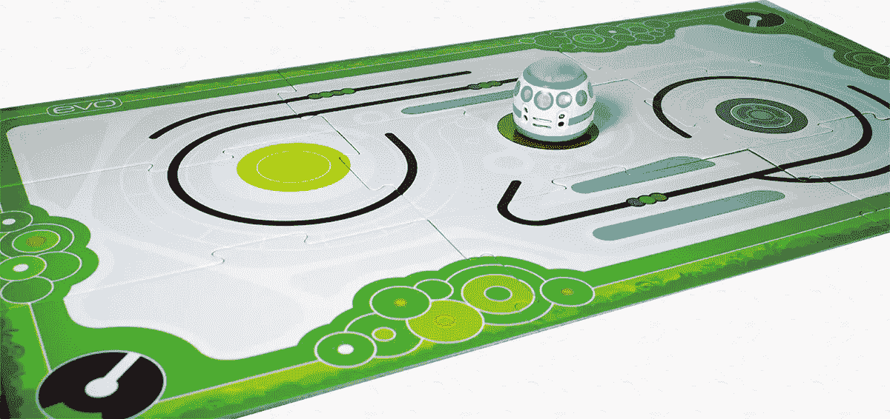
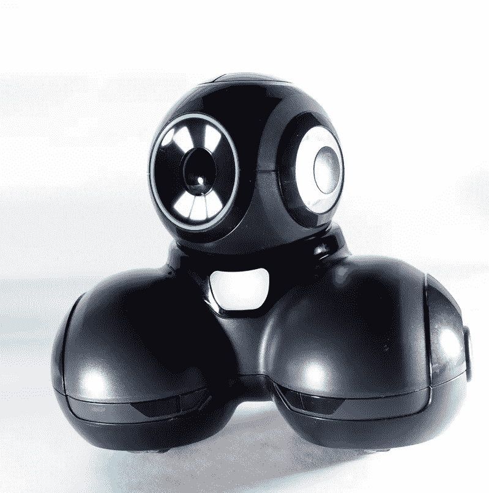
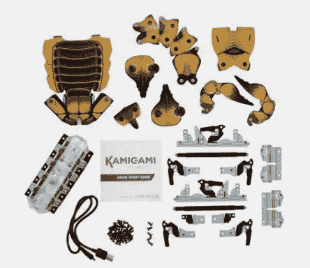
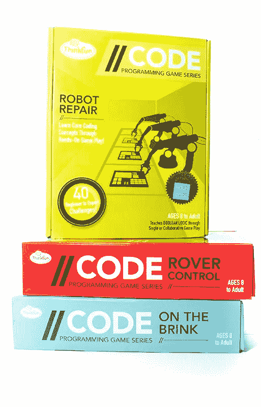

# 如何让儿童学习编码变得有趣

> 原文：<https://medium.com/hackernoon/how-to-make-leaning-to-code-fun-for-children-b0388beae9b9>

对于想在现代劳动力中脱颖而出的高中毕业生来说，基本的编码基础不再是可选的。不是每个孩子都会成长为开发人员，但理解计算机和人工智能如何工作的能力在几乎每个行业都很重要——而且每年都变得越来越重要。

幸运的是，有大量的小工具、游戏和资源被设计成将编程课程伪装成有趣的娱乐活动。找到正确的方法来激励你的孩子会有很大的不同，所以这里有一些按年龄组划分的选择。

# 5-8 岁

在这个年龄段，专家建议进行大量的实践活动。当然，有成千上万的教育应用程序和程序，但没有什么能像机器人一样让小程序活跃起来。

我们设法测试了几个儿童机器人，旨在帮助教授基本的编码技能，下面是我们最喜欢的几个:

**Evo** : [我们最近评测了](https://thenextweb.com/gadgets/2017/12/06/ozobot-evo-is-a-pocket-sized-robot-you-can-program-with-a-sharpie/)这款 [Ozobot](https://ozobot.com/?gclid=Cj0KCQiAgs7RBRDoARIsANOo-Hjo8pxr7iuR9CGF9MTf5i9HCgZk4-rgCx51FAOTrwWBXOG0aC-KH6caAh7-EALw_wcB) 机器人，虽然它是榜单上最小的一款，但却是我们的最爱之一。孩子们不用智能手机或遥控器，而是用不同颜色的记号笔画线来给 Evo“编程”。它也可以用手机或平板电脑控制，并支持拖放编程语言，但用标记“着色”的触觉是一种将逻辑问题与儿童联系起来的奇妙方式。

**提示**:在[我们对](https://thenextweb.com/distract/2017/10/18/the-cue-robot-delighted-my-children-and-scared-the-crap-out-of-my-cat/) [Wonder Workshop 的](https://store.makewonder.com/collections/cleverbots-accessories?utm_source=google&utm_medium=cpc&utm_campaign=646362917&utm_term=US-38594143121-238231859184--aud-298733317885:kwd-3647526917&gclid=Cj0KCQiAgs7RBRDoARIsANOo-Hi7q5HYo0GbpShCOFJf8KvcQYcRXSu1nwbtdktzNGNb1y8vKssUkvEaAgnZEALw_wcB)提示的评论中，我们指出了它与同行的区别在于它的个性。它伴随着你对几种态度的选择，所有这些态度都是有趣和积极的，但又各不相同。与青春期前和青少年相比，更年轻的孩子将从 Cue 的个性中获得更多的好处，但它仍然是任何年龄的优质机器人玩具。孩子们可以学习编程技能，并为他们的机器人创建带有声音和灯光的例程。

# 8-12 岁

大一点的孩子可能更倾向于喜欢更复杂的玩具和游戏，但以上任何一种产品也非常适合大孩子(如果你问我们，还有成年人)。

孩子们用塑料折叠在一起组装成的昆虫机器人[。这些全功能机器人在许多方面都优于昂贵得多的玩具，并且具有简单易学的编程界面。这些机器人教孩子们一些 STEM 技能——如果你把几个这样的机器人放在一起，它们会互动。这些对更小的孩子来说也很好，但是他们可能会与塑料铆钉斗争。阅读我们的](http://kamigamirobots.com/)[全评](https://thenextweb.com/distract/2017/10/11/kamigami-robots-insect-building-fun-whole-family/)。

**代号**:来自 [ThinkFun](http://www.thinkfun.com/learn-coding/) 的桌游。这是一个特殊的产品，因为像 Ozobot 一样，它们不需要任何应用程序或屏幕来玩。它们有几种选择，很受那些想向孩子们介绍代码基础的教育者的欢迎。不仅玩起来很有趣，而且它们是父母和孩子一起玩的很好的学习工具(即使有人被禁止打电话和看电视)。

一旦你的孩子长到十几岁，他们应该在学校学习计算机编程——根据专家的说法。我们鼓励你联系你孩子的学校，以确保学校教你的孩子他们需要知道的东西。

更多想法:优秀的 [Hour of Code](https://hourofcode.com/us/learn) 网站列出了数百种教育游戏和活动，其中许多可以在浏览器中玩，并且都受到专家和教育工作者的强烈推荐。

*这个故事是由* [*特里斯坦格林*](https://thenextweb.com/author/tristangreen/) *撰写的，最初发表在*[*Next Web 上。*](https://thenextweb.com/evergreen/2017/12/17/coding-fun-heres-ignite-developer-spark-children/)