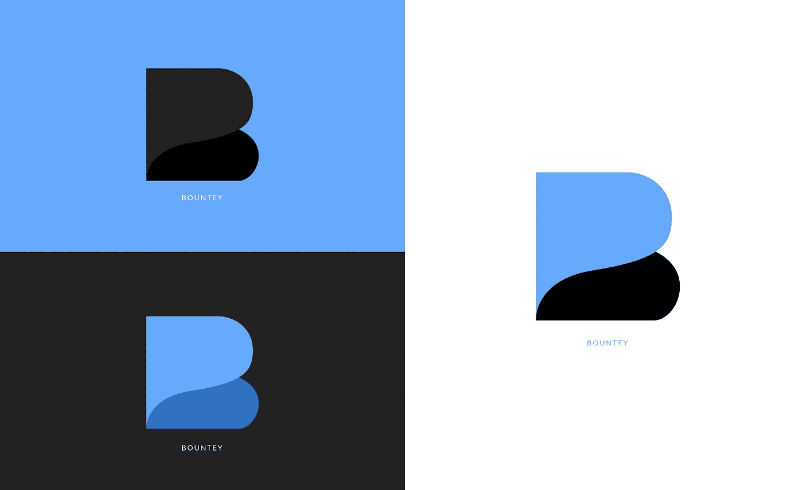

# 如果产品是免费的，你就是产品

> 原文：<https://medium.com/hackernoon/how-to-make-money-writing-blogs-7a4cb9eb2a9a>

## **我们的故事和新媒体的问题**

# 介绍

本文是免费的。您可以随时从任何设备上阅读。只要有互联网连接，您可以随时随地随心所欲地进行操作。

但是写这篇文章是不自由的。花了几个小时研究这个话题，建立受众，与出版商建立关系，管理和选择话题。这一切都是在写这篇文章之前完成的。

但是这篇文章是免费的。

事实上，互联网上的大多数内容都是免费的。我们不为我们阅读的博客，看的视频，听的播客付费。但有人为此付出了代价。

YouTube、Instagram、脸书和一些博客依靠广告赚钱，结果我们都被算法操纵着去买东西。观众点击内容期待真理和学习，但最终被说服购买一些东西。这就是 2018 年互联网上大多数内容的制作方式。

> “当前的系统导致越来越多的错误信息……以及以更低成本发布更多内容的压力——深度、原创性或质量该死。这是不可持续的，对生产者和消费者都不满意。**我们需要一种新的模式。**
> …
> 
> 经过进一步的思考，很明显这个破碎的系统是由互联网上的广告驱动的媒体。它根本不为人民服务。事实上，它不是为。我们每天消费的绝大多数文章、视频和其他“内容”都是由公司直接或间接支付的，这些公司为其提供资金以推进其目标。它是根据自己的能力来衡量、放大和奖励的。句号。结果，我们得到了…嗯，我们得到的。而且越来越糟了。"
> 
> ——Ed Williams，Medium 首席执行官

Medium 不同于大多数其他平台，因为它没有广告。然而，事实是，在 Medium 上赚钱的很大一部分仍然是通过赞助商获得的。

事实上，这个博客产生的所有钱都来自想让我们写下它们的密码货币公司。我们一直对货币化有着爱与恨的关系，因为我们一直在想“这是不是给我们的文章增加了偏见？”答案是它很可能做到了。

事实是，我们希望与观众的关系比与赞助商的关系更紧密，其中一部分就是赚钱。我们想吸引人们阅读我们的文章，而不是那些想写关于他们的文章的公司。

这让我很困扰，在过去的 6 个月里，我停止写文章，辞去工作，转而创造了一种新的方式来赚钱。在讨论我们构建的内容之前，我们先来谈谈内容货币化:过去、现在和未来。

# 互联网货币化简史

在媒体博客出现的 20 年前，就有了 RSS 提要。人们可以去有效地允许他们通过内容聚合器订阅的网站。实际上，你可以下载一个程序，该程序会询问你的订阅是否有新内容。如果他们这样做了，它会给你发一个通知，类似于收到一封电子邮件。

文章是免费的，这不是出于慈善。互联网在 1999 年非常新，人们不信任把他们的信用卡放在上面。毕竟，PayPal 还不存在，没人知道它会如何发展。这是一个免费内容时代的开始。

大约在同一时间，一家名为谷歌的搜索引擎公司诞生了，它有一个疯狂的主张。它会将人们搜索的内容与广告内容配对，这些广告内容将与人们搜索的内容相匹配。出价最高的人将首先看到他们的内容；于是，一场巨大的互联网革命开始了，搜索是免费的。

5 年后，一个名为“脸书”的小型社交项目很快发现，人们渴望与他们社交圈中的其他人分享他们的个人信息。这些信息可以出售给广告商，然后广告商可以利用这些信息来发布具有高度人口统计定制的广告。另一场革命开始了，社会化媒体的货币化，社会化媒体是免费的。

在接下来的 13 年里，这些公司了解了我们的一切，并创造了人工智能，以难以想象的规模瞄准并销售美国产品。Medium 的首席执行官(也是 Twitter 的创始人)知道我们创造的怪物，并开始了一个不会显示广告的博客。

## 中等

Medium 的使命很简单——创建一个专注于优质文章的平台。

媒体和它的出版商并不是从内容创作者那里拿走所有利润的邪恶公司。事实上，Medium 很难盈利，一年前他们解雇了三分之一的员工。

> 到今天为止，我们已经将我们的团队减少了三分之一，取消了 50 个职位，主要是销售、支持和其他业务职能部门。我们也在改变我们的业务模式，以便更直接地推动我们最初设定的使命。
> —媒体公司首席执行官 Ev Williams

如果你读到这样一段话，你会认为这家公司失败是因为人们不使用该产品。但是你可能会惊讶地发现**这发生在 Medium 增长最快的时候。**

> 就势头而言，2016 年是我们迄今为止最好的一年。读者和发布的帖子等关键指标同比增长了约 300%。我们目睹了媒体上发表的重要报道——从世界著名的领导人到不知名的个人——每天都有。
> — Ev 威廉姆斯

一家公司不断成长并被利用，却不得不解雇三分之一的员工，这怎么可能呢？这些明显的迹象表明，人们没有通过互联网支付的动机。

我们如何让观众愿意为内容付费？

由于这种破碎的货币化，Medium 决定通过 Medium 会员计划直接向用户收费。只要 5 美元，你就可以阅读无限量的优质文章(免费会员 5 美元)。然后，Medium 会根据高级会员的掌声向创作者支付这 5 美元中的一小部分。因此，如果一个高级会员拍了很多文章，你只能得到 5 美元的一小部分，而一个几乎不鼓掌的高级会员会给你带来更大一部分的钱，如果他/她每月给你的几个掌声。

制作仅限会员的文章会限制你博客的知名度，这意味着你的读者增长会严重减少。因此，在向你最忠实的粉丝展示你的文章和创建一个不会给你带来新观众的低能见度帖子之间，这可能是一种牺牲。

# 货币化的现状

一年前，随着加密货币开始爆发，我开始写文章。在此期间，我认为博客可能是了解这个话题的最佳途径。没有赚钱的预期，也没有意图。

最终，博客开始获得更多的关注，并加入更多的出版物。它获得了金融和投资第一的徽章，这基本上意味着人们阅读博客的时间会比这些类别中的其他博客更长。

在某个时候，我们开始收到一些公司的电子邮件，这些公司给我们大约 1000 美元，让我们写博客，分析他们的共识协议或加密货币。这是对我们博客的一个很好的验证，但也创造了一个真正的方法，使每周发布和分析成为可能。

让我们客观地看待事情。Medium 博客的最高收入是 1700 美元，大约 90%的故事收入不超过 100 美元。所以对我们来说，每个博客收到 1000 美元的赞助简直是疯了。

事实上，我们在[写作合作社](https://writingcooperative.com/consistently-featured-as-a-medium-top-writer-with-1-000s-of-views-here-s-how-c0e90b28a3d3)的一篇文章上发现了以下有趣的琐事:

> 《媒体头条》当月收入 1744.21 美元。根据上面的粗略计算，有 1.8 亿个故事被发表，这意味着你在一个故事上赚 1744.21 美元的机会比你赢得英国彩票头奖的机会少 10 倍*。*

*不幸的是，这意味着赞助商将能够看到我们的故事并对其发表意见，这将严重影响对话的真实性。我们明确地告诉用户哪些博客得到了赞助，但这还不够。*

*事实上，在某些时候，我们写的文章要么是专门为赞助商写的，要么是专门吸引新观众的，几乎没有介于两者之间的内容。*

## *真实和内容*

*当人们订阅博客/内容创建者时，他们这样做是因为他们期望高质量的内容。高质量本质上可以归结为诚实和信息丰富。但是，当我们收到赞助商的钱时，我们如何才能写一些诚实和翔实的东西呢？*

*更重要的是，我们如何为您提供更好、更有活力的体验。我们不希望你支付我们(或媒体)5 美元/月，因为有时我们会写更多或更少的文章，有时你会不喜欢我们写的文章。*

*如果我们可以创建一个系统，让你为你想让我们写的故事支付确切的费用，然后我们一起决定是否写以及何时写，会怎么样？这就是我们开始着手 [Bountey](http://www.bountey.com) 的原因。*

# *Bountey 和货币化的未来*

**

*目前所有的货币化解决方案都是这样的:*

1.  *从赞助商那里收钱，偏向你的内容*
2.  *不管观众是否想要这个故事，都要求他们每月付费(或每篇文章)*

*我们想要的东西可以让我们:*

*   *写我们的观众想要的，而不是赞助商*
*   ***让我们的观众为他们想要的东西买单***
*   *观众对我们应该写些什么的反馈*
*   *奖励我们最忠实的粉丝，不影响新粉丝*
*   *保持可见性，但不制作仅限会员的内容*

*为什么你要给某人一个月的报酬，当他们那个月可能什么都不写的时候，或者是什么激励他们写不止一次？这显然是次优的。*

*Bountey 是一个网站，在这里你(以及内容创建者)可以向你最喜欢的内容创建者提供想法，然后你和其他人可以将钱存入该建议。然后，内容创作者可以拿钱并执行建议。*

## *最佳 ICOs*

*我们想做一个实验。我们想知道如果我们让读者对我们将要写的文章进行投票会发生什么。具体来说，就是通过存钱来投票。只有当我们写他们想看的文章时，我们才会拿他们的钱。这也是我们测试他们想要阅读的文章种类的一种方式，也是他们向我们推荐的一种方式。*

*出于这个原因，从现在开始，我们将在[bountey.com/bestoficos](https://bountey.com/bestoficos)上发布我们所有的新文章想法*

***如果您喜欢我们的内容，并愿意帮助我们，请前往** [**页面**](https://bountey.com/bestoficos) **并投票让我们知道您的想法。***

*我们将不再从广告商那里拿钱，我们希望我们的支付 100%来自你想阅读的东西，而不是来自人们想卖给你的产品和东西。*

# *结论——如何通过写博客赚钱*

*你有 4 个选择:*

1.  *从赞助商那里拿钱，尽量不要变得有偏见*
2.  *利用媒体的合作关系，每个故事赚 10 美元*
3.  *每月要钱，向你这样的人收房租*
4.  *下注并加入 [Bountey](http://www.bountey.com) ，让您的观众提出建议*

*毕竟，媒介就是信息。*

*想帮忙吗？
在奖金上支持我们！[https://www.bountey.com/bestoficos](https://www.bountey.com/bestoficos)*

 *[## Bountey

### 编辑描述

bountey.com](https://bountey.com/bestoficos)* 

*谢谢你支持我们。*