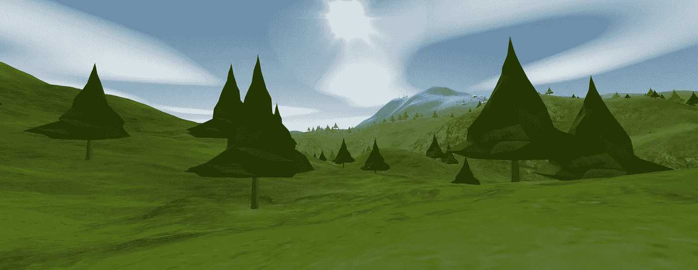
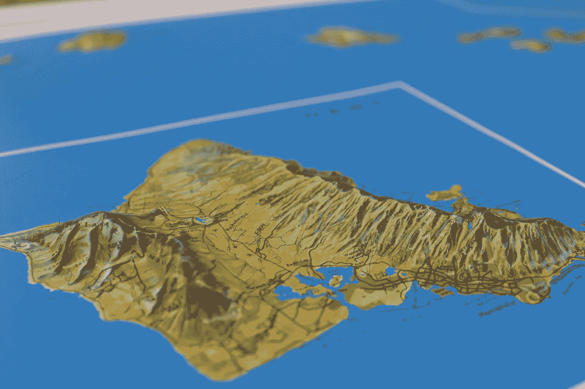
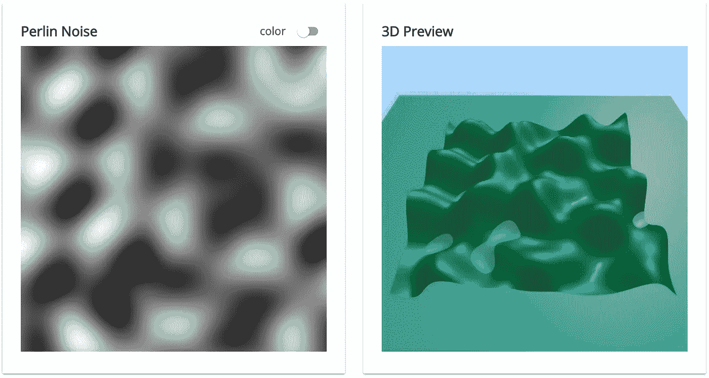
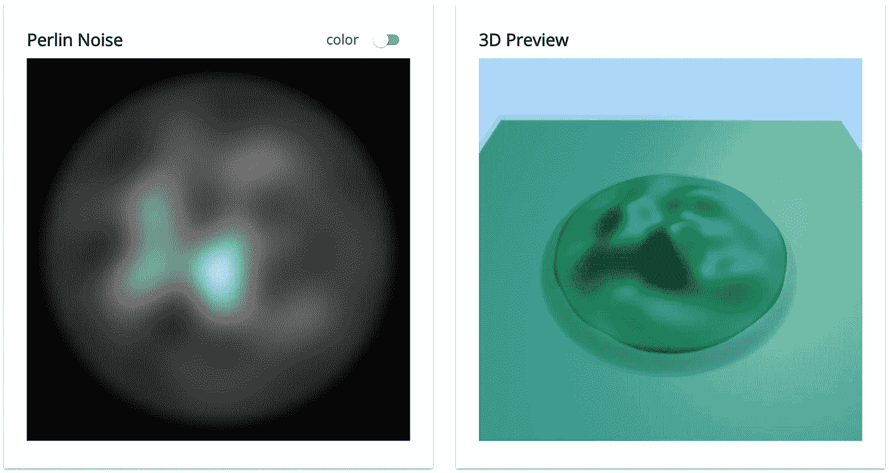
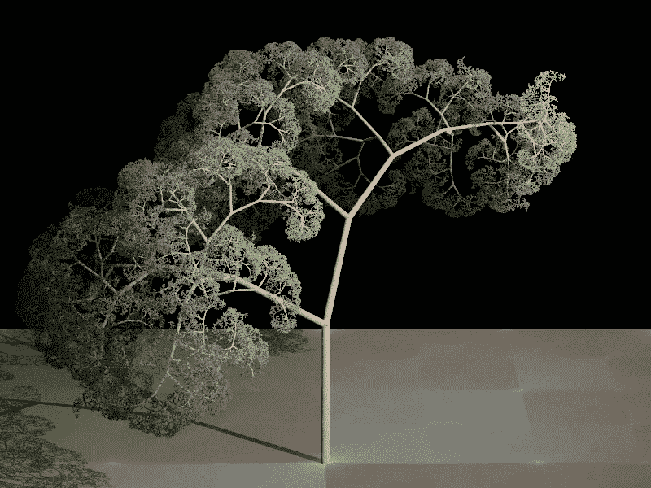
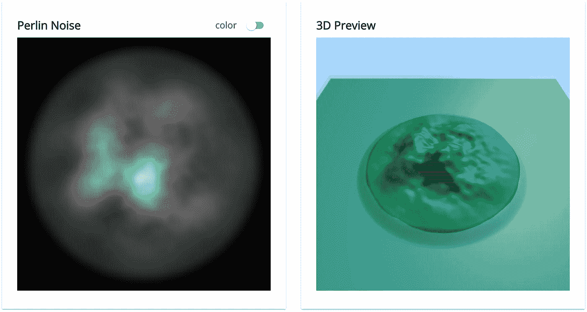
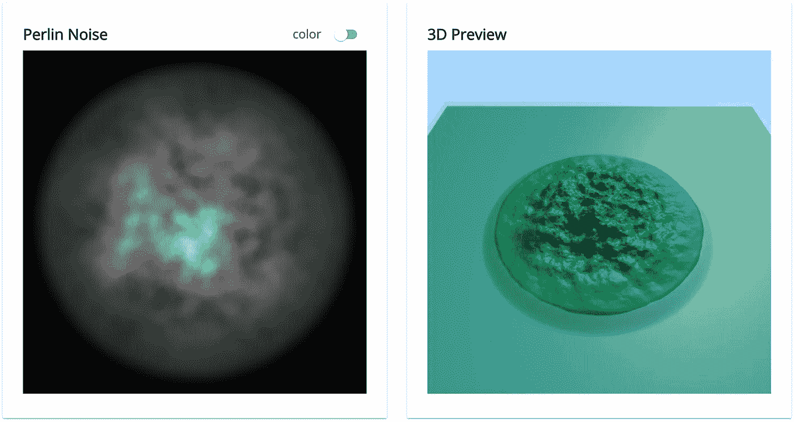
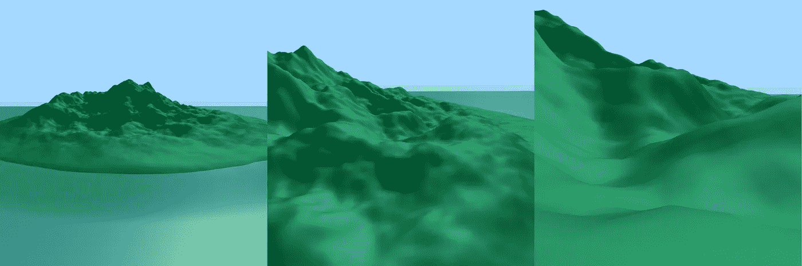

# 如何用柏林噪音让山变得令人难忘

> 原文：<https://medium.com/hackernoon/how-to-make-mountains-memorable-with-perlin-noise-76f93da23601>

## 记忆、用户体验和分形的故事

Screen shot of applying Perlin noise to Grasp Theory memory island terrain.

# 回忆…

我一直在建立一个个人的**内容管理系统** ( **CMS** )叫做[抓理论](https://johndavidmartin.com/sites/grasptheory)。我用它来吸收我读过或听过的所有书籍，这样我就可以快速组织和回忆这些信息。

CMS 的目标是为整合信息、合成新信息和回忆信息提供最佳体验。在研究消费和记忆信息的有效技术时，我偶然发现了“ [**记忆宫殿**](https://artofmemory.com/wiki/How_to_Build_a_Memory_Palace) ”的概念。

或许，你已经从约书亚·福尔的 TED 演讲或者他的书《与爱因斯坦漫步月球》中听说过记忆宫殿的概念。这是一个强大的工具，被记忆专家用来做令人难以置信的事情，比如记忆圆周率的 70，000 位数字。

[https://en.chessbase.com/post/memory-techniques-memory-palace-from-roman-times-to-today](https://en.chessbase.com/post/memory-techniques-memory-palace-from-roman-times-to-today)

记忆宫殿技术包括想象一个熟悉的 3D 空间，然后在脑海中沿着一条路径放置你想要记住的物体。由于我们大脑非凡的空间编码能力，这种技术使得回忆记忆宫殿中路径上的物体变得微不足道。

你自己的房子就是口语化的例子。你可以很容易地在精神上从外到内，从一个房间到另一个房间，从每个房间的一件家具到另一件家具。你的房子提供了足够的区别，所以房间之间有一个令人难忘的关系和足够的层次，以帮助房间和房间部分之间的思维转换。

除了记忆长长的数字列表，记忆宫殿技术还能做更多的事情吗？它能被用来回忆存储在 CMS 中的一般知识吗？

# 构建记忆岛

内容管理系统需要随着内容的增加而扩展。同样，内存宫的实现也需要扩展。理想情况下，每个值得深入探索的主题都有一个记忆宫殿。这意味着它需要支持许多记忆宫殿。

CMS 也应该让记忆所有的记忆宫殿和它们彼此之间的关系变得容易。本质上，记忆宫殿需要一个记忆宫殿！

在建筑物中储存建筑物可能会令人困惑，所以我决定在我自己的岛上晒晒太阳。在岛上，我可以用手中的一杯椰汁酒建造和组织许多记忆宫殿。

[https://www.3d-relief.com/Raised-relief-maps--of-the-world/Reliefkarten-USA/raised-relief-map-hawai.html?language=en](https://www.3d-relief.com/Raised-relief-maps--of-the-world/Reliefkarten-USA/raised-relief-map-hawai.html?language=en)

这座岛需要像一座记忆宫殿一样运作。它需要在不同的尺度上有足够的细节来容纳记忆宫殿群的形成，甚至可能是群体群的形成。

此外，它需要足够有趣的功能，以帮助不同规模的人定向，就像在你自己的房子里保持定向一样容易。

如果成功的话，我应该很容易就能回忆起我放在岛上的每一座记忆宫殿。

问题变成了，“如何让一个岛屿的地形变得有趣？”

你是如何让山变得令人难忘的？

# 第一天，有些模糊。很好。

我想要这个岛的立面图来帮助唤起人们对岛上所有记忆宫殿的回忆。我也不想手动绘制立面图，所以我想按程序生成**。**

**如果我可以程序化地生成它，我可以为一些代码提供一些变量，让它显示出我的岛屿的高程剖面。这将允许我在测试变量的不同值的效果时快速迭代。**

> **全局随机性和局部可预测性的结合是强大的。**

**那些已经熟悉过程生成的人知道肯·柏林的发明，柏林噪声函数([和它的更高性能的单纯形前身](https://stackoverflow.com/questions/6439350/simplex-noise-vs-perlin-noise?utm_medium=organic&utm_source=google_rich_qa&utm_campaign=google_rich_qa))。**

**柏林噪声函数产生独特但“局部可预测”的输出。这给了高水平的随机性和低水平的连续可预测性一个很好的平衡。**

**这种随机性和局部连续性的结合是如此强大，甚至《我的世界》也用它来生成地形和洞穴。**

**这是一张使用 2D·柏林噪声生成的图像，以及该图像作为地形的 3D 解释。这是我最初的出发点。**

**查看这里 的 [**现场演示。**](https://johndavidmartin.com/sites/terrain/index.html?configs=%7B%22seed%22%3A0.19425620300379554%2C%22octaves%22%3A%5B%7B%22id%22%3A-1%2C%22xScale%22%3A3%2C%22zScale%22%3A3%2C%22elevationPercent%22%3A100%7D%5D%2C%22islandConfigs%22%3A%7B%22enabled%22%3Afalse%2C%22seaLevel%22%3A16%2C%22shelfPercent%22%3A16%2C%22seaOpacity%22%3A40%7D%2C%22useTerrainPerlinNoiseColors%22%3Afalse%7D)**

****

**Basic Perlin noise and a 3D representation**

**这确实产生了一个高度剖面，但是需要做一些工作来获得更多的岛屿感觉，使它更加真实。**

# **保持体形**

**为了获得一个岛屿形状，地形的高度需要接近海平面，因为它越来越接近地图的边缘。这很容易。你可以[在这里看到代码](https://github.com/gitsome/terrain/blob/eae41dc59ebd38ad16c3a51783387900665f7e0e/terrain-react-app/src/classes/PerlinNoiseGenerator.cls.js#L96)。**

**[这是启用孤岛配置后的情况](https://johndavidmartin.com/sites/terrain/index.html?configs=%7B%22seed%22%3A0.19425620300379554%2C%22octaves%22%3A%5B%7B%22id%22%3A-1%2C%22xScale%22%3A3%2C%22zScale%22%3A3%2C%22elevationPercent%22%3A100%7D%5D%2C%22islandConfigs%22%3A%7B%22enabled%22%3Atrue%2C%22seaLevel%22%3A16%2C%22shelfPercent%22%3A16%2C%22seaOpacity%22%3A40%7D%2C%22useTerrainPerlinNoiseColors%22%3Afalse%7D):**

****

**Restricting Perlin noise based on distance from center of the island**

# **山脉到鼹鼠丘**

**这个阶段的小岛有点无聊。需要添加额外的细节，以便在不同的比例下为用户提供足够的信息，帮助他们更好地确定自己的方向。**

**如果我缩小，我应该能够从鸟瞰图中挑出独特的特征。如果我放大到地平面，我应该可以在更小的比例下看到足够的高度变化，以便在更低的高度定位我。**

**为了更好地思考这个问题，我考虑了来自**分形**和**自相似性**的类比。具有分形性质的事物具有“无标度”特性。细节的层次在不同的尺度下似乎保持不变。**

****

**[https://en.wikipedia.org/wiki/File:Fractal_tree_(Plate_b_-_2).jpg](https://en.wikipedia.org/wiki/File:Fractal_tree_(Plate_b_-_2).jpg)**

**树可以被认为是分形。如果你从树上切下一根树枝，检查它，它看起来，嗯，像一棵树。**

**甚至还有对山区地形的研究，分配一个分数维来描述它的无标度行为。看起来使用分形类比是正确的方法。**

# **模拟无标度地形**

**柏林噪声在为一个音阶提供足够的细节方面做得很好。我需要不同尺度下相同的柏林噪声效果。**

**自然，一些聪明人已经想出了一个好的解决方案。我只需要添加额外的柏林噪声层，以不同的比例进行变换。这叫加“八度”。每个八度音程都是一层柏林噪声，通过某种因素进行缩放，从而缩小或扩大细节。每个八度音程被[归一化并组合](https://github.com/gitsome/terrain/blob/eae41dc59ebd38ad16c3a51783387900665f7e0e/terrain-react-app/src/classes/PerlinNoiseGenerator.cls.js#L56)。**

**在我添加了一个八度的柏林噪声后，[的情况立刻开始好转。](https://johndavidmartin.com/sites/terrain/index.html?configs=%7B%22seed%22%3A0.19425620300379554%2C%22octaves%22%3A%5B%7B%22id%22%3A-1%2C%22xScale%22%3A3%2C%22zScale%22%3A3%2C%22elevationPercent%22%3A90%7D%2C%7B%22id%22%3A1%2C%22xScale%22%3A12.5%2C%22zScale%22%3A12.5%2C%22elevationPercent%22%3A10%7D%5D%2C%22islandConfigs%22%3A%7B%22enabled%22%3Atrue%2C%22seaLevel%22%3A16%2C%22shelfPercent%22%3A16%2C%22seaOpacity%22%3A40%7D%2C%22useTerrainPerlinNoiseColors%22%3Afalse%7D)**

****

**Two octaves total giving way to mountains and hills**

# **转动旋钮**

**最终，我在 4 个八度音阶上分层，这似乎充分提供了每一个音阶的细节。调整音阶和每个八度贡献的音调百分比花了一些时间，但是[的结果看起来更真实。](https://johndavidmartin.com/sites/terrain/index.html?configs=%7B%22seed%22%3A0.19425620300379554%2C%22octaves%22%3A%5B%7B%22id%22%3A-1%2C%22xScale%22%3A3%2C%22zScale%22%3A3%2C%22elevationPercent%22%3A65.72168673468862%7D%2C%7B%22id%22%3A1%2C%22xScale%22%3A11%2C%22zScale%22%3A11%2C%22elevationPercent%22%3A27%7D%2C%7B%22id%22%3A2%2C%22xScale%22%3A31.25%2C%22zScale%22%3A31.25%2C%22elevationPercent%22%3A5.169300728466543%7D%2C%7B%22id%22%3A3%2C%22xScale%22%3A78.125%2C%22zScale%22%3A78.125%2C%22elevationPercent%22%3A2.1090125368448427%7D%5D%2C%22islandConfigs%22%3A%7B%22enabled%22%3Atrue%2C%22seaLevel%22%3A16%2C%22shelfPercent%22%3A16%2C%22seaOpacity%22%3A40%7D%2C%22useTerrainPerlinNoiseColors%22%3Afalse%7D)**

****

**Four total octaves gives detail at the macro and micro scales**

**当你放大时，你可以看到适量的细节来找到感兴趣的点。你可以看到远处清晰的山脉，当你走近时可以看到几座小山，在地面上有突起。任务完成！？**

****

**Detail at many zoom levels allows the user to find points of interest useful for orienting themselves at different scales**

# **运用这项技术**

**我将这些简单的技术应用到我在 CMS 的 3D 世界中。**

**查看下面的动画，它显示了用户在 Grasp 理论记忆宫殿岛中进行交互的不同尺度，并注意本文中讨论的柏林噪声技术的应用:**

**Implementation using ThreeJS with custom shaders and LOD Terrain algorithms.**

# **真的有用吗？**

**我的目标是回忆起这座岛上每一座记忆宫殿。这里的初步结果是主观的，但很有希望。**

1.  **在放置了几组记忆宫殿和每个记忆宫殿中的一些内容之后，我意识到这个方法对我来说非常有效。你可以随时在街上拦住我，我可以告诉你岛上每个记忆宫殿的位置，以及它与什么主题有关。**
2.  **此外，我可以给你画一张当你从任何记忆宫殿向外看时所看到的美丽图画，包括远处的小山和山脉。**

**随着软件的进展，将会量化有效性，我会再次发布。希望这能带来新的有趣的方法来增强教育和 T2 的学习！**

# **喜欢这篇文章？**

**谢谢！考虑给这篇文章一些**掌声**！**

## **生成您自己的岛屿！**

**[查看现场柏林噪音演示](https://johndavidmartin.com/sites/terrain/index.html)并创建您自己的地形！**