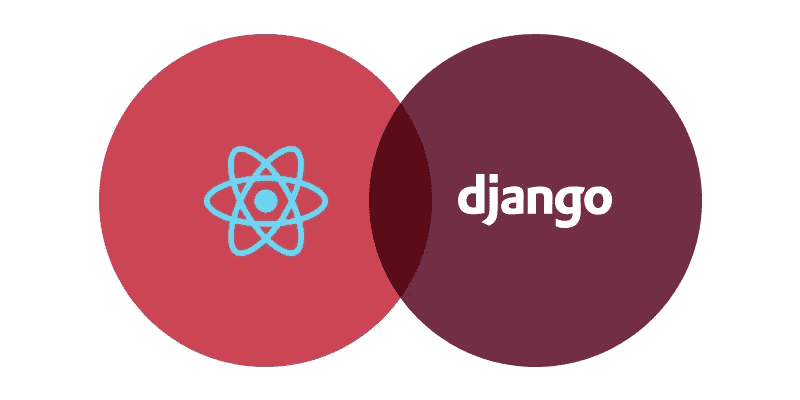

# 如何让 React + Django 组合像魔法一样工作

> 原文：<https://medium.com/hackernoon/how-to-make-react-django-combination-work-like-magic-7605360979c4>

在过去几年中，基于 Javascript 的 ReactJS 结构越来越受欢迎。这是理所当然的——它非常灵活，毫不夸张地说，是创建单页面应用程序的完美解决方案，目前也非常流行。React 还帮助开发交互式 web 应用程序，由于服务器端渲染，这些应用程序具有无可挑剔的性能。除此之外，在脸书团队以及广泛的在线社区的支持下，你可以亲眼看到它对于 web 应用的前端开发是多么的高效。

然而，仅靠 React 不足以构建功能全面的 web 软件。API 还必须与创建的前端集成，以提供服务器交互和数据传输。与众多开发人员类似，我们更喜欢基于 Python 的框架 Django Rest 来完成这项任务，它是专门为后端开发而发明的。

尽管 Django 和 React 基本上是两个独立的结构，前端和后端在各自的帮助下编写得很好。我们准备了一个简短的教程，告诉你如何在 Django 中使用 React。

# React + Python (Django)组合为什么效率这么高？

在前端框架首次出现在 IT 开发领域之前，应用程序的所有业务逻辑都只在服务器端工作。UI 只需要显示对用户请求的某些反应。当 React 和 Angular 这样的解决方案出现时，web 应用程序的构建方法经历了重大的变化。用户-服务器交互过程变得更加先进。用户输入与用户界面元素的同步开始在前端软件代码中实现。

这极大地提高了 web 软件的性能，并提供了全新水平的 UX。这也让开发人员的工作变得更容易——借助这种方法编写的应用程序在本质上更具可扩展性。

至于 React 和 Django 对，它实际上是构建全球 web 软件的典型组合。问题是，Python 和 Django 都具有陡峭的学习曲线、庞大的在线社区和一套良好的内置工具，允许用户专注于软件逻辑的构建，而不是其他更琐碎的方面。

React 与 Django 的集成非常简单。此外，该框架因其[非常快速的渲染](https://reactjs.org/docs/faq-internals.html)(例如，与 Angular 提供的相反)、可访问的学习曲线和高级灵活性(然而，这可能会给没有经验的开发人员带来某些困难，如深度代码错误)而受到称赞。

好吧，我们有没有让你相信 Django 和 React 值得你关注？然后让我们来看一些创建后端(通过 Django)和前端(通过 React)的技巧。

# 写入后端

首先，安装 Django 框架，并以如下方式连接数据库:

`$ virtualenv env`

`$ source env/bin/activate`

`$ pip3 install django djangorestframework django-filter`

`$ pip3 freeze > requirements.txt`

现在，我们可以打开项目并启动应用程序:

`$ django-admin startproject backend`

`$ cd backend`

`$ django-admin startapp api`

下一步将是根据 [Django 工作要求](https://docs.djangoproject.com/en/1.11/topics/install/#get-your-database-running)以及 DRF 的[配置对所选数据库进行配置。](http://www.django-rest-framework.org/#installation)

现在，我们来看看软件开发最重要的一个方面——认证过程。在我们的例子中，我们来看看使用令牌的身份验证。这不是最可靠的选择，因为令牌会无限期地存储在服务器端——如果某个黑客发现了您的解决方案中的这个弱点，他们将会成功地破解它。另一方面，这种身份验证方法允许我们演示一种通过 API 在 UI 和服务器端之间提供连接的方法。在 [Django 官网](http://www.django-rest-framework.org/api-guide/authentication/#tokenauthentication)上了解如何配置令牌。

查看如何在令牌的帮助下实现身份验证过程，特别是某个用户的名称和密码在 redux Store 中的重要性:

`# file: api/urls.py`

`from django.conf.urls import ur` l

`from rest_framework.authtoken import views as drf_views`

`urlpatterns = [`

`url(r'^auth$',`

`drf_views.obtain_auth_token, name='auth'),`

`]`

下一步是 urlpatterns 的定义:

`# file: backend/urls.py`

`from django.conf.urls import url, include`

`urlpatterns = [`

`url(r'^', include('api.urls', namespace='api', app_name='api')),`

`]`

将此代码添加到项目中，您将教会您的软件跟踪资源位置指示器。

下面几行用于测试应用程序的性能——它们启动服务器端的性能，但是，测试本身只能在前端工作完成后才能启动。

`$ python3 manage.py migrate`

`$ python3 manage.py createsuperuser`

`$ python3 manage.py runserver 0.0.0.0:8000`

一旦您编写了服务器端的代码，您就可以通过下面的命令轻松地检查您的资源位于何处:

`$ curl -X POST -d "username=username&password=password"`http://localhost:8000/auth

# 书写前端

让我们从如何在我们的代码中使用众所周知的特性 create-react-app 的定义开始。还要注意，您必须删除配置文件中的默认内容(我们相信这将为您进一步开发前端性能提供更多的灵活性)。

`$ npm install -g create-react-app`

`$ create-react-app frontend`

`$ cd frontend`

`$ npm run eject`

设置相关性您会发现这在以后的工作中很有用:

`$ npm install --save-dev babel-preset-es2015 babel-preset-stage-3`

`$ npm install --save redux redux-logger redux-persist response-redux`

`$ npm install --save axios response-router-dom lodash`

考虑负责后端和前端连接的代码部分。要做的第一件事是创建一个 redux Store，您将在其中执行存储带有用户数据的令牌的过程(应用程序在身份验证时接收这些数据):

`// file: src/store.js`

`import { compose, createStore, applyMiddleware } from 'redux';`

`import { createLogger } from 'redux-logger';`

`import { persistStore, autoRehydrate } from 'redux-persist';`

`import rootReducer from './reducers';`

`const store = createStore(`

`rootReducer,`

`compose(`

`applyMiddleware`(

`createLogger()`，

`),`

`autoRehydrate()`

`)`

`);`

`persistStore(store);`

`export default store;`

`// file: src/reducers/index.js`

`import { combineReducers } from 'redux';`

`import * as actionType from '../actions/types';`

`const tokenInitialState = null;`

`const token = (state = tokenInitialState, action) => {`

`switch(action.type) {`

`case actionType.SET_TOKEN:`

`return action.data;`

`default:`

`return state;`

`}`

`}`

`const appReducer = combineReducers({`

`token,`

`})`

`const rootReducer = (state, action) => {`

`return appReducer(state, action);`

`}`

`export default rootReducer;`

接下来，定义必须以代码形式输入到 index.js 和 types.js 文件中的操作:

`// file: src/actions/index.js`

`import * as actionType from './types';`

`export const setToken = (data) => {`

`return {`

`type: actionType.SET_TOKEN,`

`data`

`}`

`}`

`// file: src/actions/types.js`

`export const SET_TOKEN = "SET_TOKEN";`

以上是解决方案在身份验证期间如何定义带有用户数据的令牌处理的定义。特别是，您可以看到它们在服务器端的保存方式。

现在，对于需要描述用户授权过程的代码行(它们包括异常处理器，其中定义了应用程序在输入无效数据时的行为)。

`// file: src/util/Auth.js`

`import axios from 'axios';`

`import _ from 'lodash';`

`import store from '../store';`

`import { setToken } from '../actions'`

`import { URL, LOGIN } from '../config/Api';`

`export function InvalidCredentialsException(message) {`

`this.message = message;`

`this.name = 'InvalidCredentialsException';`

`}`

`export function login(username, password) {`

`return axios`

`.post(URL + LOGIN, {`

`username,`

`password`

`})`

`.then(function (response) {`

`store.dispatch(setToken(response.data.token));`

`})`

`.catch(function (error) {`

`// raise different exception if due to invalid credentials`

`if (_.get(error, 'response.status') === 400) {`

`throw new InvalidCredentialsException(error);`

`}`

`throw error;`

`});`

`}`

`export function loggedIn() {`

`return store.getState().token == null;`

`}`

这几行代码允许发送 redux Store 令牌，并且通过这种方式，让我们能够从解决方案的用户部分的任何地方与授权用户建立互连。

`// file: src/util/ApiClient.js`

`import axios from 'axios';`

`import store from '../store';`

`import { URL } from '../config/Api';`

`export const apiClient = function() {`

`const token = store.getState().token;`

`const params = {`

`baseURL: URL,`

`headers: {'Authorization': 'Token ' + token}`

`};`

`return axios.create(params);`

`}`

这两段代码使用了包含常量定义的文件。这个文件使得阅读代码变得更加简单，并且减少了由于变量的不正确重定义而导致的错误(对于常量，它们在../config/Api 文件)。

`export const URL = process.env.API_URL;`

`export const LOGIN = "/ auth";`

就是这样。您已经使用 React with Django 成功地建立了后端和前端之间的互连。现在，您可以测试创建的解决方案。只需进入系统，在相应的行中输入您的认证数据。如果一切正常，您可以在开发者模式下重复启动应用程序时打开浏览器，并看到令牌已被传输到 redux Store 服务器。

# 结论

正如你所看到的，或多或少熟悉 React、Redux、Django 和 DRF 的人在实现上述例子时不会遇到太多困难。另一方面，如果你是一个没有经验的 web 开发人员，想要建立一个商业解决方案，那么请向专业人士求助。

*原载于 2018 年 8 月 7 日*[*【sloboda-studio.com】*](https://sloboda-studio.com/blog/how-to-make-react-django-combination-work-like-magic/)*。*