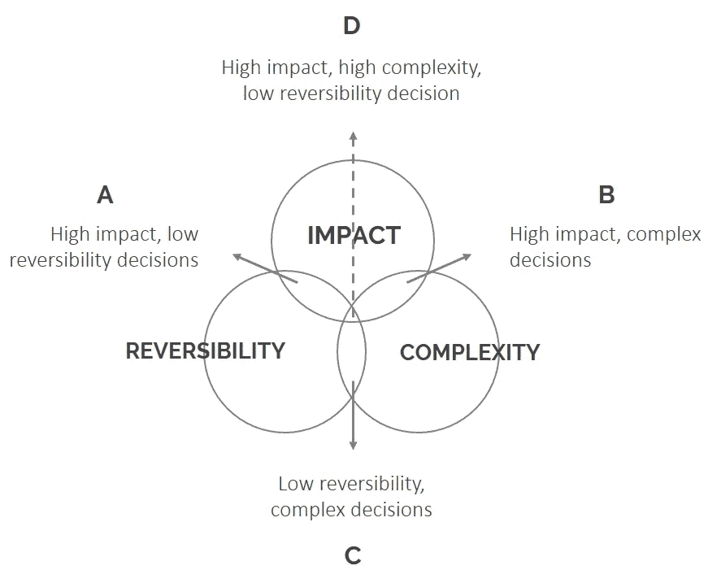
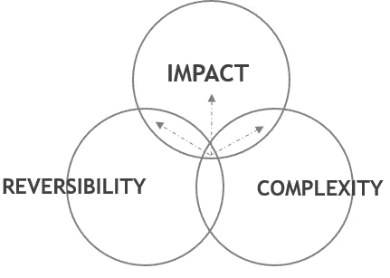

# 如何做出(正确的)决定

> 原文：<https://medium.com/hackernoon/how-to-make-right-decisions-50a1cf850320>

作为一名首席执行官，你最大的优势在于[决策](https://hackernoon.com/tagged/decision-making)。事实上，一旦你进入一家公司的早期阶段，你最终要做的两件最重要(也是最频繁)的事情就是——决策和沟通。那么，如果你所做的决定可以成就或毁掉你的创业，你如何做出正确的决定呢？

根据我在过去 5 年的[学习](https://hackernoon.com/tagged/learning)，我意识到决策有 3 个关键属性

**影响—** 它影响了多少人的生活，它会影响多久，它会对关键指标产生重大影响吗，等等。

复杂性——既包括收集做出决策所需的数据，也包括一旦做出决策就要付诸实施的努力

可逆性——如果你最终做出了错误的决定，那么撤销它有多容易？

当您根据这 3 个参数评估每个决策时，您的最终目标是优化以下两件事

**速度** —正确决策迅速>错误决策迅速>正确决策缓慢>错误决策缓慢。是的，速度很重要，快速做出错误的决定实际上比缓慢做出正确的决定要好。这是因为，理论上没有决定是完全不可逆的(除了改变生命形式)。所以即使你做了错误的决定，你也可以很快扭转它。因为你不会因为犯错误而真正失去什么(你会学习并为下一次变得更聪明)，一个错误的决定很快被撤销比一个正确的决定慢慢做出要好。

**确信**——如果我们把明显的情况放在一边，在这些情况下，正确的选择是显而易见的(比如是否跳到一辆疾驰的汽车前面)，在大多数*模糊的现实生活*情况下，如果确信地执行，任何决定都可能被证明是正确的。这是因为决策的正确性不能在决策时确定，而是在决策完全执行时确定。所以如果你有完全的信念，你的执行力一定会推动成功。

影响、复杂性和可逆性这三个参数的叠加可以通过下面的文氏图来展示。影响圈意味着高影响决策，复杂性圈意味着高复杂性，可逆性圈意味着低可逆性。

Decision Making

虽然图中有不同的部分，但是人们可以将它们大致分为两部分——低影响决策和高影响决策。让我们从低影响决策开始。

## 低影响决策

如果你在一个需要做很多决策的职位上，尽可能多地委派那些影响较小的决策。如果你不能委派这些决定，那么用过程代替决策。定义一个过程，这样你就不必每次都花费精力去做一个重复的低影响的决定。

在低影响部分，让我们首先来看看属于 **C** 类别的决策——这些是*低影响决策*，它们是*复杂*并且具有*低可逆性*。一个很好的例子是——你的办公室使用哪种内务管理服务。这个决定很复杂，因为你将不得不会见一堆机构，获得他们的报价，然后敲定一个——这可能需要几周时间。它的不可逆转性很低，因为一旦加入，你至少要花 6 个月的时间才能发现它不可行，然后选择过程又要重新开始。但这是一个低影响的决定，因为家政服务是一件相当普遍的事情。有足够多好的服务提供商，尽管拥有好的服务(卫生)很重要，但拥有一个好的服务提供商并不能改变游戏规则，因为一个好的家政服务的优势是相当有限的。

卫生决策并不是真正的高影响力决策，因为我相信一个决策的影响力是由其创造的优势决定的。因此，尽可能多地委派这些*低影响、高复杂性、低可逆性的*决策。如果你不能做到这一点，那么优化速度的决定比其他任何事情都重要。

在低影响部分有 2 种其他类型的决策— *高可逆性、高复杂性*和*低可逆性、低复杂性*。对于前者，可逆转性很高，所以要迅速做出决定，如果你错了就逆转。对于后者，复杂性较低，因此请快速收集事实和依据，以选择最佳可用选项。我的强烈建议是——“不要重新发明轮子”。如果你能找到最佳实践，或者如果有人已经这样做了，就跟随他们的脚步。请记住，这些都是影响不大的决定，所以做出 A+决定的好处并不能抵消为此浪费的时间。

## 影响深远的决策

尽管人们仍然应该在*高影响力*决策中优化速度，但我不建议匆忙通过它们。此外，在许多情况下，优化信念可能比速度更重要。让我们看看属于这一部分的各种决定。

第一类是属于第 **A** — *部分的决策，影响大，可逆性低，但复杂性低*。属于这一类的决策并不多，因为一般来说，低可逆性决策也是高复杂性的。但是，举个例子就是，大学选什么选修课。我称之为高影响力，因为你选择的选修课在以后的生活中会非常有用。他们可以开辟不同的职业道路，或者帮助你从不同的角度看待你的核心工作。这些都是低复杂度的决定，因为人们可以结合常识和天生的兴趣来确定一个有用的选修课列表。然而，我们通常在这些决定中出错的地方是没有正确地考虑它们。例如，学生经常错过好的选修课，因为他们太懒了，没有早点注册。这里的风险不是你会做出一个明显错误的决定，这是不太可能的，因为这是一个低复杂性的决定，但不经过深思熟虑就很容易做出次优的选择，并错过潜在的巨大优势。因此，这里的想法是优化的好处。

第二类是属于第 **B** — *部分的决策，影响大，复杂度高，但具有高度可逆性*。例如，您遇到一位客户，他有一个有趣的使用案例，但是产品不支持它。如果可行，会有很多好处，但是你不确定是否值得花费时间和精力(复杂的不是做出决定，而是之后的执行)。我看到大多数公司在规模小的时候做出这些决定的速度非常快，但随着规模的扩大，他们陷入了分析瘫痪。由于决策具有很高的可逆性，如果它不起作用，你可以随时关闭它。事实上，10 个案例中有 9 个会以撤销决定而告终——关闭实验产品/功能。但这不是关于 9 个错误的决定，而是关于那一个创造了**高收益**的正确决定。当您在这些决策中优化速度时，最理想的是尽可能降低复杂性——缩小实验范围或找出一个简单的执行策略。你也想为信念做一点优化，因为你不想最终处于这样一种情况:你正在启动实验，却又异想天开地关闭它们。做出这些决定的最理想的方式是

*   迅速做出决定，但要花时间定义实验的成功——应该发生什么，你才能说这是一个伟大的实验。定义一些容易衡量成功的客观标准。
*   为此投入一定的时间。你知道这不会在一夜之间成功，所以投入最少的时间，并在此期间衡量成功的标准。只有 3 种结果——成功，失败&不能说。前两个要做什么很明显。在你不能说的情况下，如果你仍然有很高的信念，将时间延长一些合理的量，并在结束时再次评估。如果你还是没有答案，我就不建议再延伸了。
*   记录决策过程——你为什么做这个决定，你考虑了哪些因素等等。这将有助于你未来的决策。

属于第 **B** 部分的决策的另一个例子是，决策本身很复杂，但执行起来并不复杂。假设你没有使用过公关作为营销策略，你想尝试一下。这是一个可逆的决定，因为你通常会从外部公关机构开始，只有在它奏效的情况下才会将其转移到内部——因此，如果该机构不起作用，你可以撤销你的决定。此外，如果该机构未能展示成功，那么如果你在内部尝试，结果可能也不会有什么不同。

这个决定是*高度复杂的*，因为你不仅要确定并加入正确的公关机构，你还必须确保你有正确的内部系统来利用代理工作。在这种情况下，尝试公关的决定应该相当快(你会惊讶于人们对这种高影响力、高度可逆的决定的看法)。但是你确实需要花大量的时间去执行。

有一个简单的方法可以把这些事情做好——不要重新发明轮子。寻找已经这样做的人，并遵循他们的建议。

## 最艰难的决定

在你必须做出的所有决定中，最艰难的决定属于 **D** — *高影响力、高复杂性*和*低可逆性*。做出这些决定不仅需要时间，而且一旦做出决定就很难逆转。这些都是我会为**信念而不是速度**优化的决策。因为在决策过程中，即使你会收集大量的数据，做大量的研究并听取多方面的意见，最终你也不得不做**你相信**的事情。像买房子、结婚或显著改变公司战略这样的决定都属于这一类。

我们经历了一个不得不显著改变公司战略的情况，这不是一个完整的支点，而是一个相当重要的变化。4 年来，我们一直是社区第一企业，然后有一天，我们决定成为一个企业 SaaS 公司。这将对公司产生深远的影响。这意味着所有的团队必须重新分配，一些产品线必须被取消，一些低调的商业模式必须关闭，一些角色将变得多余，大多数人必须重新培训。最重要的是，组织中的每个人都必须重新调整以适应新的公司使命。影响是巨大的！

你不能在这样的决定上动作太快，你很少在某个时间点做出这些决定。在你有意识地开始考虑这些决定之前，这些决定的想法就已经在你的头脑中播种了。一旦你下定决心，就进入了研究阶段。你必须进行广泛的研究——挖掘你的数据，进行竞争研究，查阅第三方报告和公共数据，最重要的是与大量的人交谈。在这样的决策中最重要的事情是有一个*固定的期望最终状态条件。*这意味着你完全清楚*想去哪里*以及*为什么*，即使你可能不知道*如何*或*何时*。

有了这个北极星指标，这个不可协商的结果，你就可以开始绘制 a)你今天在哪里，b)你想去哪里有什么可能的方法(思维导图是绘制这种图的好方法)。当你创建这个思维导图时，收集图上每个点的详细数据，并客观地评估每个点如何与你的*固定的期望结束状态条件相一致。*

尽管对任何决定设定一个时间限制很重要，但是你应该有意识地慢慢来。这是因为，你不仅要做广泛的研究，更重要的是，你要对你要做的决定建立一个坚如磐石的信念。随着你日复一日地浏览思维导图，一次又一次地讨论，慢慢地，你必须做出什么决定就变得很清楚了。渐渐地，你会明白这个决定。这是一个影响很大的决定，你很可能无法逆转，所以无论你做出什么决定，你不仅要接受，还要享受和宣传(至少在战略变化的情况下，因为你需要走出去，说服内部和外部的利益相关者)。所以除非你完全被收买，否则这个决定注定会失败。

如果你使用上面的文氏图来分类你的决定，并优化它们的速度和信念，你会意识到，在大多数情况下，这并不是决定中固有的复杂性，而是我们不客观和过度思考造成的复杂性。

我们大多数人倾向于将高影响力的决策放在第 **D** 部分，而这些决策实际上属于其他部分。例如，人们问我，我是如何离开谷歌舒适高薪的工作，投身到一家完全没有经验的初创公司的不确定性中的。99.9%会把这个决策放在*高影响*、*低可逆性*和*高复杂性*部分*。虽然它是高影响的，甚至可能是高复杂性的，但它绝对不是低可逆性的。如果不成功，你随时可以回到公司工作，也许会有更好的经济条件。我们甚至降低了复杂性，决定除非我们有足够维持一年的资本，否则我们不会启动。接下来就是寻找一个加速器/天使投资者来帮助我们创业。我们基本上将决策从*低可逆性*和*高复杂性*转移到*高可逆性*和*低复杂性。我已经在这里写了更详细的内容。**

以上矩阵的全部意义在于帮助你将决策从第 **D** 部分移出。

除了以上几点，我还学到了其他一些东西:

## 你做了很多错误的决定，却做出了一些伟大的决定

伟大的决策不能从理论上学习，只能实践。我们经常低估潜意识在我们决策中的作用。我们都发现在危急情况下非常有用的人类本能，即直觉，并不是一种与生俱来的精神技能，而是需要一段时间才能形成的。这是人类心智持续学习的表现，它存在于我们大脑中我们的意识自我不能随意调用的部分。磨练我们本能的唯一方法是让我们置身于许多决策环境中，根据手头的信息有意识地做出最好的决定，而不要过于担心自己会犯错。虽然大多数时候你会错，但当你在做出无数决定时有意识地思考，我们的潜意识正在识别隐藏在看似不相关的数据集中的模式，并将它们硬连线在我们的脑海中。因此，当下次你遇到类似的情况，你可能在过去以某种形式经历过，即使你不能回忆起确切的情况，你的本能能够匹配模式，并为你指出正确的决定。

## 不要多此一举

在这篇文章中，我可能已经多次说过这句话，因为我怎么强调都不为过。99%的时候，我们做的决定已经被别人做了。大多数人的生活并没有很大的不同，因为你正在经历的事情可能有数百万人已经经历了同样的情况。因此，走出去寻找过去做过类似事情的人，并从他们的成功和失败中学习，这确实是一个常识。虽然很明显人们很少这样做。也许是因为做决定给了我们一种权力感，所以说让我们去做其他五个伟大的人已经做过的事情听起来并不那么令人印象深刻。或者可能是因为我们太沉醉于自己的决定，我们不想知道我们可能是错的，因此我们不寻求别人的建议。不管是什么原因，有一件事是显而易见的，那就是我们个人所知道的远远少于我们所有人所知道的。

为了有效地向他人寻求建议，我所做的是

*   有 2-3 个人作为我的导师(我觉得他们比我聪明)，每次我遇到棘手的情况，我都会很快向他们请教。我是否采纳他们的意见并不重要，至少这给了我另一种视角。
*   维护一个我过去见过的棘手情况的列表。每当我遇到某个特定领域的聪明人时，我都会问他们一连串的问题。

## 减少你做决定的次数

这与我的第一点并不矛盾。开始的时候，你要尽可能多的考虑各种情况，做出更多的决定。但是随着你逐渐成熟，你的价值不在于做很多决定，而在于做尽可能少的决定。当你创建一个系统，试图减少你做决定的数量时，会发生以下情况:

*   你开始授权他人做决定，因此消除了单点失败(你),增加了决策过程的可靠性
*   您创建的流程可以确保在您不在时，大多数决策不会受到影响
*   你无情地问自己是否真的应该做出这个决定，从而允许自己少做一些事情
*   你穿过噪音，找出那些最关键的决定，然后把全部精力集中在这些决定上——你的产出会明显更好

决策更多的是科学，而不是艺术。你严格地收集数据，做出很多决定，记录你的决定，从错误中学习，向比你聪明的人寻求建议。