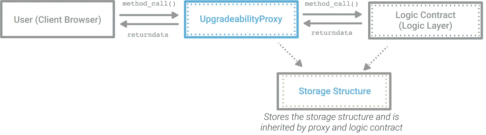

# 如何让智能合约升级！

> 原文：<https://medium.com/hackernoon/how-to-make-smart-contracts-upgradable-2612e771d5a2>


智能合同已经不仅仅是基本合同。现在，我们拥有由智能合约驱动的整个生态系统！无论我们多么小心，或者我们的代码测试得多么好，如果我们正在创建一个复杂的系统，我们很可能需要更新逻辑来修补一个错误，修复一个漏洞或者添加一个必要的缺失功能。有时，由于 EVM 的变化或新发现的漏洞，我们甚至需要升级我们的智能合约。

一般来说，开发人员可以很容易地升级他们的软件，但区块链是不同的，因为它们是不可变的。如果我们部署了一个合同，那么它就在那里，不再有回头的选择。然而，如果我们使用适当的技术，我们可以在不同的地址部署新的契约，并使旧的契约变得无用。以下是创建可升级智能合同的一些最常用的技术。

# 主从合同

主从技术是使智能合同可升级的最基本和最容易理解的技术之一。在这种技术中，我们将主契约与所有其他契约一起部署。主合同存储所有其他合同的地址，并在需要时返回所需的地址。契约充当从契约，每当它们需要与其他契约通信时，从主契约获取其他契约的最新地址。要升级智能合同，我们只需将其部署在网络上，并更改主合同中的地址。尽管这远不是开发可升级合同的最佳方式，但却是最简单的。这种方法的许多限制之一是，我们不能轻松地将合同的数据或资产迁移到新的合同。

# 永久存储合同

在这种技术中，我们将逻辑和数据契约相互分离。数据契约应该是永久的，不可升级的。逻辑契约可以根据需要升级任意多次，并且数据契约会被通知这一变化。这是一个相当基本的技术，但有一个明显的缺陷。由于数据契约是不可升级的，所以数据结构中所需的任何改变或者数据契约中的错误/漏洞都可能使所有数据变得无用。这种技术的另一个问题是，如果逻辑契约想要访问/操纵区块链上的数据，它将需要进行外部调用，并且外部调用需要额外的开销。这种技术通常与主从技术相结合，以促进合同间的通信。

# 可升级的存储代理合同

我们可以通过让永久存储合同充当逻辑合同的代理来避免支付额外的天然气费用。代理契约和逻辑契约将继承相同的存储契约，以便它们的存储引用在 EVM 中对齐。代理契约将具有回退功能，该功能将委托调用逻辑契约，以便逻辑契约可以在代理的存储中进行更改。代理合同将是永久的。这为我们节省了多次调用存储契约所需的时间，因为现在，无论数据发生多少变化，都只需要一次委托调用。

## 这项技术有三个组成部分

1.  **代理契约**:它将充当永久存储，并委托调用逻辑契约。
2.  **逻辑契约**:它会做数据的所有处理。
3.  **存储结构**:它包含存储结构，由代理和逻辑契约继承，以便它们的存储指针在区块链上保持同步。



## 委托呼叫

这项技术的核心在于 EVM 提供的`DELEGATECALL`操作码。除了目标地址的代码在调用契约(调用了`DELEGATECALL`)的上下文中执行，并且保留了原始调用的 msg.sender 和 msg.value 之外，`DELEGATECALL`类似于普通的`CALL`。因此，当使用`DELEGATECALL`时，执行目标契约的代码，但是使用调用契约的存储、地址和余额。换句话说，`DELEGATECALL`基本上允许(委托)目标契约对调用方契约的存储做任何它想做的事情。

我们将利用这一点，创建一个代理契约，它将`DELEGATECALL`逻辑契约，这样我们可以在代理契约中保持数据安全，同时根据我们的需要自由地更改逻辑契约。

## 如何使用可升级的存储代理合同？

让我们深入一点细节。我们需要的第一个合同是存储结构。它将定义我们需要的所有存储变量，并将由代理和实现契约继承。它看起来会像这样

```
contract StorageStructure {
    address public implementation;
    address public owner;
    mapping (address => uint) internal points;
    uint internal totalPlayers;
}
```

我们现在需要一个实现/逻辑契约。让我们创建一个有缺陷的实现，它不会在添加新玩家时增加 totalPlayers 计数器。

```
contract ImplementationV1 is StorageStructure {modifier onlyOwner() {
        require (msg.sender == owner);
        _;
    }

    function addPlayer(address _player, uint _points) 
        public onlyOwner 
    {
        require (points[_player] == 0);
        points[_player] = _points;
    }function setPoints(address _player, uint _points) 
        public onlyOwner 
    {
        require (points[_player] != 0);
        points[_player] = _points;
    }
}
```

现在，最关键的部分，代理合同。

```
contract Proxy is StorageStructure {

    modifier onlyOwner() {
        require (msg.sender == owner);
        _;
    }

    /**
     * [@dev](http://twitter.com/dev) constructor that sets the owner address
     */
    constructor() public {
        owner = msg.sender;
    }

    /**
     * [@dev](http://twitter.com/dev) Upgrades the implementation address
     * [@param](http://twitter.com/param) _newImplementation address of the new implementation
     */
    function upgradeTo(address _newImplementation) 
        external onlyOwner 
    {
        require(implementation != _newImplementation);
        _setImplementation(_newImplementation);
    }

    /**
     * [@dev](http://twitter.com/dev) Fallback function allowing to perform a delegatecall 
     * to the given implementation. This function will return 
     * whatever the implementation call returns
     */
    function () payable public {
        address impl = implementation;
        require(impl != address(0));
        assembly {
            let ptr := mload(0x40)
            calldatacopy(ptr, 0, calldatasize)
            let result := delegatecall(gas, impl, ptr, calldatasize, 0, 0)
            let size := returndatasize
            returndatacopy(ptr, 0, size)

            switch result
            case 0 { revert(ptr, size) }
            default { return(ptr, size) }
        }
    }

    /**
     * [@dev](http://twitter.com/dev) Sets the address of the current implementation
     * [@param](http://twitter.com/param) _newImp address of the new implementation
     */
    function _setImplementation(address _newImp) internal {
        implementation = _newImp;
    }
}
```

为了使契约工作，我们需要首先部署代理和实现 V1，然后调用代理契约的`upgradeTo(address)`函数，同时传递我们的实现 V1 契约的地址。我们现在可以忘记 ImplementationV1 契约的地址，而将代理契约的地址视为我们的主地址。

为了升级契约，我们需要创建逻辑契约的新实现。它可以是这样的东西

```
contract ImplementationV2 is ImplementationV1 {

    function addPlayer(address _player, uint _points) 
        public onlyOwner 
    {
        require (points[_player] == 0);
        points[_player] = _points;
        totalPlayers++;
    }}
```

> 您应该注意到，此合同也继承了存储结构合同，尽管是间接继承。

所有实现都必须继承存储结构契约，并且在代理部署后不得更改，以避免代理的存储被意外覆盖。

为了升级到实现，我们在网络上部署实现 V2 契约，然后调用代理契约的`upgradeTo(address)`函数，同时传递实现 V2 契约的地址。

这种技术使得升级我们合同的逻辑变得相当容易，但是它仍然不允许我们升级我们合同的存储结构。我们可以通过使用非结构化代理契约来解决这个问题。

# 非结构化可升级存储代理合同

这是使合同升级的最先进的方法之一。它的工作原理是将实现和所有者的地址保存在存储中的固定位置，这样它们就不会被实现/逻辑契约提供的数据覆盖。我们可以使用`sload`和`sstore`操作码直接读写固定指针引用的特定存储槽。

这种方法利用存储器中状态变量的[布局来避免固定位置被逻辑契约覆盖。如果我们将固定位置设置为类似于`0x7`的东西，那么它将在前 7 个存储槽使用后被覆盖。为了避免这种情况，我们将固定存储位置设置为类似于`keccak256(“org.govblocks.implemenation.address”)`的位置。](https://solidity.readthedocs.io/en/latest/miscellaneous.html#layout-of-state-variables-in-storage)

这消除了在代理中继承存储结构合同的需要，这意味着我们现在也可以升级我们的存储结构。升级存储结构是一项棘手的任务，因为我们需要确保我们的更改不会导致新的存储布局与以前的存储布局不一致。

## 这项技术有两个组成部分

1.代理契约:它将实现契约的地址存储在一个固定的地址，并将调用委托给它。

2.实现契约:它是保存逻辑和存储结构的主契约。

> 您甚至可以将您现有的契约与这种技术一起使用，因为它不需要对您的实现契约进行任何更改。

代理合同看起来会像这样

```
contract UnstructuredProxy {

    // Storage position of the address of the current implementation
    bytes32 private constant implementationPosition = 
        keccak256("org.govblocks.implementation.address");

    // Storage position of the owner of the contract
    bytes32 private constant proxyOwnerPosition = 
        keccak256("org.govblocks.proxy.owner");

    /**
    * [@dev](http://twitter.com/dev) Throws if called by any account other than the owner.
    */
    modifier onlyProxyOwner() {
        require (msg.sender == proxyOwner());
        _;
    }

    /**
    * [@dev](http://twitter.com/dev) the constructor sets owner
    */
    constructor() public {
        _setUpgradeabilityOwner(msg.sender);
    }

    /**
     * [@dev](http://twitter.com/dev) Allows the current owner to transfer ownership
     * [@param](http://twitter.com/param) _newOwner The address to transfer ownership to
     */
    function transferProxyOwnership(address _newOwner) 
        public onlyProxyOwner 
    {
        require(_newOwner != address(0));
        _setUpgradeabilityOwner(_newOwner);
    }

    /**
     * [@dev](http://twitter.com/dev) Allows the proxy owner to upgrade the implementation
     * [@param](http://twitter.com/param) _implementation address of the new implementation
     */
    function upgradeTo(address _implementation) 
        public onlyProxyOwner
    {
        _upgradeTo(_implementation);
    }

    /**
     * [@dev](http://twitter.com/dev) Tells the address of the current implementation
     * [@return](http://twitter.com/return) address of the current implementation
     */
    function implementation() public view returns (address impl) {
        bytes32 position = implementationPosition;
        assembly {
            impl := sload(position)
        }
    }

    /**
     * [@dev](http://twitter.com/dev) Tells the address of the owner
     * [@return](http://twitter.com/return) the address of the owner
     */
    function proxyOwner() public view returns (address owner) {
        bytes32 position = proxyOwnerPosition;
        assembly {
            owner := sload(position)
        }
    }

    /**
     * [@dev](http://twitter.com/dev) Sets the address of the current implementation
     * [@param](http://twitter.com/param) _newImplementation address of the new implementation
     */
    function _setImplementation(address _newImplementation) 
        internal 
    {
        bytes32 position = implementationPosition;
        assembly {
            sstore(position, _newImplementation)
        }
    }

    /**
     * [@dev](http://twitter.com/dev) Upgrades the implementation address
     * [@param](http://twitter.com/param) _newImplementation address of the new implementation
     */
    function _upgradeTo(address _newImplementation) internal {
        address currentImplementation = implementation();
        require(currentImplementation != _newImplementation);
        _setImplementation(_newImplementation);
    }

    /**
     * [@dev](http://twitter.com/dev) Sets the address of the owner
     */
    function _setUpgradeabilityOwner(address _newProxyOwner) 
        internal 
    {
        bytes32 position = proxyOwnerPosition;
        assembly {
            sstore(position, _newProxyOwner)
        }
    }
}
```

## 如何使用非结构化可升级存储代理合同？

使用非结构化可升级存储代理合同相当简单，因为这种技术可以与几乎所有现有合同一起工作。要使用这种技术，请遵循以下步骤:

1.  部署代理协定和实现协定。
2.  在传递实现契约地址的同时，调用代理契约的`upgradeTo(address)`函数。

我们现在可以忘记实现契约的地址，将代理契约的地址视为主地址。

要升级到一个新的实现契约，我们只需部署新的实现契约并调用代理契约的`upgradeTo(address)`函数，同时传递新的实现契约的地址。就这么简单！

让我们来看一个例子。我们将再次使用与我们在可升级存储代理契约中使用的相同的逻辑契约，但是我们不需要存储结构。因此，我们的实现 V1 可以看起来像这样

```
contract ImplementationV1 {
    address public owner;
    mapping (address => uint) internal points;

    modifier onlyOwner() {
        require (msg.sender == owner);
        _;
    }

    function initOwner() external {
        require (owner == address(0));
        owner = msg.sender;
    }

    function addPlayer(address _player, uint _points) 
        public onlyOwner 
    {
        require (points[_player] == 0);
        points[_player] = _points;
    }

    function setPoints(address _player, uint _points) 
        public onlyOwner 
    {
        require (points[_player] != 0);
        points[_player] = _points;
    }
}
```

下一步是部署这个实现和我们的代理。然后，调用代理契约的`upgradeTo(address)`函数，同时传递实现契约的地址。

您可能会注意到，在这个实现中甚至没有声明 totalPlayers 变量。我们可以将这个实现升级到声明并使用 totalPlayers 变量的实现。新的实现可能类似于

```
contract ImplementationV2 is ImplementationV1 {
    uint public totalPlayers;

    function addPlayer(address _player, uint _points) 
        public onlyOwner 
    {
        require (points[_player] == 0);
        points[_player] = _points;
        totalPlayers++;
    }
}
```

为了升级到这个新的实现，我们所要做的就是在网络上部署这个契约，并且，您猜对了，调用代理契约的`upgradeTo(address)`函数，同时传递我们的新实现契约的地址。现在，我们的合同已经发展到跟踪新玩家总数，同时仍然为用户提供相同的地址。

这种方法非常强大，但是有一些限制。一个主要的担忧是代理所有者拥有太多的权力。此外，这种方法对于复杂的系统是不够的。主-从和非结构化可升级存储代理合同的组合是一种更灵活的方法，用于构建具有可升级合同的 dApp，这正是我们在 [GovBlocks](https://govblocks.io/) 使用的方法。

# 结论

非结构化存储代理合同是创建可升级智能合同的最先进技术之一，但它仍不完美。我们 GovBlocks 不希望 dApp 所有者对 dApp 拥有不合理的控制权。毕竟都是去中心化的应用！因此，我们决定在代理合同中使用网络范围的授权者，而不是简单的代理所有者。我将在以后的文章中解释我们是如何做到的。同时，我推荐阅读 Nitika 反对使用 onlyOwner 的论点。你也可以在 GitHub 上先睹为快我们的[代理合同。](https://github.com/somish/govblocks-protocol/blob/npm/contracts/proxy/GovernedUpgradeabilityProxy.sol)

我希望这篇文章能帮助你创建可升级的智能合同！

*大声喊出来* [*他们的作品*](https://github.com/zeppelinos/labs) *在代理技法上。*