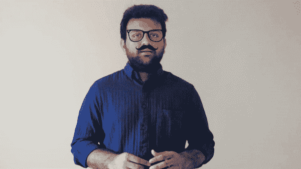
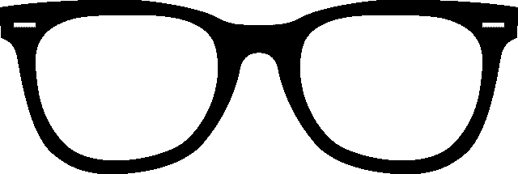
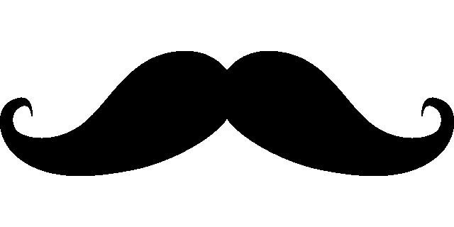
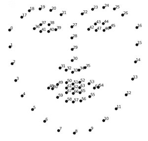
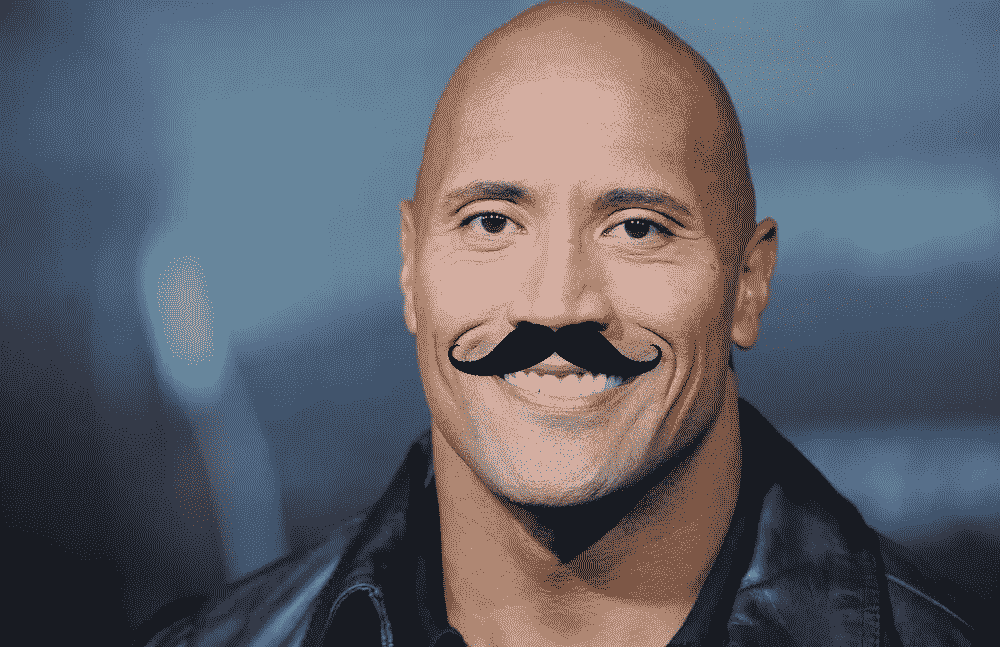

# 如何用计算机视觉制作 SnapChat 镜头？

> 原文：<https://medium.com/hackernoon/how-to-make-snapchat-lenses-f9eae861b5db>

我们都喜欢 SnapChat 镜头/滤镜，但有没有想过如何自己制作？本文解释了如何使用 python 和计算机视觉库(如 opencv 和 dlib)来创建自己的“眼镜和小胡子透镜”，代码只有 80 行。



# 什么是 dlib？

Dlib 是一个现代 C++工具包，包含机器学习算法和工具，用于用 C++创建复杂的软件来解决现实世界的问题。它广泛应用于工业和学术界，包括机器人、嵌入式设备、移动电话和大型高性能计算环境。Dlib 的开源许可允许您在任何应用程序中免费使用它。[ [来源](http://dlib.net/)

# OpenCV 是什么？

OpenCV(开源计算机视觉)是一个主要针对实时计算机视觉的编程函数库。该库是跨平台的，在开源 BSD 许可下可以免费使用。OpenCV 支持深度学习框架 TensorFlow、Torch/PyTorch 和 Caffe。[ [来源](https://en.wikipedia.org/wiki/OpenCV)

让我们试着在下图的道恩·强森上实现一个 SnapChat 过滤器。出于本教程的目的，我们将添加一副眼镜和一个小胡子。


首先，导入所有需要的库:

```
import cv2
import numpy as np
import glob
import os
import dlib
```

阅读所有的图像文件，我们想覆盖在道恩·强森的脸。我们将使用如下所示的眼镜和胡子。



glasses



mustache

在下面的代码片段中，我们加载小胡子和眼镜图像，并创建我们的图像遮罩。图像遮罩用于从图像中选择我们想要显示的部分。当我们将小胡子图像覆盖在背景图像上时，我们需要确定应该显示小胡子图像中的哪些像素，以及应该显示背景图像中的哪些图像。蒙版用于标识在应用于图像时应该使用哪些像素。

我们用-1(负一)作为第二个参数来加载小胡子/眼镜，以加载图像中的所有层。图像由 4 层(或通道)组成:蓝色，绿色，红色和一个阿尔法透明层(称为 BGR-A)。alpha 通道告诉我们图像中的哪些像素应该是透明的，哪些应该是不透明的(由其他 3 层组合而成)。然后，我们只需阿尔法层，并创建一个新的单层图像，我们将用于遮罩。我们把面具反过来。初始遮罩将定义小胡子/眼镜的区域，而反向遮罩将用于小胡子/眼镜周围的区域。然后，我们将小胡子/眼镜图像转换为 3 通道 BGR 图像。保存原来的小胡子/眼镜图像尺寸，我们将在以后调整小胡子/眼镜图像大小时使用。

```
imgMustache = cv2.imread("mustache.png", -1)
orig_mask = imgMustache[:,:,3]
orig_mask_inv = cv2.bitwise_not(orig_mask)
imgMustache = imgMustache[:,:,0:3]
origMustacheHeight, origMustacheWidth = imgMustache.shape[:2]imgGlass = cv2.imread("glasses.png", -1)
orig_mask_g = imgGlass[:,:,3]
orig_mask_inv_g = cv2.bitwise_not(orig_mask_g)
imgGlass = imgGlass[:,:,0:3]
origGlassHeight, origGlassWidth = imgGlass.shape[:2]
```

一旦阅读完成。先说人脸检测。有几种方法可以做到这一点。

1.  dlib 人脸检测
2.  OpenCV 人脸检测
3.  TenesorflowSSD 人脸检测

我将使用 dlib 人脸检测超过其他两个原因。

1.  要使用 Tensorflow，我们需要训练自己的人脸检测模型，因为没有预先训练的模型可用。
2.  与 OpenCV 相比，dlib 似乎提供了更好的准确性。

```
# 68 point detector on face
predictor_path = "shape_predictor_68_face_landmarks.dat"
# face detection modal
face_rec_model_path = "dlib_face_recognition_resnet_model_v1.dat"cnn_face_detector=dlib.cnn_face_detection_model_v1("mmod_human_face_detector.dat")detector=dlib.get_frontal_face_detector()
predictor = dlib.shape_predictor(predictor_path)
```

dlib 68 点检测器将检测以下面部点



dlib face points map

现在，我们将开始从网络摄像头或视频文件中捕捉帧，然后我们将检测这些帧中的人脸，还将检测人脸上的 68 个点以应用过滤器。

```
ret, frame = video_capture.read()  
dets = cnn_face_detector(frame, 1) 
for k, d in enumerate(dets):  
    shape = predictor(frame, d.rect)
```

现在点 31 和 35 是鼻子的长度，所以我们将认为小胡子是鼻子长度的 3 倍，并且高度与原始图片相关。将 numpy 数组应用于原始帧。

```
mustacheWidth = abs(3 * (shape.part(31).x - shape.part(35).x))
mustacheHeight = int(mustacheWidth * origMustacheHeight / origMustacheWidth) - 10
mustache = cv2.resize(imgMustache, (mustacheWidth,mustacheHeight), interpolation = cv2.INTER_AREA)
mask = cv2.resize(orig_mask, (mustacheWidth,mustacheHeight), interpolation = cv2.INTER_AREA)
mask_inv = cv2.resize(orig_mask_inv, (mustacheWidth,mustacheHeight), interpolation = cv2.INTER_AREA)
y1 = int(shape.part(33).y - (mustacheHeight/2)) + 10
y2 = int(y1 + mustacheHeight)
x1 = int(shape.part(51).x - (mustacheWidth/2))
x2 = int(x1 + mustacheWidth)
roi = frame[y1:y2, x1:x2]
roi_bg = cv2.bitwise_and(roi,roi,mask = mask_inv)
roi_fg = cv2.bitwise_and(mustache,mustache,mask = mask)
frame[y1:y2, x1:x2] = cv2.add(roi_bg, roi_fg)
```



现在，让我们戴上眼镜。点 1 和 16 将是玻璃宽度，高度是相对的。

```
glassWidth = abs(shape.part(16).x - shape.part(1).x)
glassHeight = int(glassWidth * origGlassHeight / origGlassWidth)
glass = cv2.resize(imgGlass, (glassWidth,glassHeight), interpolation = cv2.INTER_AREA)
mask = cv2.resize(orig_mask_g, (glassWidth,glassHeight), interpolation = cv2.INTER_AREA)
mask_inv = cv2.resize(orig_mask_inv_g, (glassWidth,glassHeight), interpolation = cv2.INTER_AREA)
y1 = int(shape.part(24).y)
y2 = int(y1 + glassHeight)
x1 = int(shape.part(27).x - (glassWidth/2))
x2 = int(x1 + glassWidth)
roi1 = frame[y1:y2, x1:x2]
roi_bg = cv2.bitwise_and(roi1,roi1,mask = mask_inv)
roi_fg = cv2.bitwise_and(glass,glass,mask = mask)
frame[y1:y2, x1:x2] = cv2.add(roi_bg, roi_fg)
```


# 结论

这将不会像 SnapChat 镜头那样好，但它是创建一个像 SnapChat 一样的强大基础。此外，创建自己的定制镜头比使用 SnapChat 提供的镜头有趣得多。你可以在下面归档全部代码。

[](https://github.com/smitshilu/SnapChatFilterExample) [## smit Shilu/SnapChatFilterExample

### SnapChat 过滤器的小例子。通过在…上创建帐户，为 smit Shilu/SnapChatFilterExample 开发做出贡献

github.com](https://github.com/smitshilu/SnapChatFilterExample) 

如果你喜欢这篇文章请别忘了关注我关于 [***中***](/@smitshilu) 或者*[***Github***](https://github.com/smitshilu)***。*** 或者订阅我的 [***YouTube 频道***](http://www.youtube.com/c/SmitShilu) 。*