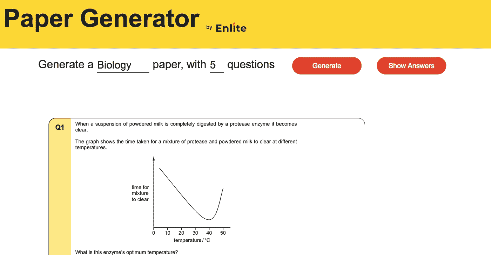

# 如何制造人们(实际上)使用的东西

> 原文：<https://medium.com/hackernoon/how-to-make-something-that-people-actually-use-b8f51a60dba6>

## 即使你的产品是垃圾

我刚刚开始掌握[创造和运输东西](https://medium.freecodecamp.org/what-i-learned-from-creating-and-shipping-my-first-app-in-a-day-9f79010765f0)的诀窍，但是我仍然害怕的是制造人们不会使用的东西。

但是最近，我创造了一些东西，让我知道[制造](https://hackernoon.com/tagged/making)人们使用的东西实际上非常简单…

# 当没人用你做的东西时

有没有觉得没人在用你做的东西？所有的努力都白费了？好吧，问问你们自己。当然没有人在使用你的产品，但是**你自己在使用你的产品吗？**

如果你不使用你自己做的东西，你怎么能指望让其他人使用它呢？

> 通常，我们对自己做的东西如此感兴趣，以至于忘记了它们是否真的在解决问题。

这就是为什么制造能解决我们自身问题的东西是个好主意。

> 当我们制造能解决我们自己问题的东西时，这立刻意味着产品至少为一个人解决了问题，这使它变得有用。

**有用的产品得到利用。**

事情是这样的，**一个能真正解决哪怕是一个人的问题的产品，比一个稍微改善了很多人的问题的产品更有用。**

这是我下次做东西时需要提醒自己的。

# 问题是

想象一下。这是考试季节的中期，我讨厌学习。你看，我在做过去的科学论文，但是我总是得到不正确的生物学问题。

如果只从过去的生物试卷中学习就好了，但是这意味着要在过去的每一份试卷中寻找特定的生物试题。

我需要一种方法来基于主题研究过去的试卷问题，而不是单调乏味地手动搜索每份试卷。

# 解决方案

然后我突然想到。在练习过去的试卷时，我开始对每个问题进行截图，并根据主题及其答案将其放在一个文件夹中。

后来，我和一个朋友创建了一个[又快又丑的网站](http://enlite-app.com/Generator.html),把这些问题拼凑成一份试卷。

最精彩的部分来了。我现在可以根据子主题学习，每次随机生成不同的试卷，所以实际上，我有一个试卷生成器，它有数百万个可能的问题组合。

# 成功了

我认为这个网站完全没用，除了我没有人会用它。但是为了防止有人会用它，我和我的一些朋友分享了它。

这就是奇迹发生的地方。我们各年级超过 250 人使用该应用程序为考试做准备。

> 制造真正解决问题的产品是获得用户的关键，而解决你自己的问题是一个很好的方法

# 行动呼吁

下次你做东西的时候，确保你自己用了至少一个星期。这样，你就会明白它是否真的有用，以及它是否是你可以改进产品的地方。

**感谢阅读，**

**萨尔瓦什**

**想聊天？在**[**Twitter**](https://twitter.com/SarvasvKulpati)**和**[**Linkedin**](https://www.linkedin.com/in/sarvasvkulpati/)上找到我

**这是我写的其他一些帖子**

 [## 你需要进行信息节食

### 我们生活在一个吸毒者的社会里。你最好的朋友可能就是其中之一。你的家人也是。很有可能，你也是…

hackernoon.com](https://hackernoon.com/you-need-to-go-on-an-information-diet-def2f5a3fd5b)  [## 我从一天内创建和发布我的第一个应用程序中学到了什么

### 一个摧毁完美主义和实现创造潜力的练习

medium.freecodecamp.org](https://medium.freecodecamp.org/what-i-learned-from-creating-and-shipping-my-first-app-in-a-day-9f79010765f0)