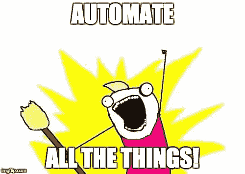

# 如何确保你总能按时拿到工资

> 原文：<https://medium.com/hackernoon/how-to-make-sure-you-always-get-paid-on-time-4bb1469538f>

如果你向客户提供任何类型的服务，无论是实体的还是虚拟的，你都是一个基于服务的企业。在服务行业，你可能已经面临的一个主要挑战是及时获得报酬。不仅开发票很麻烦，客户还会故意拖延，迫使你花费宝贵的时间追踪付款。根据 Fundbox 在[做的一项研究](https://fundbox.com/blog/late-payments/)，在发出的大约 450 亿美元的发票中，有 250 亿美元是延迟支付的。在这篇文章中，我将解释我如何通过利用自动化[技术](https://hackernoon.com/tagged/technology)来消除我的延期付款问题。

# 为什么付款会延迟？

延迟付款是一个经常出现的问题；如果客户迟到过一次，这很有可能是他们每次订购你的服务时都会重复的习惯。对于以服务为基础的企业来说，与新客户相比，回头客通常占其客户群的大部分。客户订购服务，如果他们对这些服务满意，他们往往会再次购买，从而在客户和企业之间建立持续的关系。

据[商业内幕](http://www.businessinsider.com/e-commerce-report-shows-returning-customers-are-more-valuable-than-new-ones-2016-3):

> 新的网上购物者只有回头客的一半，只有 7.6%，相比之下，现有的购物者为 14.8%

对于服务型企业来说，这些数字甚至会更高。回头客是生意兴隆的必要条件，但你如何在不影响你与客户关系的情况下消除逾期付款？

首先，让我们看看传统的基于服务的业务的客户生命周期:

1.  客户订购服务。
2.  业务交付服务，并发送发票。
3.  客户付款，约定完成。
4.  客户回来做更多的工作。
5.  步骤#1 到#4 一次又一次地重复。

如果你在提供服务后给你的客户发发票，那么你就给了他们一个选择，让他们决定何时付款，这是对双方关系的过度信任。客户最终会付钱，但你的企业并没有完全从压力中恢复过来。

善待你的顾客，但不要给他们选择何时付款的权力。服务型企业应该像酒吧一样运作。相反，他们的客户生命周期应该看起来像这样:

1.  客户订购服务。
2.  您交付服务，将其添加到他们的开放标签，并自动从他们的卡上收费。
3.  客户回来做更多的工作。
4.  步骤#1 到#3 一次又一次地重复。

你看出区别了吗？你省去了整整一个步骤，不再需要催促客户为你的服务付费。这些费用会在未来的每一次交易后自动收取，使交易过程完全透明。

# 解决方案是自动化

解决方案的核心是自动化。业务自动化是指使用现有技术自动执行该业务的重复性任务。大多数这些技术都可以通过在线应用程序提供给企业。问题是没有一个单一的解决方案可以自动化你业务的所有方面，所以如果你想尽可能有效，你需要使用多种不同的工具。实现业务自动化的关键是逐步实现自动化，并为每项任务使用合适的工具。

但是，沙尔山，自动化与消除逾期付款有什么关系呢？

问得好。一切。为了消除逾期付款，你需要自动化你的计费系统。这意味着付款是自动处理的，没有发送发票的额外工作，也没有提醒客户他们欠你什么的尴尬局面。如果你想实现整个业务的自动化，计费自动化是一个很好的起点。以下是一些您应该自动化的常见计费场景:

*   如果你正在为你的客户提供一个经常性的服务，自动化你的帐单！
*   如果你和许多回头客一起工作，并且经常给他们发发票，那就自动化你的账单吧！
*   如果你在项目上工作，并接受前期费用的百分比，其余的完成后，自动计费！
*   如果你正在使用 Quickbooks online、Xero 或任何其他计费系统向客户发送发票，juts 可以实现自动化！
*   如果你正在经营一家 SaaS 企业，请自动结算！

**你是如何自动计费的？**使用 Stripe 和 Servicebot。

# 使用条带和 Servicebot 实现自动化

Stripe 是市场上最强大的在线支付网关。支付网关系统是客户和银行账户之间的中间人。它从顾客的信用卡中提取付款并存入你的银行账户。Stripe 从每笔交易中收取 2.9%+0.30 美元的手续费。

几乎所有自动计费系统都使用 Stripe 作为主要的在线支付系统。您的最终客户从不与 Stripe 互动，他们只需付款，其余的由 Stripe 负责。

尽管 Stripe 确实提供了一些基本的自动化功能，但要实现计费自动化，您需要一个与 Stripe 协同工作的良好的计费自动化系统。

[Servicebot](http://bit.ly/2EKC0gY) 是一个计费自动化系统。它位于您的 Stripe 帐户之上，是您基于服务的企业的终极虚拟办公室。这是一个电子商务平台，用于销售服务和自动重复计费。它用于:

*   自动重复计费。
*   自动发送发票。
*   为新客户和老客户自动打开标签。
*   允许客户请求报价。
*   给客户免费试用你的服务。
*   允许客户管理他们的重复计费。

[Servicebot](http://bit.ly/2EKC0gY) 也是一个开源系统。如果你是开发者，你可以使用开源版本来定制系统，并将其与现有网站集成。

# 摘要

如果你是一家服务型企业，传统的电子商务网站不是你想要向客户收费的。执行以下操作来自动化您的业务计费系统:

*   用[条纹](https://stripe.com/)创建账户。
*   用[服务机器人](http://bit.ly/2EKC0gY)创建一个账户。
*   将您的 Servicebot 网站连接到 Stripe。
*   使用您的 [Servicebot](http://bit.ly/2EKC0gY) 网站开始向您的客户收取在线费用。Servicebot 将使您的业务自动化，并为您节省时间和金钱。

## 想要自动计费吗？[跟我预约免费咨询](http://bit.ly/sbotconsult)。

