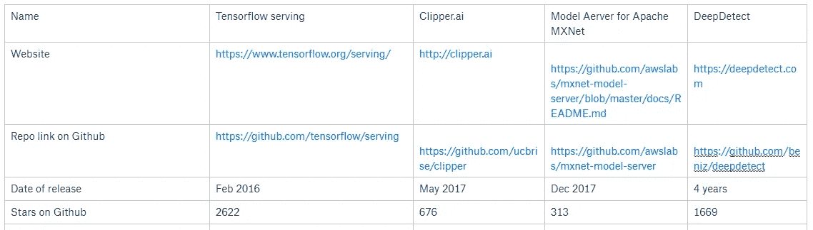
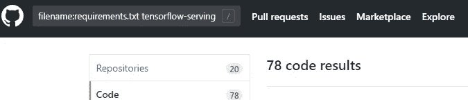
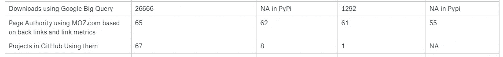

# 如何在选择图书馆时做出明智的选择

> 原文：<https://medium.com/hackernoon/how-to-make-wise-choices-in-selecting-libraries-4f292a7247cd>

选择一个图书馆就像选择一个妻子，你必须坚持下去，经常更换一个涉及复杂的过程是非常昂贵的。所以最好的分析方法是。

现在大多数对图书馆的分析都涉及到图书馆的特点。所以我们不会深入讨论这个问题。我们将通过为机器学习选择模型服务器库的例子来解决这个问题。模型服务器库允许您轻松地为您的机器学习模型制作服务器。

## 选择为您提供最多功能的库

这是一个相当明显的选择，选择一个给你最多功能的。你看着你的需求，你会发现这个库提供了你所需要的最少的特性。

所以我选择了 4 个图书馆:

1.  [张量流发球](https://www.tensorflow.org/serving/)
2.  [Clipper.ai](http://clipper.ai)
3.  [Apache MXNet 的模型 Aerver](https://github.com/awslabs/mxnet-model-server/blob/master/docs/README.md)
4.  [深度检测](https://deepdetect.com)

我们可以看看发布日期，GitHub 上的星星。

现在你比较特性并选择最好的。但这是用来卡住的地方。我曾经找到 3 个非常好的库，但我不明白为什么一个比另一个好。一个人可能有更多的星星，因为它越老。意义不大。是吗？

## 查看每个库的下载

通过使用[谷歌的大查询云](https://bigquery.cloud.google.com/)平台，可以考虑数据驱动的下载，该平台分析所有 API 的 python 包，以做出关于使用哪个平台的明智决定。

> 看看有多少人下载了这个包。

Example of how to see total downloads of tensorflow=-serving-api library using Google BigQuery

你也可以设置较短的下载时间，比如说一个月左右。

## 看看有多少开源项目在使用它们

这个非常简单明了，但是大多数人不会这么做。看看 GitHub 上有多少人在用这个包。

使用这些库的项目可以在 GitHub 上使用搜索词“filename:requirements.txt library-name”进行搜索。这将在“requirements . txt”中进行搜索，这是一个包含在 GitHub 中所有标准 python 项目中的文件，用于检查库。

这可以用来衡量有多少人使用这个库。它不可用于深度检测，因为它不是 Python 包。如此悲伤😢

Search in GitHub to see how many people are using these libraries.

## 搜索引擎优化有帮助

如果一个页面有较高的搜索引擎优化排名，这意味着更多的人使用和访问这个库。这也能帮助你做出理性的决定。

使用基于反向链接和链接度量的 MOZ.com 的页面权限也可以用于查看这些库中哪个更受欢迎。这考虑了有多少网站链接这些库。

## 结论

人们可以检查一个图书馆是否被大量的人使用，以便在你使用的图书馆中做出理性的选择。因为选择一个不仅仅需要查找博客帖子和 GitHub 明星。还取决于生态系统有多大。

我可以建议的其他事情是看看社区在图书馆里有多活跃，如果它死了可能就不用它了。就像当你被困在一个 bug 里，你会被困很长一段时间。您可以通过查看 stackoverflow 中有多少标签属于这个库来做到这一点。

*感谢您的阅读😅。如果你喜欢这篇文章，就给它鼓掌👏。*

如果你喜欢这篇文章，请考虑给我买一杯 https://www.buymeacoffee.com/gautham 咖啡。

*如果你想聊天，在 https://twitter.com/gauthamzzz*[*DM 我*](https://twitter.com/gauthamzzz) *。*

我是阿拉哈巴德印度信息技术学院的一名硕士研究生。我的网站[【http://gauthamzz.com】T21](http://gauthamzz.com/)*。*

我正在做一个客户反馈追踪器访问[https://www.featuremonkey.com/](https://www.featuremonkey.com/)，它是 [canny](https://www.featuremonkey.com/alternatives/canny) 、 [hellonext](https://www.featuremonkey.com/alternatives/hellonext/) 、 [uservoice](https://www.featuremonkey.com/alternatives/uservoice/) ，可用于[功能请求追踪](https://www.featuremonkey.com/features/feature-request-tracking/)、[内部反馈](https://www.featuremonkey.com/features/internal-feedback/)、[公共路线图](https://www.featuremonkey.com/features/public-roadmap/)等的一个很好的替代品