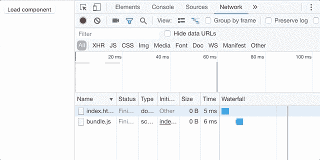

# 如何通过 Webpack 动态导入让您的应用更快

> 原文：<https://medium.com/hackernoon/how-to-make-your-app-faster-with-webpack-dynamic-imports-c46dc9602e8f>

[](https://blog.jscrambler.com/how-to-make-your-app-faster-with-webpack-dynamic-imports/?utm_source=medium.com&utm_medium=referral)

# 由[雅各布·林德](http://webpack.jakoblind.no/)， [@karljakoblind](https://twitter.com/karljakoblind) 。

有多少用户访问你的应用程序的每一个页面，或者使用你的网站的每一个功能？

大概**只有你和你的集成测试**。

你的大多数用户都有一个明确的目标。例如，一个用户可能只想浏览您的产品目录，看看您的网上商店有什么。他还没有准备好购买，也不会看到你的结账。他也不会点击产品页面上的“显示评论”标签。

对于整个应用程序的一个包，这个用户必须下载他*永远不会运行*的代码。

如果你想创建快速的网站，你必须向浏览器发送尽可能少的 JavaScript 代码。不仅下载 JavaScript 包需要时间，浏览器还必须提取代码并*解析它*——这也需要很多时间。

慢网站让用户离开。这也不利于 SEO — [谷歌奖励快捷网站](https://web.dev/fast)。

您应该做的是只发送用户查看和与他访问的页面交互所需的 JavaScript 不多也不少。这样的话，网站的加载速度会更快，你的用户会得到更好的体验。

嗯，你猜怎么着——有了 webpack 和动态导入，这是可能的。

当您使用动态导入时，您只需在页面加载时提供最少的 JavaScript，当(如果)用户需要时，动态地提供其余的 JavaScript。

# 如何配置 webpack 动态导入

动态加载听起来不错，但是如何配置 webpack 项目来支持它呢？

实际上根本不涉及 webpack 配置，因为动态导入在 webpack 2 和更高版本中是开箱即用的(如果您还在使用 webpack 1，现在是升级的好时机)。您不需要在您的`webpack.config.js`中做任何配置就可以让它工作。

然而你需要做的是配置 Babel。您还需要用稍微新一点的语法编写处理导入的代码。我们稍后将回到那个语法。首先，我们来看看巴别塔。

动态导入是阶段 3 中的 TC39 提案。阶段 4 是“完成”阶段，所以它非常接近成为一个标准。因为它仍然是一个提议，浏览器还不支持它。因此，要让它工作，您需要配置 Babel 来传输您的动态导入。

为此，您首先需要安装 Babel 插件`plugin-syntax-dynamic-import`:

```
npm install --save-dev @babel/plugin-syntax-dynamic-import
```

然后在`.babelrc`文件中使用它:

```
{
  "plugins": ["[@babel/plugin-syntax-dynamic-imp](http://twitter.com/babel/plugin-syntax-dynamic-imp)ort"]
}
```

# 动态导入的语法

现在您已经配置了 Babel，您可以在您的项目中使用动态导入。在我描述如何做到这一点之前，让我们看一下不是动态导入的导入是什么样子的。

```
import Text from "./Text"
```

这行代码你应该很熟悉了。当您以这种方式导入时，您可以使用新变量`Text`访问`./Text.js`中的模块。导入后，您可以访问模块中的任何功能。

对于动态导入，该语句看起来略有不同。

```
import("./Text").then(Text => {
  // you can access Text inside here.
})
```

我们仍然使用 import 关键字，但是我们不像以前那样用 from 关键字将它赋给一个变量。相反，`import("./Text")`回报一个承诺。在这个承诺里，你可以使用这个模块。

幕后发生的事情是，当您调用`import("Text")`时，它发出一个 Ajax 请求，只获取您的包中包含包文本的部分。在看到这个语句之前，应用程序不会加载这个包。

这意味着，如果你把这个代码放到一个`onClick`处理程序中，这个模块的代码直到用户按下那个按钮才会被获取。

# 动态导入的一个例子

让我们看看如何在一个示例应用程序中使用它。我们将使用 React 作为例子，但是同样的原理可以应用于任何框架或者根本不应用框架。首先，我们在`Text.js`中创建`Text`组件:

```
import React from "react";
export default () => <div>This text is loaded dynamically</div>
```

接下来，我们将在`index.js`中使用它。我们将在根组件内部动态导入它，而不是像通常那样在文件的顶部导入它:

```
class App extends React.Component {
    constructor(props) {
        super(props);
        this.state = {
            Text: null
        }
        this.loadComponent = this.loadComponent.bind(this);
    }
    loadComponent() {
        import("./Text").then(Text => this.setState({Text: Text.default}));
    }
    render() {
        let { Text } = this.state;
        return (
            <div>
                <button onClick={this.loadComponent}>Load component</button>
                {Text ? <Text/> : null}
            </div>
        )
    }
}
```

当用户点击按钮时，`Text`组件将被动态导入并进入组件状态。`App`渲染`render`函数中的`Text`组件。

如果您查看浏览器的网络选项卡，您可以看到包含`Text`组件的块只有在您按下按钮时才会加载。



在页面加载时获取的代码更少，这意味着更快的加载速度！

现在，在你自己的项目中尝试一下。看看是否可以使用动态导入来减小入口点包的大小。

# 对您的应用进行更多优化

Webpack 是一个非常棒的工具，它给了作为开发者的你力量。这很棒，因为你有能力创建用户需要的应用程序。但这也意味着，如果你的网站开始变慢，你不能责怪别人。

有这么多的事情可以做，以减少包的大小，它变得势不可挡。有数以百万计的优化。哪一个适合你？哪一个能给你最大的回报？

我创建了一个工具,它可以给你一个定制的报告，告诉你应该为你的 webpack 项目做哪些优化和改进。这给了你一些关于从哪里开始优化的想法，这样你就不用花太多时间去谷歌和 RTFM 了。

请务必为您的项目试用 [webpack 优化工具](https://webpack.jakoblind.no/optimize)。

[](https://blog.jscrambler.com/protectyourcodewhileusingwebpack/?utm_source=medium.com&utm_medium=referral&utm_campaign=protect-webpack)

*原载于*[](https://blog.jscrambler.com/how-to-make-your-app-faster-with-webpack-dynamic-imports/?utm_source=medium.com&utm_medium=referral)**由* [*雅各布林德*](https://blog.jscrambler.com/author/jakob-lind) *。**