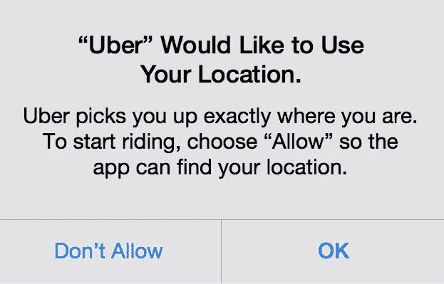

# 如何让你的应用内权限对你的用户来说不那么可怕

> 原文：<https://medium.com/hackernoon/how-to-make-your-in-app-permissions-less-scary-for-your-users-8b1c87b67b68>

让我们面对现实吧。尽管人们喜欢从苹果应用商店下载最酷的新 iOS 应用，但用户经常抱怨他们的私人信息受到侵犯。智能手机比以往任何时候都更加个性化。用户无论去哪里都带着他们的手机，并在手机上存储大量信息。因此，有两个重要问题需要考虑:用户愿意提供多少访问权限来换取使用你的 iOS 应用？你的应用内权限的透明度和相关性如何？

# 让应用内权限为你服务，而不是与你作对

虽然权限对应用程序的运行至关重要，但它们也会吓跑用户，最终对 UX 造成损害。你最不想做的事情就是拒绝你的用户，因为应用内的权限看起来是侵入性的和不相关的。为了帮助你，我们列出了消除应用内权限恐惧的最佳技巧。

# 解释你的许可，只在必要的时候询问

用户已经对交出他们的个人信息、位置等的访问权有所警惕。如果你过度要求权限或者要求与你的应用无关的信息，用户将更有可能卸载你的应用。清楚直接地说明你需要的访问权限对你的应用程序是多么重要。如果你对你的权限开诚布公，只问你真正需要的，他们可能更愿意与你分享他们的信息。确保描述你的应用程序为什么需要这些信息，如果还不明显的话。在某些用户操作之后询问特定的权限也是一个好的做法，例如当用户点击“分享文章”按钮，然后被提示访问社交媒体帐户的权限。用户更有可能接受这种许可，因为这让他们直接理解“为了做 A 你必须做 B”。

# 确保用户对你的应用程序有适当的了解和教育

本能地，你不太可能与一个你刚刚认识并且几乎不认识的人分享很多个人信息。随着你和一个人相处得越来越舒服，你可能会开始透露更多关于你自己的信息。你的直觉告诉你要确定对方不希望以任何方式利用你或伤害你。从逻辑上讲，大多数下载应用程序的人的行为方式都差不多。这是关于与你的用户建立信任和可信度。为你的应用建立一个专业的网站，让你的苹果应用商店页面尽可能的易懂和专业。确保你的内容写得好，传达透明。你还应该在你的网站和应用程序中包含一个完整的 FAQ 部分。最重要的是，确保支持页面易于访问，这样，如果您的用户有任何问题或疑虑，他们可以很容易地转向您的支持页面，以获得他们正在寻找的答案/保证。

# 通过入职流程建立信任

这是人类行为 101 的另一课——一个给予和索取的游戏。或者，你也可以把它看作是一种简单的互惠互利的业务关系。如果你想从用户那里获得有价值的信息，你必须让用户知道你可以提供有价值的东西作为回报。在用户的第一次会话中解释你的应用的好处的过程被称为[价值导向的入职](https://blog.appsee.com/essential-onboarding-tactics-part-2-value-oriented-onboarding/?cpnid=701b0000000Wd7c&utm_source=medium&utm_medium=link&utm_campaign=in_app_permissions_less_scary&utm_content=essential_onboarding_2_value_oriented)。如果做得好，它肯定能增加你的用户保留率、参与度，并让你的用户更适应应用内权限。只要确保你坚持你所推销的价值理念。当你顺利地与用户沟通并阐述了关键的价值点后，只问他们对你的应用程序的主要功能至关重要的权限。正如[产品分解部的安基特·普拉萨德敏锐地指出的，“一些应用程序更进一步，在首次启动时就向你提出一系列请求(*允许摄像头接入？位置？通知？*)。虽然如果用户已经熟悉这款应用程序，这种方法可能会奏效，但用户可能会因为触发而拒绝应用程序。”很多时候，如果你一次使用多种权限，如果用户因为你失去了再次询问的能力而拒绝了所有的权限，你将很难恢复。因此，你应该考虑在你的用户能够体验你的应用程序并衡量它的价值之后，才询问你的一些权限。这使他们能够在更强的背景下做出决定。](/product-breakdown/5-ways-to-ask-users-for-ios-permissions-a8e199cc83ad#.11m629f1v)

就功能而言，应用内权限非常简单，但也不能掉以轻心。如果误用或过度使用，应用内权限会真正损害应用的用户体验。随着应用程序及其用户变得越来越复杂，请求权限应该谨慎、细致、有策略地进行。如果做得好，你可以显著提高你的用户保持率，并最大化你的应用价值。"明智地请求，你就会得到。"

