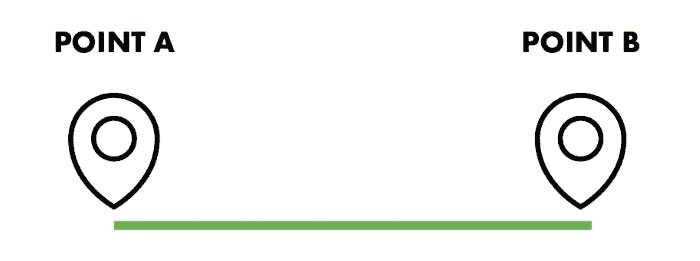

# 如何像专业人士一样管理产品策略和优先顺序？产品经理指南

> 原文：<https://medium.com/hackernoon/how-to-manage-product-strategy-and-prioritize-like-a-pro-guide-for-product-managers-3641011140f2>

如果你不会做战略规划，你会做什么产品管理？如果你不能正确区分轻重缓急，你怎么能成功呢？

不开玩笑——清晰的战略和强有力的优先排序在产品管理中非常重要。任何雄心勃勃的产品经理都应该努力[发展](https://hackernoon.com/tagged/develop)技能和能力，帮助他/她像著名的有远见的指挥官一样建立伟大的战略。

这些想法促使我们的团队汇集了创建[的最佳想法，这是产品战略规划和优先排序](https://hygger.io/blog/guide-to-product-strategy-planning-and-prioritizing/)的最终指南。

在本指南中，我们将与产品和项目经理以及所有想了解更多产品战略和优先排序能力的人分享这些见解。

**为什么值得一读？**

如果产品经理、项目经理、营销人员和团队领导想要了解以下信息，该指南将非常有用:

1.  如何像专业人士一样定义、描述和管理产品战略？
2.  如何应用 Itamar Gilad 创建的 GIST 规划系统？
3.  如何为小项目和小团队简化 GIST？
4.  如何选择创意和功能优先级排序的最佳方式？
5.  如何使用适当的方法对特征进行评分？

以下是最重要的摘录:

**第一部分。产品策略**

任何产品策略都是整个产品生命周期的基础。它旨在实现一个特定的目标。比方说，这就像一条从 A 点到 b 点的路线。

产品战略由四部分组成:愿景、目标、衡量标准和可行的计划。

*   **产品愿景**即包括市场机会、目标客户、产品定位、竞争分析和市场计划等细节。它还描述了谁是客户以及他们需要什么。
*   **产品目标**应该是可衡量的、有时间限制的目标，有明确定义的相关指标。产品目标帮助您设定您想要在下一季度或另一段时间内实现的目标(增加收入、扩展到新的国家、增加移动应用，等等)。
*   **产品指标**允许您衡量目标实现的进度。它们应该是具体的和可衡量的。
*   **可执行计划**

第二部分。关于要旨

GIST 规划的概念在 Itamar Gilad 的[文章](https://hackernoon.com/why-i-stopped-using-product-roadmaps-and-switched-to-gist-planning-3b7f54e271d1) **中有清晰的描述。**

事实上，计划很快就会与现实脱节——时间越长，错误就越多。路线图和甘特图很有帮助，但是没有灵活性的空间——顶层的变化会导致底层重新规划和项目取消的巨大连锁反应。

GIST 计划系统的使用有助于解决这样的问题:你得到了为改变而建立的轻量级计划。它们减少了管理开销，提高了团队速度和自主性，建立了适当的跨公司联盟，并最终建立了产品和解决方案。

作者版本的 GIST 规划系统(简称)由以下模块组成:

*   **目标**根据期望的结果来描述公司的战略:我们想去哪里，什么时候去，以及我们如何知道我们已经到达那里。
*   想法描述了实现目标的假设方法。它们是假设性的，因为对于如何实现给定的目标可以有许多想法，但是最多三分之一的想法会产生积极的结果。产品经理收集创意库中的所有创意，使用适当的优先排序方法和框架对其进行优先排序，并按照优先级顺序对尽可能多的创意进行测试。
*   **Step 项目**出现在创意背后的较大项目应该被分成小部分，每个部分不超过 10 周(根据 GIST)。每个分步项目都像是一个测试想法的实验。
*   **任务**是每个 step-project 的组成部分。敏捷计划工具、看板和其他现代开发项目管理技术很好地覆盖了系统的这一部分。这个层面没什么好改变的。

要点计划的过程可能看起来太复杂，这就是为什么我们提供一个简化版本的系统。

**第三部分。如何简化 GIST？**

这种规划方法对于小项目来说可能显得多余。Step Projects Itamar Gilad 写了当开发一个功能的成本达到几十万美元时，大型项目需要什么。

分步项目对大型项目非常有用，因为它们有助于尽快验证想法，从而避免在想法的全面开发上花费巨额资金。然而，例如，在移动应用程序开发中，您可以不使用 Step 项目。因此，当我们在优先级的帮助下选择了最好的想法后，我们为它们的实现编写任务，收集需求，编写规范并将其推向开发。在 sprint 结束时，我们将它们投入生产，并可以收集用户的数据和反馈。

简化的过程看起来很容易:我们设定目标，选择适当的控制指标，并收集可以改进这些指标的想法。然后，我们对想法进行精益优先排序，应用功能评分，最后为获胜的功能编写任务。然后这些特性被分解成任务，并被推向开发。仅此而已。

第四部分。精益优先是成功之道

有许多区分优先级的技术、框架和方法。在终极指南中，我们详细描述了以下内容:

**优先级排序的 2x2 矩阵**作为经典方法，基于初始的[艾森豪威尔矩阵](https://university.hygger.io/prioritization-techniques/eisenhower-matrix-for-prioritization)，具有两个轴。选择框架时，你可以设定自己的标准，并对产品创意、功能和任务进行评分。例如，在这个框架的帮助下，价值与努力、价值与风险、价值与成本等优先化方法可以很容易地可视化。以下是对价值与努力系统的解释:

**ICE 评分**—**无需额外要求即可完成工作并优先考虑产品特性的简单方法。你只需要根据公式计算每个想法的得分:*影响力*信心*轻松度=ICE 得分，*其中:**

****影响**展示您的想法将在多大程度上积极影响您试图改进的关键指标；**信心**表明我对自己所有的评估有多确定——包括影响和努力(我的评估看起来有多真实)；**易**是关于实现的容易程度。它是对实现这个想法需要多少努力和资源的估计。**

**这些值的相对等级为 1-10，因此不要过分看重其中任何一个。只要评级保持一致，您可以选择 1-10 的含义。**

****莱斯评分**即包括 4 个组成部分:**达成率**每项功能在一定时间内会影响多少人以及有多少人会注意到这些变化；**影响**展示该功能将如何对产品做出贡献，以及该项目将如何影响您的客户；信心表明我对自己的所有估计有多确定——包括影响和努力(我的估计看起来有多真实)；**工作**根据需要，估计为“人月”、周或小时数。它是一个团队成员在特定月份可以完成的工作。**

**您需要根据范围、影响、信心和努力程度对提议的功能进行排序，并使用您得出的最终分数来决定首先应该实现什么。**

**第五部分。特征评分**

**加权评分允许根据您自己的标准评估特性。每个标准都有自己的权重和标度(从 0…到 10)。使用这种优先排序方法，您可以选择您的功能或计划，借助一个基于多项标准的效益与成本框架对它们进行排序，然后使用您得出的分数来决定哪些计划符合要求。这种评分方法有助于公司评估一组可能的新功能对战略目标的相对影响。**

****其他优先化技术和方法****

**如今，产品经理可能会发现许多经典的和创新的优先级排序技术和方法。我们在[海格大学](https://university.hygger.io/prioritization-techniques)板块组合了其中最有趣的。以下是根据受用户欢迎程度排名的前 6 名:**

*   **[价值与成本](https://university.hygger.io/prioritization-techniques/value-vs-cost-and-value-vs-complexity)**
*   **[卡诺模型](https://university.hygger.io/prioritization-techniques/kano-methodology)**
*   **[莫斯科优先排序法](https://university.hygger.io/prioritization-techniques/moscow-prioritization-method)**
*   **[购买功能](https://university.hygger.io/prioritization-techniques/buy-a-feature-gaming-method)**
*   **[功能桶](https://university.hygger.io/prioritization-techniques/feature-buckets-method)**
*   **[KJ 法](https://university.hygger.io/prioritization-techniques/kj-methodology)**

****接下来是什么？****

**如果优先化的过程是成功的，那么一切都很简单:所有的任务都按照 Scrum 或看板进行开发，产品经理必须跟踪他们的进度。**

**在这里，我试图结合 Hygger 博客上发布的指南中最重要的几点。当然，它的许多部分在这里都写得很简单。如果你对细节和更多见解感兴趣，请随意阅读[原文](https://hygger.io/blog/guide-to-product-strategy-planning-and-prioritizing/)。**

**祝你阅读愉快！**