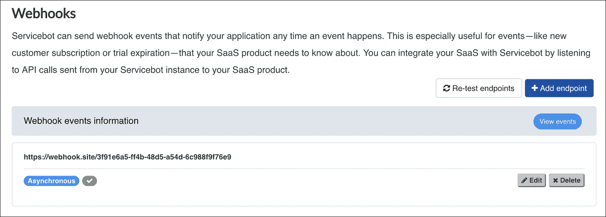

# 如何使用 Servicebot 管理 SaaS 套餐计费

> 原文：<https://medium.com/hackernoon/how-to-manage-saas-subscription-billing-using-servicebot-open-source-4901301dfbe8>

在这篇文章中，我将解释如何使用 [Servicebot](https://servicebot.io) ，一个自动化 [SaaS](https://hackernoon.com/tagged/saas) 计费的平台。 [Servicebot](https://hackernoon.com/tagged/servicebot) 旨在成为计费引擎，使企业能够将软件作为服务出售。

# Servicebot 管理订阅生命周期

能够管理[订阅生命周期](/@ben_sears/understanding-the-lifecycle-of-a-saas-subscription-5169307fd0c8)对于销售 SaaS 至关重要。这意味着拥有对特定计费事件(如订阅或取消服务)做出反应的自动化流程。通常，订阅计费由以下事件组成:

*   **订阅—** 一位新客户注册了您的服务。
*   **试用期到期—** 免费试用期到期，客户将被计费或被限制访问应用。
*   **升级/降级—** 客户将其订购更改为不同价格的服务等级。例如，升级到高级网飞，以更高的价格访问超高清视频。
*   **取消—** 客户取消他们的订阅。
*   **再次预订—** 以前的客户再次为您服务。

设置应用程序对这些事件做出反应的能力(例如，如果免费试用过期而没有支付来源，则限制访问)是 SaaS 计费管理的核心。

Servicebot 在设计时就考虑到了这一点，让公司能够围绕这些事件添加业务逻辑。

# 服务模板和服务实例

Servicebot 通过两个主要结构支持 SaaS 计费。**服务模板**，包含客户订阅的详细信息，以及**服务实例**，代表客户订阅的服务。

## 服务模板

服务模板是向客户交付应用程序所需的蓝图。该模板包含最终客户需要填写的定价和字段定义等详细信息。例如，企业可能希望在接纳新客户时收集电话号码或其他信息。他们的服务模板将包含一个必需的输入字段，需要填写该字段才能创建一个新的**服务实例**。

Setting up a Service Template’s payment details and tiering using Servicebot

## 服务实例

一旦客户订阅，就会根据服务模板和他们填写的信息创建一个服务实例。对于 SaaS 计费，挂钩到**服务实例**的生命周期是关键。实例可以升级、取消或试用，这意味着公司要实现计费，只需将其应用程序与 Servicebot 中发生的不同事件集成。

The Service Instance Information in Servicebot, details pricing, user inputted information

以下是使服务实例非常适合 SaaS 的一些重要特性:

*   **升级功能—** 如果 SaaS 的产品有不同的定价等级，修改等级将会改变价格并应用适当的比例分配。
*   **取消—** 取消服务实例将停止所有订阅，并限制在 SaaS 的访问。
*   **自定义费用—** 如果 SaaS 提供专业服务或各种一次性费用，服务实例可以应用费用并自动支付。
*   **免费试用—** 免费试用是销售产品的最佳方式之一，服务实例支持提供试用服务的能力，以及向用户提供额外试用时间的能力。

# 嵌入式 SaaS 订阅表单

Servicebot 使您可以轻松地将表单嵌入到网站中。只需将代码复制并粘贴到您的网站上，立即开始销售您的产品。你所需要做的就是指定客户点击“订阅”后会发生什么

Generate complex forms that you can embed in your site to easily onboard customers

# 嵌入式计费管理

Servicebot 提供的另一个可嵌入功能是帐户管理表单。当您将此功能嵌入您的 SaaS 时，您的客户可以添加他们的信用卡、将他们的计划更改为更高级别、取消他们的订阅或重新订阅。您只需将预生成的代码粘贴到您的应用程序中，剩下的工作由 Servicebot 完成。

# 用于生命周期管理的 Webhooks

提醒你的应用付费改变的最好方法之一，比如试用到期，就是使用 webhooks。Webhooks 允许应用程序与其他应用程序交流实时信息。在这种情况下，Servicebot 将为您的 SaaS 提供账单信息。

使用 Servicebot，可以定义 webhook 端点，这样无论何时发生计费事件，端点都会得到通知并采取行动。例如:如果试用期到期，一个网页挂钩将被发送到 SaaS，客户可以被锁定在该软件之外，直到他们付款。

Easily integrate with anything using Servicebot’s webhooks

# 结论

我们 Servicebot 相信，为您的软件获得报酬的过程不应该是一项困难的任务。许多工具侧重于计费的支付方面；Servicebot 与众不同，它专注于所提供的服务，这使得它更容易进入订阅生命周期。

## 您的 SaaS 需要计费解决方案吗？[我们来聊聊](https://servicebot.io/contact)