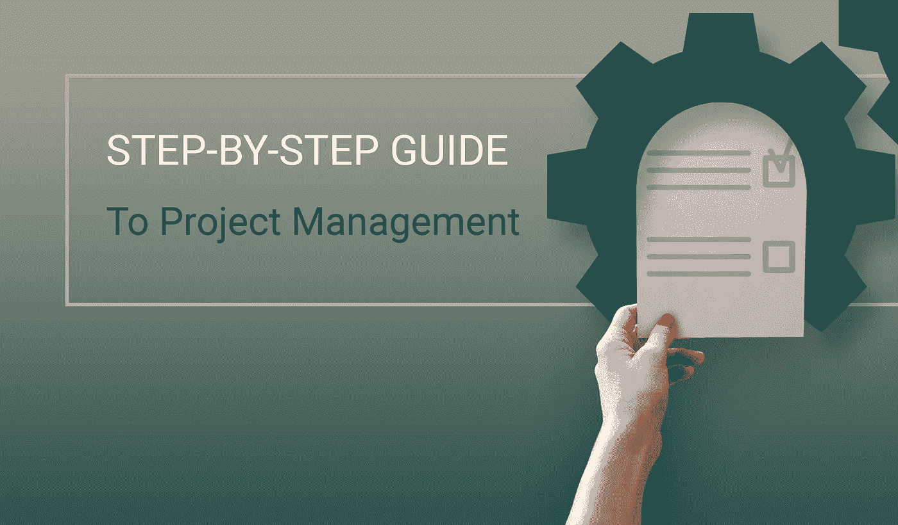

# 如何逐步管理您的项目

> 原文：<https://medium.com/hackernoon/how-to-manage-your-project-step-by-step-9057d57d99f5>

什么是项目管理，为什么它是软件开发的关键成功因素？这些是我们今天要为你解答的关于项目管理的问题。我们将讨论瀑布和敏捷项目管理过程之间的主要区别，并讨论完成开发所需的七个步骤。

# 瀑布 vs .敏捷。哪个项目管理流程比较好？

项目管理是一门使用时间管理、跟踪、风险管理和故障排除来计划和执行项目的艺术。这一过程有助于企业沿着阻力最小的路径从 A 点到 B 点，而不会走不必要的、代价高昂的弯路。

两种最常见的项目管理方法是瀑布和敏捷。前者来自传统企业，在传统企业中，流程的第二步在第一步完成之前无法开始。后一种方法是一种迭代的、面向特性的方法，非常适合小型团队和时间敏感的项目。敏捷开发不需要一步一步的计划，而是使用预定长度的冲刺和可交付成果。

每个项目管理过程，瀑布式和敏捷式，都有其优点和缺点。例如，一个固定价格的项目和一个 MVP 可以从一个记录良好的瀑布方法中获益，因为所有的需求都是预先交付的，并且不太可能发生变化。然而，如果您选择时间和材料模型，敏捷开发可能更适合项目，因为它提供了更快的结果，并更好地应对动态的需求变化。

# 项目管理分步指南

如果你想知道如何成为一名项目经理，答案是你需要大量的练习。项目经理的角色对产品的成功至关重要。但是，不能只在知识和教育上下功夫。为了磨练你的技能，你需要一次又一次地经历这 7 个步骤，直到你达到完美。

## 第一步。需求启发

这一步允许您关注项目的远景，并从对需求有直接或间接影响的涉众(如产品所有者或最终用户)那里收集可操作的需求。启发过程可以包括访谈、用户案例和场景。您需要考虑所有利益相关者的需求，并获得最终用户需求的详细列表，这将形成系统需求规范(SRS)的基础。

## 第二步。SRS 开发

高质量的 SRS 意味着你有更多的机会满足项目的预算。在这一步，对前一步收集的用户需求进行澄清、组织和优先排序。需求有几个粒度级别，从项目范围和目标的更广泛定义到特定功能和过程的更精细细节。为了确保商业软件解决方案的高质量，为每个用户需求设计几个特性，并为每个特性开发几个测试用例。

我们已经在之前的文章中介绍了如何创建一个完美的系统需求规格说明书的细节。

## 第三步。项目评估

这一步对于初创企业和成熟企业都至关重要，因为一天的延误就能决定项目的成败。基于 SRS，你应该估计每个专家的工作所需的时间，包括开发人员、设计师、SEO 专家。为每项任务估计两条时间线:一条乐观的，一条悲观的。在估计了每项任务所需的时间后，使用蒙特卡罗分析来估计在估计的时间内完成项目的可能性。您还可以使用甘特图来可视化内部或外包开发过程随时间变化的各个阶段，并更好地了解其时间框架。根据开发时间表，您可以估计项目的预算。

你可能想催促开发人员，但是在你选择速度优先于质量之前，[直接设定你的软件开发优先级。](https://freshcodeit.com/freshcode-post/quality-or-speed-setting-software-development-priorities-straight)

## 第四步。范围缩小

如果项目评估符合您的预算和时间要求，您可以跳过这一步，进入第 5 步。然而，如果你没有足够的时间和金钱来完成这个项目，那就再检查一遍需求和特性。你需要再次采访涉众，并确定项目不可或缺的主要特征。您需要将项目缩减到具有市场价值的最小可行产品(MVP)。一旦您重新评估了缩小范围的项目，就进入下一步。

如果你想[确定项目评估是正确的](https://freshcodeit.com/freshcode-post/project-estimation-how-do-you-know-that-its-correct)，看看我们之前的博客帖子。

## 第五步。发展规划

这一步可以让你对每个开发阶段有一个清晰的了解，并为从事该项目的特定专家提供完整的时间表。一个详细的计划将允许您管理软件开发服务提供商的人力资源，以防任务不能按时完成。使用您在第 3 步中开发的相同甘特图，但通过分配给个人开发人员、设计人员或其他专家的具体任务使其更加详细。

## 第六步。风险管理

大多数软件项目由于不可预见的风险而失败，因此风险评估和管理是确保积极成果的关键步骤。要评估风险，使用死亡前的方法。与病人死后进行的尸体解剖不同，在项目开始时就进行了生前分析。假设最坏的情况发生了，项目失败了，然后沿着时间线往回走，提出它过早死亡的原因。

对于每个风险，评估可能性和影响，创建一个风险矩阵。解决矩阵右上角的问题，这些问题最有可能产生严重影响。如果你是项目管理的新手，你需要咨询项目的首席开发人员来评估风险。项目完成后，不要丢弃风险矩阵；软件公司将它们存储在一个风险注册表中，在每个新项目之后都会扩展。

## 第七步。项目执行

即使是最仔细的计划有时也会失败，所以为了确保项目按时完成，你需要掌握它的脉搏。根据您在步骤 5 中创建的甘特图评估项目的进展，开始每一天。如有问题，分析其原因，提出可操作的解决方案。可能会出现技术和个人方面的意外风险。前者可以通过邀请顾问来解决，而额外的专家往往足以解决后者。每隔一周，回到你的风险登记簿，分析并扩充你所面临的新麻烦。

项目管理早在开发人员开始编码之前就开始了。高质量的准备，如需求引出、范围评估和风险管理，对于项目的成功是无价的。如果你是项目管理的新手，不要让你的产品碰运气，让 Freshcode 的 [web 开发服务](https://freshcodeit.com/services)和经验丰富的项目经理帮助你！

我们已经确定每个项目都是从需求概要开始的。当你创建自己的应用程序时，为了使这个项目管理阶段更容易，我们将在以后的文章中介绍构建 SRS 和执行需求获取的最佳实践。请继续关注我们的博客文章:

*   通过分析项目需求逐步创建 SRS 模板
*   CRM 项目的 SRS 模板
*   EdTech 项目的 SRS 模板
*   通过吉拉和特雷罗实践项目管理

你喜欢这篇文章吗？请为我们鼓掌！在媒体上与其他人分享文章。

访问我们的企业 [*FreshCode.blog*](https://freshcodeit.com/blog) 获取更多有趣的文章。

欢迎随时联系我们的[*fresh code . website*](https://freshcodeit.com/)

原文 [*此处*](https://freshcodeit.com/freshcode-post/how-to-manage-your-project-step-by-step)