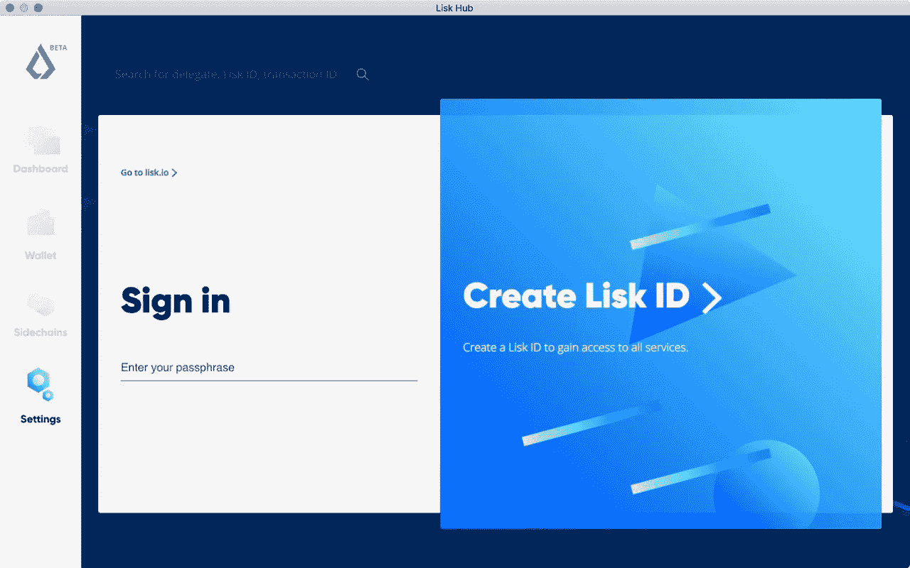

# 如何用 Consensys 和 Lisk 营销区块链

> 原文：<https://medium.com/hackernoon/how-to-market-blockchain-with-consensys-and-lisk-dzone-security-eecd9a7a2a90>

2017 年下半年的黑暗日子正在成为遥远的记忆。对一些人来说，疯狂的 ICO 估值和过度的象征性投机时代是美好的，但它分散了人们对区块链的兴趣——技术和该技术的前景。

就像登上炒作列车的任何新想法一样，有早期的采纳者，那些争先恐后登上列车的人，几乎撞毁了列车，然后，最终那些随着旅程变得更加一致和可预测而留下来的人。我觉得我们和区块链开始进入这个后期阶段。我一直看着这些项目默默无闻地成长和成熟，但正在构建一些最终可能有用的东西。想象一下！

# 理事会

对某些人来说， [Consensys](https://new.consensys.net/) 不需要太多介绍，想象一下他们是 Linux 基金会的红帽，你就会知道他们是如何融入以太坊空间的。由以太坊的创建者之一约瑟夫·卢宾创建，他们专注于以太坊技术的原型有用的想法。[他们是几十个以太坊相关项目](https://new.consensys.net/solutions/)的幕后推手，对从开发者到甚至不知道什么是区块链的最终用户的广大受众都很有用。其中包括:

*   [Truffle](https://truffleframework.com/) 用于管理智能合约的开发和部署。
*   Metamask ，一个易于使用的浏览器扩展，用于查看您的以太坊帐户。
*   [Gnosis](https://gnosis.pm/) ，市场预测平台。
*   [Gitcoin](https://gitcoin.co/) ，用于小额捐赠。

随着数十个其他项目的进展，Consensys 正在对冲他们的赌注，即什么可能有效，什么可能无效，然后将这些经验传递给其他寻求用以太坊开发和建造的人。

我与柏林科技露天展的 CMO 阿曼达·古特曼(Amanda Gutterman)进行了交谈，讨论了她推销一种技术和概念的方法，这种技术和概念对许多人来说，往好了说过于复杂，往坏了说就是不必要的浪费时间。阿曼达的背景很有趣。她创立了 Slant，这是一个认识到互联网将打破传统新闻模式并试图解决这一问题的早期项目。Slant 现在关闭了，但区块链的项目现在正在尝试同样的做法，她带来了社区通常缺乏的历史知识。

在下面的采访中，阿曼达简要介绍了她是如何对以太坊感兴趣的，Consensys 是如何与以太坊基金会合作的，以及他们是如何决定要开展哪些项目的。从营销的角度来看，Amanda 承认区块链空间在解释自己方面还有很多工作要做，她的建议是专注于用例，适当调整你的语言，并坚持充分研究的事实，而不是试图欺骗人们去做一些不真实的事情。

Listen to the interview with Amanda

# 利斯克

第二天，我与 Lisk 的营销主管托马斯·斯豪滕进行了交谈，他正在开发一套工具来简化分散式应用的部署，并使用开发人员已经熟悉的编程技术。支撑这些工具的是 Lisk“侧链”,它试图通过从主链卸载大量处理并在需要时重新连接到主链来解决长期存在的区块链性能问题。Lisk 的 ICO 在 2016 年筹集了超过 14，000 BTC，并且正在慢慢进行，尽管在 2018 年早些时候举行了重新启动活动，Thomas 提到了这一点。ico 是一种有些独特的融资方式(嗯，有点类似众筹)；你根据一个想法的提示筹集了很多钱，然后整个社区坐下来，观察并不断询问你的进展。这是一次充满压力的经历，尤其是当一个团队有一半时间都不完全确定他们将如何实现这个想法的时候。

Lisk 正试图专注于创造一种产品，提供他们所承诺的，有用的，高质量的。这个过程需要时间，需要同时进行高质量的沟通，托马斯和他的团队认识到了这一点，团队成员多达 14 人，这对任何一家科技初创公司来说都是一个很高的数字——更不用说区块链了。

在下面的采访中，你可以听到更多关于 Lisk 的旅程和 Thomas 团队的信息，以及我对他们工具的体验总结。

你对 Lisk 的第一印象是他们的网站和工具看起来是多么的光滑。我在他们的重新启动活动中也经历了这一点(一切都按时工作和运行，这在柏林的活动中很少见)，托马斯在采访中提到这对公司有多重要。

Lisk 包括(或将包括)以下产品:

*   [Commander](https://lisk.io/documentation/lisk-commander)Lisk 核心 API 的 CLI 接口。
*   [Hub](https://lisk.io/hub/) ，管理您的 Lisk ID、LSK 代币和代表投票的一体化解决方案。
*   [核心](https://lisk.io/documentation/lisk-core/user-guide/api)，面向想要访问底层区块链数据的高级用户。
*   [元素](https://lisk.io/documentation/lisk-elements)，类似于核心，但用于加密操作。
*   [Nano](https://github.com/LiskHQ/lisk-nano/releases/latest) ，一款用于 LSK 代币的轻便钱包。
*   [Sidechain Development Kit](https://lisk.io/documentation) 或 SDK (Lisk 可能会对这个缩写感到困惑)。一组与上述其他工具交互的库。

如何开始使用 Lisk 在某种程度上取决于您的用例，知道什么时候使用什么组件可能是目前使用 Lisk 的最大绊脚石。入门没有第一步。这是区块链地区常见的挑战，也是 Thomas 提到的问题。许多人只对代币交易和投机感兴趣，而其他人则对使用区块链作为新的应用范例感兴趣。问题仍然是:如何让双方都满意？

Listen to the interview with Thomas

*原载于*[*dzone.com*](https://dzone.com/articles/marketing-blockchain-with-consensys-and-lisk)*。*