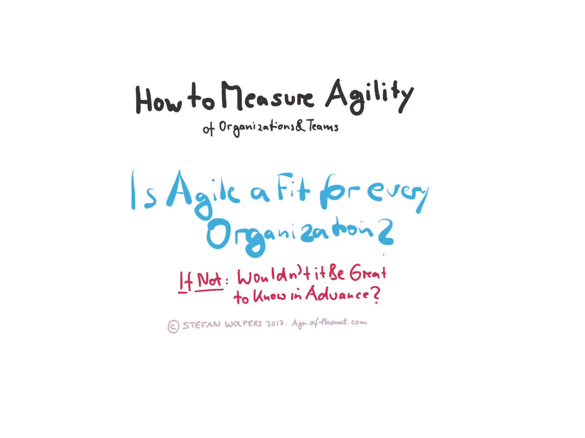
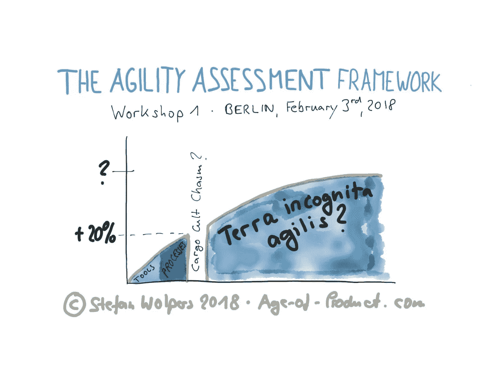

# 如何度量组织和团队的敏捷性

> 原文：<https://medium.com/hackernoon/how-to-measure-agility-of-organizations-and-teams-6e24e3a48483>

# TL；DR:如何度量组织和团队的敏捷性

每个组织都适合变得“敏捷”吗？如果是:如何度量敏捷性？如果没有:在开始一段徒劳而昂贵的旅程之前弄清楚这一点不是很好吗？

回到 2017 年 10 月和 11 月，我进行了一项[调查，以确定组织或团队敏捷成熟度的影响因素](https://age-of-product.com/agile-maturity-survey/)。共有 86 人参加。基于他们的回答，我汇总了一个敏捷相关因素的初步分类。

这一分类首次出现在 2017 年 11 月 30 日的[动手实践敏捷柏林会议上。](https://www.meetup.com/Hands-on-Agile-Berlin-Chapter-Meetup/events/244713211/)

2018 年 2 月 3 日，20 多人将参加一个黑客马拉松，在这个分类法的基础上构建一个敏捷性评估框架。研讨会的目标是提供第一个版本的工具，使敏捷实践者能够度量敏捷，无论是组织对敏捷实践的适应性，还是团队在敏捷化道路上的进展。

# 如何度量敏捷性:当前状态

衡量敏捷性并不是什么新鲜事。有很多可用的工具和方法，从克里斯普的 [Scrum 清单](https://www.crisp.se/gratis-material-och-guider/scrum-checklist)到詹姆斯·肖尔和戴安娜·拉森的[敏捷流畅](http://www.agilefluency.org/)模型。对许多咨询公司来说，衡量潜在客户的敏捷性也已经成为一种有价值的售前工具。

然而，现在缺少的是一个开源的、因此广泛可用的框架，任何敏捷实践者都可以用它来了解她的组织或团队的敏捷水平。

# 如何度量敏捷性:未来的步骤

2018 年 2 月 3 日，20 多人将参加一个黑客马拉松，根据下面描述的分类法构建一个敏捷性评估框架。研讨会的目标是提供第一个版本的工具，使敏捷实践者能够度量敏捷。

“敏捷”可以是对一个组织是否适合敏捷实践的评估，为一个决定成为学习型组织的组织提供一个必要步骤的想法。例如，我想到的问题有:

1.  我们现在在哪里？
2.  我们想去哪里？
3.  到达那里的必要步骤是什么？
4.  设计一个如何到达那里的计划

柏林黑客马拉松将是一个实验。例如，我想知道我们是否可以将分析性思维——如测量因素和计算状态——应用于复杂的社会系统？或者这种方法会不会被证明是一个死胡同？

# 如何度量敏捷性:最初的调查问题

2017 年敏捷成熟度调查由四个问题组成:

1.  哪些因素有助于团队在敏捷实践中不断成熟？
2.  你在团队层面上看到了什么样的成熟度？
3.  哪些因素有助于成为“敏捷”或学习型组织？
4.  你在组织层面上看到了什么样的成熟度水平？

总共有 86 人参与了调查:13 人来自我目前支持的公司，另外 73 人来自产品年龄邮件列表。

[下载《敏捷转变——一线实践指南》](https://age-of-product.com/download-agile-transition-hands-guide-trenches/),这是一本 180 多页的电子书，讲述了组织向敏捷原则的转变。它是免费的。

# 如何度量敏捷性:初步的敏捷成熟度指标

从这些回答中，我得出了以下敏捷成熟度指标的分类:

*   人和团队:自主、掌控、目标
*   组织卓越
*   卓越的技术
*   沟通与协作

(演示文稿的幻灯片可在 [SlideShare](https://www.slideshare.net/wolpers1/handson-agile-agile-maturityfad-trend-or-holy-grailsurvey-results) 上获得。)

让我们更深入地了解衡量敏捷性的细节:

# 人员和团队:自主性

## 自组织:

1.  授权团队(决策、责任)
2.  关注结果
3.  尊重 Scrum 价值观(承诺、专注、开放、尊重、勇气。)
4.  提出和讨论问题的安全性
5.  团队处理自己的问题(没有 scrum mom。)
6.  作为团队成员互相支持(结合。)
7.  让彼此承担责任(敏捷是一项团队运动。)

## (个人的)责任:

1.  选择工具和设备(如软件)

## 请点击“拍手”👏，如果你觉得这篇文章有用——它对我来说意义重大！

***如果你更喜欢邮件通知，请*** [***注册我的每周简讯***](https://age-of-product.com/subscribe/?ref=Food4ThoughtMedium) ***，加入 13873 位同行。***

# 人员和团队:精通

## 学习:

1.  简短的反馈循环(用户测试、客户开发)
2.  回顾的使用
3.  持续的团队辅导(行会、代码导师等。)
4.  利益相关者履行他们的责任
5.  凭证主义的实践经验

## 能力:

1.  t 型人
2.  主动知识共享

*   持续学习
*   不得隐瞒知识
*   超越产品和技术领域的知识共享

1.  参加会议的预算
2.  敏捷卓越中心

## 团队建设:

1.  跨职能团队:

*   不依赖其他团队，
*   端到端交付能力

1.  稳定、长寿的团队
2.  由经验丰富的 scrum 大师提供支持

# 人员和团队:目的

## 包含

1.  产品发现
2.  产品路线图创建
3.  发布计划

# 组织卓越

## 文化:

1.  拥抱和庆祝失败(通过实验验证假设)
2.  好奇心是一种常态
3.  非教条的态度，活的舒哈里:

*   透明度:
*   在各级分享信息和数据，
*   不再有门控信息或信息经纪人

## 领导力:

1.  关注创新、质量和商业价值(不再有河马主义。)
2.  充分支持“敏捷的工作方式”
3.  将“敏捷”作为公司文化的核心
4.  尊重角色、原则和过程(“真正的”PO。)

## 管理层:

1.  经理到仆人型领导
2.  信任他人和团队
3.  提供变得敏捷所需的工具和设施
4.  Gemba 和 Kaizen 成为标准做法。

## 组织设计:

1.  为跨职能团队放弃职能孤岛
2.  删除多余的中间管理层(扁平化)
3.  不再需要命令和控制，遵从驱动的管理
4.  人力资源符合自组织团队的要求
5.  这些组织变成了一个团队的团队

## 明确的目标:

1.  所有行动者的共同愿景
2.  清晰的战略
3.  明确的优先事项

## 商业价值焦点:

1.  以客户为中心的思维模式
2.  交付业务成果
3.  转移 IT 焦点业务需求
4.  从项目预算到产品团队。

# 卓越的技术

## 工程水平:

1.  内在质量:

*   代码审查，
*   测试自动化，测试覆盖

1.  结对和 mob 编程
2.  实践 Scrum，看板，XP。

## 流程级别:

1.  DevOps: CI、CD(随意部署)
2.  定期发布
3.  确定合适的指标:

*   交付时间、周期时间、
*   实验次数，
*   团队健康

1.  开放源代码。

# 沟通与协作

## 信任和尊重:

1.  对同事有利的怀疑
2.  不同意的安全性
3.  诚实
4.  坦诚的同行反馈。

## 冲突解决:

1.  建设性的分歧(承认，但承诺的方法。)
2.  非暴力沟通。

## 协作:

1.  对政治游戏零容忍
2.  没有脚本协作
3.  没有隐瞒知识(或信息)的动机。)
4.  没有指责，没有责备。

# 如何度量组织和团队的敏捷性——结论

在组织或团队层面上度量敏捷性元素并不是什么新鲜事。然而，这种“敏捷评估框架”的方法是新的，因为它的目标是成为第一个开源的，因此是所有敏捷实践者广泛可用的工具。第一次计划的研讨会不太可能交付比敏捷性评估框架更基本的原型。

然而，这将是一个开始，通过将该框架应用于现实生活的工作情况来收集更多的见解，并以此为基础。希望将来我们能够围绕“敏捷性评估框架”建立一个社区。

# ✋，你想读更多这样的书吗？

好吧，那么:

*   📰*加入 13873 位同行和* [*报名参加本周简讯*](https://age-of-product.com/subscribe/?ref=Food4ThoughtMedium)
*   🐦*关注我的* [*推特*](https://twitter.com/stefanw) *并订阅我的博客* [*产品时代*](https://age-of-product.com)
*   💬*或者，免费加入* [*Slack 团队的 2300 多名同事“手把手的敏捷”*](https://goo.gl/forms/XIsABn0fLn9O0hqg2) *…*

如何衡量组织和团队的敏捷性——敏捷成熟度调查的结果首次在《产品时代》上发表。