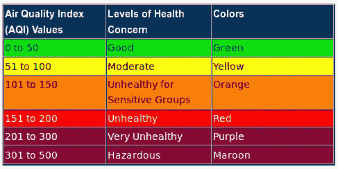
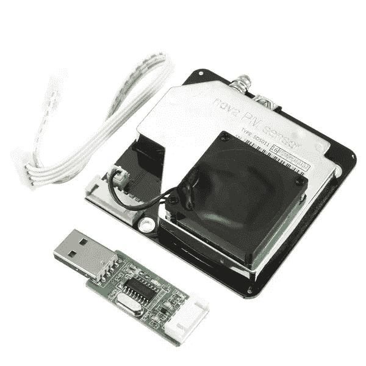
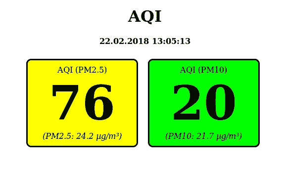

# 如何用树莓 Pi 测量颗粒物

> 原文：<https://medium.com/hackernoon/how-to-measure-particulate-matter-with-a-raspberry-pi-75faa470ec35>


我们定期测量学校空气中的颗粒物。特别是在二月和五月之间，东南亚这里的数值非常高，因为在这段时间很少下雨，非常干燥和炎热，许多草地和田地被烧毁。所有这些都对空气质量有负面影响。今天我将向大家展示如何用[树莓皮](https://amzn.to/2t1hgK8)测量颗粒物。不过，我想先简单评论一下这个问题:什么是颗粒物，我们要测量什么？

# 什么是颗粒物？

可以相当粗略地说，微尘是空气中非常小的颗粒。PM10 和 PM2.5 是有区别的。PM10 是空气中小于 10 m 的所有颗粒，而 PM2.5 是小于 2.5 m 的所有颗粒。颗粒越小，即所有小于 2.5 m 的颗粒，对健康越危险，因为它们可以渗透到肺泡中。

[世卫组织](https://en.wikipedia.org/wiki/Particulates)推荐以下限值:

*   年平均 PM10 20 克/平方米
*   年均 PM2,5 每年 10 克/平方米
*   日平均 PM10 50 克/平方米，不含可能超标的许可天数。
*   日平均 pm 2.5 25g/m，没有可能超标的许可日。

这些数值低于大多数国家设定的限值。在欧盟，PM10 允许的年平均值为 40 克/平方米。

# 什么是空气质量指数？

空气质量指数可以根据空气中的微粒来计算。它表明空气的好坏程度。可惜这里没有统一的标准，因为不同国家对此的计算方式不同或者尺度不同。维基百科关于[空气质量指数](https://en.wikipedia.org/wiki/Air_quality_index)的文章提供了一个很好的概述。在我们学校，我们以 EPA ( [美国环境保护局](https://en.wikipedia.org/wiki/United_States_Environmental_Protection_Agency))建立的分类为指导。



关于颗粒物和空气质量指数的简要概述到此为止。

# 测量颗粒物我们需要什么？

实际上，只需要两件事:

*   一个[树莓派](https://amzn.to/2t1hgK8)(每个型号都可以，最好是带 WiFi 的型号)
*   [微粒传感器 SDS011](https://amzn.to/2MIBvFs)



就是这样:)

无论是谁选择了 Raspberry Pi Zero W，都需要一根适配器电缆连接到标准 USB 端口，因为 Zero 只有 Micro-USB。传感器最好在速卖通购买。那里大约是 17-20 美元。该传感器带有一个串行接口的 USB 适配器。

# 装置

对于我们的 Raspberry Pi，我们下载相应的 Raspbian Lite 图像并将其写入 Micro-SD 卡。这里记载的[就是以](https://www.raspberrypi.org/documentation/installation/installing-images/README.md)为例。在这一点上，我不打算设置 WLAN 连接。网上有很多教程。

如果您想在引导后启用 SSH，您需要在引导分区中创建一个名为`ssh`的空文件。Raspberry Pis 的 IP 可以通过您自己的路由器/ DHCP 服务器获得。然后，您可以通过 SSH 登录(默认密码是 raspberry):

```
$ ssh pi@192.168.1.5
```

首先，我们需要在 Pi 上安装一些包:

```
$ sudo apt install git-core python-serial python-enum lighttpd
```

在开始之前，我们需要知道 USB 适配器连接到哪个串行端口。`dmesg`帮助我们:

```
$ dmesg 
[ 5.559802] usbcore: registered new interface driver usbserial 
[ 5.559930] usbcore: registered new interface driver usbserial_generic 
[ 5.560049] usbserial: USB Serial support registered for generic 
[ 5.569938] usbcore: registered new interface driver ch341 
[ 5.570079] usbserial: USB Serial support registered for ch341-uart 
[ 5.570217] ch341 1–1.4:1.0: ch341-uart converter detected 
[ 5.575686] usb 1–1.4: ch341-uart converter now attached to ttyUSB0
```

在最后一行你可以看到我们的界面: *ttyUSB0* 。我们现在需要两样东西:一个读取数据并将其保存在 JSON 文件中的小 Python 脚本，然后我们将创建一个读取并显示数据的小 HTML 页面。

# 在树莓 Pi 上读取数据

我们首先创建一个传感器实例，然后在 30 秒内每 5 分钟读取一次传感器。这些值当然可以调整。在测量间隔期间，我们将传感器置于睡眠模式，以延长其寿命(根据制造商的说法，寿命约为。8000 小时)。

我们可以使用以下命令下载脚本:

```
$ wget -O /home/pi/aqi.py [https://raw.githubusercontent.com/zefanja/aqi/master/python/aqi.py](https://raw.githubusercontent.com/zefanja/aqi/master/python/aqi.py)
```

为了让脚本运行时不出错，还需要做两件小事:

```
$ sudo chown pi:pi /var/www/html/ 
$ echo [] > /var/www/html/aqi.json
```

现在您可以启动脚本了:

```
$ chmod +x aqi.py
$ ./aqi.py
PM2.5:55.3, PM10:47.5
PM2.5:55.5, PM10:47.7
PM2.5:55.7, PM10:47.8
PM2.5:53.9, PM10:47.6
PM2.5:53.6, PM10:47.4
PM2.5:54.2, PM10:47.3
…
```

# 自动运行脚本

因此，我们不必每次都手动启动脚本，我们可以让它在每次重启 Raspberry Pi 时启动 cronjob。为此，请打开 crontab 文件

```
$ crontab -e
```

并在结尾处添加以下一行:

```
@reboot cd /home/pi/ && ./aqi.py
```

现在，我们的脚本在每次重启时都会自动启动。

# 用于显示测量值和 AQI 的 HTML 页面

我们已经安装了一个轻量级的 web 服务器。所以我们必须将我们的 HTML、Javascript 和 CSS 文件保存在目录 ***/var/www/html/*** 中，以便我们可以从另一台计算机/智能手机中访问这些数据。使用接下来的三个命令，我们只需下载相应的文件:

```
$ wget -O /var/www/html/index.html [https://raw.githubusercontent.com/zefanja/aqi/master/html/index.html](https://raw.githubusercontent.com/zefanja/aqi/master/html/index.html)
$ wget -O /var/www/html/aqi.js [https://raw.githubusercontent.com/zefanja/aqi/master/html/aqi.js](https://raw.githubusercontent.com/zefanja/aqi/master/html/aqi.js)
$ wget -O /var/www/html/style.css [https://raw.githubusercontent.com/zefanja/aqi/master/html/style.css](https://raw.githubusercontent.com/zefanja/aqi/master/html/style.css)
```

主要工作在 Javascript 文件中完成，它打开我们的 JSON 文件，获取最后一个值，并基于该值计算 AQI。然后根据 EPA 的比例尺调整背景颜色。

现在，您只需在浏览器中打开树莓派的地址，查看当前的颗粒物值，例如 [http://192.168.1.5:](http://192.168.1.5:)



该页面非常简单，可以扩展，例如用图表显示过去几个小时的历史记录等。欢迎拉取请求:)

完整的[源代码在 Github](https://github.com/zefanja/aqi) 上。

# 结论

花相对少的钱，我们现在可以用树莓皮测量颗粒物。无论是永久安装在室外还是作为移动测量设备，都有许多可能的应用。在我们学校，两者都在使用。一方面，有一个传感器日夜测量室外数值，还有一个移动传感器检查教室空调过滤器的有效性。

在 [http://luftdaten.info](http://luftdaten.info) 有另一种可能性来建造一个类似的传感器。软件交付后即可使用，测量设备更加紧凑，因为没有使用 Raspberry Pi。伟大的工程！

微粒传感器是一个学生可以在计算机科学课堂或研讨会上很好完成的项目！

**你用一个** [**树莓**](https://openschoolsolutions.org/shutdown-servers-case-power-failure%e2%80%8a-%e2%80%8aups-nut-co/) **做什么？**

*原载于*[*openschoolsolutions.org*](https://openschoolsolutions.org/measure-particulate-matter-with-a-raspberry-pi/)*。* ***注册*** *订阅我们的时事通讯，获取免费的 PDF 格式的开源应用程序，供您的课堂使用，或者在 Twitter 上关注*[*@ OpenSchoolZ*](https://twitter.com/OpenSchoolZ)*。*