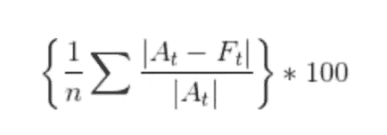

# 如何衡量预测模型或算法的准确性第 1 部分？

> 原文：<https://medium.com/hackernoon/how-to-measure-the-accuracy-of-a-predictive-model-or-algorithm-part-1-6a6c00c38687>

在开发预测模型和算法时，无论是线性回归还是 [ARIMA 模型](http://www.acheronanalytics.com/acheron-blog/arima-and-ets-forecasting-in-r)，量化模型与未来观测值的吻合程度都非常重要。计算模型正确程度的最简单方法之一是使用预测值和实际值之间的误差。从那里，有几种方法可以利用这种差异，并进一步挖掘其中的意义。量化算法的准确性是证明该算法在产品中使用的重要步骤。

我们将使用 R 编程语言中的函数精度作为我们的基础。您可能会注意到，输出如下所示，其中有几个缩写可能看起来不太友好。我们将在下面讨论其中的一些。此外，您可以在 R Studio 中观看我们解释视频格式中的相同错误！

# 平均绝对误差

平均绝对误差是最容易理解的误差之一。它取实际值和预测值之间的绝对差值并求平均值。找到绝对值很重要，因为它不允许任何形式的误差值抵消。例如，如果你取 1 和-1 的平均值，那么你将得到平均值 0，因为 1 和-1 基本上相互抵消了。

为了避免这种情况，我们使用[绝对值](https://www.khanacademy.org/math/arithmetic/arith-review-negative-numbers/arith-review-abs-value/v/absolute-value-of-integers)。现在我们想演示如何用数学方法和使用 SQL 找到 MAE。您可以对 SQL 使用下面的公式，它会找到与 MAE 相同的值。另外，我们觉得它可能会简化你在下一张图片中看到的所有复杂的数学符号。

*Avg(Abs(实际—预测))*

# 均方根误差(RMSE)

均方根误差似乎有点类似于 MAE。他们都采用实际和预测之间的差异。但是，RMSE 也会对差值求平方，求出所有平方的平均值，然后求出平方根。现在看起来平方然后求平方根的动作可能会互相抵消。事实并非如此。RMSE 本质上是惩罚更大的错误。另一种说法是，它对更大的错误赋予更重的权重。

例如，让我们比较下面的两个表。如果您注意到，表 1 和表 2 中的 MAE 和 RMSE 几乎相同。然而，即使误差仅增加 1，两个值之间的差异也会稍大，如第一行所示。如果误差是 5、6 或更大的数字，RMSE 和平均相对误差之间的差异会变得更大。这是因为你平方了这个数。这就造成了基数的指数变化。因此，1 的误差差对于例如从(3 到 4，然后从 4 到 5)的每次增加具有更大的影响。这就是为什么它本质上惩罚更大的错误。

下面是 RMSE 的 SQL 和数学符号。

*Sqrt(Avg(功率(实际-预测)))*

# **平均绝对百分比误差(MAPE)**

对于 RMSE 和梅伊，你可能会遇到的一个问题是，这两个值可能会变成很大的数字，实际上并不能说明太多问题。597 的 RMSE 是什么意思？这是好事还是坏事？这部分是因为你需要将其与其他模型进行比较。另一个问题是，RMSE 将基于实际和预测的差异，这取决于您的数据可能在非常不同的比例上。例如，如果你正在为一个 10 亿美元的公司创建一个模型，你的误差将比一个只有 6 位数总收入的公司的误差大得多。

在这种情况下，平均绝对百分比误差是一种好方法，因为它是与实际值相比的误差百分比。这提供了更多的标准化误差测量。例如，如果误差为 10，实际值为 100，则百分比将为 10%，而如果误差为 100，实际值为 1000，则度量仍为 10%。

这比 RMSE 和 MAE 提供了更多的背景，有助于更好地解释模型的准确性。

下面列出了 SQL 和数学符号

*Avg(Abs(实际-预测)/Abs(实际))*100*

# **平均绝对标度误差(MASE)**

平均比例误差是我们今天要讨论的最后一个误差。这个脉泽与其他三个略有不同。它将您正在测试的当前模型的 MAE 与原始模型的 MAE 进行比较。朴素模型只是预测上一次观测到当前观测。

MASE 是 MAE 与朴素模型的 MAE 之比。这样，当 MASE 等于 1 时，这意味着您的模型与朴素模型具有相同的 MAE，因此您几乎可以选择朴素模型。如果模型的 MASE 是 0.5，那就意味着你的模型比选择之前的值要好 2 倍。

此错误跳过了运行多个模型的步骤，而是自动将您的模型与另一个模型进行比较。它提供了比 MAE，RMSE 和 MAPE 多一点的背景。

总的来说，这四个错误创造了一个可以帮助决定你的算法或模型是否合适的故事。还有其他因素需要考虑，但我希望这有助于简化这些奇怪的缩写。如果您还有任何问题，或者有其他统计或编程问题。请随时伸出援手！

**其他关于数据科学的精彩阅读:**

[什么是决策树](http://www.acheronanalytics.com/acheron-blog/brilliant-explanation-of-a-decision-tree-algorithms)

[算法如何变得不道德和有偏见](http://www.acheronanalytics.com/acheron-blog/how-do-machines-learn-bias-data-science)

[男装店如何利用数据科学竞赛](https://www.theseattledataguy.com/how-mens-wearhouse-could-use-data-science-cont/)

[R 中时间序列介绍](https://www.youtube.com/watch?v=8cKeAH2aGVI)

[如何开发鲁棒算法](/@SeattleDataGuy/how-to-develop-a-robust-algorithm-c38e08f32201)

[4 数据科学家必备技能](https://www.theseattledataguy.com/4-skills-data-scientist-must-have/)

