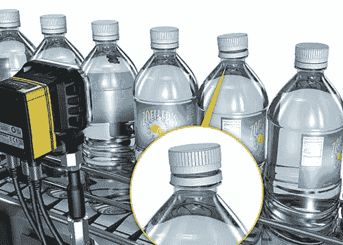
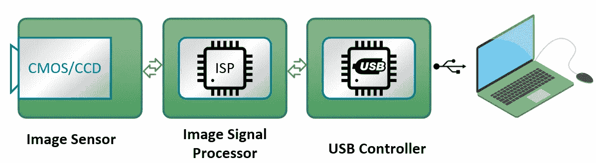
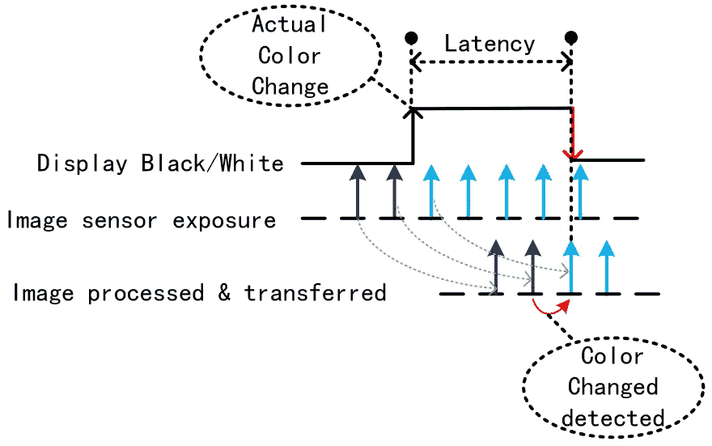
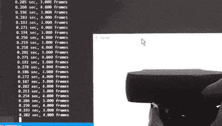
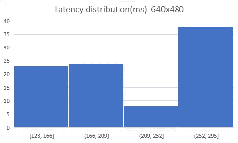
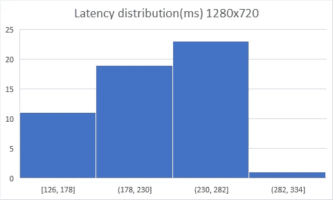
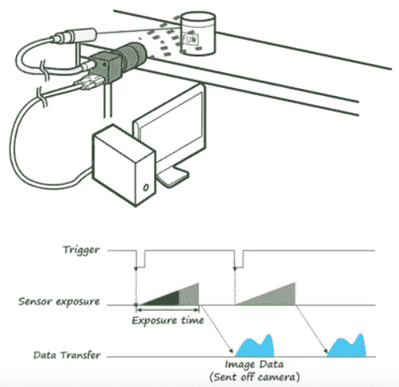

# 如何使用 OpenCV 测量网络摄像头的延迟

> 原文：<https://medium.com/hackernoon/how-to-measure-the-latency-of-a-webcam-with-opencv-1a3d4a86558>

在这个快速教程中，您将了解如何测量网络摄像头的延迟，以评估它是否能够处理实时要求比静态图像捕捉更高的图像捕捉任务。

想象一条饮料生产线沿着传送带快速灌装瓶子。部署了一个摄像头来验证每个瓶子的质量，如液体的体积和形状，每个有缺陷的产品都必须被挑选出来。图像捕捉的实时要求是至关重要的，因为任何延长的等待时间都可能导致不同的瓶子被转移到错误的路径。

Vision-based inspection

# 潜伏期从何而来？

通过调用 Python cv2 库中的`camera.read()`从网络摄像头中读取一帧似乎很简单，然而，在幕后发生了许多事情，这可能会引入不可预测的延迟，这在实时应用中是不可取的。

Camera pipeline

从上图可以看出，捕捉到的图像经过“很长”的一段路到达你的电脑，然后被解码并显示在屏幕上。

# 测量延迟

为了测量实际图像被捕获和显示在屏幕上之间的延迟，我们将快速编写一个简单的 Python 脚本，以尽可能快的速度从摄像机读取图像，并在管道末端检测到之前的颜色变化时立即翻转显示颜色。

Measure latency

前面的序列表明等待时间可能比几帧长。

这是这个实验的逻辑图。

Flowchart

完整的脚本如下所示。

将您的相机指向弹出窗口，观察每秒钟黑白之间的几次颜色翻转，这反映了延迟。

你可以将你的相机镜头尽可能靠近屏幕，它不需要有一个清晰的焦点，只需要平均强度就可以使颜色翻转。

我已经在我的罗技 C930e USB 网络摄像头上测试了它，下面是结果。

Demo

测试了两种图像分辨率，您可以看到较低的分辨率产生的延迟稍低。

Latency distribution 640 x 480

Latency distribution 1280 x 720

该值以毫秒为单位，平均值约为 200 毫秒。假设传送带以 1 米/秒的恒定速度运行，瓶子已经移动了 20 厘米远。

# 解决方法是什么？

如果您的应用需要更多的预测和更低延迟的图像捕捉，一个简单有效的解决方案是将您的相机升级为具有外部触发信号的工业相机，其中可以连接一个[光电眼传感器](https://en.wikipedia.org/wiki/Photoelectric_sensor)或数字控制 IO。

External trigger

在这种情况下，可以在更具预测性的时间戳捕获图像，该时间戳可以由阻挡光电眼传感器的东西或来自计算机的实时信号触发。

[在 Twitter 上分享](https://twitter.com/intent/tweet?url=https%3A//www.dlology.com/blog/how-to-measure-the-latency-of-a-webcam-with-opencv/&text=How%20to%20measure%20the%20latency%20of%20a%20WebCam%20with%20OpenCV) [在脸书分享](https://www.facebook.com/sharer/sharer.php?u=https://www.dlology.com/blog/how-to-measure-the-latency-of-a-webcam-with-opencv/)

【www.dlology.com】最初发表于**。**