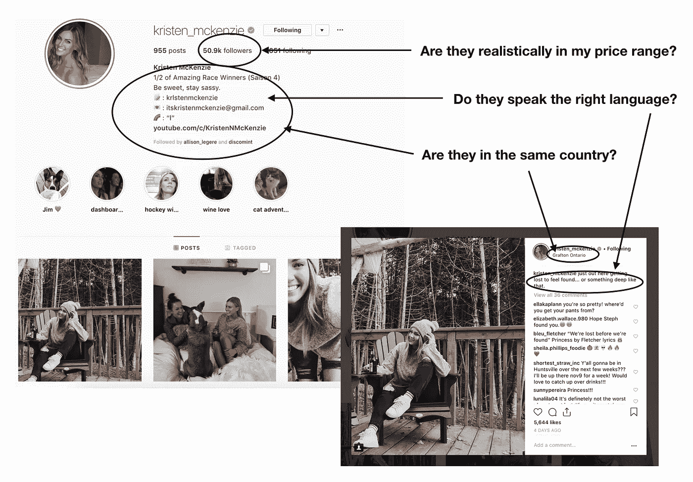
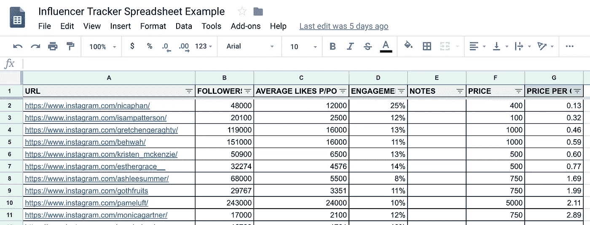
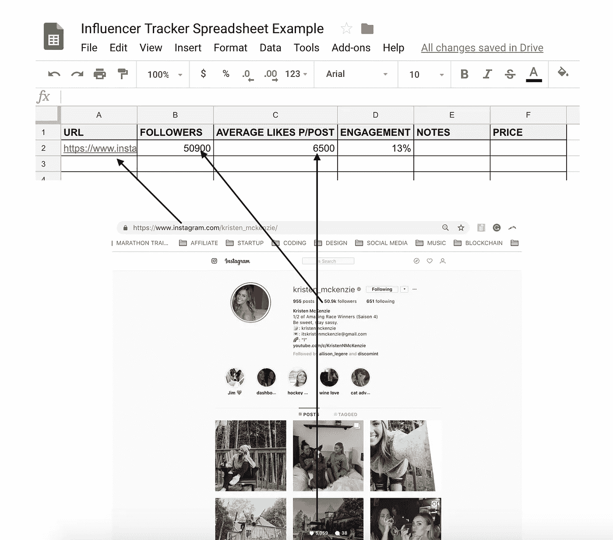
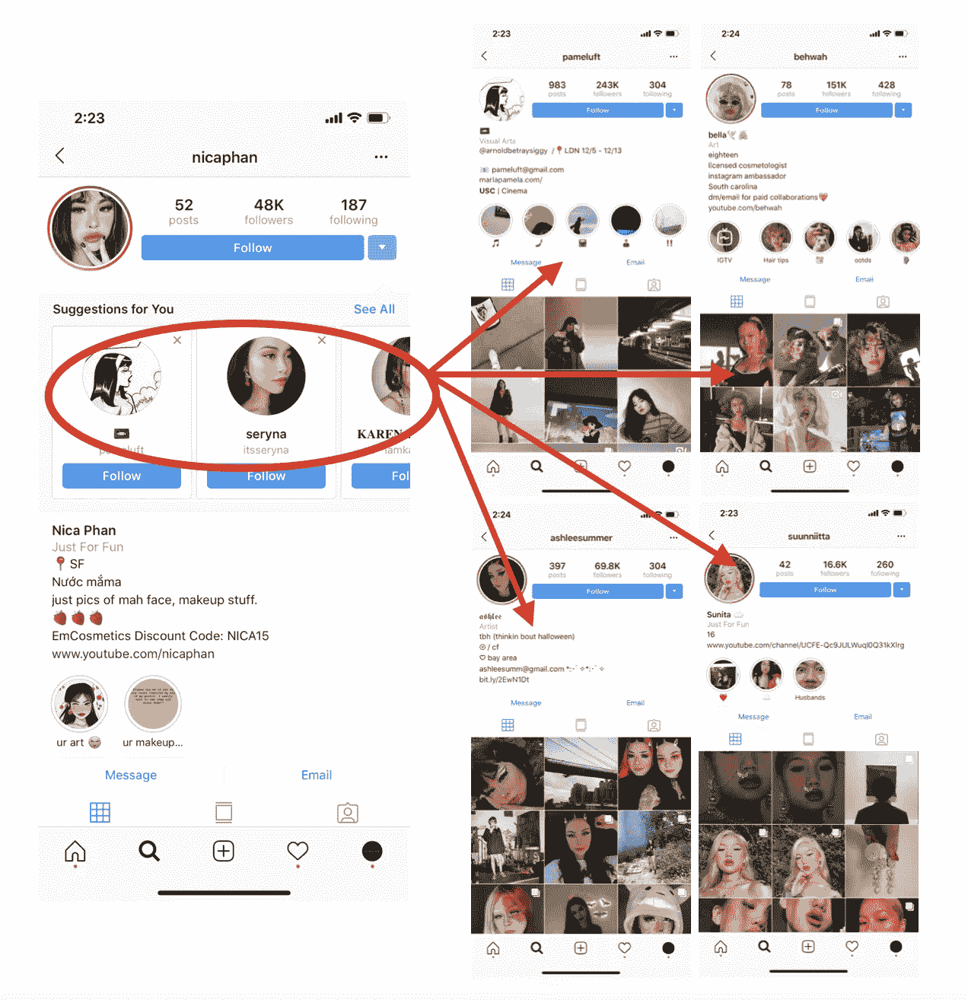
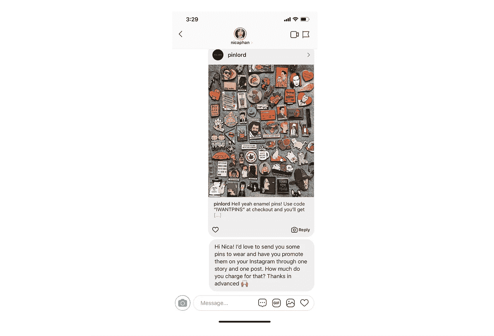
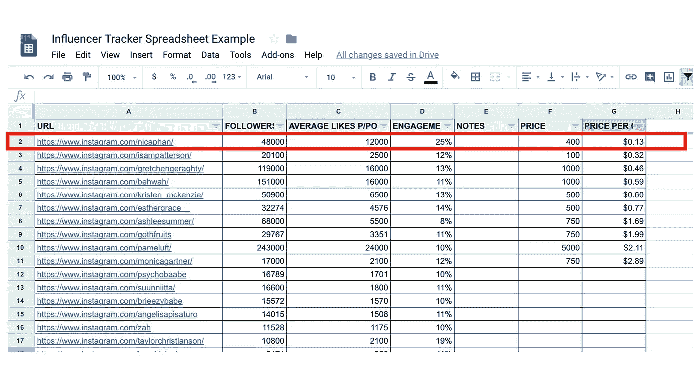

# 如何衡量一个 Instagram 影响者的价值？

> 原文：<https://medium.com/hackernoon/how-to-measure-what-an-instagram-influencer-is-worth-cb488f605ffe>

对于我们大多数人来说，理解在 Instagram 上推广我们的品牌或服务时向社交媒体影响者支付多少费用的过程仍然是一个谜。

价格是如何确定的？给你的价格是划算还是不太划算？你应该与哪些有影响力的人合作，以获得最高的投资回报？幸运的是，我们有办法自己解决这个问题，而且这个过程非常简单。

那么，你是怎么做的呢？！

为了衡量 Instagram 影响者的价值，我们首先了解影响者如何决定如何为推广机会定价是很重要的。

## 影响者如何为晋升机会定价。

每当你向有影响力的人提出可能的晋升机会时，他们通常会以两种方式决定他们的价格。

首先，他们有多喜欢你的产品或服务，其次，在你接近他们的时候，他们有多少其他类似的促销机会。

通常情况下，如果影响者真心喜欢你的产品或服务，他们会给你一个比他们的“平均”推广价格更低的价格(因为他们通过推广他们真正喜欢的产品/服务为他们的受众提供价值)。相反，如果他们不真正喜欢你的产品或服务，他们可能会给你高于平均水平的价格(因为大多数有影响力的人只愿意推广他们不一定喜欢的产品/服务来换取金钱，他们越不喜欢它，他们可能会要求更多的金钱来推广它)。

同样，如果在你提出建议时，他们有大量其他类似的促销机会，他们可能会要求更高的价格，因为对他们产品的需求很高(而他们的产品很稀缺)。如果他们当时没有很多其他机会，他们更有可能接受更低的价格，因为对他们服务的需求很低(他们希望获得有偿机会)。

这意味着所有的促销机会都应该有不同的价值，这取决于谁是影响者，以及促销的产品/服务是什么。

## 换句话说，社交媒体影响者没有“标准”价值。

影响者的价值只能通过与希望与他们合作的产品或服务的关系来衡量。

好的一面是，有一个客观而实用的过程，让你衡量一个影响者相对于*你的*产品或服务的价值。

为此，请遵循以下四个步骤:

# 1.确定你想合作的影响者的“类别”。

当我谈到“类别”时，我指的是影响者谈论的内容类型。

通常，有两种“类别”的影响者:

1.  **小众影响者、**，主要集中在谈论一个(或两个)特定话题([时尚影响者](https://www.instagram.com/evachen212/)、[美食影响者](https://www.instagram.com/hotspothunter/)、[健康影响者](https://www.instagram.com/rachellerobinett/)、[化妆影响者](https://www.instagram.com/visiblejune/)、[游戏影响者](https://www.instagram.com/netnobody/)等)。
2.  **一般生活方式的影响者，**谈论他们的生活，但不专注于某个特定的话题(一些很好的例子是像 [Emma Chamberlain](https://www.instagram.com/_emmachamberlain/) 或 [Ellie Thumann](https://www.instagram.com/elliethumann/) 或[企业家精神的影响者](https://www.instagram.com/ryancarson/)像 [Ryan Carson](https://medium.com/u/d6be9e8e259e?source=post_page-----cb488f605ffe--------------------------------) ，以及[两者兼而有之的人](https://www.instagram.com/kickiyangz/?hl=en)(范围很广)。

当谈到选择你的类别时，这里有一些我在这个过程中学到的东西可能会对你有所帮助:

*   **与受众对*的信任程度相比，类别并不重要*特定影响者所说的话:**传统上，大多数营销人员认为最好的结果来自于与影响者合作，他们创造的内容与你的产品或服务主题相同。例如，大多数鞋品牌营销人员仍然认为他们应该与时尚或街头服饰的影响者合作，因为他们创造的内容与他们的产品主题相同。问题是，通常情况恰恰相反。当谈到采取行动(跟进一个新客户或根据影响者的推荐购买产品)时，人们并不关心*一个影响者在说什么*，他们关心的是他们*有多信任*正在促销的特定影响者*。如果受众信任某个影响者，他们会购买该影响者推荐的任何东西，只要它看起来是真诚的推荐，会给他们的生活带来价值。如果受众不信任某个影响者所说的话(因为其他每一个帖子都是无诚意的赞助帖子)，无论话题多么符合他们的兴趣，他们都不会基于他们的推广采取任何行动。你如何衡量观众对一个有影响力的人所说的话有多信任？有机[参与率](/@edmo_nyc/how-to-measure-engagement-rates-on-instagram-and-why-its-important-d368486a984a)(但我们将在未来的步骤中讨论这一点)。*

Btw, have you every asked yourself [if your Instagram is actually even worth growing?](/better-marketing/how-to-know-if-your-instagram-is-actually-worth-growing-c0874be37fc5) If not, you should. It might help save you a whole bunch of time and energy. It’s not worth it for everyone…

*   **你越具体，就越有可能获得巨大的结果:**当考虑一个类别时，我还建议你在谈到你关注的影响者类型时，尽可能具体。例如，如果你制作[纯素食男装套装](https://www.instagram.com/Brave_GentleMan/)，而不是寻找一般的男装时尚博主，你会从寻找美国 22 岁以上、吃纯素食并有 YouTube 频道的内容创作者那里获得更好的结果。专注于一个超级特定类型的内容创作者不仅会缩小你的影响者搜索范围(22 岁以上、住在美国、吃纯素食、有 YouTube 频道的内容创作者会少得多，相比之下，那些只是被认为是“时尚博主”的内容创作者会少得多)，这将使你更有效地利用你的时间，而且还会帮助你更好地衡量价值。 因为你将基于拥有更多可比内容的影响者(有各种各样的“时尚影响者”，这使得比较他们的价值变得更加困难，因为他们在所有方面都是如此不同)。

# 2.在你的类别中找到尽可能多的相关和高参与度的影响者。

一旦你知道你想和哪一类影响者合作(小众或普通生活方式)，花时间在 Instagram 上寻找尽可能多的相关和高参与度的影响者。

## 什么是相关影响者？

相关意味着有影响的人说你的受众的语言，在你的国家(这将使支付、合同等方面的过程更容易)，并且在你的价格范围内(除非你有 10 万美元以上的预算，否则大的影响者(50 万-100 万)可能会超出你的价格范围，因为他们通常对每个合作关系收取数千美元)。

Once you start researching influencers you’ll find that it’ll become easier and easier to find this information quickly (I just eye-ball it).

## 什么是高参与度影响者？

高参与度意味着在 Instagram 上处于有机“喜欢”参与度前 1%的影响者。为什么关注高参与度？参与度是一个很好的(也很简单的)指标，表明了观众对影响者的信任度。参与度越高，该影响者的受众就越信任(并关心)他们所说的话，因此，与拥有类似数量的追随者但参与度较低的影响者相比，每当该影响者推荐产品或服务时，就有更大比例的受众可能会采取行动。下面是衡量敬业度的公式:

Measure engagement by dividing the average number of likes they get in post 4–10 and divide that by their total number of followers

这就是为什么你想在一个类别中找到参与度最高的影响者。如果有大量的内容创建者谈论某个特定的话题(通常都有)，你会想把钱花在那些会带来最大流量或每名追随者销售额的内容创建者身上，这样你就可以获得最大的回报。

一般来说，与参与度较低且拥有类似数量追随者的影响者相比，参与度为 **10%或以上的影响者更有可能取得更好的结果**(流量/销售额/关注数)，因此，请努力寻找参与度至少达到该水平的影响者。他们很难找到，但也更有可能给你最好的投资回报率。

## 通过电子表格记录它们:

要跟踪他们，开始一个电子表格！这里的是我使用的电子表格的一个例子。

Beware, many influencers manipulate their engagement numbers through an [Instagram bot](https://bettermarketing.pub/the-best-instagram-bots-for-2022-the-most-effective-options-everything-else-you-need-to-know-73fa36f4e433). If you’re interested in how they work, here’s a great guide that shows you [how to automate a bot safely](/the-mission/how-to-automate-an-effective-instagram-bot-that-isnt-spammy-b2146a2c0b19).

在我的例子中，我喜欢以如下方式组织我的影响者电子表格:在 URL 列中，你将放置 Instagram 个人资料的 URL(最好在你的笔记本电脑上完成)，在 FOLLOWERS 列中，你将包括影响者的粉丝数量，对于平均赞数 P/POST，你将包括影响者在第 4 到第 10 个帖子中获得的平均“赞数”，对于参与度，你将使用公式 ENGAGEMENT =(平均赞数 P/POST / FOLLOWERS) * 100， 在“价格”栏中，您将包括他们为您发送给他们的合作建议提供的价格(稍后将进行解释)，在“每次转化的价格”栏中，您将根据影响者的参与度和价格(稍后也将进行解释)来衡量其每次转化的估计成本。

By hovering over a post on your laptop you’re able to see the number of likes. Doing this to measure average likes p/post will make the process much quicker for you instead of clicking in and out of posts 4–10.

## 在浏览器页面、“给你的建议”下拉菜单、标签搜索和/或第三方影响者工具中查找高参与度影响者:

[我写了一篇文章，详细解释了如何在 Instagram](https://hackernoon.com/how-to-search-for-and-find-the-most-valuable-influencers-on-instagram-df8ddd5b2243) 上找到高参与度影响者的每一个步骤，但一般来说，你首先要通过 Instagram 浏览器页面进行搜索…

Instagram tends to show you posts from people who have high-engagement and are relevant to you on the Explorer Page because they use that page to surface the content from people that others tend are engaged with. Posts that get a lot of interactions (engagement) are the ones who tend to keep people using the app for longer, and Instagram wants you to use their app for as long as possible (because that’s how they make money). For example, I run an [enamel pin business](/the-mission/how-to-monetize-your-instagram-account-7b13ce4b300d) and I’m looking for stylish US-based content creators between the age of 16–25 who have a youtube channel. By searching on my explorer page, I quickly found [@nicaphan](https://www.instagram.com/nicaphan/), who fits all of my requirements and has an engagement rate of over 18% (that’s GREAT!).

…然后浏览您找到的高参与度客户的“建议”下拉菜单…

I searched through the “Suggestions for You” accounts from [@nicaphan](https://www.instagram.com/nicaphan/) (the first account I found) and discovered over 4 other influencers ([@pameluft](https://www.instagram.com/pameluft/), [@behwah](https://www.instagram.com/behwah/), [@ashleesummer](https://www.instagram.com/ashleesummer/), [@ssuunniittaa](https://www.instagram.com/suunniitta/)) who have great engagement and fit all my requirements.

…并在您的电子表格中包含所有相关和高参与度的内容。

如果你这样做没有找到很多参与度超过 10%的客户，你可以通过标签或第三方[影响者搜索工具](https://scopeapp.io/)和平台搜索[，尽管这些在试图找到高参与度客户时往往不会那么有效。](https://www.instagram.com/explore/tags/veganyoutuber/)

继续这个过程，直到你找到至少 25 个与你相关的有影响力的人，他们的参与度达到或超过 10%。

# 3.联系他们并询问他们的价格。

一旦你的电子表格中有至少 25 名影响者，按照参与度从高到低对他们进行排序，Instagram Direct 消息前 10-20 名的合作提议(没有代理的影响者不倾向于使用电子邮件工作)。在你的 DM 中，你将解释你在寻找什么，并询问他们的价格。

这里有一个我过去用过的信息模板，它给了我很高的回复率:

Something along the lines of “Hi {NAME}! We would like to send you our {PRODUCT}, and if you like it, we would love to pay you to promote it to your audience through a {PARTNERSHIP DELIVERABLE}. What are your rates? Thank you!”

通常，切中要点、明确可交付成果并清楚说明影响者将获得报酬的消息往往会有较高的回复率。像我们大多数人一样，他们的时间是宝贵的，他们会收到大量的入站消息，他们不想回应那些没有明确表示将为他们的工作支付报酬的人。

# 4.衡量他们每次转换的估计成本。

一旦你知道了每个影响者的要价，你就可以衡量他们对你的相对价值。为此，请使用以下公式:

通过将每篇帖子的平均点赞数乘以参与度，您可以计算出每个点赞的估计转化率，或者换句话说，根据影响者的建议预期采取行动的人数(关注和/或参与度越大，采取行动的人数就越多)。当你将价格除以估计的转换率时，你将得到每次转换的估计成本，其中转换=根据影响者的推荐采取行动的人。每次转换的成本越低，你得到的价值就越多。

一旦你完成了计算，从最低到最高对你的电子表格上的每次转换价格列进行排序，在所有条件相同的情况下，每次转换价格最低的人可能会给你最高的价值( [ROI](https://en.wikipedia.org/wiki/Return_on_investment) )。

In my case, after getting pricing from 10 influencers, the one who is likely to give me the most value is [@nicaphan](https://www.instagram.com/nicaphan/). She charges $400 for a photo and story post and her estimated value is $.13 per converted like. The second most valuable would be [@isampatterson](https://www.instagram.com/isampatterson/), followed by [@gretchengeraghty](https://www.instagram.com/gretchengeraghty/), etc.

瞧啊。您已经衡量了与您的品牌和项目最相关的影响者的价值！现在由您来确认与他们的合作关系，衡量您得到的结果，以及它们与您的估计相比如何。

Btw, here’s an article about the best [Instagram content scheduling and post automation tools](/better-marketing/the-best-instagram-content-scheduling-and-post-automation-tools-2e52e48373d3). Using them will help your posting process a lot more efficient 👍🏽

当决定如何花钱时，我建议你从最有可能给你带来最高价值的开始，然后从那里开始。此外，尝试与尽可能多的影响者确认合作关系(如果你有预算)，衡量结果，并与你的估计进行比较。

当谈到合作关系实际上对你有多好时，有很多变量在起作用(如执行和时机)，除非你执行几个合作关系，否则你不会知道哪种类型的影响者和哪种类型的合作关系最适合你。好的一面是，如果你只与 10%或以上参与度的影响者合作，与参与度较低且拥有类似数量追随者的影响者相比，他们都是有价值的，可能会给你带来最好的结果。

当然，每个品牌、每个项目和每个影响者都是不同的，所以关键是尽可能多、尽可能频繁地进行测试——像要求 Instagram 故事标签或 Youtube 视频提及而不是 Instagram feed 帖子这样简单的事情可能会改善你的结果。

只要你专注于寻找参与度最高的人，并测试足够多的合作关系，你最终会找到适合你的影响者公式。

顺便说一句，如果你想了解有助于你更快发展 Instagram 业务的其他策略，请阅读这些关于[Instagram 到底是什么以及如何工作的文章](https://theeduardomorales.medium.com/what-instagram-really-is-how-it-works-ad5d7ff5b6a0)、[Instagram 算法如何工作的文章](https://theeduardomorales.medium.com/what-the-instagram-algorithm-does-how-it-works-how-to-use-it-to-your-advantage-752356122c67)、 [Instagram 利基市场以及它们为什么是增长的关键](/better-marketing/instagram-niches-why-they-are-the-new-key-to-growth-on-instagram-beca2878d55d)、[如何建立一个赚钱的 insta gram 转发账户](/swlh/how-to-create-an-instagram-repost-account-that-makes-money-928a404560)、[如何在 insta gram 上赚钱](/the-mission/how-to-make-money-on-instagram-7b13ce4b300d)， [如何自动化一个没有垃圾信息的机器人](/the-mission/how-to-automate-an-effective-instagram-bot-that-isnt-spammy-b2146a2c0b19)、[哪些是最安全的 Instagram 机器人](https://hackernoon.com/the-best-instagram-bot-that-will-keep-your-account-safe-4aaf0ccaee4d)、[如何创建有效的 Instagram 赞助帖子](/@edmo_nyc/how-to-create-effective-instagram-sponsored-posts-ea948b18f582)、[如何挑选正确的 Instagram 用户名](/better-marketing/how-to-pick-the-best-instagram-username-9af1b49b7ad)、 [Instagram 机器人 2021](/better-marketing/instagram-bots-in-2021-everything-you-need-to-know-b57fb0a3b8e9) 、[如何找到最好的 Instagram 标签](/the-mission/a-simple-system-to-find-the-30-most-effective-hashtags-for-your-instagram-4c2a4ffba34a)、[如何找到在 Instagram 上发帖的最佳时间](/the-mission/how-to-optimize-posting-times-to-fix-your-falling-engagement-rates-on-instagram-f9ecf87e82aa) [为什么你的 Instagram 账户没有增长](/the-mission/why-your-instagram-account-isnt-growing-and-why-it-s-not-because-of-the-latest-instagram-523f6137014b)，如何[检查你是否被屏蔽](https://hackernoon.com/3-simple-steps-to-check-if-youre-shadowbanned-what-shadowbanning-is-what-causes-it-and-how-to-175723df938b)，如何[将你的媒体文章](https://hackernoon.com/how-to-monetize-a-medium-article-b4c1aeb7fdae)，[如何自动化你的 Instagram 帖子](/the-mission/how-to-schedule-instagram-posts-from-your-computer-7138ba26658f)，[如何提高你的 Instagram 参与度](/swlh/how-to-measure-influencer-marketing-roi-on-instagram-321b9b397ef4)，以及[如何找到最有价值的 Instagram 影响者](https://hackernoon.com/how-to-search-for-and-find-the-most-valuable-influencers-on-instagram-df8ddd5b2243)，[如何衡量一个影响者的价值](https://hackernoon.com/how-to-measure-what-an-instagram-influencer-is-worth-cb488f605ffe)， [你需要知道的关于](https://hackernoon.com/how-to-measure-what-an-instagram-influencer-is-worth-cb488f605ffe)[抖音机器人](/better-marketing/tiktok-bots-the-best-bot-providers-ca6ebe9a0134)的一切，以及[如何衡量你的影响者营销投资回报率](/swlh/how-to-measure-influencer-marketing-roi-on-instagram-321b9b397ef4)。

## 非常感谢您花时间阅读我的文章！如果你喜欢它，你可以通过注册我的 [Instagram 小企业班](https://theinstaclass.co/)来支持我，分享这篇文章并给它一堆掌声。你也可以[在 Instagram](https://www.instagram.com/theeduardomorales/) 上关注我，每当我发布❤的新作品，你就可以获得更新