# 我如何从一篇中型文章每月赚 2000 美元

> 原文：<https://medium.com/hackernoon/how-to-monetize-a-medium-article-b4c1aeb7fdae>

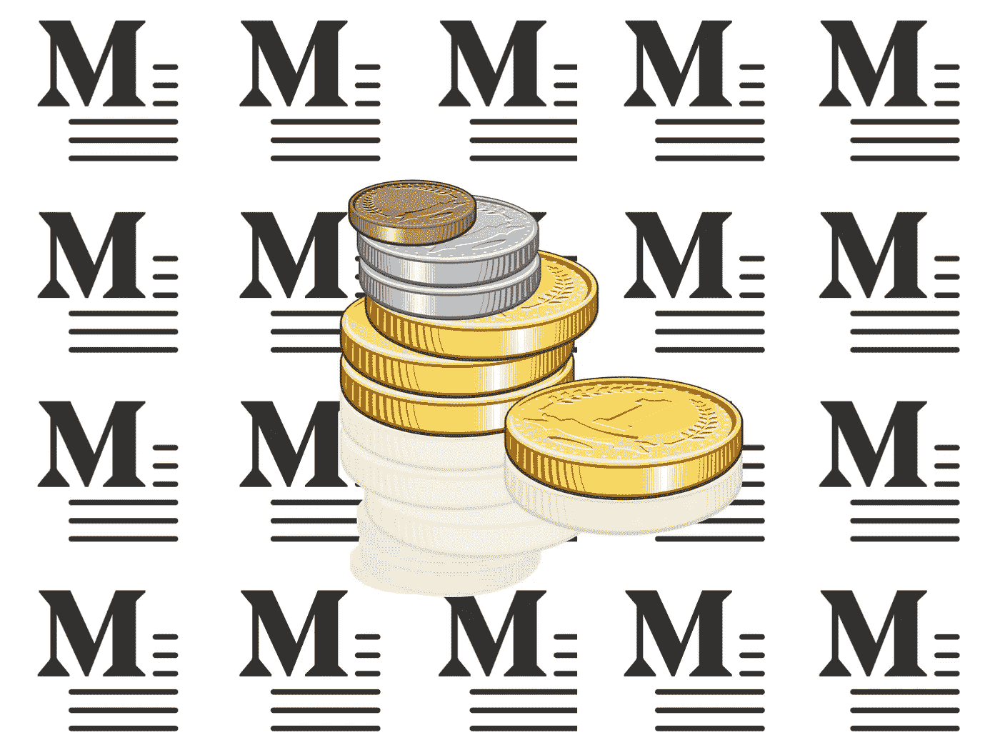

我在[媒体](https://medium.com/u/504c7870fdb6?source=post_page-----b4c1aeb7fdae--------------------------------)上写的这篇文章让我每月赚 2000 多美元。

我是这样做的…

## **1。我写了一个关于一个很多人都很好奇的话题的全面概述和可操作的方法，但是关于这个话题的信息很少。**

Instagram 机器人是一个经常被误解和政治化的话题。在使用机器人开发了我自己的几个账户后(由于缺乏有价值的文章而感到沮丧)，我开始写一些东西来帮助揭开这种做法的神秘面纱，并让人们可以从中获得真正的积极价值。

事实是，机器人不仅用于满足政治议程或[人为提升影响者的自尊心(和薪水)](https://www.adweek.com/brand-marketing/unilever-to-crack-down-on-influencers-who-buy-fake-followers-and-use-bots/)，它们也可以是企业家接触更多受众的非常有效的工具，其成本只是社交媒体上所有其他营销选项的一小部分。知道如何有效地使用它们可以为许多小企业增加大量的价值。

为了让它尽可能有用，我写了一篇简单、有趣、易懂的文章，解释了我所知道的关于机器人的一切:它们是什么，它们是如何工作的，它们如何被用来在 Instagram 上有机地发展业务，它们应该如何被使用，哪些是最有效的机器人服务，最重要的是，一步一步地指导你如何自己自动化一个非垃圾机器人。

To make as accessible and useful as possible for most Instagram users, I went through the trouble of creating visual guides for all of the elements and how to’s in the article. Btw, have you every asked yourself [if your Instagram is actually even worth growing?](/better-marketing/how-to-know-if-your-instagram-is-actually-worth-growing-c0874be37fc5) If not, you should. It might help save you a whole bunch of time and energy. It’s not worth it for everyone…

由于你在谷歌上找到的大多数与 Instagram Bot 相关的文章要么是[政治](https://abcnews.go.com/GMA/Style/fake-hair-accounts-instagram-russian-bots/story?id=55642799)，不再与[相关](https://petapixel.com/2017/04/06/spent-two-years-botting-instagram-heres-learned/)，[对于大多数](https://medium.freecodecamp.org/my-open-source-instagram-bot-got-me-2-500-real-followers-for-5-in-server-costs-e40491358340)人来说是不可访问的，要么是付费墙后面的，拥有这些免费且可操作的信息让普通 Instagram 用户可以访问这个话题，并帮助小企业主应用这些策略来发展他们的业务。这不仅为阅读它的人创造了价值，也鼓励他们与其他对学习感兴趣的人分享。

## **2。由大型** [**中型**](https://medium.com/u/504c7870fdb6?source=post_page-----b4c1aeb7fdae--------------------------------) **刊物发布，SEO 很棒。**

一旦我知道内容是有用的，下一步就是确保它到达尽可能多的合适的人手中(合适的人=会发现我的文章有价值的人)。

在阅读了[这篇关于如何成长的](/swlh/13-how-i-grew-my-medium-following-6500-30-days-of-medium-c9d2d6f80b51)文章后，我努力把它发表在 [The Mission](https://medium.com/u/2961ae4625b1?source=post_page-----b4c1aeb7fdae--------------------------------) 上。它们不仅是每天被成千上万好奇的人阅读的伟大出版物，而且是由像这样的大型媒体出版物出版的([目前，Mission & Hackernoon 都是平台上最大的 5 个出版物](https://toppubs.smedian.com/))增加了它被媒体的算法呈现给更多读者的可能性，更重要的是，在谷歌上排名很高([流行媒体& Hackernoon 的文章在谷歌上排名很高](https://www.quora.com/Do-medium-com-blog-posts-rank-well-in-Google-search))。

因此，在对他们的[投稿最佳实践](/the-mission/submission-guidelines-the-mission-e4c4fc01a4a)做了一些研究后，我给使团的编辑发了一封友好而周到的邮件，提交了这篇文章，他们接受了这篇文章的出版(感谢相信我的写作[Stephanie Postles](https://medium.com/u/bcd4adba8243?source=post_page-----b4c1aeb7fdae--------------------------------)&[Chad Grills](https://medium.com/u/8804c3026cce?source=post_page-----b4c1aeb7fdae--------------------------------)——在[出版的这篇文章](https://medium.com/u/2961ae4625b1?source=post_page-----b4c1aeb7fdae--------------------------------)改变了我的生活！).

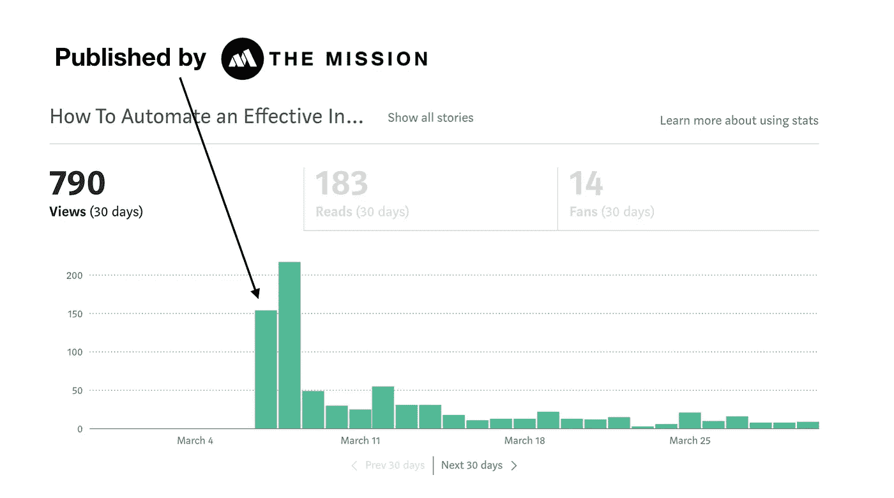

Usually, my Medium articles get the most traffic within the first 2–3 days of being published.

## **3。我在我的社交媒体渠道上推广了它。**

为了让尽可能多的人看到我的文章，我还在我的 Instagram [@pinlord 上通过](https://www.instagram.com/pinlord/)[照片贴](https://www.instagram.com/p/BgCm_kcH_yv/?taken-by=pinlord)，以及[故事集锦](https://www.instagram.com/stories/highlights/17938827349073541/)来推广它。

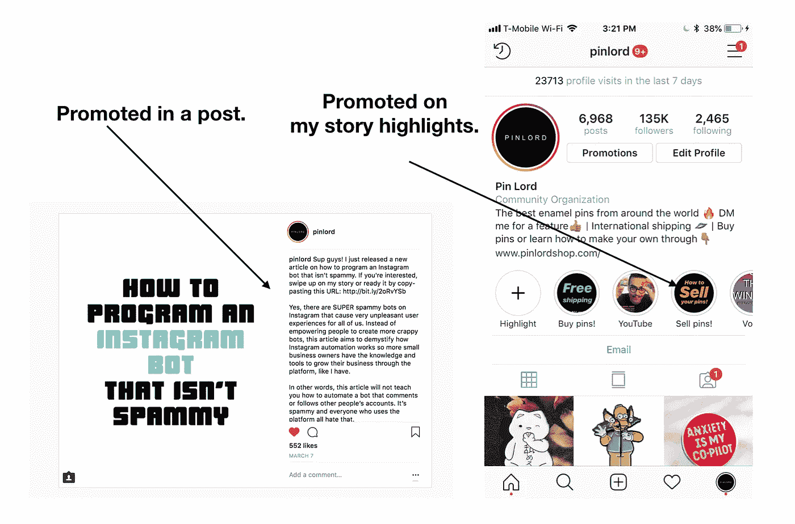

My Instagram account receives over 20k visits each week. By placing the article on my [story](https://hackernoon.com/how-to-create-an-effective-instagram-story-ad-bf9aef9eb9) highlights, I’m increasing the likelihood that a higher percentage of that traffic will discover the article in comparison to just posting it on my grid. People would have to scroll a long way down to find it on my grid, and it’s highly unlikely that’ll happen.

虽然这些帖子只让这篇文章的读者比任务推动的读者增加了 50 人，但它帮助它被 Instagram 上的新观众发现，在 Instagram 上它甚至更相关，因为它是关于 insta gram 的。

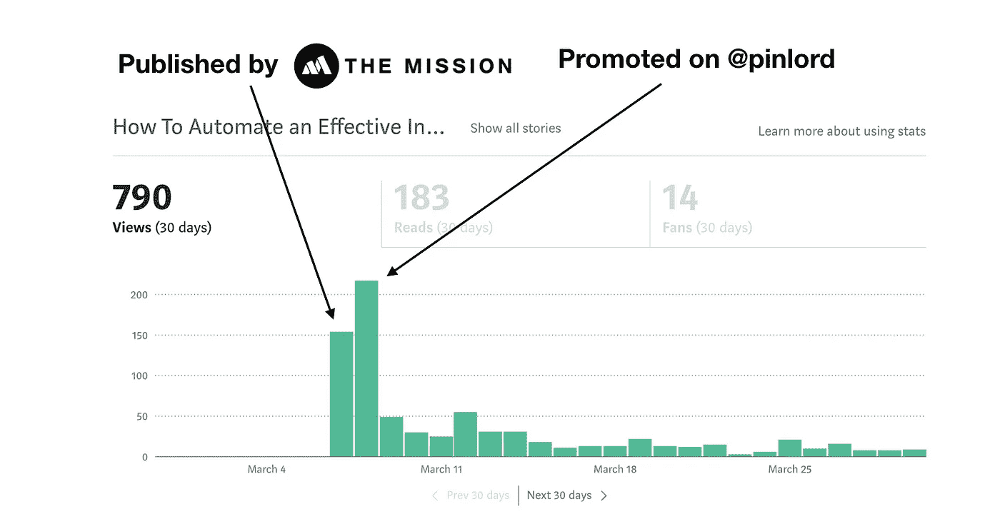

Promoting the article to my Instagram followers helped surface it to an audience that was more likely to find it useful vs. Medium’s readership that doesn’t necessarily use Instagram heavily. Btw, here’s an article about the best [Instagram content scheduling and post automation tools](/better-marketing/the-best-instagram-content-scheduling-and-post-automation-tools-2e52e48373d3). Using them will help your posting process a lot more efficient 👍🏽

## 4.它还在其他频道推广，并被新观众发现。

在文章发表的头两天就有超过 350 次浏览后，在接下来的一个月(3 月)，文章的访问量逐渐减少到每天 15 次左右。由于这是我过去大多数文章的流量表现，我不再试图推广它(假设它已经过了它的寿命)，而是继续写其他 Instagram 相关的话题。

[通过我的另一篇文章](/the-mission/how-to-measure-what-an-instagram-post-is-worth-ffb38e91a9dd?source=user_profile---------22------------------)，我最终联系到了[迪伦嘿](https://medium.com/u/b429f28098ad?source=post_page-----b4c1aeb7fdae--------------------------------)，他邀请我在他的[社交媒体增长播客](https://itunes.apple.com/us/podcast/how-to-find-work-instagram-influencers-eduardo-morales/id1356651980?i=1000408063995&mt=2)上谈论 Instagram 影响者。令人惊讶的是，当播客上线后，他通过他的社交媒体和时事通讯进行了推广，我的 Instagram Bot 文章的流量再次飙升，我的日均浏览量增加到每天 30 次左右(是播客发布前平均浏览量的两倍！).

在那个月(4 月)，我再次[发表了一篇新文章](/@edmo_nyc/how-to-create-effective-instagram-sponsored-posts-ea948b18f582)，并注意到平均浏览量再次小幅上升至每天 50 次左右。

I published my article late at night on the 24th of April, so most of it’s views accumulated on the next day.

虽然我没有数据来准确指出这种流量来自哪里(除了迪伦的播客和这篇新文章)，但数据告诉我，如果新的读者发现了它，我可以大大增加我的文章的读者群。越多新的人发现它，发现它有价值的人阅读它的可能性就越高，这导致更多的人分享它，它在 Medium 和 Google 上的排名就越高。在这些平台上更高的排名再次帮助更多的人发现它。这是一个良性循环。

## **5。我为我推荐的基于订阅的服务使用附属链接。**

接近四月底的时候，我无意中向我的好朋友兼导师阿曼达·柯林斯提到了最近的流量变化。她问我是否在做联盟营销，我告诉她我不知道那是什么(我知道，我知道，我当时是一个网络营销新手……)。

This video is lols but it’s a pretty darn simple explanation of how affiliate marketing works.

她解释说，每当有人为我在文章中推荐的任何服务付费时，我可以使用附属链接来获得佣金。因为这篇文章已经链接到了我认为最好的自动化服务(不需要付费)，所以切换链接来获得联盟付费是显而易见的。

经过一些快速的研究，我发现了联盟计划，我改变了文章中提到的服务的链接。当时， [Instazood](https://instazood.com/instazood-affiliate-program/) 为每月 9.99 美元的订阅支付 10%的佣金，而 [Social Sensei](https://socialsensei.co/affiliate-program/) 也为每月 45 美元的订阅支付 10%的佣金(平均水平)。

## **6。我不断在新的渠道推广它，以最大化流量和增长。**

现在我知道，如果新的读者发现我的文章，我可以大大增加我的文章的读者群*和*，我可以从每个为我链接的服务付费的读者那里获得报酬，我把在尽可能多的新渠道推广它作为我的使命，试图增加它的读者群(并可能获得更多报酬)。

5 月，我发布了一篇[新文章](/the-mission/how-to-automate-posts-on-instagram-from-your-computer-7138ba26658f?source=user_profile---------6------------------)，在@pinlord 上再次推广了这篇 Bot 文章，并向我组织的[insta gram Growth Hackers Meetup](https://www.meetup.com/Instagram-Growth-Hackers-NYC)的 600 多名成员发送了一封电子邮件:

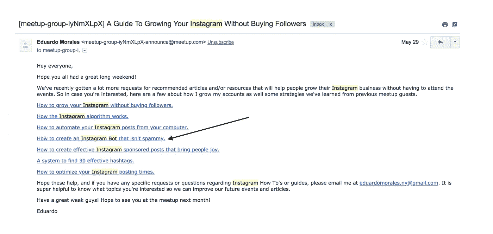

以下是这些活动对流量产生的影响:

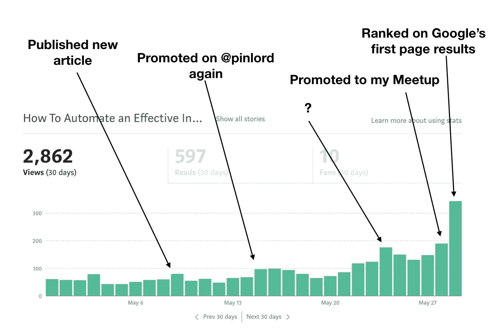

I have no clue where that traffic spike on May 24th came from.

我的日均浏览量从 4 月份的 50 次上升到 5 月底的 200 次，当时这篇文章开始在谷歌搜索结果的第一页上以“Instagram Bot”为主题排名。

这些是我在 5 月份收到的代销商付款:

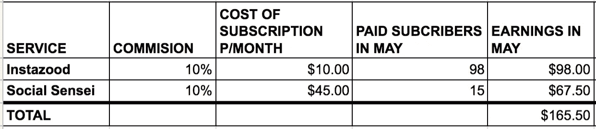

6 月，为了继续发展，我再次通过@pinlord 推广了这篇文章，并发布了另一篇文章。结果如下:

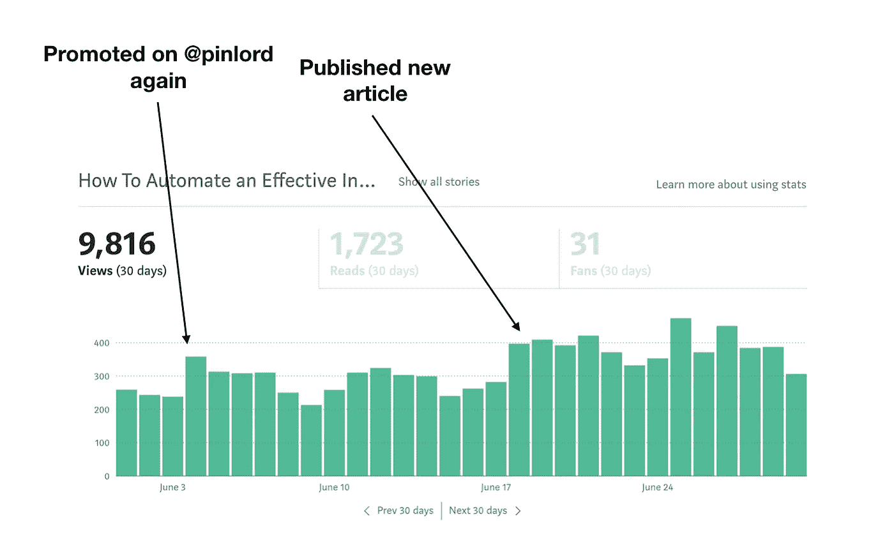

Since the article ranked on the first page of Google, I could count on a significant amount of daily views.

这些是我在 6 月份收到的代销商付款:

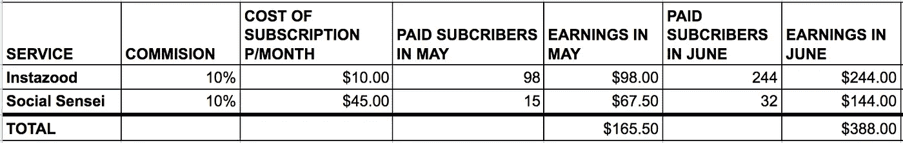

虽然我的日流量持续增加(从出现在谷歌的第一页开始)，但我注意到我从@pinlord 帖子(人们已经厌倦了一遍又一遍地听到这篇文章)以及发表新文章中获得的回报正在减少。

为了弥补这一点，我在 7 月份改变了策略，在我的其他 Instagram 账户上推广了这篇文章: [@potteryforall](https://www.instagram.com/stories/highlights/17961423187010917/) 和 [@macramemakers](https://www.instagram.com/stories/highlights/17889022867225757/) 。

这两个受众发现它很有用，阅读了它，分享了它，由于这种新的流量，这篇文章在谷歌上被评为“ [Instagram Bot](/the-mission/how-to-automate-an-effective-instagram-bot-that-isnt-spammy-b2146a2c0b19) ”主题的头号热门文章。

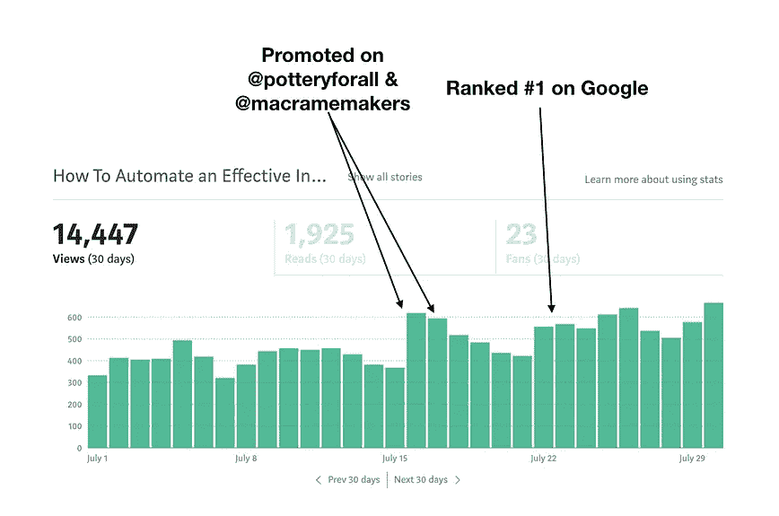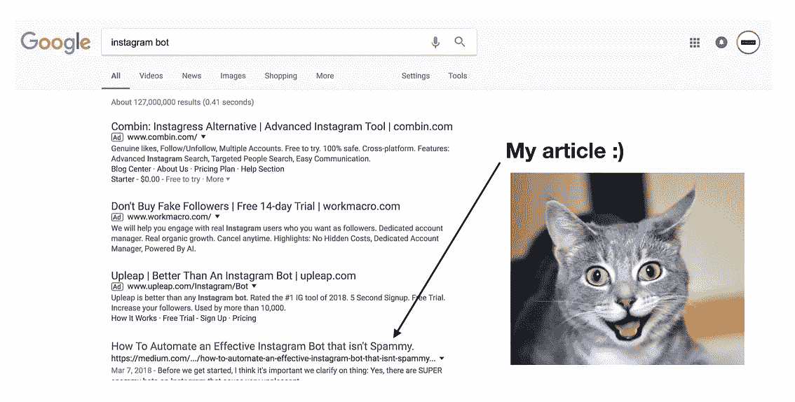

这些是我 7 月份收到的代销商付款:

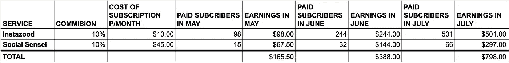

从这一点开始，我不再在任何新的渠道上推广这篇文章，但平均每日浏览量从 7 月初的 400 次(谷歌排名第一之前)增加到 8 月的 700 次左右(谷歌排名第一之后)。

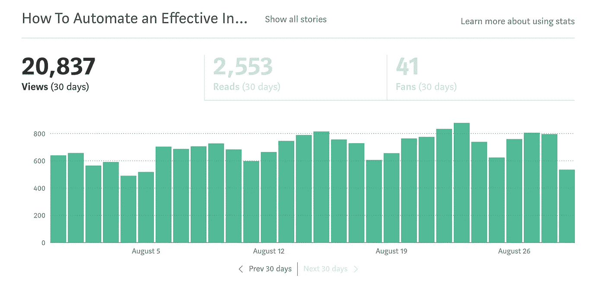

I’m very grateful for Google…

## **7。我编辑这篇文章是为了提供更多的价值，赚更多的钱。**

现在我在谷歌上排名第一(看到了它的强大)，我想确保我的文章保持在首位。

为了做到这一点，我努力从两个方面来改进这篇文章:首先，我让我可爱的妻子罗马尼·波普(Romany Pope)仔细检查并再次编辑，以确保文章尽可能的好(她是一个比我好得多的作家)。第二，我的目标是通过做额外的研究和测试尽可能多的新自动化服务来增加它的价值，以便为不同的用例推荐绝对最好的*(以前，我只推荐 2 个)。*

*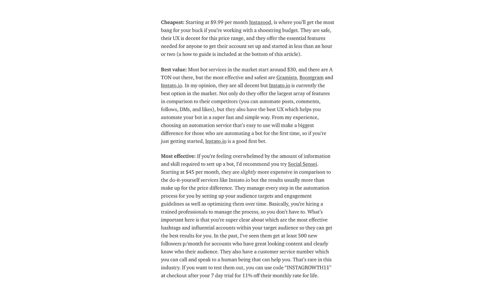*

*I segmented my recommendations in “Cheapest”, “Best Value”, and “Most Effective” vs just a small, general recommendation that I had before I made the edit.*

*通过这样做，我不仅为阅读这篇文章的人提供了更多有用的信息，而且我还增加了另一个收入来源，包括可以给我代销商支付的额外服务。*

## ***8。我谈妥了价格。***

*大约在我编辑这篇文章的同时，我收到了这些服务提供商之一的评论请求。知道我在谷歌上排名第一，并且我为他们的公司创造了很多价值，我决定值得一试，要求更高的佣金。以下是我写的:*

*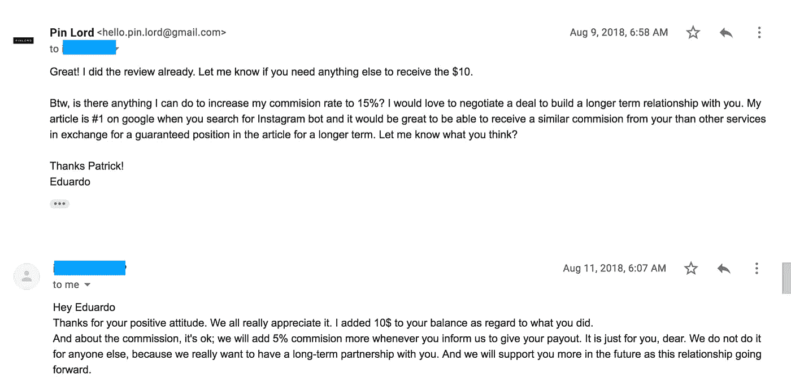*

*Not the best written email but it got the job done (also…it was 7AM). The service I emailed is the best in the business so I knew that a long term inclusion in the article is something I felt comfortable bringing up.*

*看到协商价格是可能的，我联系了其他服务机构，写了一封类似的电子邮件，他们也同意提高我的价格。*

*排名第一，包括额外服务和费率百分比的增加，导致 8 月份收入大幅增加。这是那个月的总数:*

*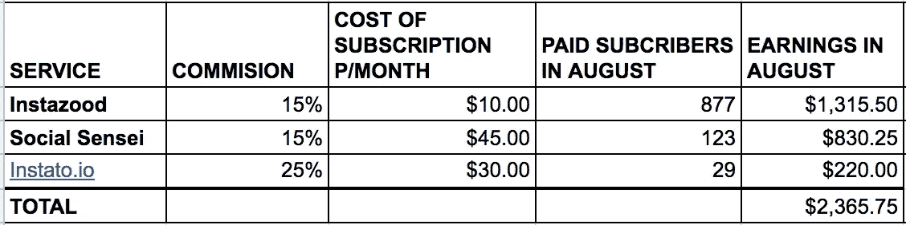*

*My earnings almost tripled in August by including a new service recommendation as well as increasing my affiliate rates.*

*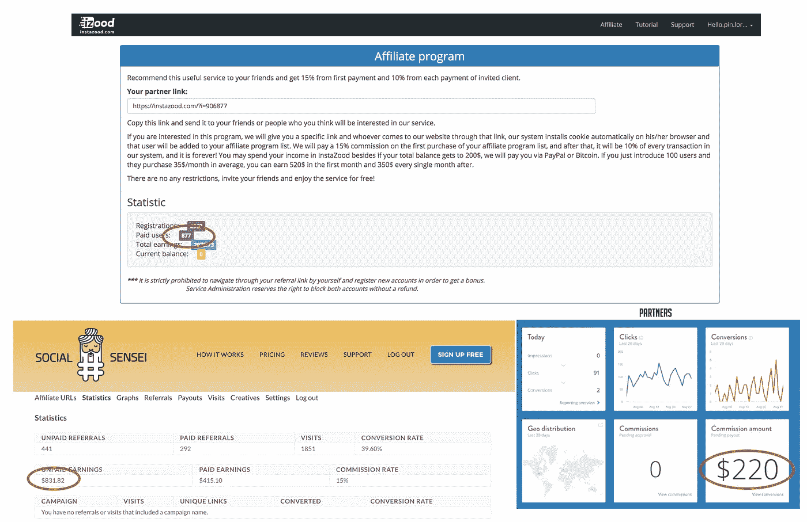*

*这就是我现在如何从一篇中型文章中每月赚取 2000 多美元的原因👍🏽。*

## *建议:*

*虽然很难复制这些结果(我认为在这个话题上星星对我来说是一致的)，但肯定有一些策略你可以实施，这将有助于提高你的文章获得流量和赚钱的机会。这些是我从这次经历中学到的最重要的:*

*   *写一些你有很深知识，而别人没有的东西。如果你写的是一个没有多少人深入了解的主题，你的文章往往会更有价值，因为能够提供关于该主题的有价值信息的人更少。有人能代替你阅读的文章越少，你的文章在谷歌上的排名就越靠前。*
*   ***让你的文章尽可能的详细和可行。**每个人都可以写一篇关于“做 X 的 10 个最佳策略”的一般文章。这就是为什么这些类型的文章通常没有长期价值。运用你独特的知识，给那些想了解这个主题的人尽可能多的信息。越多的人了解并发现你的文章有帮助，他们就越会回头去看它，反过来，越多的人会阅读它！*
*   *向尽可能多的新受众推广。让新的读者阅读你的文章极大地增加了它在谷歌上排名靠前的可能性(因为新的人会发现、阅读并分享它)。要做到这一点，你必须在尽可能多的渠道推广它(不仅仅是在你第一次发布的时候)。如果你没有大型社交媒体账户，写一些很棒的东西并提交给 [The Mission](https://medium.com/u/2961ae4625b1?source=post_page-----b4c1aeb7fdae--------------------------------) ，或者联系那些在 Instagram 或 LinkedIn 上拥有大量粉丝的人，请他们为你推广(如果你想让他们同意，我强烈建议你提供报酬或其他类型的价值来换取他们的服务。).你越有创造力和足智多谋，你就会找到越多的晋升机会。*
*   ***为你的链接使用联盟营销，最好推荐订阅服务。**如果你的文章被很多人阅读，联盟营销是获得被动收入的好方法。如果你能每月从会员链接中获得可靠的经常性收入，那就更好了。这就是为什么订阅服务提供了如此多的价值:如果他们每个月都得到报酬，你也一样。这是一个更可取的从属地位，相比之下，当你卖一次东西得到一小笔佣金，这是很难建立大的收益。*
*   *继续编辑和推广你的文章。从一篇文章中获得良好的收入是一个漫长的过程。如果你有*很棒的*内容，能够从中赚钱就是要有耐心和技巧将它推广给足够多的观众，以便找到喜欢它并分享它的人。如果一个观众不工作，然后继续测试新的观众。从一开始就很难知道谁会喜欢你的文章，谁不会，所以一定要不断编辑你的文章，使它变得更好，并不断推广，以找到观众会欣赏和重视它。*

*相信我，这些策略是有效的。我还在[我的如何制作珐琅别针的指南](https://www.pinlordshop.com/pages/how-to-make-enamel-pins)以及[如何运送别针的指南](https://www.pinlordshop.com/blogs/the-ultimate-guide-to-making-and-selling-enamel-pins/how-to-ship-and-package-enamel-pins)中实现了它们，它们现在都在各自的主题中被列为谷歌上的第一热门话题。*

*有了正确的文章和聪明的推广，你也可以得到类似的结果！*

*顺便说一句，如果你想更深入地了解有助于你在社交媒体上成长的其他策略，请阅读这些关于 Instagram 到底是什么以及如何工作的文章、[Instagram 算法如何工作的文章](https://theeduardomorales.medium.com/what-the-instagram-algorithm-does-how-it-works-how-to-use-it-to-your-advantage-752356122c67)、 [Instagram 利基市场以及它们为什么是成长的关键](/better-marketing/instagram-niches-why-they-are-the-new-key-to-growth-on-instagram-beca2878d55d)、你需要知道的关于 Instagram 标签的所有事情、[如何选择正确的 insta gram 用户名](/better-marketing/how-to-pick-the-best-instagram-username-9af1b49b7ad)、 [Instagram 机器人 2021](/better-marketing/instagram-bots-in-2021-everything-you-need-to-know-b57fb0a3b8e9) [我如何在 Instagram 上赚钱](/the-mission/how-to-make-money-on-instagram-7b13ce4b300d)，[如何建立一个赚钱的 Instagram 转发账户](/swlh/how-to-create-an-instagram-repost-account-that-makes-money-928a404560)，[如何创建有效的 Instagram 故事广告](https://hackernoon.com/how-to-create-an-effective-instagram-story-ad-bf9aef9eb9)，[Instagram 算法如何工作](https://hackernoon.com/the-principles-behind-how-the-instagram-algorithm-works-bec902eca17e)，[如何自动化你的 Instagram 帖子](/the-mission/how-to-schedule-instagram-posts-from-your-computer-7138ba26658f)，[如何创建有效的 insta gram 赞助帖子](/@edmo_nyc/how-to-create-effective-instagram-sponsored-posts-ea948b18f582)，如何[检查你是否被屏蔽](https://hackernoon.com/3-simple-steps-to-check-if-youre-shadowbanned-what-shadowbanning-is-what-causes-it-and-how-to-175723df938b)，[为什么你的 insta](/the-mission/why-your-instagram-account-isnt-growing-and-why-it-s-not-because-of-the-latest-instagram-523f6137014b) [如何提高你的 Instagram 参与率](/swlh/how-to-measure-influencer-marketing-roi-on-instagram-321b9b397ef4)，以及[如何衡量一个影响者的价值](https://hackernoon.com/how-to-measure-what-an-instagram-influencer-is-worth-cb488f605ffe)，你需要了解的关于[抖音机器人的一切](/better-marketing/tiktok-bots-the-best-bot-providers-ca6ebe9a0134)，[如何在 Instagram 上找到最有价值的影响者](https://hackernoon.com/how-to-search-for-and-find-the-most-valuable-influencers-on-instagram-df8ddd5b2243)，[如何接触影响者](https://hackernoon.com/how-to-reach-out-to-instagram-influencers-to-maximize-response-rates-16f429008f62)，以及[如何衡量你的影响者营销投资回报率](/swlh/how-to-measure-influencer-marketing-roi-on-instagram-321b9b397ef4)。*

*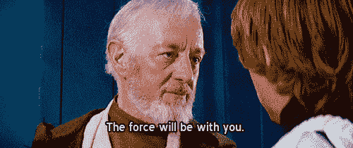*

## *非常感谢您花时间阅读我的文章！如果你喜欢它，你可以通过注册我的 [Instagram 小企业班](https://theinstaclass.co/)来支持我，分享这篇文章并给它一堆掌声。你也可以[在 Instagram](https://www.instagram.com/theeduardomorales/) 上关注我，每当我发布❤的新作品，你就可以获得更新*