# 如何在智能合约中不毁掉几百万(Pt。1)

> 原文：<https://medium.com/hackernoon/how-to-not-destroy-millions-in-smart-contracts-pt-1-bdefac3656b7>

# 介绍

随着基于区块链的加密货币的兴起，智能合约变得越来越流行。


加密初创公司正在利用智能合同来创建可以在“*”无信任环境中执行的智能协议。智能合同去掉了中间人，并根据制定的规则自动执行合同条款。虽然智能合约有很多承诺，但我们已经看到了一段令人担忧的智能合约被黑客攻击的历史，其中价值数亿美元的加密货币已经丢失或被盗。*

*我对加密货币和基于区块链的[技术](https://hackernoon.com/tagged/technology)越来越感兴趣，这促使我研究和调查这些黑客攻击，以更好地了解 ***它们是如何被黑客攻击的。****

***本文是 3 部分系列**的第 1 部分，我们将深入探讨最臭名昭著的黑客攻击。 ***我们将研究天才的笔触，或者细微的错误是如何在密码世界中引起地震的。****

> *旁白:本文基于 [Leonid Beder](https://www.linkedin.com/in/leonidb/) 在[区块链学院的精彩演讲——如何不摧毁数百万人。](https://www.youtube.com/watch?v=xv7JNIBYR7A)我强烈推荐观看这个演讲，以及 Youtube 频道上的所有其他材料。*

# *智能合同*

> *智能合同是一组以数字形式规定的承诺，包括各方履行这些承诺的协议— Nick Szabo，1996*

*让我们逐项分解这个定义。*

***合同***

*普通合同的一个例子是销售合同。*

*卖方 ***承诺*** 为买方交货。*

*买方 ***承诺*** 支付想要的价格。*

***数字形式***

*数字形式意味着合同必须用机器可读的代码编程。我们希望契约本质上是确定性的，因此每次都基于相同的输入提供相同的结果。*

***协议***

*例如，假设双方同意用比特币支付购买的商品。显而易见，比特币协议将是首选协议。*

***智能***

*这听起来很酷。*

***智能合约编程语言的流行实现***

***以太坊***

*在其著名的智能契约框架区块链上实现了一种接近图灵完备的语言。我们说近似图灵完全 b/c 为了完全图灵完全，我们需要无限的计算能力。*

***比特币***

*实现一种图灵不完全脚本语言，允许创建有限的智能合同，例如:*

*   *多重签名账户*
*   *支付渠道*
*   *escrows*
*   *时间锁*
*   *原子跨链交易*
*   *神谕*

## *以身作则*

*Solidity 是一种编写智能合约的 OOP 语言(大部分？)上以太坊。我们将从一个名为 **Greeter 的智能契约的简单示例开始，它将:***

*   *用问候信息初始化(例如，“你好，世界！”)*
*   *提供读取/查询问候消息的方法。*
*   *提供编写/修改问候语的方法。*
*   *对于这些例子，我们将使用官方在线混音 IDE @[https://remix.ethereum.org](https://remix.ethereum.org)*

*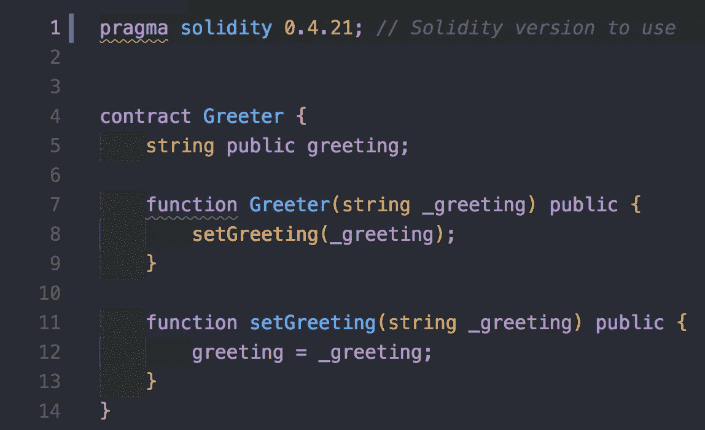*

*目前最好的做法是明确指定我们正在使用的 solidity 的版本，因为我们不知道在未来的版本中会引入哪些 bug。*

*Solidity 的语法与 JS 相似。我们正在定义一个名为 *Greeter 的契约。*另外，我们有一个名为 greeting 的 string 类型的公共状态变量和两个方法(constructor 和 setGreeting)。*

## ***基础:执行模型***

*   *每个智能合约在部署到网络之前都需要编译成字节码。部署意味着存储在以太坊网络上。这可以是生产网络、测试网络或专用网络。*
*   *以太坊中的每个事务或消息调用都由每个以太坊节点上的**以太坊虚拟机(EVM)执行。(miner 或者只是一个完整的节点)。***
*   *由于**每个智能契约**都在 EVM 上运行，并且**每个单个操作**都由网络中的**每个节点**同时执行，因此应该有一种机制**来限制每个契约使用的资源**。以太坊限制资源的机制是气体。*
*   *每一项操作都有一个确定的(但有时难以预测的)成本，以天然气为单位。很难确定 gas 成本，因为条件控制流可以改变在运行时执行哪些操作。想象一下下面的程序*

```
*if (condition is true) { // do something super simple which is very cheap in gas terms} else {// do something really complicated which will be very expensive!}*
```

*   *交易消耗的每个气体单位必须基于由交易发送者设定的气体/乙醚价格以乙醚支付。每个发送者决定他愿意支付多少。这个想法对你来说越重要或越紧急，你就越愿意花钱。*
*   *交易还有一个**气体限制参数，它是交易可以消耗多少气体的上限***
*   *为什么需要气体极限参数？我们有一个上限 b/c，我们并不总是清楚一个事务的执行会花费多少，我们想限制我们在它上面花费的开销！*

*让我们将合同上传到 Remix IDE，创建并部署它。*

*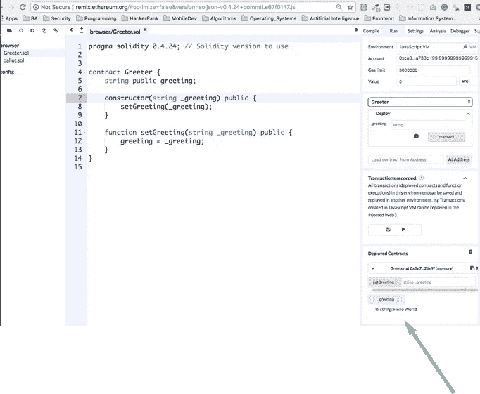*

*混合可以对抗主网和测试网。对抗以太坊模拟真的很方便。当使用模拟时，我们可以假装拥有数百万个以太，而不是等待以太坊交易被处理，这使得开发速度大大加快。通过 Remix 运行智能合约是完全免费的，所以我建议你在家试一试:)*

*一旦部署了契约，我们就会在框中的已部署契约部分看到它(参见箭头！).请注意，我们可以轻松地更改构造函数参数并重新部署到网络。*

*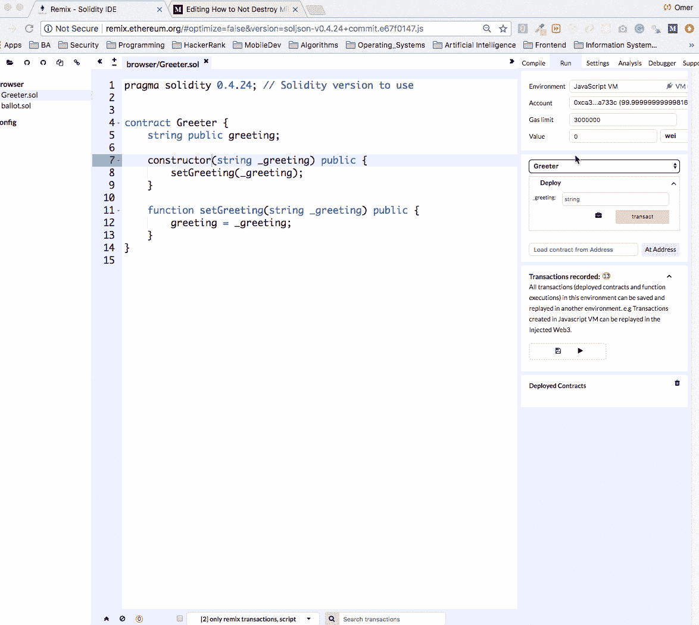*

## ***基础:特殊变量和函数***

*有一些特殊的变量和函数**总是存在于全局名称空间中。这些是我们今天要讨论的***

*   ****msg.sender*** (以太坊地址):消息的发送方(当前通话)。Thsi 属于事务的原始调用者。这可以是用户帐户，也可以是另一个智能合同的地址。以太坊安全模型保证 msg.sender 不能被伪造。*
*   ****msg.value*** (单位):随消息发送的魏号。卫是乙醚的最小单位(认为美分是美元。)因此，这指定了我们通过购买、交易等功能发送了多少以太...*

## *基础:函数和状态变量的可见性*

*在固体中，有四种类型的可见性:*

*对于功能:*

*   ***外部**:可以从其他账户/合同外部调用。需要注意的是，我们不能从脚本中调用这段代码。我们需要创建一个额外的事务来从外部调用它。这对于需要公开访问的方法来说非常好，但是您希望避免在自己的代码中使用它们。*
*   ***公共**(默认) **:** 大家都可以调用。*
*   ***内部**:只能从我们的智能合约或者从我们的智能合约继承的智能合约内部调用。*
*   ***private:** 只能在内部调用，并且只能从契约本身调用。*

*对于状态变量:*

*   ***公共**:所有人都可以访问。Solidity 自动为公共变量生成一个 getter。*
*   ***内部**(默认):只能在内部访问，并且只能从合同本身访问。*
*   ***私有**:只能在内部访问，并且只能从合同本身访问。*

## *基础:函数修饰符*

*修饰符可以用来修改函数的行为。这让我们可以在函数调用之前、之后甚至前后添加功能。(例如日志记录)*

*修饰符非常类似于其他编程语言中的 before/after/around/hooks。*

*例如，让我们将我们的迎宾智能合同扩展到:*

*   *拥有一个所有者(在我们的例子中，是智能契约的部署者)*
*   *确保只有所有者可以进一步修改问候语*

*在接下来的例子中以及在野外，我们会经常看到这种模式。此外，让我们添加一个条件，即只有所有者可以更改问候语。*

*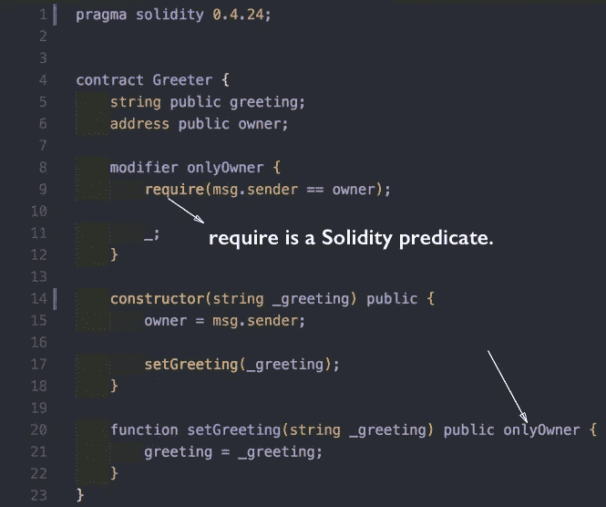*

> *需要注意的是，require 在 Solidity 中是谓语。如果它的评估返回 false，那么将抛出一个异常，在 contract 中完成的所有更改都将完全回滚。*

*下划线相当于屈服。这基本上意味着在这个地方执行函数的剩余代码。*

## *基础:回退功能*

*一个智能契约只能有一个未命名的函数。*

*当调用约定并且没有其他函数匹配给定的函数标识符时，调用该函数。回退功能的一个常见用途是当乙醚被转移到合同时。这将触发回退功能的调用。因此，为了设置一个能够接收乙醚的账户，最起码(在大多数情况下)要设置这个功能。*

## *基础:应付款修改量*

*为了接收以太网，**每个功能都必须标记为应付**。这是为了保护我们不意外地将以太发送到一个不期望它的契约。*

*   *当发送 Ether 作为函数调用的一部分时，该函数必须标记为 **payable。***
*   *当直接向合同发送 Ether 时，其后备功能必须标记为应付。*

*如果不存在该功能，合同**将无法通过常规交易**接收乙醚。*

## *事件示例*

*这是一种在以太坊进行日志记录的奇特方式。*

> *旁白:我们有一个名为*的函数来记录回报和事件。这对于拥有一个读取日志并管理所有捐赠的离链客户端的情况可能很有用。**

*我们有一个函数叫做*捐赠*是**应付**(我们添加了应付修饰符)。我们还有一个叫*巨魔*的函数是**不应付款**，所以这种情况下发送以太应该会失败(应付款修饰符缺失)。*

*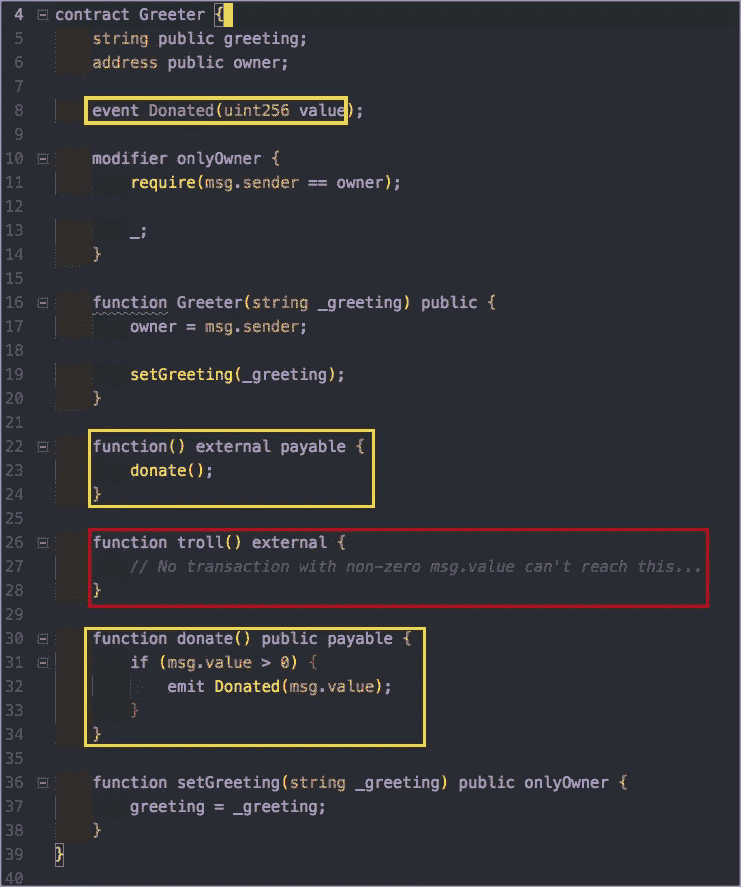*

*让我们将这个契约部署到 Remix，这样我们就可以验证通过这些方法汇款的结果。*

*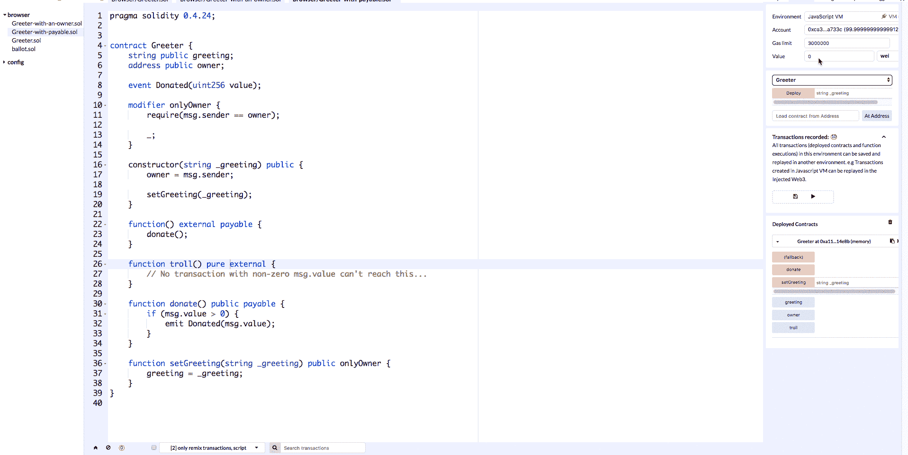*

*在上面的 gif 中我们可以看到，调用*捐赠*方法导致一个交易，其中价值为 5 魏被转移，而当我们调用*巨魔*方法时，没有钱被转移。*

## *让我们摧毁一些以太*

***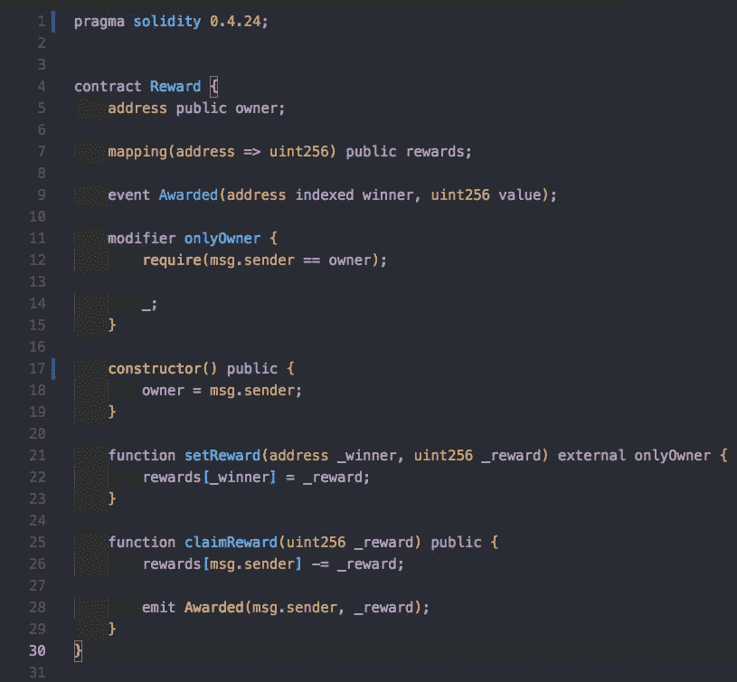*

*作为回报，我们可以看到在*地址和一个 uint 之间有一个映射。*我们在这里使用了一个所有者的概念，这样我们的所有者可以调用 *setReward* 方法，决定一个特定的地址应该获得一定数量的魔法令牌。此外，我们有 *claimReward* 方法，每个人都可以公开访问。这个方法给你属于你的地址的奖励，然后为奖励发出一个事件。*

*有人能指出这有什么问题吗？*

*注意，当我们声明*奖励*映射时，它是从*地址到无符号整数的映射。**

*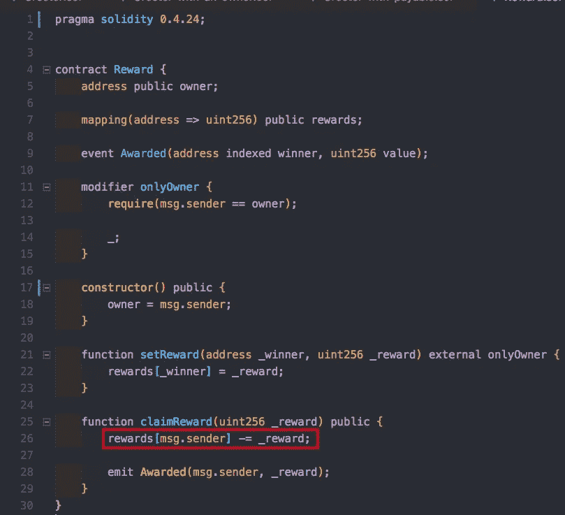*

*我们在这里做减法，却没有检查必要的资金是否可用！因此，任何情况下，当我们的奖励达到负值时，都会导致下溢。*

> *旁白:一个 [n 下溢](https://math.stackexchange.com/questions/534670/arithmetic-overflow-and-underflowing)，将会把一个负值变成一个非常大的正值。查看链接，获得关于下溢如何工作的进一步解释。*

*考虑下面的例子。提出 500 个单位的奖励要求。现在，我们的黑客将尝试并要求 1000 美元。理论上，这应该行不通，因为我们只剩下 500 块了。运行此交易*后，索赔者*将拥有无限数量的硬币！*

**

# *错误:溢出/下溢*

*   *Solidity 最多可以处理 256 位数*
*   *溢出是指一个数的增量超过了它的最大值。所以 0x fffffffffffffffffffffffffffffffff 加 1 得到 0。*
*   ***下溢**是相反的情况，当数字无符号时，递减将下溢数字。反之亦然，从 0x00000000000000000000 中减去 1 得到 0xFFFFFFFFFFFFFFFFFFFFF。*

***缓解#1:正确性测试***

*   *在执行任何操作之前测试正确性。对此的一个快速解决方法是执行一个检查来验证索赔是否小于当前帐户余额。*

*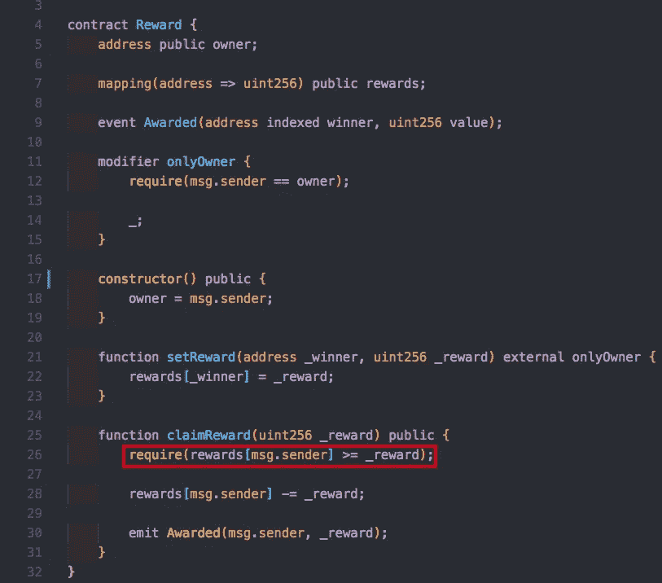*

***缓解#2:安全数学***

*   *总是使用(事实上的)标准安全数学库。*
*   *在 OpenZeppelin 的 Github repo 中找到好的、相对稳定的、聪明的合约。*
*   *该库所做的是以一种安全的方式实现数学运算，这样，如果发生溢出，它将回滚事务。Assert 与 revert 非常相似，它回滚错误的事务。*
*   *在下面的例子中，我们已经导入了 SafeMath，并将其注入到 *unit256* 中使用，因此库将恢复任何导致第 30 行下溢的事务。*

*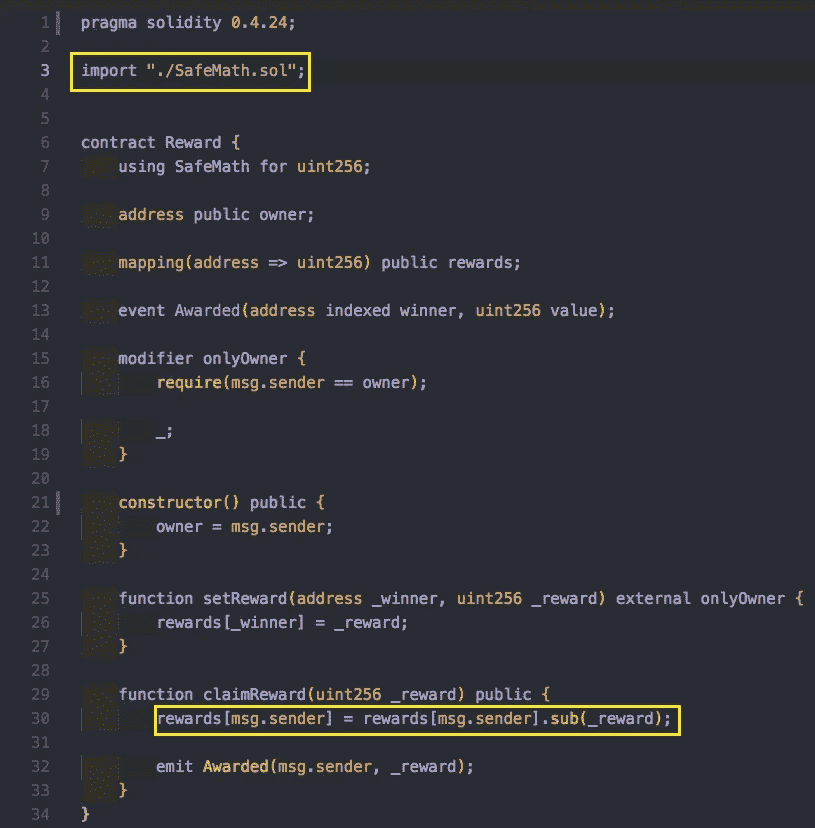*

## *设置功能可见性*

*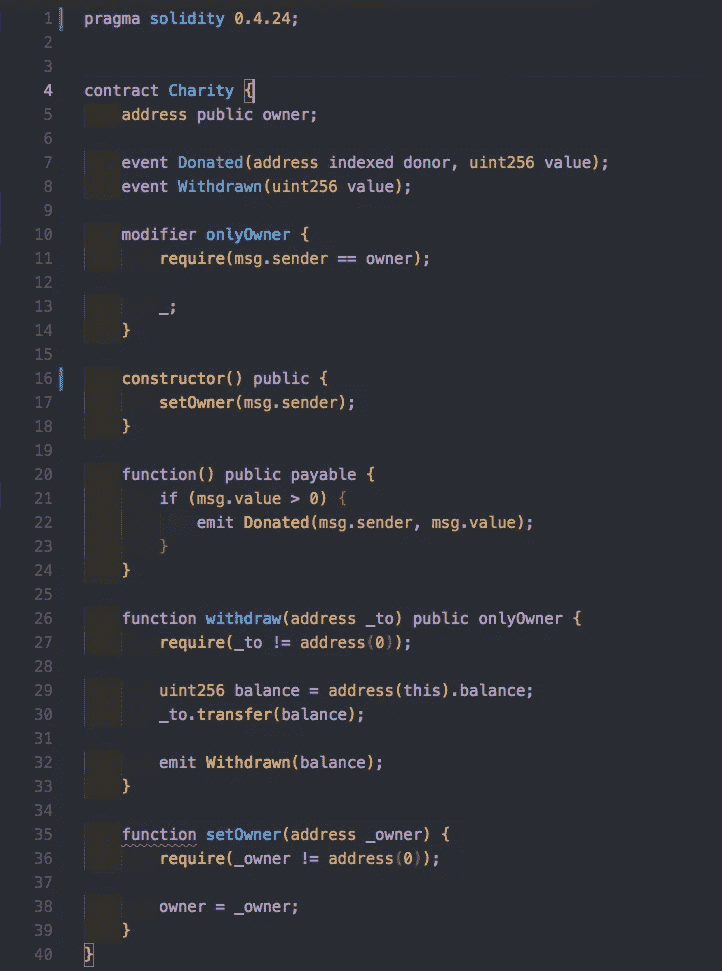*

*你能发现慈善合同中的一个错误吗？我们来分解一下。我们有一个可支付的后备功能和一个提取功能，所有者可以提取他的资金。你可以想象，在某个时候，所有者可能想要提取他的资金，这样他就可以用它们做一些事情。*

*现在，让我们来看看*设置者*的方法。它使用了所有者范式。它没有隐私。**在 Solidity 中函数默认是公共的！**任何人都可以改变所有者，从而将资金转移到自己手中。*

***黑客场景:***

*爱丽丝为这个例子存了 1000 魏。鲍勃试图退出，但失败了，因为他不是慈善机构的所有者。现在，Bob 调用 setOwner，将所有者改为他自己。鲍勃拿走了所有的资金。这一切都是因为有人忘了定义可见性！*

***缓解#3:始终定义可见性！***

*   *始终定义可见性*
*   *尽可能限制函数的可见性*

**

# *结论*

*这是 Solidity 语言的初级读本，我们已经研究了在智能契约开发过程中可能犯的一些简单而危险的错误。*

*本系列的下一篇文章将深入探讨臭名昭著的、天才的和细致入微的黑客攻击，这些攻击在过去几年中已经耗费了价值数亿美元的密码。*

*如果你正在寻找区块链世界的资源，我强烈推荐(再次)查看 [Kin 生态系统 Youtube 频道](https://www.youtube.com/channel/UCZ0z9fRKhW-GEjQs-_Jxfyg)，因为它有一个高质量、技术讨论和讲座的精彩清单。非常感谢 [Leonid Beder](https://www.linkedin.com/in/leonidb/) 建立这个讲座并在区块链学院教授它！*

## *如果这篇文章有帮助，请订阅并点击鼓掌👏按钮以示支持！⬇⬇*

*你可以在 [Instagram](https://www.instagram.com/omeragoldberg/) 、 [Linkedin](https://www.linkedin.com/in/omer-goldberg-680b40100/) 和 [Medium](/@omergoldberg) 上关注我。*