# 如何在智能合约中不毁掉数百万美元(第二部分)

> 原文：<https://medium.com/hackernoon/how-to-not-destroy-millions-in-smart-contracts-pt-2-85c4d8edd0cf>

# 介绍

[在本系列的第 1 部分](https://hackernoon.com/how-to-not-destroy-millions-in-smart-contracts-pt-1-bdefac3656b7)，我们学习了 Solidity 编程语言、智能合约初级读本，并了解了一些被利用来从智能合约中榨干资金的基本攻击和漏洞。在本文中，我们将通过研究现实世界中的黑客并对其进行遍历来进一步了解这些知识。

# 示例#1:奇偶校验“破解”#1

*   TL；DR —在[奇偶校验 Multisig](https://twitter.com/paritytech?lang=en) 钱包版本 1.5+上发现了一个漏洞，该漏洞允许攻击者窃取 **15 万以太(当时为 3000 万美元，今天为 1.05 亿美元以太/700 美元)。**
*   加文·伍德，最初的 Solidity 开发者之一，是奇偶校验的 CTO。我们要检查的代码实际上是他写的。
*   奇偶校验提供给用户的一个功能是 multisig。Multisig 是一个拥有 M 个所有者的钱包，它需要 M 个签名(确认)中的 N 个来使用这些资金。基本上，奇偶校验提供了开箱即用的“托管人”。
*   恶意黑客能够锁定特定的 multisig 钱包，窃取上述金额。如果不是一个白人黑客组织，攻击者可能会窃取更多。白人黑客利用这一漏洞抽干了他们能找到的所有钱包，这样恶意黑客就无法获得更多资金。几周后，白人黑客归还了他们抽走的所有资金。按今天的价格计算，白人黑客节省了大约 2 . 64 亿美元。

**那么这里发生了什么？**

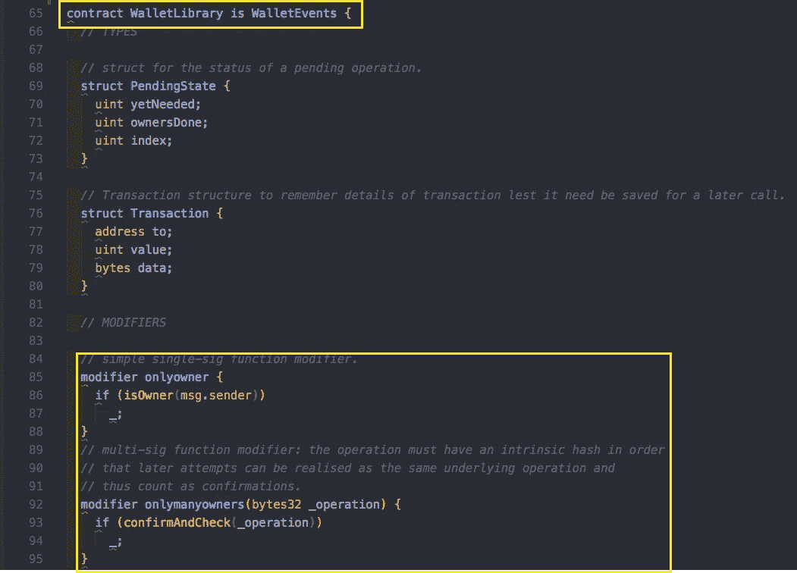

奇偶校验有一个图书馆叫做 WalletLibrary。它被部署到以太坊网络，并由 multisig wallets 智能合约重用，这样人们就不会花太多的时间重新部署图书馆。这个钱包库有很好的修饰符，只有*个所有者*和*个所有者。*需要注意的是，所有这些修饰符都使用状态变量来查看谁是所有者、有多少确认等等。看看下面的两个片段。

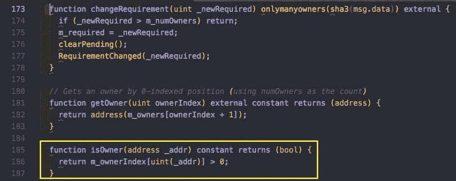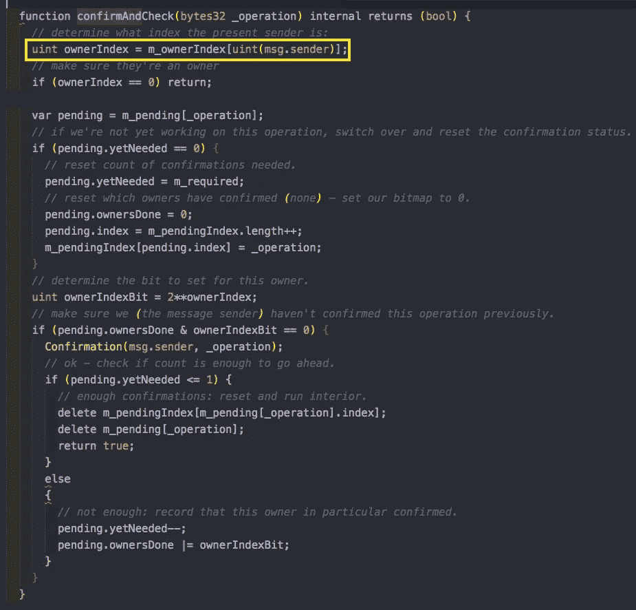

然后我们有了这个有趣而可疑的函数，名为 *initWallet* ，用于在构造函数中初始化钱包。该函数的参数是一个所需的*所有者数组，代表确认交易所需的所有者数量。这里有什么引人注目的？该函数没有显式声明的可见性！*

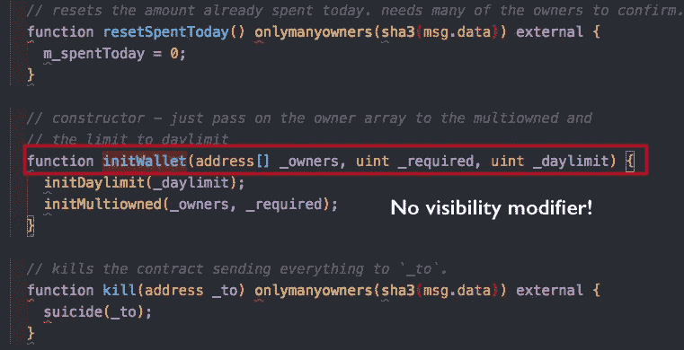

等等，也许 initDayLimit 或 initMultiOwned 有某种类型的保护或修改？

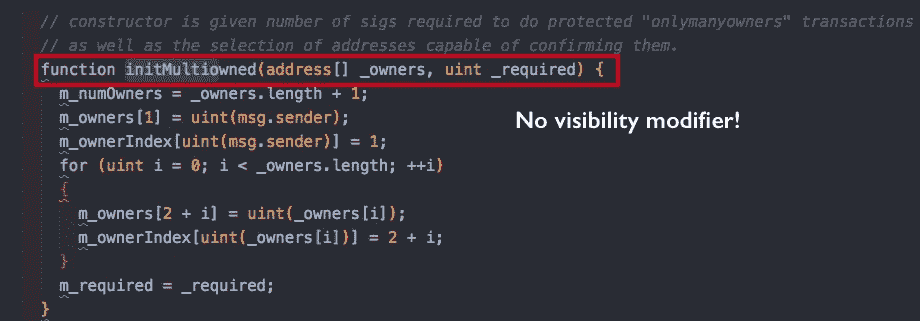

***不，它们也没有定义可见性！所以基本上 initWallet 谁都可以调用！！！！***

但是，等等……在这之前，我们已经检查了 WalletLibrary。这个库被钱包契约使用，它实际上不是它的一部分。所以如果钱包合同没问题，这就不是问题了？我们来看看钱包合同。

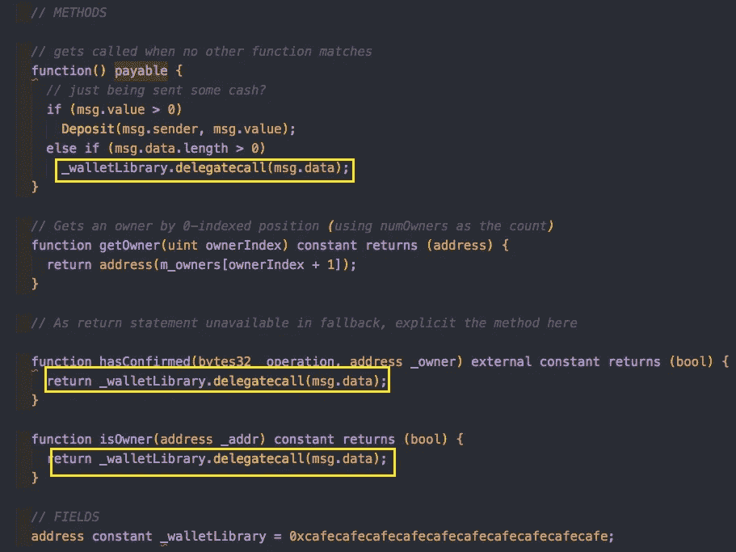

你可以看到在钱包中我们有一个钱包库状态变量，我们有那些*委托调用。*

> *此外:* delegateCalls *接受编码的消息数据、编码的函数名和编码的参数。*

这正是所发生的事情。

关注带有应付款修饰符的 *fallback 函数，我们看到它是公共的。**我们可以注意到上面的 3 个委托调用都来自公共方法！**这很有意义，因为我们希望任何人都能够调用它。但是因为其余的函数也是公共的，所以攻击者可以使用代表 initWallet 函数名、数据和预期参数的编码数据来调用 delegateCall，并将自己设置为所有者！这正是所发生的事情。攻击者利用了这一点，简单地将契约的 **m_owners** 状态变量更改为一个只包含其地址的列表，并且只需要**一次**确认就可以执行任何事务。*

## 减轻

*   复杂性是一个弱点。**保持简单愚蠢。过度优化和复杂是所有罪恶的根源！**
*   总是明确定义可见性。
*   不要将构造器逻辑提取到库契约中。避免过早优化！
*   不要使用 delegateCall 作为一种无所不包的转发机制。

## 缓解:奇偶校验开发人员的修复:

奇偶校验开发者做了两件事。

1.  他们声明 initDayLimit 和 initMultiowned 是内部的。
2.  他们添加了一个名为*only _ un initialized*的修饰符，表示如果我已经有了所有者，那么就恢复。他们将这个修饰符添加到了 initWallet，，所以本质上它不能被调用两次。看起来不错…但是有一个巨大的 bug！我们稍后再讨论这个问题！

[这里有一个链接](https://github.com/paritytech/parity-ethereum/commit/b640df8fbb964da7538eef268dffc125b081a82f)指向为修复这个漏洞而部署的补丁。评论跟帖很有意思！

# 例 2: Rubixi

*   Rubixi 是一份合同，其执行让人联想到据称的金字塔计划。(虽然不是传销！)
*   投资者可以存入资金。
*   **所有者**可以收集所有的资金。
*   如果你带更多的人加入这个智能合同，你会得到他们的部分费用。

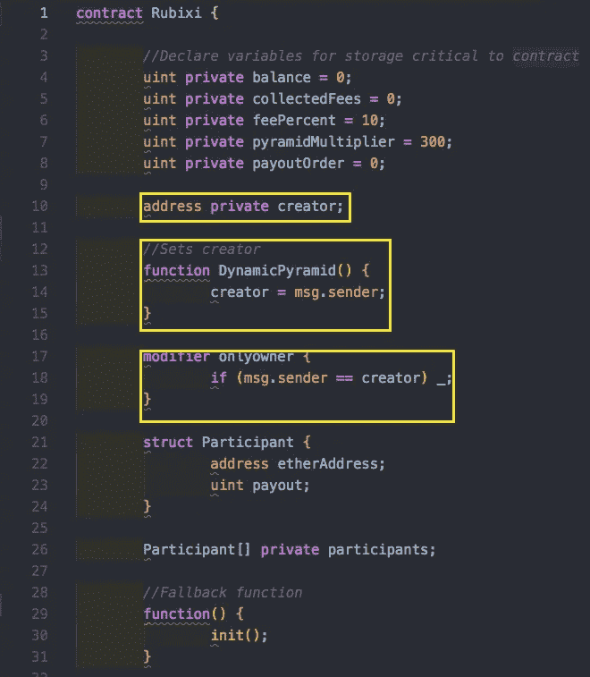

有一个名为 creator 的成员在构造函数中初始化。我们有 *onlyOwner* 修饰符，只有当你是正确的所有者时，它才会执行代码。此外，我们有办法根据这个修改量来收费。

## 那么这里出了什么问题呢？！

最初的合同名称和建造商是 *DynamicPyramid。*

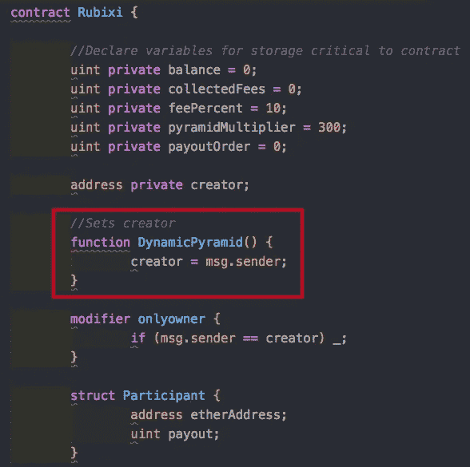

创造者们改变了主意，认为也许带有“金字塔”这个词的东西市场前景不好。他们把名字改成了 Rubixi，忘了改构造函数方法的名字；)因为 *DynamicPyramid* 函数是公共的，任何人都可以调用它，并设置自己是合同创建者！有一份合同损失了 100 吨乙醚，另一份合同损失了约 0.1 吨乙醚。

## 减轻

*   嗯，首先，尽量不要误命名函数…
*   保持警惕！！骗子越来越厉害了。
*   从 **0.4.22 开始，**你现在可以使用安全的**构造函数**方法来代替。这意味着您可以改为执行以下操作。

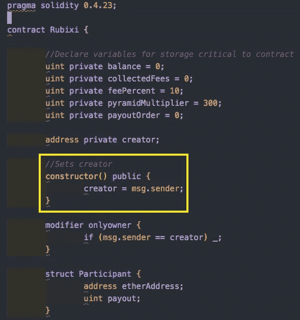

# 示例#3:银行，智能合同(重入)

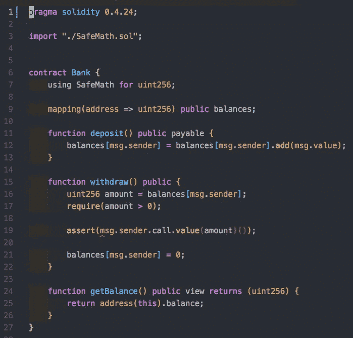

我们有一个叫做银行的智能合约。每个用户都有余额，用户可以存入资金，这将立即用多少资金可用来更新状态变量。我们可以使用*取款*功能取出资金，然后这些资金被发送给我们。

## 有什么问题？

首先，需要注意的是*断言*是一个**阻塞同步调用。**因此，在 assert 语句完成之前，余额不会更新。

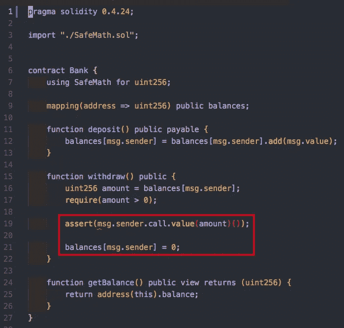

如果存款实体是一个用户，这很好，但是如果它是一个智能契约，会发生什么呢？如果存放资金的实体**是智能合同而不是用户**，那么**将这些资金发送到智能合同将触发应付回退功能**(如果它存在或失败)。该回退功能将在原始交易完成之前返回银行并再次取款。银行合同通过更新余额来防止这种情况，但这只是在潜在攻击者可以提取两次之后。这种类型的攻击(bug？)叫做**再入**。

让我们来看一个名为 *Robber* 的恶意智能合约的例子，它将通过一个可重入错误来利用 *Bank* 智能合约。

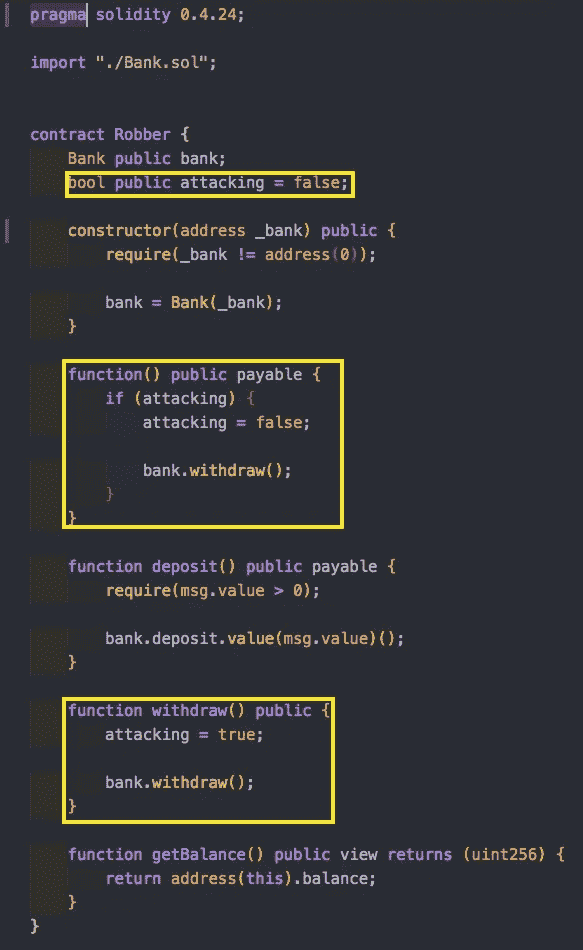

每份合同我们只能做两次。但是，如果它的工作，我们可以创建和部署许多合同，并重复这样做，直到我们耗尽银行！

**缓解#1:检查-效果-交互模式**

*   **执行检查**(谁调用了函数，参数是否在范围内，他们是否发送了足够的以太，这个人是否有令牌，等等。).
*   如果所有检查都通过，**应对当前合同的状态变量产生影响**。
*   **最后，与其他账户/合同进行任何互动。为了让例子更清楚，这就是我们的合同失败的地方。它在完成**影响**所有状态变量之前，与*强盗*智能契约进行了交互。**

通过利用这种模式，我们可以确保即使有一个**重入**问题，检测**也会失败。因此，按照这种模式，对我们的*银行契约*的修复将首先影响状态变量——在本例中是余额，然后调用智能契约/用户:**

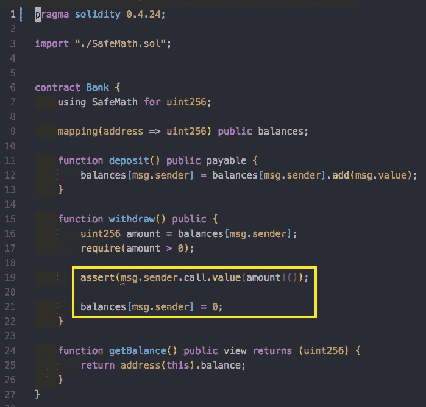

## 缓解#2:避免 call.value()()

在以太坊中，有 3 种方式可以与其他智能合约进行隐式交互。当发送以太网时，我们应该意识到它们的使用之间的相对权衡:

1.  **address.call.value():** 将发送所提供的以太和触发代码执行给定**所有可用气体。因此，在银行/劫匪的例子中，**如果用户/智能合同发送了足够的 gas，他可以完成执行重入。
2.  **address.send():** 将发送提供的以太网并触发代码执行，给定**2300 燃气的有限津贴。**这是相似的，但天然气是有上限的，基本上足以一直获得资金。任何更复杂的事情都会因一个 ***出气异常*** 而失败。
3.  **address.transfer():** 相当于 **require(address.send())。如果发送失败，它会自动恢复。**

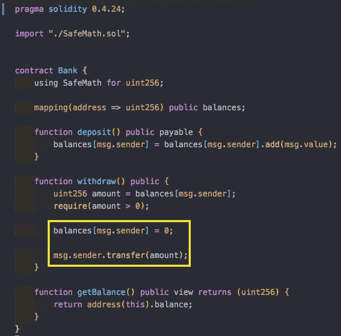

# 例 4:“道”

*   “DAO”是一个特定 DAO(去中心化自治组织)的名称，由德国 start Slock.it 背后的团队构思和编程，该公司建造“智能锁”，让人们在 Airbnb 的去中心化版本中共享他们的东西(汽车、船、公寓)。
*   它将作为[分散风险投资基金](https://www.coindesk.com/ethereum-classic-explained-blockchain/)资助 dapp(分散应用),参与者可以投票决定哪些 dapp 获得资助。
*   它于 2016 年 4 月 30 日推出，资金窗口为 28 天。
*   这是历史上最大的众筹，从 11，000 多名热情的成员那里筹集了超过 150，000，000 美元(按照今天的价格是几十亿美元)。
*   2016 年 6 月 18 日，攻击者开始使用相对复杂的重入攻击来耗尽“道”。
*   攻击者已经设法消耗了超过 3，600，000 乙醚(当时为 72，000，000 美元；今天达到惊人的 25.2 亿美元瑞士法郎/美元 700 元)
*   以太坊社区是如何回应的？

社区的反应是分裂成两个，又名 ***硬分叉*** ！那些相信黑客是合法的(**代码就是法律)**留在了网络上，被称为**以太坊经典。分叉者形成了一个新的网络，在那里他们恢复了所有丢失的钱，并被称为(普通的)以太坊。**

# 例子 5:蜜罐

这里我们有一个资产智能合同。这是一个演示概念的玩具例子，请耐心听我说；)本来资产合同的创建者就是这个资产的所有者。任何人都可以向此合同发送资金。如果有人出价高于该智能合约中的资金金额，那么您将成为该资产的所有者，并获得该资产的所有资金。

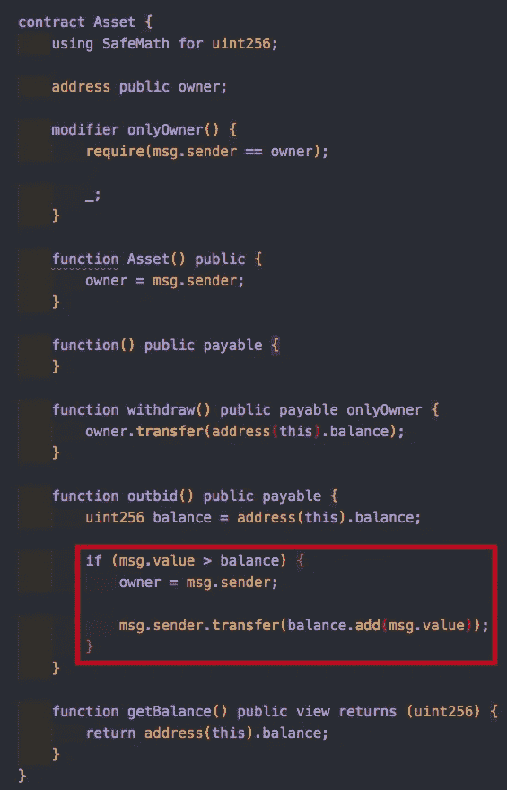

有哪些情况下 *if 语句可以成立*？

这永远不会是真的！这是因为在到达该代码之前，余额已用值**更新。这种类型的合同有两个版本，其中第一个消耗 20 以太，第二个消耗 5 以太，从出价的人**

# “替代”乙醚转移

到目前为止，我们已经研究了转移以太的显式方法。让我们看看一些不太为人所知/受欢迎的转会选择。

除了发送以太网的常规方式(如呼叫、发送/转移)，还有两种方式**绕过回退功能。**

*   **自毁**:从[区块链](https://hackernoon.com/tagged/blockchain)中删除代码的唯一可能是当该地址的一个契约执行**自毁**操作时(以前称为**自杀)。这是实现自毁调用以从网络中移除不再有用的合同的动机。**自毁程序接收一个地址参数，该参数指定将被销毁的合同的资金转移到哪里。
*   如果接收地址是一个**合同，**它的回退功能**不会被执行。这是一个奇怪的边角案例/ [设计](https://hackernoon.com/tagged/design)在坚固性上的选择。**
*   作为一名矿工，将目标地址设置为 coinbase 地址，以便获得区块挖掘奖励。

让我们看一个例子。每次有人向**genous attack**契约发送资金时，我们都会自毁并将资金发送到**genous attack**构造函数中确定的地址。

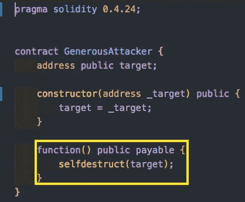

因此，每次用户向该合同转账时，存储在该合同中的值都会被转移到预先确定的目标，而无需显式转移。当心！如果你不完全了解这门语言，你可以通读它，并认为它是无辜的！

# 缓解:小心假设

*   永远不要用合约的余额作为警戒
*   一般来说，要注意语言/框架特定的特性和更新。

1.  小心编译器优化和错误，并进行相应的测试。
2.  当心编译器特定的错误，并且总是使用严格的编译器版本。
3.  小心潜在矿工的干预(例如，抢跑，链重组等)。

# 示例#6:奇偶校验“破解”#2

## TL；博士:

有人打开了平价钱包的 Github 问题，并说“嘿，我不小心杀了它”。实际上，他找到了删除智能合同的方法。突然间，他们的许多钱包都在使用一个可以被删除并不复存在的库！

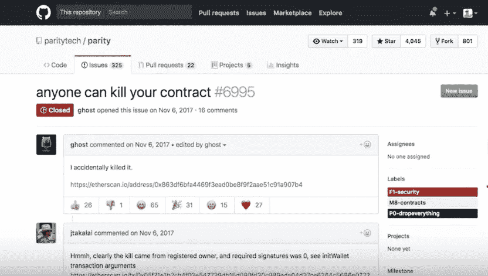

*   大约 513，000 ETH 被锁定在受影响的合同中。
*   没有资金被“盗”；只是因为一场意外而无法触及。
*   有一些关于恢复损失资金的方法的建议，甚至是新的治理模式，但这不太可能很快发生。

## 这里发生了什么？

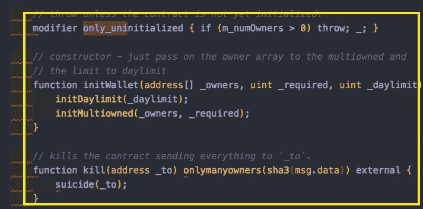

如果你还记得，我们有这个唯一的未具体化修饰符。你可以看到这个库使用了许多状态变量。但是这些状态变量在哪里声明和初始化呢？

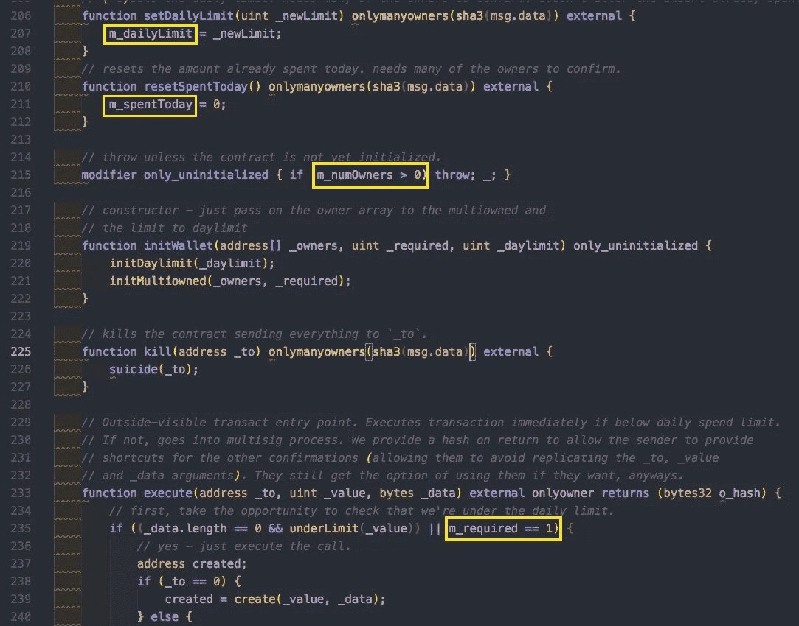

我们搜索了所有用于创建奇偶钱包的契约，发现这些状态变量是在**钱包契约中定义的。**

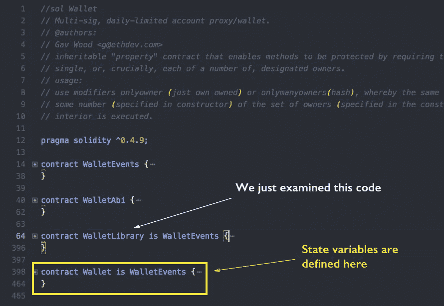

**WalletLibrary** 契约包含状态变量，它期望这些变量被调用契约自身的状态**遮蔽**。

一旦部署，WalletLibrary 契约只是未初始化，所以 **m_numOwners** 是 0。

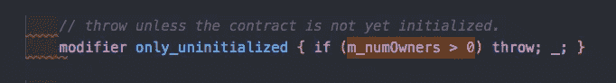

*   如果 WalletLibrary 没有在 **Wallet 契约的上下文中执行，m_numOwners 为 0，**允许任何人调用这个修饰符保护的方法，其中一个是 **initWallet** 。

## 这是如何被利用的？

某开发者调用 ***initWallet*** 并将自己设置为唯一拥有者，然后通过调用 ***kill*** 函数进行杀死。发现这个 bug 的开发者有一个 Github 句柄 **devops199** 然后发了这个

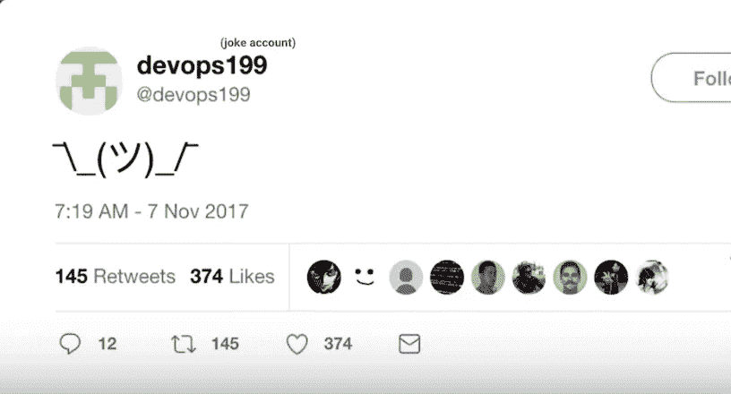

# 例 7:拍卖合同

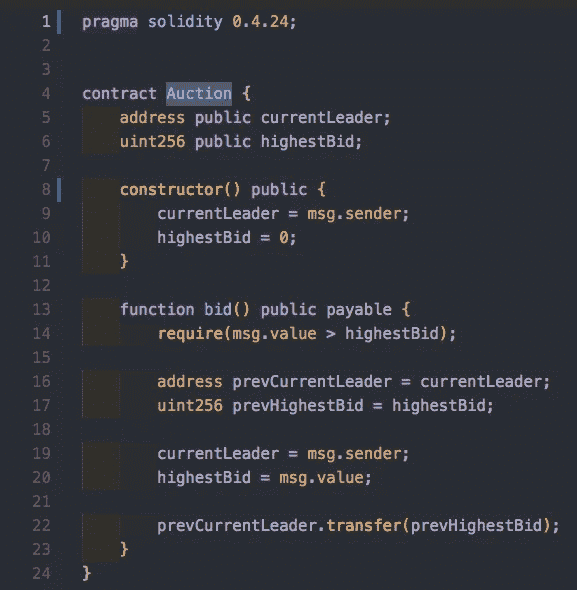

因此，用户可以进行拍卖出价，如果出价最高，他们就可以获得资金。但是如果 ***转移*** 方法失败了会怎么样呢？

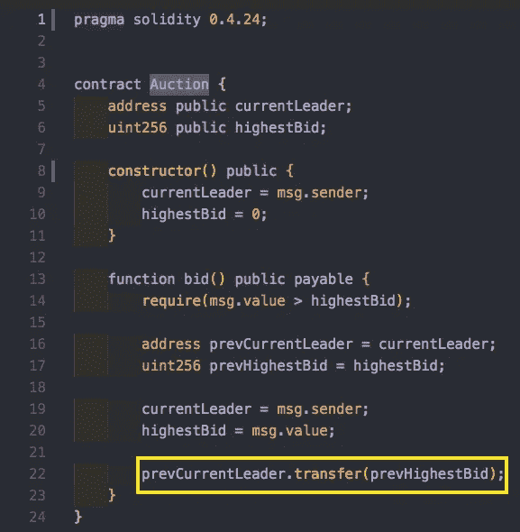

想象一下，就在拍卖开始时，我们出价很低，成为了所有者。然后，如果有人出价高于我们，我们不知何故使转让失败，那么我们将永远成为拍卖的领导者，但仍然保持新的最高出价！让我们来看看这是如何工作的。让我们简单地创建一个不实现可支付回退功能的合同，这样就不可能向我们发送资金。

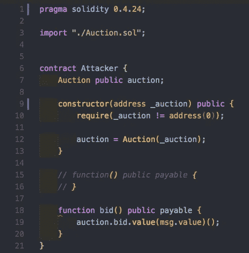

## 缓解#1:支持拉推

*   永远记住，你不仅是在与人类互动，也是在与其他契约互动。

我们还可以通过实施退款机制来缓解这一问题。本质上，我们将持有每个用户贡献的资金的地图，并实现一个*取款*功能，允许每个人都要求他们的资金回来。

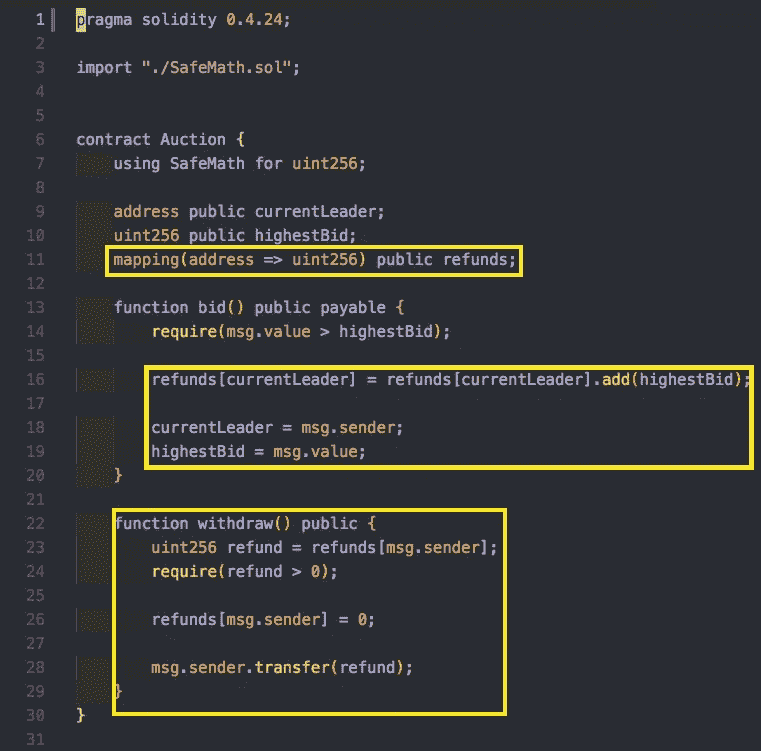

## 缓解#2:忽略合同

*   通常不建议或不希望这样做，但是也可以通过以下检查选择不与合同交互:

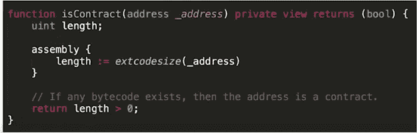

# 结论

智能合同是一个术语，通常与 ***不信任环境同义。尽管智能合同去除了中间人和集中的合同执行者，但这些黑客行为证明确实存在信任因素。我们不相信一家公司或一群律师，而是相信代码以及编写和审核这些合同的开发人员。***

虽然代码容易出错，但我相信智能合同社区将继续提高他们编写智能合同的熟练程度。开发人员变得越来越有经验，从过去的错误中学习，并且不断开发更好的工具来帮助分析契约逻辑/测试。我对未来的智能合约感到兴奋，并相信它们在未来几年将越来越受欢迎。

我的下一篇文章将探索智能合约和分布式应用程序开发(dapps ),敬请关注！

如果你正在寻找区块链世界的资源，我强烈推荐(再次)去看看 Youtube 频道的 [Kin 生态系统](https://www.youtube.com/channel/UCZ0z9fRKhW-GEjQs-_Jxfyg)，那里有很多高质量的技术讨论和讲座。非常感谢 [Leonid Beder](https://www.linkedin.com/in/leonidb/) 建立这个讲座并在区块链学院教授它！

## 如果这篇文章有帮助，请订阅并点击鼓掌👏按钮以示支持！⬇⬇

你可以在 [Instagram](https://www.instagram.com/omeragoldberg/) 、 [Linkedin](https://www.linkedin.com/in/omer-goldberg-680b40100/) 、 [Medium](/@omergoldberg) 上关注我。