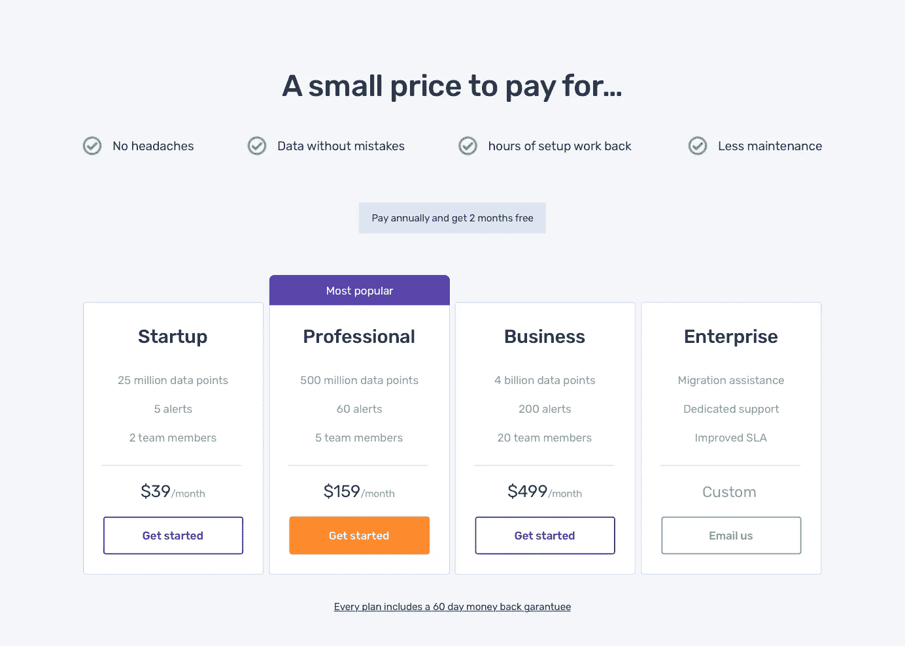
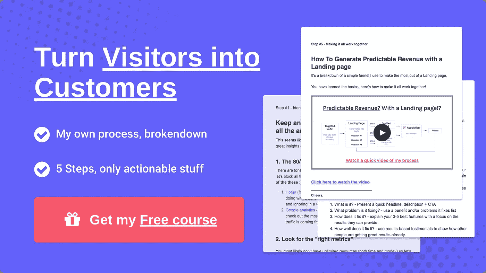

# 如何优化一个登陆页面，即使没有自定义图像！+真实示例(主机矩阵)

> 原文：<https://medium.com/hackernoon/how-to-optimize-a-landing-page-even-without-custom-images-real-example-hostedmetrics-efec6f4949f0>

在这篇文章中，我将指出 [HostesMetrics 网站](http://hostedmetrics.com/)的一些问题，这些问题可能会让潜在客户望而却步，同时列举一些更好的解决方案。

# 什么是主机矩阵？

[HostedMetrics](http://hostedmetrics.com/) 为应用监控解决方案提供了一个简化、便捷的解决方案包，可防止各种常见问题，如花费大量时间进行设置、大量维护，甚至因实施过程中的常见错误而导致数据质量不佳。

# 为什么不使用自定义图像？

因为每当团队想要添加更多东西时，自定义图像会大大增加网站的维护，所以我决定不使用它们，而且这个解决方案不需要平台的很多图像，因为服务应该是让你远离工作的东西，你不会检查太多。

因为这些原因，我决定保持这篇文章的干净、简单、易读/易懂，同时**也让所有阅读这篇文章的人更容易操作。**

# 该过程

这将是针对 HostedMetrics 的，如果你想学习我的将访问者转化为客户的 5 步过程，你可以应用到你的网站上，[这是我的 100%免费电子邮件课程](http://bit.ly/2xwP2fz)

# 要记住的事情

*   HostedMetrics 正在解决长时间设置过程的问题，并解决过程中可能出现的所有问题，因此这些是我将在页面上重点关注的难点。
*   为了了解应该关注哪些问题，我们通过电子邮件进行了一次简短的聊天
*   该产品需要更好地验证，以便我们知道什么是最好的异议来回答，因此，这是我们目前能做的最好的事情。
*   目标是让更多的人注册和更多的线索(人们联系/安排演示)，这样 Heliodor 就可以获得更多的注册或更多的服务验证。

每个问题都是不同的，我会尽最大努力让尽可能多的人可以操作，如果你想要的东西可以适用于每个网站，[查看我的 5 步电子邮件课程](http://bit.ly/2xwP2fz)(顺便说一句，这是 100%免费的)

# 当前的问题以及如何解决这些问题

# 页眉

Current version

*   目前有太多的事情正在发生，因为他展示了所有不同的平台作为标题，这不是一个解释它做什么的有效方式
*   这是第一印象，所以我们需要简单回答“这是什么？”以及“它是做什么的？”因此，你可以创造好奇心，继续学习更多的服务，避免高跳出率。

Suggested version

*   这个标题很大，可以吸引很多注意力，同时不需要在右边放一张图片
*   请注意，标题为它所解决的问题提供了一些背景，但也激发了足够的好奇心，让你通过下面的段落了解更多。
*   Heliodor(创始人)提到他的目标是精通技术的人，否则这个标题和段落组合就不会很好，因为它会丢失信息。
*   CTA 上方的线提供了额外的安全感和创建帐户的好理由。
*   作为创建帐户的替代方法，我添加了“预订一个演示”，以防一些人需要更高接触度的方法来获得服务。

# 引入问题

Current version

*   这太棒了！正是我在[我以前的文章](https://www.indiehackers.com/@pedrocortes/breaking-down-a-landing-page-designed-to-capture-more-leads-47b5554c40)中提到的或者我在[我的免费电子邮件课程](http://bit.ly/2xwP2fz)中提到的一个伟大的登陆页面的公式。
*   这里唯一的问题是图片看起来不够专业，问题出现的方式可能不够“激进”

Suggested version

*   本节的目的是提醒他们 HostedMetrics 解决的棘手问题有多糟糕，或者提供一些背景信息，说明如果他们第一次使用这样的服务，可能会出现多少问题。
*   注意“通常情况下，很多事情都可能出错！”吸引一些注意力，并试图改变将此视为“值得拥有”而非投资的心态。有了标题和一个专门的部分，我们可以更好地控制人们对它的看法。
*   为了帮助说明这是出了问题，我添加了 FontAwesome 中的图标，任何人都可以免费使用。
*   每个问题都有一个标题来解释可能会出错的大背景，下面有一段解释为什么会出错或者会有多糟糕，以便回答一些人可能会对这些问题的看法。
*   我在我的网站上做了完全相同的事情[，如果你想要另一个例子的话。](https://www.indiehackers.com/@pedrocortes/www.cortes.design)

# 解释其工作原理

Current version

*   看起来很简单，可能是他们期望其他竞争对手的选择，以防他们以前没有面临这些问题。
*   需要一步一步来，多一点背景。
*   需要回答为什么更好或者怎样才能更好。

Suggested version

*   使用编号列表和垂直布局更容易理解，因为这与你在页面上滚动的方向是一致的，而且更容易被人注意到，也更容易被人阅读。
*   Heliodor 需要解释为什么这可以在 15 分钟内设置好，而以前他没有解释设置有多难以及有多少事情会出错。

# 确认客户资格

Current version

*   两极分化很好，可以让合适的人喜欢这项服务，并淘汰掉不适合成为你的客户的人，但执行起来需要更多的工作。
*   似乎客户需要做这项工作来判断是否合适，而不是相反。
*   对于像“不确定你是否健康？让我们聊聊天，我们会帮你找出最适合你的方式”

# 区别

Current version

*   这是一个很好的计划，它只是需要更多地关注小团队可以提供的独特优势。
*   这里的一些事情，比如“我们不会在你面前一夜消失”可能会引起一些以前没有的反对意见。

# "最终 CTA "

Current version

*   这个标题并没有创造足够的紧迫性或者一个好的注册理由
*   需要一个替代的 CTA，以防人们不准备创建一个帐户，可能需要问一些问题或演示。

Suggested version

*   “您的解决方案只需 15 分钟”——提醒他们这样设置要快得多，并将其与最简单/最快的应用程序监控方式联系起来。希望，即使他们考虑自己做，他们也会提醒自己这可以快“X 倍”！
*   重要的是要突出无风险，以鼓励更多的人注册
*   如果人们还没有准备好或者需要一种更高接触度的方法，总是有替代的 CTA 来预订演示。

# 定价

Current version

*   所有的计划看起来都是一样的，它需要优先排序，以帮助人们决定是否被淹没和不转换。
*   主动回答问题或安排演示固然很好，但这并不是获得最多请求的理想场所。
*   需要更好地解释包含的内容(如下例)
*   我没有足够的信息来说明这应该在“最终 CTA”(我刚才提到的部分)之前还是之后，但无论如何，切换顺序和测试都非常容易。

Suggested version

*   这个版本的重点是锚定价格，使它看起来像一个更好的投资和尝试计划，记住这将是更容易和最终更便宜的方法(由于它节省的时间或错误)
*   我把价格放在底部，因为我们通常认为价格越低的东西价格越低。理想的地方应该是在那个街区的左下角。
*   请注意，专业计划的优先级更高，因为它有一个显示“最受欢迎”的栏，而 CTA 的对比度比其他计划高得多。
*   由于企业可能是一个罕见的场合，我把很多注意力从它身上转移到正常的计划上，把大部分注意力放在“专业”计划上。

# 替代 CTA 以获取更多线索！

Current version

*   看看这是怎么读的！人们不太可能有他们需要知道的一切来转化，所以尽可能提供承诺较低的替代方案，这样即使你必须长期转化他们，你也可以抓住这些线索。

Suggested version

*   这几乎是页面的结尾，如果你没有得到访问者的任何互动，他将离开页面，这是我们抓住他们的最后机会！
*   请注意，这两个选项更加明显。
*   这些有不同的承诺水平，人们可以选择任何对他们来说感觉最好的，但无论哪种方式，你仍然会得到他们的联系信息！
*   你可以用这个链接到你的 FAQ，文档等等…这取决于你提供的服务。

# 他将来可以添加的其他内容

*   **FAQ** —回答所有问题，并在最后提供一个 CTA，以便人们在有更多问题时联系团队
*   **证明书**——获得一些真正必要的社会证明(Heliodor 还没有这些)
*   **案例研究**——比推荐更好的是结果驱动的案例研究，以显示 HostedMetrics 有多好(Heliodor 还没有这些)
*   **用例** —在这种情况下，可以解释什么类型的数据可以导入，什么可以测量，以及潜在客户愿意支付的任何有价值的东西。

# 想知道我是怎么做到的吗？👇

这篇文章是我帮助 SaaS 初创公司提高转换率和收入的 5 步过程中的一步。[注册我的免费电子邮件课程](http://bit.ly/2xwP2fz)到**从很少的潜在客户变成一个网站！**

Click here to get my free course

# 需要帮助您转换吗？

我很乐意讨论你的问题，所以请在评论中告诉我你的现状、需求或目标👇或者…

**我用了不到 6 个小时设计了这个页面**，想象一下我用更多的时间能为贵公司做些什么；)👇

[服务](http://www.cortes.design/#services)

[感言](http://www.cortes.design/#testimonials)

[免费电子邮件课程](http://www.cortes.design/email-course)

**邮箱:** pedro@cortes.design

**延伸阅读:**

 [## 如何做一个转化驱动的 SaaS 登陆页[2017 版]

### 人类的平均注意力持续时间最近下降到了 8 秒(比一条金鱼还少！)，还有几百个…

blog.prototypr.io](https://blog.prototypr.io/how-to-make-a-conversion-driven-saas-landing-page-2017-edition-9ad4434c9bc2)  [## 剖析一个伟大的登陆页面

### 如果你足够了解你的客户，并且你有一个好的产品来服务他们，那么你可以用…

blog.prototypr.io](https://blog.prototypr.io/anatomy-of-a-great-landing-page-5285a743d981)  [## 围绕异议设计登录页面！

### 在我的每一篇文章中，我都试图解释可以改进产品的通用技术…

blog.prototypr.io](https://blog.prototypr.io/design-landing-pages-around-objections-8cba617c2efd)  [## 最大的登录页面错误以及如何修复它们

### 作为一名专注于优化转化率的设计师/顾问，通过定期分析大量页面…

blog.prototypr.io](https://blog.prototypr.io/the-biggest-landing-page-mistakes-and-how-to-fix-them-c08302c7b1fd)  [## 分解转化驱动的 SaaS 登录页面(旨在获取更多销售线索)

### 在这篇文章中，我将向你展示我是如何设计一个概念页面来捕捉线索的，在这种情况下，它是…

hackernoon.com](https://hackernoon.com/breaking-down-a-conversion-driven-saas-landing-page-designed-to-capture-more-leads-584c569f9565)