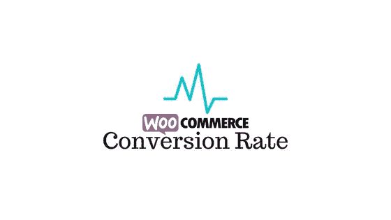

# 如何优化电子商务转化率

> 原文：<https://medium.com/hackernoon/how-to-optimize-woocommerce-conversion-rate-18e936dfa3ce>

我们已经了解了使用 Google Analytics 在您的 WooCommerce 商店上跟踪客户参与度的[方法。一旦你能够跟踪顾客在商店的行为，你就可以考虑实施改进策略。你可以从转换率优化(CRO)开始，这是一件很重要的事情。转换可以广义地定义为一个过程，在这个过程中，站点用户执行一个定义好的期望动作。对于电子商务商店来说，最理想的转换是购买产品。然而，也可以有其他的转换目标，如在网站上注册，或订阅时事通讯等。这篇文章将探讨几个策略，帮助你优化你的 WooCommerce 转化率。](https://learnwoo.com/customer-engagement-woocommerce/)

# 怎么计算转化率？

在进入优化策略之前，让我们快速看一下如何计算转化率。转化率是用户执行转化目标的速率除以会话数。例如，假设“用户 A”一天访问你的商店五次，这将是 5 次会话。用户在最近两次会话中进行了购买。也就是说，在五次会话中有两次转换。转化率会是 2/5，也就是 40%。

只有当您的商店有多种产品并且用户可以在每个会话中购买时，基于会话计算转化率才有意义。然而，如果我们谈论的只是你网站上的一个订阅产品，那就不一样了。在这种情况下，您可能希望使用独特的用户访问来计算转化率。

## 了解销售漏斗

你需要非常了解你的商店的销售漏斗，以便能够优化转化率。简而言之，你可以观察客户在你的销售漏斗中会采取的一般步骤，并思考如何改进。但是，销售漏斗是由以下多个部分组成的:

*   **产品的知名度** —这将决定潜在客户是否了解你的产品。
*   **研究材料的可用性**——一旦他们知道了你的产品，有足够的材料来研究吗？你的产品页面是否详细且有吸引力？
*   **兴趣产生**——你的产品或网站有足够的理由保持用户对产品的兴趣吗？
*   **购买决策** —在做出购买决策之前，你的用户可能想知道其他客户对你的产品的评价。评论和证明的可用性可能会有很大帮助。
*   **定价交易和优惠券** —电子商务用户倾向于在任何给定的时间结帐，寻找最佳交易。你可能需要通过提供最好的交易和折扣券来始终领先于你的竞争对手。
*   **结账容易度** —做出购买决定后结账有多容易？是否有几种支付方式来满足不同的兴趣？结账表格是否简单且符合逻辑？有客人退房的选项吗？
*   **奖励积分** —顾客一旦购买，你就可以把它算作一次转换。然而，那里有促进重复购买的空间。后续购买的奖励积分和优惠可能会保证你有更多的转换。

# 从哪里开始优化过程？

转化率优化的第一步是监控销售漏斗。这会给你洞察力，引导你走向正确的方向。以下是一些您可以使用的重要工具:

# [woo commerce Google Analytics Pro](https://learnwoo.com/refer/woocommerce-google-analytics-pro)

这是一个伟大的工具来跟踪先进的电子商务活动对你的商店。你可以监控几个可能影响你转化率的事件。它允许您跟踪事件，如购物车数量的变化，或者客户申请或取消优惠券。此外，您可以在您的站点上为客户操作添加事件。例如，您可以在客户登录您的网站或留下评论时创建一个事件。与正常的谷歌分析集成，您可以从跟踪报告中排除网站管理员。使用这个扩展，您也可以排除商店经理。

该扩展还支持购物和结账行为分析报告。您将能够深入了解顾客在结账过程中做出的具体选择。你需要购买并安装这个插件，它可以在 WooCommerce 网站上以 29 美元的价格购买。

## [面向 WooCommerce 的可操作谷歌分析](https://learnwoo.com/refer/codecanyon-actionable-google-analytics-for-woocommerce)

这个插件在你的谷歌分析账户上提供了许多自定义维度和指标的跟踪。你将能够理解可能影响你转化率的几个因素。这些包括跟踪页面类型、可用折扣、购买日期和时间、选择的支付方式等。你可以在这些因素中寻找有助于提高转化率的模式。一旦你确定了具体的模式，你就可以相应地随机应变你的策略。甚至其他因素，如顾客的位置、商店的库存水平展示等。，可以测量。

你可以花 114 美元购买这个插件的普通许可证。

# 如何提高转化率？

既然你已经了解了如何监控你的 WooCommerce 商店的转换率，你可能需要关注如何随机应变。这里有一些专家建议的技巧来提高你的网上商店的转化率。

## 帮助顾客了解你的产品

当谈到提高转化率时，这是最直接的步骤之一。为了能够销售产品，你需要让潜在客户知道你的商店和产品的存在。这是你在 WooCommerce 转化率优化过程中需要采取的第一步。你需要有很好的产品描述，描述产品所有重要和独特的功能。同样，你的网站导航需要流畅，让客户能够轻松找到他们想要的产品。在这种情况下，像 Ajax 支持的分层导航这样的 WooCommerce 扩展会有很大帮助。

为了更好地了解产品，最好提供一个比较图表，详细说明两个以上类似产品的特性。[使用高级过滤选项改善您的产品搜索选项](https://learnwoo.com/increase-conversions-better-woocommerce-product-search/)是改善网站客户体验的另一种方式。

## 让你的产品页面更有吸引力，信息量更大

您的产品详情页面需要设计成高质量，以确保客户不会离开那里。如果你的分析洞察力指向产品页面的大量出口，你可能需要重新设计。一个有吸引力的产品页面是任何电子商务商店的强制性要求。你可能想浏览一些[流行的 WooCommerce 主题](https://learnwoo.com/wordpress-woocommerce-themes/)，找出最好的产品展示选项。

[**马上获取 Avada！**](https://learnwoo.com/refer/themeforest-avada)

使用高质量的产品图像是转化率优化的另一个重要要求。您的客户应该能够从产品页面中找到尽可能多的详细信息。产品放大选项、产品页面上的快速演示视频等。，也有助于保持客户的兴趣。

## 尝试动态定价计划

电子商务行业竞争激烈，因此，你真的无法保持产品价格稳定。如果你销售一种普通产品，你的潜在顾客在某一特定时间有很多选择。所以最终让他们留在你网站上的是产品的价格。你可以通过考虑各种参数和策略来保持产品价格的动态。阅读这篇文章来[了解更多关于网上商店的动态定价策略](https://learnwoo.com/woocommerce-dynamic-pricing-strategies-conversion/)。

[**立即获取动态定价插件！**](https://learnwoo.com/refer/xadapter-dynamic-pricing-discounts-woocommerce)

## 优化结账

你网站的结账流程是你转化率的另一个决定因素。你需要确保你的结帐表单简单，并且能够更快地结帐。有几个插件可以用来确保你的商店的收银台根据顾客的兴趣进行个性化设置。这里有一篇文章可以帮助你找到一些[最好的 WooCommerce 收银台编辑器插件](https://learnwoo.com/modify-woocommerce-checkout-fields/)。

启用客人结账或社交登录，并以当地货币显示价格可能是您可以用来改进结账流程的一些策略。多种支付方式和灵活的支付计划是一些电子商务店主使用的策略。

你可能需要在你的网站上做大量的测试来了解你的顾客最喜欢的结账方式。增强的电子商务报告工具将帮助您了解您的结账是否没有优化。如果你发现你的结帐可能有问题，你需要立即优先纠正它。

## 包括评论和证明

产品评论是电子商务转换中的差异化因素。绝大多数电子商务客户更喜欢在做出购买决定之前查看客户对产品的评论。重要的是你的产品页面要有真实的评论，让潜在客户了解产品的可用性。据业内专家称，在你的网站上只展示有利的评论是一大禁忌。你网站上的产品评论应该是顾客体验的混合体。你可能需要努力工作，才能在你的网站上持续获得评论。当你要求复查时，专家建议在产品到达顾客手中 24 小时后进行。

WooCommerce 社区也有令人敬畏的产品评论插件。你可能想阅读这篇文章来了解[产品评论如何帮助](https://learnwoo.com/improve-sales-woocommerce-review-plugins/)你提高你的 WooCommerce 转化率。

## 减少购物车废弃

放弃购物车是另一个会对你的转化率产生负面影响的因素。然而，研究表明，通过发送及时的跟进邮件，你可以在相当大的程度上收回废弃的购物车。有几个插件可以帮助你管理这个。找出几个[最好的 WooCommerce 插件，帮助你回收废弃的购物车](https://learnwoo.com/woocommerce-abandoned-cart/)。

## 回应顾客的询问

支持人员随时响应客户查询是提高转化率的一个重要因素。虽然这并不是所有网站都可行的选择，但是如果实施得好的话，会有很大的帮助。大多数情况下，客户在确认决定之前会有一个问题。在这一点上，如果有一个支持人员可以保证一个特性或功能，它可能会大大提高你的转化率。

在你的网站上加入一个实时聊天软件是最明显的解决方法。然而，这也有不好的一面。当售前咨询如潮水般涌来时，你这边应该有人来解答。如果你只是让查询重定向到你的收件箱，这可能会对客户体验和转化率产生不利影响。你可以浏览这篇文章，找到更多关于实时聊天插件对你的转化率的[影响的细节。](https://learnwoo.com/improved-wordpress-customer-support-ticketing-system-with-live-chat-plugins/)

## 告诉客户你的网站是安全的

交易的安全性是电子商务客户最关心的问题之一。你必须主动告诉你的客户你在你的网站上采取的安全预防措施，以保护他们的数据。从长远来看，建立信任的声誉会大大帮助你提高转化率。在你的网站上设置 SSL 并在结账时展示安全徽章可以让你的客户相信你的网站是安全的。

## 有好的退货政策

大多数顾客会在购买前查看你的退货政策。由于电子商务购买是根据网站上看到的内容决定的，客户总是会有一定的疑虑。如果他们根本不喜欢这个产品，应该有办法退货。你需要在你的网站上展示一个令人信服的退货政策，并尽量让这个过程没有麻烦。

# 结论

有几个因素会影响你的 WooCommerce 商店的转化率。你需要及时跟踪这些因素，以提高你的商店的转化率。使用先进的分析解决方案将帮助您跟踪和即兴电子商务活动在您的网站上。希望这篇文章提供了一些工具和技巧来提高 WooCommerce 的转化率。如果您想分享适用于您的商店的具体策略，请告诉我们。

## 进一步阅读

*原载于 2018 年 5 月 15 日*[*【learnwoo.com*](https://learnwoo.com/optimize-woocommerce-conversion-rate/)*。*