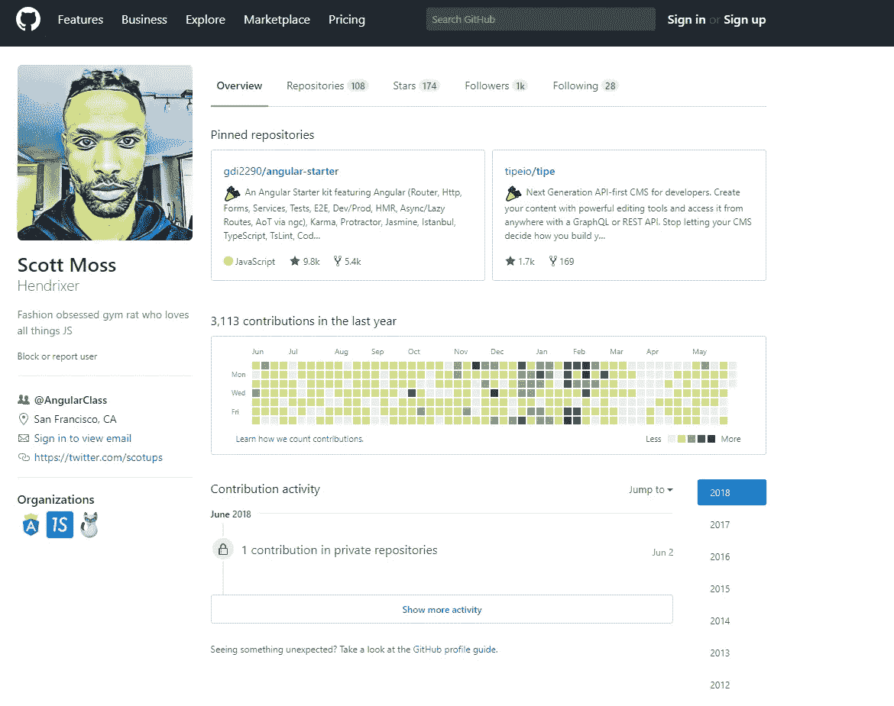
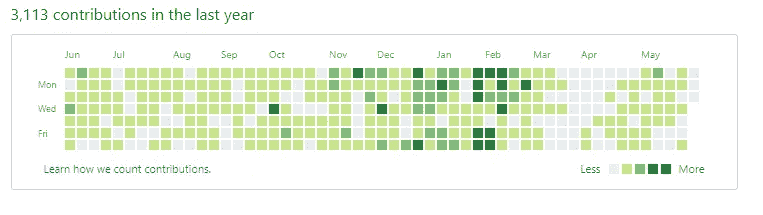

# 如何优化你的 GitHub 档案

> 原文：<https://medium.com/hackernoon/how-to-optimize-your-github-profile-9540f338b2c9>

## 从个人资料到投资组合


## 介绍

本指南将帮助您创建一个专业外观的 GitHub 个人资料，并将其用作您的作品集。

你还将学习如何通过参与开源项目来打动招聘人员。

如果你没有 Github 中 Git 的经验，你可以[了解 Git](https://teamtreehouse.com/library/git-basics/why-version-control-matters/how-version-control-works) 上的版本控制。

只要跟着链接去 Freecodecamp 看教程就行了。

然后当你完成的时候回来这里，我们将工作在你的侧面。

艺术家用一个文件夹来保存他们作品的样本。类似地，GitHub 档案是程序员工作的作品集。

> 以同样的方式使用 GitHub 向潜在雇主炫耀你的工作。

你的个人资料也会显示出你是如何工作的。

放心吧！我们将通过各种方式将您的 GitHub 档案制作成专业的作品集。

附:你有令人惊叹的 GitHub 简介吗？[你应该在这里申请](https://goo.gl/jtWp6j)

## GitHub 配置文件检查

让我们从招聘人员的角度来看看 eggselent GitHub 的简介。

[Github 链接](https://github.com/Hendrixer)



Hendrixer

这是斯科特·莫斯的资料。他是 Angular 班的软件工程师。

左边是个人信息。

**个人资料照片**

一张带着友好微笑的照片可以帮助招聘人员与你建立联系，但这不是强制性的。

如果你不用自己的照片，一定要附上一张能捕捉你个性的照片。但不粗糙。就像斯科特一样。

**一般信息**

以下是一些一般信息和他的电子邮件和 twitter 个人资料的链接。

招聘人员可以浏览斯科特的推文，了解他感兴趣的事情。

**储存库**

描述很好，这样我们就知道这些存储库是做什么的了。

他对知识库的贡献令人印象深刻。这清楚地表明他参与了开源软件的合作。

雇主可以通过斯科特的贡献来判断他在团队中的表现。

**贡献图**



contribution chart

这是招聘经理首先要考虑的事情之一。

每个方块代表一天。绿色的黑色表示当天有多少捐款。

你可以看到斯科特非常活跃，在大多数日子里至少做出了一项贡献。

很明显他花了很多时间在代码上。

对招聘人员来说是个好兆头。

如果人们对编码充满热情，那么活动的热图会给人一种很好的感觉。

不一定要一直这样，但事实就是这样:

> 喜欢编码的人有稳定的模式，这与工作场所的成功相关

## 自述文件

一个写得很好的自述文件是一个好的存储库最重要的部分之一。

阅读对其他人来说是必要的，因为它告诉人们:

1.  代码是干什么用的
2.  如何构建/安装代码
3.  如何投稿

这是一项重要的技能。你应该学习如何为人类写文档。

## 提交消息

提交消息对于交流代码更改的原因至关重要。这是为了你的同事或合作者，也是为了你未来的自己。让我们来看看编写提交消息的一些最佳实践。

以下是您可以使用的消息格式:

```
type: subjectbodyfooter
```

第一行是主题。这应该是对变化的简短描述。

没有什么像“修好了”或“做了什么”，这些需要清晰和翔实，并尽量避免亵渎。

主题应不超过 50 个字符，首字母大写，结尾不带句号。

您还应该包括一个关于提交类型的简短注释，如果它是一个 bug 修复、一个特性、对文档的更改等等。

接下来是正文，这是你给出一个更详细的描述你为什么要做这个改变的地方。

正文通常每行应该有大约 72 个字符。这是为了确保在命令行上使用 git 时消息适合终端窗口。

你还需要确保在主题行和正文之间有一个空行。当你需要列一个清单时，你也可以用星号或破折号来添加项目符号。

有些提交不需要消息体。例如，如果你修改了一个错别字，只有一个主题行也没问题。

您还可以包含一个页脚，通常这将用于指示提交解决了哪些问题或错误。

一个更具体的例子是这样的:

```
feat: Summarise changes in around 50 characters or lessMore detailed explanatory text, if necessary. Wrap it to about 72
characters or so. In some contexts, the first line is treated as the
subject of the commit and the rest of the text as the body. The
blank line separating the summary from the body is critical (unless
you omit the body entirely); various tools like `log`, `shortlog`
and `rebase` can get confused if you run the two together.Explain the problem that this commit is solving. Focus on why you
are making this change as opposed to how (the code explains that).
Are there side effects or other unintuitive consequences of this
change? Here's the place to explain them.Further paragraphs come after blank lines. - Bullet points are okay, too - Typically a hyphen or asterisk is used for the bullet, preceded
   by a single space, with blank lines in between, but conventions
   vary hereIf you use an issue tracker, put references to them at the bottom,
like this:Resolves: #123
See also: #456, #789
```

当然，这也有例外。

如果您正在处理一个开源项目，请确保遵循该项目的消息格式。这将使维护人员高兴，并增加您的拉请求被接受的机会。

## 开源项目

作为一名程序员，你经常会和其他人一起共享代码。

所以雇主希望看到你能合作。

通过参与开源项目，你可以展示你与他人合作得有多好。

这也表明你乐于助人，喜欢与代码打交道。

## 后续步骤

将这些最佳 GitHub 实践应用到未来，并吸引招聘人员和高级软件工程师的注意。

你会想要:

*   至少每周提交一次
*   连续 2-4 周

个人的副业可能会发展成更大的事业。你不能总是预测什么会引起招聘人员或高级软件工程师的注意，但当它发生时，你想展示你最好的工作。

一旦你实现了必要的改变，使你的个人资料更加专业，记得通过定期在 GitHub 上提交来保持活跃。

好运&快乐编码！

*教程来源:Udacity*


Have a great GitHub Regular Time!!