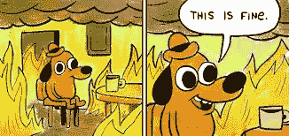

# 如何克服工作中的挑战

> 原文：<https://medium.com/hackernoon/how-to-overcome-challenges-at-work-4ce020dd03ee>

最近，我和一个朋友进行了一次艰难的谈话，他在工作中经历了糟糕的情况。我们讨论了一些选择和要采取的行动步骤，我留给他们的信息是“这也会过去的。”果然，我昨天收到了朋友的短信，说他们已经度过了难关，一切都恢复正常了。

当我听到情况得到解决时，我松了一口气，但我忍不住想到了我朋友面临的难题:她在处理这种情况时感到压力，就像她害怕寻求帮助一样。令人沮丧的是，看到他们如此害怕和担心寻求帮助来处理他们在工作中遇到的有压力或困难的情况。虽然许多公司开始倡导工作与生活的平衡，并努力创造更包容的工作环境，但承认自己有压力、有困难、有挑战、需要帮助似乎仍是禁忌。默认情况是假装一切都很好，尽管事实并非如此。

生活和工作的一个现实是，将会有艰难和糟糕的时候，并不是所有的事情都是彩虹和蝴蝶。我认为承认和讨论这些问题是很重要的，而不是躲在它们背后或把它们视为禁忌话题。

在进一步思考我朋友的经历后，我开始思考我在工作中遇到的具有挑战性的情况，以及我是如何设法克服它们的。我知道我肯定经历过很多挣扎、挑战和挫折，但是通过这些挫折和成功，我学到了一些应对困难和压力的策略。

**进入风暴中心**

当你开始经历一个让你感到不舒服的困难或挑战时，它可能会令人害怕，并引起焦虑或担忧。这是“[战或逃](https://www.psychologistworld.com/stress/fight-or-flight-response)的经典案例虽然逃避手头的任务看起来令人欣慰，但如果你想继续学习和成长，就必须直面风暴之眼，不管它看起来多么可怕或具有挑战性。那么，你为什么要一头扎进去呢？

首先，很难完全逃避工作中的问题，尤其是那些与你的工作职责有关的问题。虽然你可以拖延，或者把他们推到一边或其他人身上，但在某个时候他们会赶上你，并以消极的方式影响你。

第二，寻求安慰很棒，感觉很好，但不一定能帮助你继续学习和增长技能。看你是什么做的最好的方法是把你自己放在不舒服的位置来测试你的技能。这可能意味着短期的痛苦(希望不要太严重)，但从长远来看，这将帮助你获得额外的技能和经验。

**关注每天的进步**

利用前面的类比，回想一下你擅长的领域。你是一夜之间成为 it 专家的吗？这很可能花费了大量的时间、反复试验、大量的努力以及大量的训练和坚持。无论你在工作中面临什么样的挑战或处境，这些都是真的。你不会在一夜之间完成它，也不会在一天之内掌握它，所以一旦你接受了你将进入风暴中心的事实，事情不会在一夜之间改变，你也接受了你需要在这方面努力一段时间。

这可能看起来具有挑战性和令人畏惧。不要试图把它看作一个整体，不要把注意力放在解决挑战或战胜困难上，而是每天朝着你的目标前进。如果你接受它不会在一夜之间变得更好，但你每天都可以做些事情来改善，它就会变成一个更小更现实的目标，一个看起来可以实现的目标。

研究告诉我们，成功处理项目和目标的标准之一是我们相信我们实际上拥有实现目标所需要的东西。所以，把目标分成小块，让它看起来可以实现，而不是不可实现。

**确定你的减压方法**

当你经历一次具有挑战性的经历时，它可能会让你精疲力尽。即使当你不工作时，它也很容易支配你的想法和感觉，这会阻碍你的整体前景，给你的生活带来额外的压力和担忧。你可以马上做的一件事是找出你生活中缓解压力的事情，并在你经历这段经历时，想办法尽可能地将这些事情融入你的生活。

对一些人来说，这意味着去跑步、练习瑜伽或听音乐。对其他人来说，这意味着写日记或与朋友共度时光。确定这些事情并把它们融入我们的一周可以帮助我们管理压力，并确保我们正在经历的任何事情都不会消耗我们的整个生活。

**给朋友打电话**

我们帮助自己的最好方法之一就是依靠我们的支持网络。例如，在最近的一次工作挑战中，我做的第一件事就是打电话给我所有的朋友，发邮件给他们，我认为他们以前也有过类似的经历，向他们寻求建议、技巧和诀窍。重要的是要记住，虽然你可能觉得自己很孤独，但很可能你正在做的事情 A)可能有人以前做过，B)可能感受到你的感受。如果他们能挺过去，你也能。果不其然，在给大约 5-6 个人发了邮件后，我收到了各种各样的回复，从“我正在经历这一切！”到“我完全了解你的感受”

除了与我分享他们的建议，他们中的一些人开始在我经历困难的时候定期联系我，只是为了确保我做得好并继续前进。你可能没有所有的答案，这没关系。但是如果你深入挖掘你的资源，你可能会找到一些答案来帮助你

**专注于你能控制的事情**

其中一些事情会在你的控制范围内，在大多数情况下，你可以采取行动来纠正它们。其他事情不在你的控制范围内，不管你做什么或不做什么，这些事情都会发生。现在，只专注于你能控制的东西在理论上听起来很棒，但在现实中很难做到，尤其是对那些与之斗争的人来说。

专注于或花时间在你无法控制的事情上会夺走你本该花在你可以控制的事情上的精力和资源。这也很累人，压力也很大。此外，确定并专注于你能控制的事情也有助于你优先考虑在哪里花时间，并最终将你的精力投入到最重要的事情上。

**练习感恩**

研究显示，懂得感恩的人往往会体验到更多积极快乐的情绪。在压力大或困难的时候，这些情绪会特别有帮助。

我有一个感恩日记，我写它只是为了提醒我自己我感谢的事情。如果你能掌握自己的思想，如果你能学会如何充分利用任何情况，当你感觉不像自己时如何做自己，当你感觉自己不在正确的道路上时如何找到自己，你会在一生中的每个糟糕或艰难的时候一次又一次地回到这一技能，这将使你不仅是一个成功的人，而且是一个非常快乐的人。

**帮助某人**

摆脱压力或担忧的一个方法是引导它们去帮助别人。想办法在一天中的某个时候帮助别人。你可以做简单的事情。打电话给一个朋友，给他们一些关于他们正在想的事情的建议，把一个新的想法或网站转发给一个和他们相关的同事，或者为你白天见到的每个人开门。我发现，当你集中精力帮助别人时，A)会让你觉得你在为别人做贡献，这让你感到积极，B)会让你忘记你脑海中的压力或担忧。

**完成后汇报**

当一切结束时，你可以做的一件事就是问自己，“刚刚发生了什么？”在你从这段经历中走出来之前，花点时间问问你自己你做了什么，你学到了什么，你能从这种前进中得到什么。

做一个简短的汇报或反思会帮助你理解你刚刚经历的事情。此外，它还会让你了解你获得的技能和学到的课程。是的，有时经历如此糟糕，以至于你想做的就是忘记它，但是我发现做一个简单的反思/汇报练习也是有帮助的和宣泄的，在某些情况下，它可以帮助你在糟糕的情况下找到积极的一面。

压力大的工作环境永远不会消失，所以如果你打算工作更多年，那么当压力出现时，花时间思考如何最好地应对是值得的。好消息是，你可以做一些事情来应对这些艰难的情况，并在保持生活平衡的同时茁壮成长。

我们不能总是控制将要发生在我们身上的事情，但是我们可以控制我们如何应对，我相信，如果你下次在工作中遇到压力时使用这些建议，你将会克服任何困难。

*这篇文章最初出现在我的* [*博客*](http://alexdea.com/2018/02/how-to-overcome-any-challenge-at-work/)