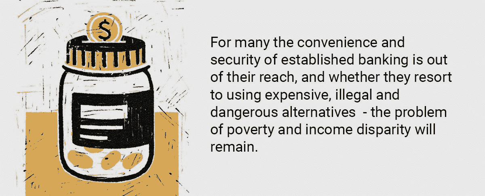
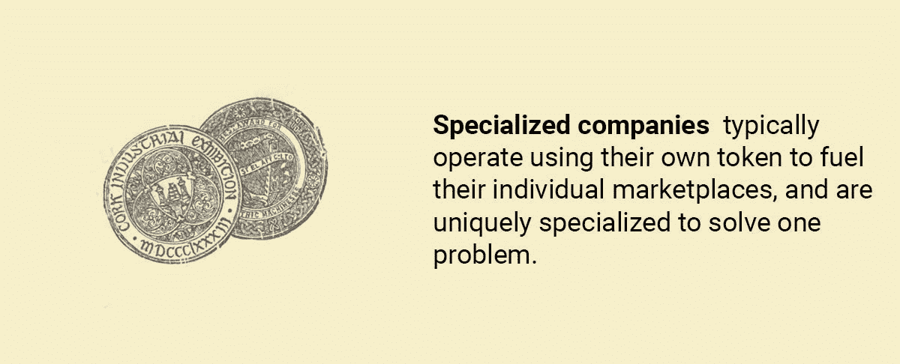

# 如何通过帮助没有银行账户的人来克服贫困？

> 原文：<https://medium.com/hackernoon/how-to-overcome-poverty-by-helping-the-unbanked-723f8c915d62>

银行业务是我们许多人认为理所当然的事情，无论是因为我们易于使用的信用卡，我们安全和联邦保险的银行账户，还是因为我们的雇主每两周直接将钱存入我们的账户。然而，对许多人来说，现有银行的便利和安全是遥不可及的，无论他们是否诉诸于使用昂贵的(有时是非法和危险的)替代手段，如支票兑现办公室，把钱藏在后院的咖啡罐里，或通过其他方式，贫困和收入差距的问题都将继续存在。你有没有考虑过没有银行的生活有多艰难？甚至那些带有过滤选项的选项——不受任何外力限制，但有用范围有限的选项——也可以在许多第一世界国家找到。过滤选项，如支票兑现中心，由雇主提供的预付借记卡，而不是支票，或依赖典当行的“信贷”，因为他们没有信用卡选项。除非我们向大众提供公平、负担得起和未经过滤的银行选择，否则我们永远无法在全球范围内实现更大的金融平等。

# 没有银行账户和银行服务不足

没有银行账户或银行服务不足的人经常被遗漏，他们约占世界人口的 39%，接近 29 亿人。无银行账户和银行服务不足的个人可以被定义为那些无法获得金融机构的银行服务的人，或者那些无法获得足够广泛的选择来创建一个公平的银行市场的人。从这里开始，为了简单起见，我们将把这两个术语统称为“银行不足”。

欠银行主要存在于 GDP 低于平均水平的国家，但即使在像美国这样的老牌国家，大约 27%的人口[因缺乏足够的金融机构而遭受折磨。银行业务不足有显而易见的原因，比如出于安全考虑或缺乏市场而缺乏实体银行分支机构。但一些不太明显的原因可能包括工资兑现服务垄断市场，限制性帮派/流氓军事活动，以及高收费的进入壁垒。区块链技术为许多这些问题提供了独特的解决方案，但这些解决方案完全受到全球互联网使用渗透率的限制，全球互联网使用渗透率在](https://www.fdic.gov/householdsurvey/)[约为 55%](https://www.internetworldstats.com/stats.htm)。

随着全球互联网的使用每年都在增加，移动电话的接入也在领先，那些目前银行服务不足但现在在线的人有一个巨大的潜在市场。不幸的是，区块链技术只能帮助那些能够访问互联网的人，但这产生了一个美丽的副作用——如果你通过增加发展中国家的互联网可用性，为盈利性公司提供了一种赚钱的方式，你就可以注入更多的资金和资源，在那些原本可能停滞不前的地方发展基础设施。对于那些已经上网的银行服务不足的人(在东南亚占 6 亿人口的 73%)来说，缺乏金融服务是没有道理的。幸运的是，金融科技和区块链的解决方案正在整合，以帮助缓解这些问题——通过在没有地方司法管辖区担保资金的地区提供更大的问责，以及通过支持现有机构并帮助它们发展，以便它们可以容纳更多客户。

# 为缺乏银行服务的人提供分散的银行服务

在这一点上，你可能对权力下放的想法很熟悉，但是如果你有任何问题，你可以在我们写的关于这个主题的[文章中找到你想要的答案。谈到去中心化的银行业，需要理解的关键概念是更低的成本和更大的激励，让企业进入它们通常会避开的市场。在这种情况下，去中心化为交易双方提供了安全保障，所以即使没有像](https://howtotoken.com/explained/decentralization-encourages-sharing/) [FDIC](https://www.fdic.gov/) 这样的组织为客户的资金提供保险，客户也可以放心，因为他们知道他们的资金记录在区块链上。

正如我们前面提到的，分散化对于降低技术或服务的总成本有着巨大的潜力。对于缺乏银行服务的人来说，这可以导致更便宜的资金转移和更低的账户费用，而不会牺牲每个人都希望在金融机构中获得的必要的安全性和透明度。在为银行不足和各自的金融业务提供服务的特定情况下，使用 [hyperledger fabric](https://www.ibm.com/developerworks/cloud/library/cl-top-technical-advantages-of-hyperledger-fabric-for-blockchain-networks/index.html) 将加快交易时间，提高安全性，并允许各公司在获得批准后加入现有网络。

开放银行业是这场完美风暴的最后一个主要部分，这场风暴正在全球银行体系不健全的人群中蔓延。[开放银行](https://www.bankingtech.com/2018/01/open-banking-what-you-need-to-know/)的理念是允许第三方开发者围绕使用开放 API 的金融机构构建应用和服务。这样做的目的是通过公开和私人数据增加账户持有人的财务透明度，所有开放银行协议必须使用开源技术编写，以便易于验证。开放银行业本质上允许新的参与者进入该领域，并开始以以前从未被允许的方式帮助欠发达的银行，而区块链技术将成为整个过程中的关键组成部分。为了更好地解释整个过程，我们想强调一下这个领域中出现的一些特定公司。

# 将所有这些结合在一起的项目

想法是伟大的，但光有想法并不能解决问题。只有将这些想法付诸行动，并从中创造出一些东西，我们才能看到进步，在为银行下层服务的情况下，有一些公司正在采纳这些想法并带着它们前进。我们将研究这些解决具体问题的单个公司，以及一家公司， [TraXion。Tech](https://www.traxion.tech/) ，该公司正计划建立一个服务网络，让银行服务不足的人完全沉浸在一个金融准入和稳定的世界中。

# 专业化公司

有各种各样的公司正在为区块链技术可能缓解的许多问题提供单独的解决方案。它们存在于众多领域，通常使用自己的令牌来推动各自的市场，并且专门解决一个问题。专业化公司通常会蓬勃发展，因为他们只有一个市场可以专注，可以像激光一样瞄准他们的理想受众，并将所有的资金和研究投入到让他们的特定客户满意上。

*   [Alice.si](https://alice.si/) 是一家总部位于区块链的筹资公司，旨在减少对企业的必要信任，增加众筹过程的透明度。他们希望允许更多基于全球的跨境众筹，而无需高昂的费用和交易时间，并让他们的筹款客户有机会审查捐赠者，并证明资金的确切来源。
*   [Yocoin.org](https://www.yocoin.org/)是一家由 oracle 支持的区块链保险公司，它使用智能合约来接受和支付使用其特定令牌(YOC)的结算。YoCoin 可以帮助全世界的人投保，因为保险索赔的中间人是社区而不是公司，所以赔付更可能是公平的，更少受贪婪的驱动。
*   [FiiiPay](https://fiii.io/) 是一种沉浸式支付解决方案，涵盖从钱包到商户 POS、交换数据库和投资的一切。Fiii 希望成为那些希望做任何与购买/汇款有关的事情的客户的目的地，并希望最终进入主流加密货币转换领域。

专业化公司被设计成在他们试图完成的个人目标上表现出色，但是由于这种专业化，如果他们的特定市场枯竭，挣扎，或者竞争对手带着更好的产品进入，他们很容易失败。缓解这种情况的一种方法，尽管并不完美，是将类似的服务捆绑在一家伞式公司下，以帮助确保稳定性。

# 一站式商店

TraXion 致力于为日常用户构建基础设施，以访问银行服务和更多服务。他们的运营基于区块链驱动的环境，以帮助改变人们做生意的方式，包括强制性的数据完整性、问责制、透明度和[无信任的信任](https://hackernoon.com/how-do-we-put-trust-in-a-trustless-system-a2b66f0f81fd)。TraXion 的整个目的是为企业提供一个区块链就绪的平台(即开放银行业务)，该平台是可扩展的、不可变的、许可的(得益于 hyperledger 结构)，并且能够以可见的、开源的方式执行智能合同。

通过与其他各种大型金融科技公司合作，TraXion 的目标是让自己成为世界各地银行不足的人不可替代的一员，并最终提供一些功能，为区块链技术开辟其他许多途径。将与 TraXion 平台集成的一些关键组件包括:

*   [GavaGives.com](https://www.gavagives.com/)—这是一个端到端的筹款平台，通过提供多种货币选择和分析，帮助非营利组织增加和管理他们在区块链内外的捐赠者和捐款。
*   [TraXionPay.com](https://traxionpay.com/)—一家成长中的菲律宾支付集成商，为非信用卡持卡人(底层银行)提供更多支付选择。
*   [BayaniHealth](http://www.bayanihealth.com/homepage/) —一个以人力资源利益为导向的服务平台，为中小企业、个体创业者、自由职业者和普通人提供可负担的、基于滑动比例的灵活医疗保健套餐。
*   [Parachure](https://parachure.com/) —一个数字建议平台，由行业专家和顾问组成，他们提供基于目标的财务建议和信息，以使其社区实现财务安全、未来有保障的生活。
*   [Azzurance](http://azurrance.com/) —一家总部位于 SaaS 的保险平台，提供汽车、非人寿、火灾、财产和旅游保险。与保险产品相结合，它为其他保险公司提供物联网解决方案，并帮助实现保险运营的自动化，以降低成本和提高效率。

这可能很难接受和理解，但您需要了解的基本情况是, [TraXion 将提供一个 API 驱动的区块链](https://traxion.tech/documents/Traxion%20Whitepaper.pdf),其中第三方可以构建银行、医疗保健和其他解决方案，这些解决方案将在全球范围内提供，并且进入门槛较低，以便让世界上更多的人能够访问它们。

# 走哪条路线最好？

不幸的是，这个问题没有正确的答案。专业化公司和综合服务公司一样在世界上有自己的位置，通常那些试图做太多事情的公司会失败，因为他们不能专注于业务的任何特定部分。在这种情况下，TraXion 似乎在承担所有各种服务的全部责任和提供其他公司可以在 TraXion 品牌下运营的手段(白标运营)之间徘徊。只有时间能告诉我们结果，但对于世界上的银行来说，像 TraXion 这样的公司可以提供他们迫切需要的许多服务。

# 不仅仅是金钱利润

区块链技术经常被吹捧为解决世界上大部分问题的关键，但在现实中，这种技术的影响仅限于全球公民个人的可行使用。只有能够访问互联网的公民才能使用这些新技术，尽管向区块链和金融技术投入更多资金最终可能导致更大的全球互联网覆盖，但我们应该专注于帮助我们目前可以通过网络获得的银行服务不足的个人。至于帮助那些生活在没有当地政府或私人银行选项的地区的人，外部(总部设在区块链)公司可能是最可行的解决方案，因为它既提供资金安全，又提供低成本运营。总体而言，这个世界肯定正在远离实体银行业务、现金和实物货币。在货币兑换蓬勃发展的数字时代，还有什么比不变的全球区块链更好的资金保障方式呢？

## 关于作者:

基里尔·希洛夫——geek forge . io 和 Howtotoken.com 的创始人。采访全球 10，000 名顶尖专家，他们揭示了通往技术奇点的道路上最大的问题。加入我的**# 10k QA challenge:**[geek forge 公式](https://formula.geekforge.io/)。