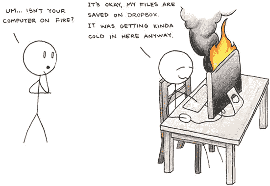
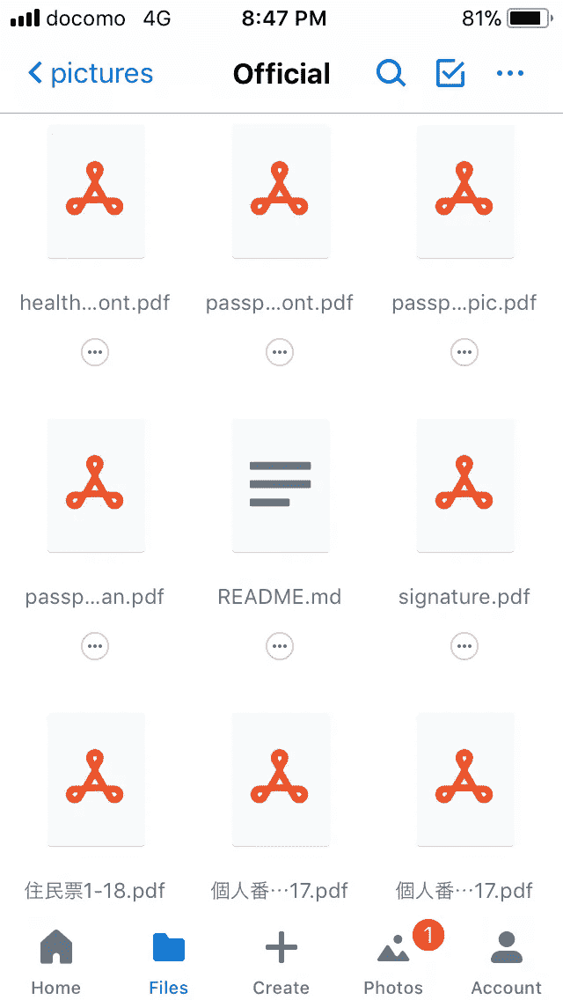
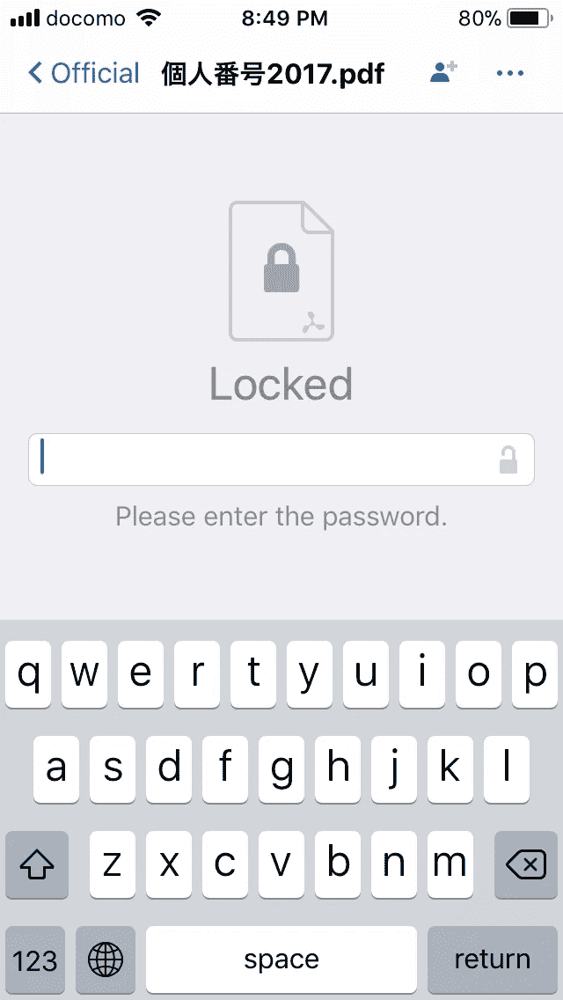
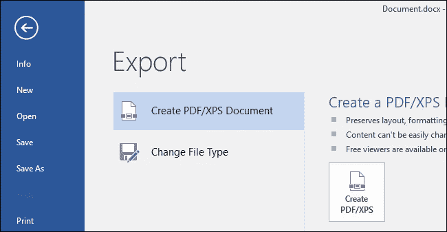
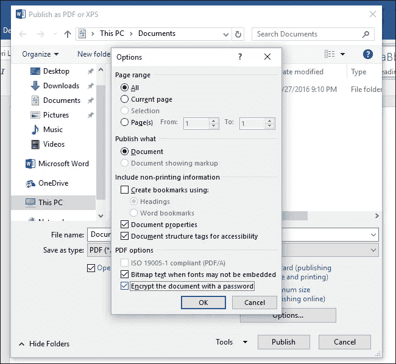
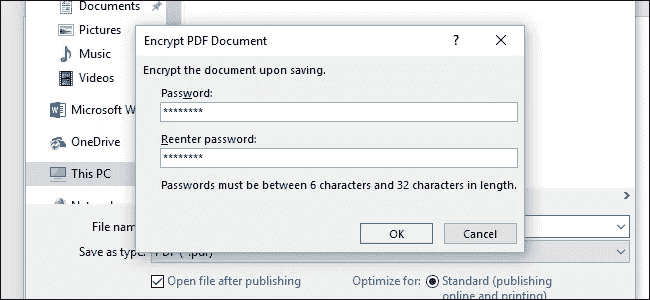
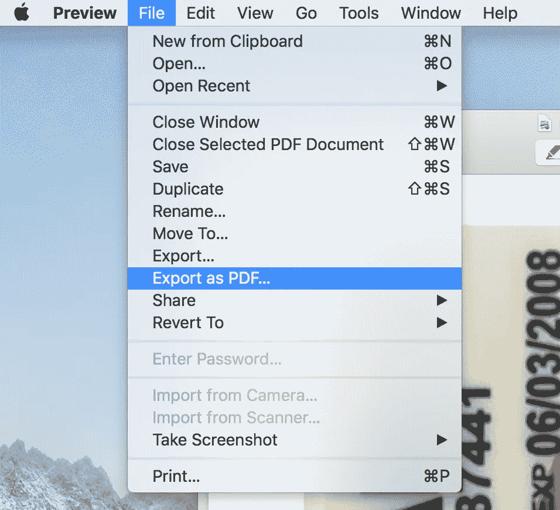
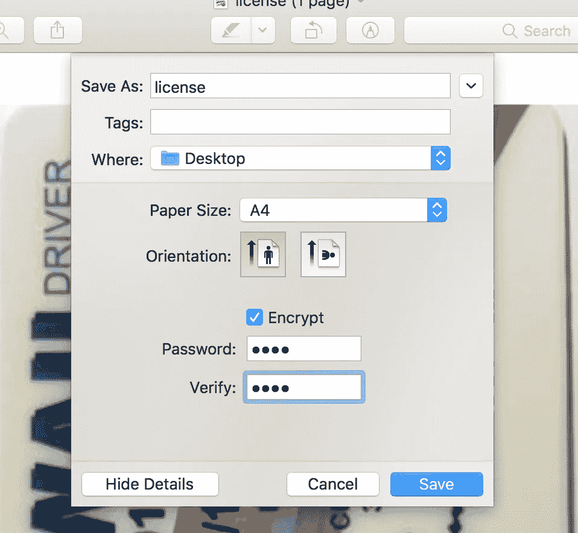

# 密码保护敏感的 Dropbox/Google Drive/I cloud/one Drive 文件

> 原文：<https://medium.com/hackernoon/how-to-password-protect-certain-dropbox-google-drive-icloud-onedrive-files-26be9f15b425>

## 并且仍然可以在手机上访问它们。

2020 年——Dropbox 发现他们的一些核心基础设施遭到破坏的证据。未经授权的人可以访问数百万用户的文件。

你收到一封催款信，来自一家你从未听说过的加密交易所，声称保证金交易让你亏损了 30 万美元。你接到联邦贸易委员会的电话，他们通知你，他们怀疑你的身份被盗。你的生活突然失控，因为你的身份已经被商品化，并在黑暗网络上出售。

倒带。你能做些什么来防止这种情况发生？

有权访问纳税申报表、信用报告、身份证扫描等。不可否认，任何地方都很方便。Dropbox 让我省去了无数次回家拿护照的麻烦，比如在处理公务的时候。它还用作备份存储。另一方面，这也可能是危险的——考虑到如果有人获得了你设备的访问权限，他们就拥有了你个人数据的精美捆绑宝库。



如果您的云存储中或普通的本地存储中有某些特别敏感的文件，您可能希望为这些文件增加额外的安全层。

在你的终端加密文件可以确保你的云提供商无法窥视你的文件*，即使他们* *想要。*

最重要的是，通过下面介绍的设置，您仍然可以在手机上方便地访问文档和照片。

# 困难的方法:使用对称 PGP 加密。

OpenPGP 是一个被广泛接受的标准，符合通用文件加密的要求。

不幸的是，PGP 解密不是我们手机内置的东西。这意味着以后要解密我们手机上的文件，我们需要安装专门的[应用](https://play.google.com/store/apps/details?id=org.sufficientlysecure.keychain&hl=en)。

我不会详细介绍如何使用 PGP 加密，相反，我们将深入研究一种更简单的替代方法，这种方法很可能不需要安装任何额外的东西。

# 更好的方法:PDF 加密。

一种不需要专门应用程序就能更普遍工作的方法是密码保护的 pdf。

PDF 可以保存你喜欢的任何东西:文档、图片、扫描等——这是一种 Androids 和 iPhones 都可以自然处理的格式，即使是带密码的加密格式。

一旦您将最敏感的文档转换为 PDF 并设置了密码保护，您的手机会提示您输入密码以打开它们。

瞧。



This is how it will look when you access a password protected PDF in Dropbox on iOS (on Android the experience parallels).

一剂安心的良药，换来的是一点点便利！

## 通过命令行(Mac/Linux)

**Mac 先决条件**

```
$ brew install qpdf imagemagick
```

**Linux 先决条件**

(确保`qpdf`和`ImageMagick`已安装)

**Linux/Mac 指令**

1.  要转换图像(使用`ImageMagick`)

```
$ convert in.jpg out.pdf
```

2.加密(*用户密码*是查看/打开 PDF 的重要密码，*所有者密码*可以留空)

```
$ cat encrypt_params
--encrypt
user-password
owner-password
256
--
```

(`qpdf` > v7)

```
$ qpdf @encrypt_params in.pdf out.pdf
```

(`qpdf` < v7，*不推荐*)

```
$ qpdf --encrypt user-password owner-password 256 -- in.pdf out.pdf
```

***注:*** *做两件事的一堆图像(* `*zsh*` *语法)*

```
$ for x in *.jpg; do no_ext=${x:r}; convert $x $no_ext-tmp.pdf && qpdf @encrypt_params $no_ext-tmp.pdf $no_ext.pdf && rm $x $no_ext-tmp.pdf ; done
```

## 通过图形用户界面(Windows/Mac)

使用 PowerShell 和`gm.exe` ( [graphicsmagick](http://www.graphicsmagick.org/) )可以将图像转换成 pdf，但是使用 PowerShell 对 pdf 进行密码加密相当困难。下面是使用微软办公软件的说明。

**视窗**

1.在 Microsoft Office 中打开*文件>创建 PDF/XPS 文档*



2.勾选*用密码加密文件*



3.在对话框中确认密码



**Mac**

1.  在预览中打开并按下*文件* > *导出为 PDF…*



2.勾选*加密*，填写密码字段，然后*保存*



P.S. Your password should definitely consist of more than four characters.

现在继续前进**加密**！还可以帮助不太懂计算机的朋友和家人加密！