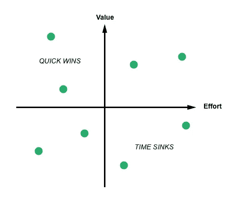

# 打造产品，而不是绒毛:如何优先处理你的待办事项

> 原文：<https://medium.com/hackernoon/how-to-prioritize-your-product-backlog-build-products-not-fluff-ea56d8fd578a>

从鸽子传递信息和马拉车的时代开始，“优先化”这个词就让产品经理们夜不能寐。

在创办公司的早期，你很可能试图解决一个棘手的问题。随着你的公司逐渐成熟，你对你的行业、你的用户流程以及他们的痛点有了更深的了解。在不迷失方向的情况下满足他们的需求可能是一个挑战，不能满足他们的要求可能会导致失去满意的客户。

> “从某种意义上说，只有一个错误会扼杀初创公司:不生产用户想要的东西。”~保罗·格拉厄姆

但这并不意味着你必须构建并解决他们所有的痛点。事实上，你可能无法构建所有的东西，除非你的工资单上有一大群开发人员和设计人员。

作为一名产品经理，当你被功能需求轰炸，并被赋予优先处理甚至你的[项目管理工具](https://zepel.io/blog/jira-alternative/?utm_source=medium&utm_medium=text&utm_campaign=prioritization)都无法处理的积压工作的任务时，很容易忽略大局并优先处理错误的功能。

当你的功能优先级出错时，你的大量资源就会被消耗掉，而你的客户会离开你去购买竞争产品。

那么，如何区分正确功能的优先级呢？

# 对你的产品积压进行优先排序的指南

# 1.关注愿景:

这个世界上有两种产品。表明立场的产品，以及试图取悦所有人的产品。

在人们不断寻求即时满足的时候，很容易屈服于短期目标，试图满足少数客户的要求，希望留住他们。但那只会导致混乱。

当你[开发一个试图取悦所有人的产品](https://zepel.io/blog/product-development-process/?utm_source=medium&utm_medium=text&utm_campaign=prioritization)时，你最终没有取悦任何人，包括你自己的团队。很难理解产品是做什么的，如何使用，甚至很难找到某些按钮在哪里。你的营销团队将很难想出一个故事，你的分析团队最终将无法[跟踪正确的指标](https://blog.zepel.io/measure-metrics-for-feature-success/?utm_source=medium&utm_medium=blog&utm_campaign=prioritization)，你的设计团队甚至需要一个假期来想出一个主意，将你的下一个“棒极了”功能融入产品。

最糟糕的是，客户——这正是你构建这些低挂功能的原因——会感到沮丧，并完全停止使用你的产品。

Image Source — [The Daily WTF](https://thedailywtf.com/articles/Enter_The_Matrix/)

众所周知，自 2007 年推出首款 iPhone 以来，苹果就不让用户在手机上下载文件。自从 2005 年对甘特采取强硬立场以来，大本营就被贴上了意识形态主义者的标签。Android 手机制造商已经下定决心不在每一个 Android 版本中删除他们软件的附加层。

成长中的公司必须学会处理不符合产品愿景的功能需求。如果你想打造出一款与众不同的产品，你就必须做出艰难的决定，对功能需求说不，即使这意味着接受相当多的批评。

**秘诀:忠于你的产品愿景，即使这意味着对你的最高收入客户说不。**

# 2.您的用户在他们的产品旅程中处于什么位置:

在一个完美、简单的世界里，你的大多数活跃用户会因为你没有构建一套特定的功能而对你大喊大叫。事实上，特性优先级排序并不是那么简单。当您查看您的功能积压时，它可能从简单的“添加图像过滤器”到更复杂的“所有图片上传的参与报告”不等。

当不断变化的功能请求让您感到困惑，为什么具有相似配置文件的用户有着毫无共同之处的需求时，您该怎么办？

后退一步，看看你的用户在他们的产品之旅中处于什么位置。

用户在成为你产品的忠实用户之前会经历生命周期的不同阶段。你构建的每一个功能都应该帮助你的用户毫不费力地进入下一个阶段，这样他们就可以用你的产品快速实现他们的目标。

> “很多时候，当你创建软件时，你所创建的与其说是一个工具，不如说是一个成就的环境。”~ [塞缪尔·胡利克](https://medium.com/u/ae1d1c7cf0b6?source=post_page-----ea56d8fd578a--------------------------------)

一旦用户注册了您的产品，他们大致属于以下类别之一:

1.  参加报名
2.  激活的
3.  保存
4.  高兴的

在你开始研究一个特性之前，启动你的分析工具，考虑评估你的大多数用户处于他们的生命周期的哪个阶段。一个刚刚注册并在你的产品上执行了几个动作的用户的痛点，与一个已经积极使用你的产品六个月的用户相比，将是截然不同的。

例如，如果您计划构建一个报告功能来帮助您的用户看到他们所取得的成就的大画面，请考虑您的用户是否已经执行了足够的基本活动来查看您的产品生成的报告中的价值。

**要点:构建功能，让大多数用户进入生命周期的下一阶段。**

# 3.功能的影响

并非所有的功能请求都具有相同的影响。有些功能会让你的用户成为披着斗篷的超级英雄。还有一些功能是高收入客户想要的，但实际上，它们只是另一组值得拥有的功能。

为了构建能够将指针移向正确方向的功能， [Intercom 在图表](https://blog.intercom.com/prioritising-features-wholl-use-it-how-often/)上绘制了他们的功能请求，该图表比较了使用频率与最终将使用这些功能的人数。

我们的想法是将重点放在实现图表右上角的那些——所有用户每次都会使用的那些。你越靠近图的左上角或左下角，构建一个只有部分用户会使用的特性就越危险，甚至更糟糕的是，这个特性只会在很少的情况下使用。

 [## 相关阅读:学习如何用用户故事聚焦用户痛点。

### 想让你的团队关注用户的痛点？了解如何编写用户故事。包括最佳实践、模板和示例。

blog.zepel.io](https://blog.zepel.io/write-user-stories/?utm_source=medium&utm_medium=prioritization) 

> “把你的精力集中在右上方。在这些功能上加倍努力，比在更多的牙签上抽丝剥茧增加了更多的价值……如果你正在构建的功能只有一小部分客户群严重依赖，那么你的产品就做得太多了。”~德·特雷纳

**要点:功能应该根据它们的重要性和影响进行优先排序。而不是顾客支付的价格。**

# 4.工作量和复杂性:

确保您优先考虑正确的功能并让您的客户开心的最后一步是根据看到功能实现所需的努力进一步过滤您的待办事项。

毕竟，每次你的[团队合作开发一个新功能](https://blog.zepel.io/successful-team-collaboration/?utm_source=medium&utm_medium=prioritization)，你的设计团队就必须花时间做研究和客户访谈，你的工程团队就必须考虑技术复杂性并获取新技术的知识。这一点至关重要，因为它关系到你最稀缺的资源——时间。

一旦您计算出构建待办事项列表中的功能所需的工作量，您现在就可以将所有功能映射到一个 2x2 矩阵的值上。

Image Source — [App Cues](https://www.appcues.com/blog/product-prioritization)

当您分割图表时，您最终会将要素映射到四个类别中:

1.  **左上—高值；低投入:**
    这一类特性应该大声疾呼“到底为什么我们现在不去做这件事？”。毕竟，它们是为用户提供高价值的特性，并且可以用最少的努力来构建。
2.  **右上—高值；高努力:**
    你在这个象限下归类的特征是你希望可以忽略的，因为这涉及到很高的努力，但是不能。因为这些特性会为你的用户增加价值，所以考虑把它们分成小的、可执行的模块，你可以把它们重新映射到这个 2x2 矩阵，并重新排列优先级。
3.  **左下—低值；低投入:**
    这些功能对你的用户来说没什么价值，但是可以不费吹灰之力地频繁投入生产。它们有助于给你的用户留下这样的印象:你在不断推出新功能来改善他们的体验，甚至在临近周末的时候也能让你的团队充满活力和动力。毕竟，对于产品团队来说，没有比将功能推向生产更好的士气助推器了。
4.  **右下—低值；高度努力:**
    这些是你现在不应该做的特性，当然，除非你已经穷尽了所有的特性请求和积压的 bug。通过关注其他三个象限，你更有可能为你的用户带来更多的价值。

**要点:构建以最小的成本/努力实现最大价值的功能。**

# 轮到你了

产品经理从全局出发，将它们转化为可操作的后续步骤，通过正确的优先级，他们可以将一个正在挣扎的产品转变为客户离不开的产品。从外部看起来简单明了的事情，需要从多个角度进行思考，包括:

1.  牢记长期愿景。
2.  考虑用户在其生命周期中的位置。
3.  仔细考虑有多少用户会经常使用这个特性。
4.  分析构建功能所需的工作。

*本文原载于* [***Zepel 博客***](https://blog.zepel.io/prioritize-product-feature-backlog/)**2018 年 7 月 12 日*。*

*[***zepel . io***](https://zepel.io/?utm_source=medium&utm_medium=blog&utm_campaign=prioritization)**是* [*免费项目管理软件*](https://zepel.io/blog/free-project-management-software/?utm_source=medium&utm_medium=text&utm_campaign=prioritization) *为产品团队管理积压，协作，按时，每次出货特性。请在评论中给我们留言，或者发送电子邮件至 vikash@zepel.io，告诉我们您的想法和建议。***