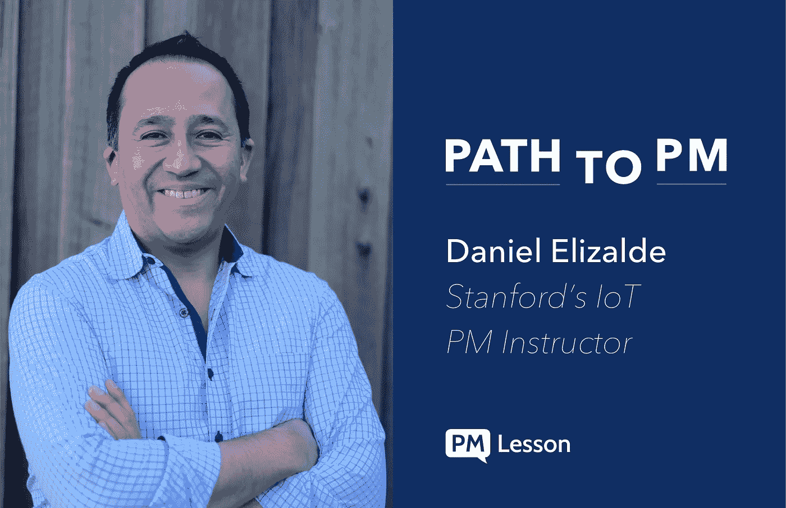

# 如何与斯坦福项目管理讲师 Daniel Elizalde 一起管理自己的职业生涯

> 原文：<https://medium.com/hackernoon/how-to-product-manage-your-own-career-with-stanford-pm-instructor-daniel-elizade-baf37eec9522>

Daniel Elizalde 在斯坦福大学教授物联网产品管理，并全职担任蔻驰的物联网项目经理。丹尼尔和我讨论物联网产品管理，以及如何通过把自己想象成一个产品来成功招聘项目经理。

**告诉我们你是如何进入产品管理行业的。**
我在墨西哥城出生长大，在那里上学，毕业时获得了电子和计算机科学双学位。我的第一份工作是在德克萨斯州奥斯汀的一家名为国家仪器的公司，这是一家工业自动化和仪器仪表公司。那对我来说是一份令人着迷的工作，因为它让我走上了今天从事的物联网道路。

在那家公司，我最喜欢的角色之一是担任咨询团队的解决方案架构师。我的角色是去客户现场了解我们的技术如何解决他们的需求。我喜欢与客户交谈，然后将客户的反馈带回给团队。我可以告诉营销人员如何调整他们的定位，或者 R&D 应该如何针对客户需求开发不同的功能。我对产品的热爱就是从那时开始的。

我从事产品相关的工作已经有 20 年了。

**为什么物联网 PM 特别让你兴奋？我相信这些类型的信息物理系统确实是我们的下一个技术前沿，帮助我们解决我们今天面临的一些最大挑战。**

这些类型的系统正在帮助我们建立一个更可靠的能源网，或者将可再生能源整合到电网中，或者创造自动驾驶汽车，或者帮助我们清洁海洋。诸如此类的事情。我充满激情，因为我可以看到这些不可思议的应用。

**对物联网产品管理有什么误解吗？**
希望去神秘化这种认为 IoT 只是给你发短信的智能烤面包机和咖啡机的想法。这当然存在，但权力存在于更深的地方。

此外，物联网开发的范围要大得多。当你在一个移动应用程序中时，你会遇到连接到 API 等的挑战。这已经够难了。但是，对于这些类型的产品，您有硬件、嵌入式软件、网络硬件/软件、云平台、前端应用程序等。通常，他们会进入关键的基础设施应用领域—能源、医疗保健、水。因此，风险和复杂性的水平被提升到一个很高的程度。

**你对有抱负的产品经理有什么建议？**
把自己想象成一个产品。

如果你是一个项目经理候选人，把自己想象成一个产品，你就开始问正确的问题。谁是我的客户？他们的需求是什么？哪家公司正面临一个难题，而我可能是最佳解决方案？这些问题有助于缩小你可能考虑的公司和机会的类型。否则，它就变成了一个笼统的陈述——“谁在招聘？”我的意思是，我的牙医正在招聘，我应该去那里工作吗？

我从项目经理，甚至是高级项目经理那里得到的一些问题是这样的:“我应该去读 MBA 吗”或者“我应该学习这种编码语言吗？”我说，我不知道。如果你把自己说成是一个产品，你会问一个随机的人你是否应该开发一个新功能吗？

你的“客户”在想什么或关心什么？与他们接触——公司可以告诉你他们在寻找什么样的品质，并帮助你做出正确的职业决定。集中注意力。

我认为问自己这些自省的问题也可以帮助你在面试过程中清晰地说出一个更好的故事。

你会如何回答“你最喜欢的产品是什么，为什么？”PM 面试问题？
我最喜欢的产品之一是特斯拉 Model S 汽车。有趣的是，它真的是一个完整的物联网产品。它有传感器，硬件，收集数据，发送到云，等等。

我真正喜欢那辆车的是，他们没有把它作为物联网产品来推。这是一个独特的，优秀的车辆，解决了运输的用户问题，定位于一个深思熟虑的利基与使命。

**你有没有推荐的书或博客？**
[c . Todd Lombardo 和 Bruce McCarthy](https://amzn.to/2TFKDhf) 重新发布的产品路线图。我认为这是最近出版的最好的书之一。

你还有什么想说的吗？
我的核心任务之一就是继续推进 PM 职业。我确实相信物联网是新的常态，而且比常态复杂得多。项目经理需要迎头赶上，确保我们能够理解这些新趋势。

在他的网站上了解更多关于丹尼尔·埃利萨尔德的信息，你可以阅读他关于物联网产品管理的博客。

访问 [PMLesson 的在线课程](https://www.pmlesson.com/?src=blog)了解更多优秀的产品管理面试准备。

*原载于 2018 年 12 月 11 日*[*【blog.pmlesson.com】*](https://blog.pmlesson.com/product-managing-career/)*。*