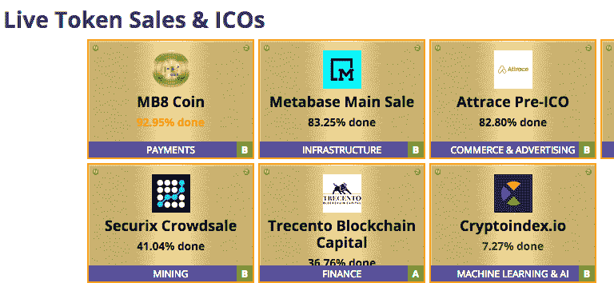

# 如何在不成为垃圾邮件机器人的情况下推广 ICO

> 原文：<https://medium.com/hackernoon/how-to-promote-an-ico-without-being-a-spam-bot-b32ebbdac186>

让我给你介绍一个场景，这是如今很多加密领域的创始人都会遇到的。

你已经花了无数的时间和个人积蓄投资于一家基于令牌化模型的初创公司。如果它获得了牵引力，你的创业公司可以为用户创造一个全新的市场，或者创新一个没有跟上加密热潮和分散账本影响的行业。

因为你的商业模式依赖于令牌化，你决定通过举办首次硬币发行来寻求一轮融资。这可能是明智之举。许多高活力的公司已经通过 ICO 筹集了数百万美元，而那时它们还只是一个想法的核心。尽管过去几年在 ICO 市场上有很多见不得人的交易——以及美国证券交易委员会的严格监管准则——它们仍然是创始人通过联系公众和投资者社区为他们的创业公司筹集资金的绝佳途径。

但是现实场景出现了。这不仅仅是关于你的商业想法的辉煌。这是关于你如何向公众和投资者展示你的创业。问题是:你如何确保你的 ICO 不会陷入骗局式代币销售的海洋？你猜怎么着——这一切都归结于你如何[推广你的 ICO](https://powerfuloutreach.com/how-to-use-pr-to-promote-your-ico/) 。

**如何在不使用垃圾邮件机器人策略的情况下有效推广 ICO**

*   在流行的日历网站上发布日期

你要从告知你的目标社区你计划出售代币的日期开始。有许多日历网站，但只有一些是著名的。换句话说，你不想出去自动给你能找到的每一个日历网站发送电子邮件。这会让你的产品出现在错误类型的投资者面前，构成我们所说的“垃圾邮件机器人”外联。

相反，你想收集最高权威的日历网站，并把重点放在他们身上。这些网站包括 Coinschedule.com、赛博基金、ICOCrowd.com 和其他类似的网站。

以下是 Coinschedule 主页现在的样子:

就你想分享的内容而言，越多越好是正确的做法。如果你在日历网站上提供一些关于代币销售的背景信息，那么记者就可以在他们的充值和即将到来的代币销售列表中分享你的项目细节。

下面是一个精心编写的描述示例:

下面是一个缺乏实质内容的描述的例子:

*   **利用专业团体和平台**

ICO 筹款最大的优点是你可以在很多地方找到投资者。挑战在于让潜在投资者了解你创业想法的价值。它非常像一个[营销](https://hackernoon.com/tagged/marketing)活动，因为你有一个目标受众，你的目标受众经常光顾的流行频道，以及一个旨在提高对你的 ICO 兴趣的出版策略。

最好的开始是在你的在线社区中分享 ICO 你经常去的，或者你的公司已经有了可靠的个人资料的团体。通常，这意味着专业的 LinkedIn 群组、LinkedIn 直邮推广、Medium、Quora 和脸书群组。您希望在所有这些应用程序中共享相同的更新。

具体应该分享什么？这是一个脱离上下文很难回答的问题。虽然这总是取决于公司，但通常内容发布活动有助于传播代币的独特价值主张。内容发布和有针对性的推广这种双重策略来宣传 ICO 日是很常见的，因为它既有效又负担得起。请记住:不要在 LinkedIn 或脸书上使用自动拓展策略。建立真正的联系，向合适的人发送独特的电子邮件。打造优质关系没有捷径！

*   **制定公关策略**

对加密项目的兴趣正在蓬勃发展，如果以正确的方式接触，有许多平台将分享关于即将推出 ICO 的公司的信息。在 [Coindesk](https://www.coindesk.com/) 上实现同步通常是这里的目标，但如果没有一个可靠的[公关策略](https://www.entrepreneur.com/article/173460)，这是徒劳的。

像 Coindesk 这样的流行出版物每天都会收到成千上万的请求，要求发布关于即将推出的 ico 的信息。你可能知道，他们倾向于忽略其中的大多数，而是选择推广他们从与他们有长期工作关系的公关机构那里收到的故事。

虽然登陆 Coindesk 不一定是不可能的，但有其他渠道可以让你的钱产生更好的回报。一个开始的地方是围绕你的产品创作有趣的内容(例如，像一份白皮书),并把它们作为公关活动中的资产。虽然这可能需要你推迟你的 ICO，直到足够多的人知道你，这将增加你达到你的代币销售目标的可能性。

*   坚持你的观点

为你的创业筹集资金从来都不容易。以传统货币运营的初创公司面临着一场艰苦的战斗，要在种子期筹集私人投资者的资金。在加密货币市场运营的初创公司可以指望公共和私人投资者社区进行投资，但在加密市场运营的不良行为者已经破坏了公众对 ico 的信任。寻求 ico 的创业者需要在推广过程中保持警惕，坚持上述策略。