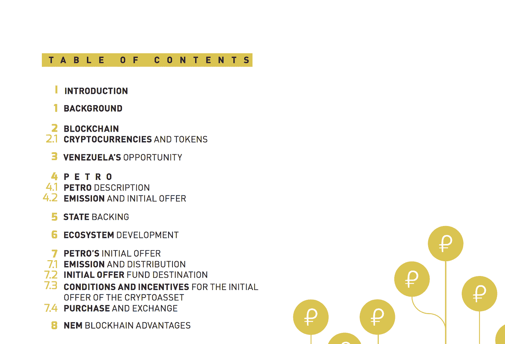
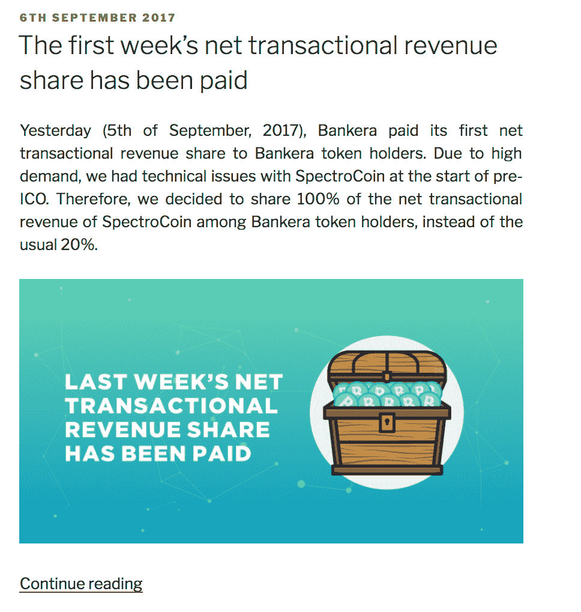
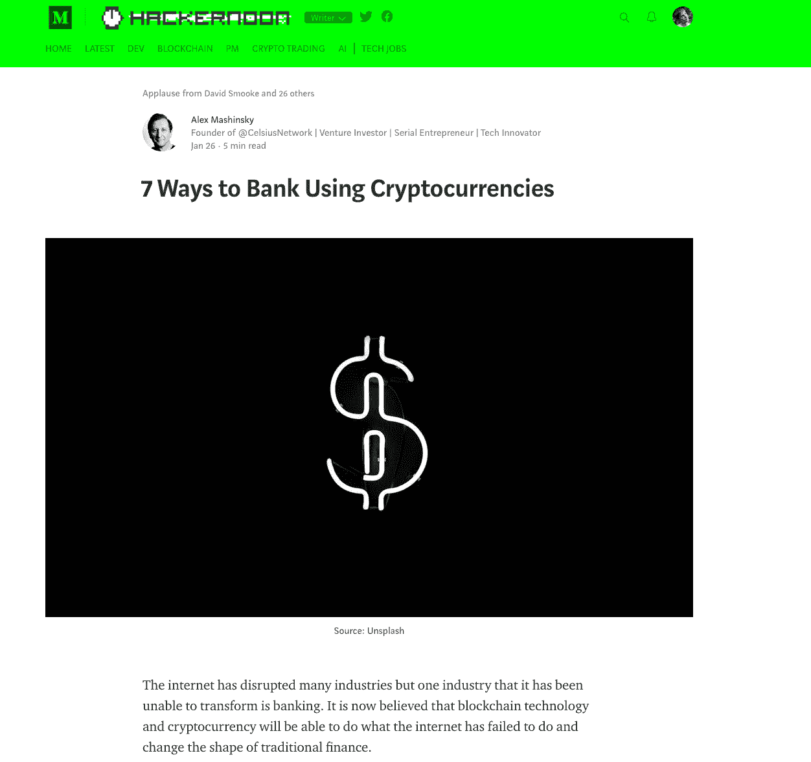

# 如何在后炒作时代推广你的 ICO 个实用技巧

> 原文：<https://medium.com/hackernoon/how-to-promote-your-ico-in-a-post-hype-era-3-practical-tips-6780341139db>

*Image credit:* [*Unsplash*](https://unsplash.com/photos/in9-n0JwgZ0)

去年，我发表了关于如何推广 ICO 的文章，T2 也发表了一份好的白皮书。然而，自那时以来，密码市场发生了巨大的变化，当时有效的东西今天可能没有用了。因此，我决定分析当前形势，并为那些计划进行象征性销售的人提出最新的营销建议。

# **ICO 市场:巨变**

2017 年是加密创业公司创始人的黄金时期。根据[统计](https://news.bitcoin.com/46-last-years-icos-failed-already/)，2017 年有 902 笔代币销售，他们的团队设法筹集了超过 20 亿美元。传统金融和风险资本似乎终于有了替代品。但事实证明远没有这么乐观。

从 2017 年成功的 ICO 批次来看，到 2018 年初，由于创始人拿钱跑路，或者慢慢结束任何活动，46%的项目都死了。这引发了关于 ico 作为融资工具的死亡的讨论。

然而，ico 幸存了下来，2018 年，加密初创公司[筹集了](https://www.bloomberg.com/news/articles/2018-08-08/token-sales-turn-exclusive-as-private-investors-snatch-up-deals?)180 亿美元的巨额资金。有趣的是，这些投资的主要部分都流向了大型项目代币销售(如 Telegram TON ),其主要目标受众是在封闭销售中购买代币的合格投资者。根据 Coinschedule，ICOs 总销售额的 18%是通过私人销售完成的，37%是私人销售。来自 Tokendata 的数据显示，大约 58%的 ico 通过预售获得了资金，正如 Investopedia 的[所引用的](https://www.investopedia.com/news/how-ico-has-totally-changed-2018/)。此外，投资和对冲基金在一个平均成功的 ICO 中的份额现在约为 60-80%。

# **对 ICO 营销人员有什么好处？**

综上所述，很多在 2017 年进行了成功 ICO 的项目，到现在都死了。新的加密冠军已经将他们的注意力从家庭投资者转移到市场专业人士和对冲基金。这就是 ICO 营销人员的变化。

## **白皮书的新方法**

2017 年任何 ICO 的主要目标都是接触尽可能多的人。团队正在寻找潜在的私人投资者，他们可以将一两个比特币投入到他们的新企业中。为了做到这一点，他们制作了明亮、漂亮的营销材料，包括白皮书。这一时期典型的白皮书是一个冗长的 80 多页的 pdf 文件，里面有精美的图像、图表、市场增长预测以及对代币持有者未来利润的计算。

现在不同了。当你的目标受众是有经验的合格投资者，甚至是投资基金时，你必须给他们更多具体的信息。这些人不是密码爱好者，他们需要了解你如何让他们赚钱。

花哨的图片和巨大的白皮书并不能帮助解决这个问题。这就是为什么越来越多的成功项目设计简短的白皮书，并把材料集中在真正重要的与金钱相关的问题上。例如，Petro 项目背后的团队在一次封闭的预售中筹集了 7.35 亿美元，使用了一份 25 页的白皮书，这在 2017 年是难以想象的。

*石油项目白皮书目录*

## **营销转变:少说话，多做生意**

再说一次，今天投资成功 ico 的人不想要娱乐。他们想要关于你的行业、它的问题、你的技术和团队的具体信息。没有粉红色的眼镜和不切实际的预测。这适用于您为支持 ICO 而制作的任何内容。

看看 Bankera 项目如何使用它的博客。这家初创公司在其 ICO 上筹集了 1.5 亿多美元，在 ICO 开始后，就开始写博客向令牌持有者支付交易收入。这是一个坚实的方法，表明有机会获得真金白银。

可能很难创作出引人注目的内容，同时揭示你的商业模式和市场细节。这就是为什么它可能是一个好主意，聘请一个 ICO 内容营销机构。一个有经验的机构将帮助你与当前的趋势保持同步，这正是我们在[微笑明亮媒体公司](https://smilebright.media/eng)所做的。

## **内容分布应该不同**

当你的目标是达到最大数量的加密持有者时，你可以使用任何媒介和工具。但 2018 年这样做的机会比 2017 年初要少。你不能在搜索引擎中使用社交网络和广告，加密媒体想要成千上万美元的赞助内容放置，Telegram 和 Discord 充满了模仿流行博主的骗子，并承诺在他们的博客或频道上创建 ICO 评论。所有这些都使得超级活跃的内容分发对于大多数创业公司来说是不可能的。

今天，为了提高效率，你应该使用一些内容营销工具，如自己的博客和可信的、忠实的加密网站，如 Hackernoon。看看 Celsius network 的创始人是如何用这个博客来描述他的项目及其特点的。它成功了，因为初创公司已经筹集了 5000 万美元。

# **最终想法**

过去几年，我一直在积极研究 ICO 市场。以下是您在 2018 年和 2019 年初推广 ICO 时应该注意的事项:

*   **娱乐不再是你的任务** —如今的 ICO 投资者大多是西装革履的正经家伙；他们需要数字和透彻的分析，他们希望看到你了解正在发生的事情，对现实世界的问题有你的解决方案，并且你的团队有足够的经验来解决这个任务。你的内容应该解决这些问题，就是这样。
*   **将你的推广工具限制在少数几种**——如今 ico 可用的推广工具比以往更加有限，但即使这样也不意味着你应该尝试所有的工具。大多数方法要么成本太高，要么风险太大(比如使用博客等)。)因为仍然有很多骗子。更好的选择是开发自己的渠道，如博客，并在一个活跃的、有针对性的社区的外部网站上传播你的项目(Hackernoon 是这里的首选之一)。
*   **ICO 营销意味着不断的研究** —事物变化如此之快，你应该每天都做研究和进行测试。这篇文章中的任何一点到春天都可能变得完全无关紧要。所以你必须跑步才能呆在原地。这是非常困难的，如果有任何从外部机构或承包商那里获得帮助的选择，这可能是值得利用一些来获得一些额外的时间来完成一个项目。