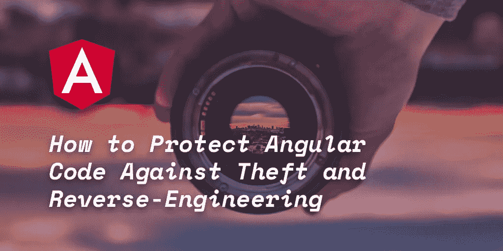
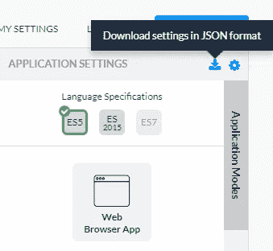
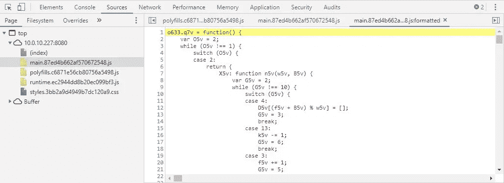

# 如何保护角码免遭盗窃和逆向工程

> 原文：<https://medium.com/hackernoon/how-to-protect-angular-code-against-theft-and-reverse-engineering-7fe218641afe>



[Angular](https://angular.io/) 是最流行的 JavaScript 框架之一。自 2016 年 Angular 2 发布以来，谷歌在短短两年内已经发布了 **5 个新的主要版本**。

这种基于 TypeScript 的框架能够轻松开发 web 和移动前端应用程序。

随着这么多新的 Angular 应用程序的发布，**我们希望确保每个开发人员都可以用最具弹性的混淆和保护形式来轻松保护他们的代码**。

本教程将在几分钟内解释如何将 Jscrambler 无缝集成到 Angular 的构建过程中。如果你是 Angular 的新手，一定要阅读官方的[快速入门](https://angular.io/guide/quickstart)。

# 先决条件

将 Jscrambler 恰当地集成到 Angular 构建过程中只需要做两件事:**创建 Angular 应用**和**配置 Jscrambler** 。我们将在下面强调这两者。

# 如何创建角度应用程序

出于本教程的目的，我们将使用一个 **Angular 7.0** 样板应用程序。如果你正在保护一个使用 Angular 5 或更早版本构建的应用，请参考我们的[文档](https://docs.jscrambler.com/code-integrity/frameworks-and-libraries/angular)。我们还有专门针对 AngularJS 的[教程](https://blog.jscrambler.com/how-to-protect-your-angular-js-application-with-jscrambler/)。

首先，我们需要使用 npm 安装 Angular CLI:

```
npm install -g @angular/cli
```

*Angular CLI* 将下载并安装最新 Angular 版本所需的所有依赖项——在本例中是版本 7。

现在，我们准备创建样板应用程序，它将作为本教程的基础。安装完成后，使用`ng`命令创建这个新应用程序:

```
ng new angular-boilerplate
```

在安装过程中，系统会提示您决定是否要添加角度布线，您还可以选择样式表格式。选择最适合您的选项，等待安装完成。出于本教程的考虑，我们使用默认选项。

然后，我们可以提供这个新创建的样板应用程序:

```
cd angular-boilerplate
ng serve
```

这就是我们拥有一个实用的 *Angular* app 所需要的一切。在浏览器中运行应用程序，检查是否一切就绪。默认情况下，它会在`[http://localhost:4200/](http://localhost:4200/.)` [运行。](http://localhost:4200/.)

如果您需要更多入门信息，请参考[官方文档](https://angular.io/docs)。您也可以运行`ng help`来检查所有可用的命令。

我们的 *Angular* 应用程序的基础项目结构如下:

```
angular-boilerplate/
|-- angular.json
|-- package-lock.json
|-- package.json
|-- tsconfig.json
|-- tslint.json
|-- dist/
| |-- angular-boilerplate/
|-- e2e/
| |-- src/
|-- node_modules/
|-- src/
| |-- app/
| |-- assets/
| |-- environments/
```

*   `angular.json`包含工作区中所有项目的所有 CLI 配置。这里定义了 CLI 使用的构建、服务和测试工具的选项。
*   `package.json`包含所有与 npm 相关的配置，如依赖关系、版本和脚本。
*   `src`目录展示了应用程序的所有源代码。然后构建源代码并打包到`dist`目录中。构建完成后，我们受保护的 HTML 和 JavaScript 文件将放在这里。

# 如何配置 Jscrambler

Jscrambler 的所有配置将驻留在一个文件中:`.jscramblerrc`。因此，我们需要创建这个文件来指定我们希望使用的转换。

最快的方法是通过 Jscrambler 网络应用。在那里，创建一个新的应用程序。现在，在*应用模式*选项卡中，选择语言规范和应用类型。接下来，选择您想要的转换(检查*模板*和*微调*选项卡)。在本教程中，我们将选择*模糊*模板。如果您在这些步骤中需要帮助，请参考我们的[指南](https://blog.jscrambler.com/jscrambler-101-how-to-use-the-cli/)。

现在，我们只需下载一个包含所有这些配置的 JSON 文件，它将只用于快速获得所需的设置。



现在，让我们在 Angular 项目的根文件夹中创建一个名为`.jscramblerrc`的新文件。打开我们刚刚下载的`jscrambler.json`文件，将其所有内容复制到`.jscramblerrc`文件中。在此之后，我们只需在`.jscramblerrc`中添加两个新的区段，即`filesSrc`和`filesDest`(见下文)。您最终的`.jscramblerrc`文件应该是这样的:

```
{
 "keys": {
   "accessKey": <ACCESS_KEY_HERE>,
   "secretKey": <SECRET_KEY_HERE>
 },
 "applicationId": <APP_ID_HERE>,
 "filesSrc": [
   "./dist/**/*.html",
   "./dist/**/*.js"
 ],
 "filesDest": "./",
 "params": [
   {
     "name": "whitespaceRemoval"
   },
   {
     "name": "identifiersRenaming",
     "options": {
       "mode": "SAFEST"
     }
   },
   {
     "name": "dotToBracketNotation"
   },
   {
     "name": "deadCodeInjection"
   },
   {
     "name": "stringConcealing"
   },
   {
     "name": "functionReordering"
   },
   {
     "options": {
       "freq": 1,
       "features": [
         "opaqueFunctions"
       ]
     },
     "name": "functionOutlining"
   },
   {
     "name": "propertyKeysObfuscation"
   },
   {
     "name": "regexObfuscation"
   },
   {
     "name": "booleanToAnything"
   }
 ],
 "areSubscribersOrdered": false,
 "applicationTypes": {
   "webBrowserApp": true,
   "desktopApp": false,
   "serverApp": false,
   "hybridMobileApp": false,
   "javascriptNativeApp": false,
   "html5GameApp": false
 },
 "languageSpecifications": {
   "es5": true,
   "es6": false,
   "es7": false
 },
 "useRecommendedOrder": true,
 "jscramblerVersion": "5.<X>"
}
```

因为我们是通过 Jscrambler Web 应用程序直接获得这些信息的，所以我们的`accessKey`、`secretKey`和`applicationId`字段已经被填充了。如果您希望手动检索它们，请参考我们的[指南](https://blog.jscrambler.com/jscrambler-101-first-use/)。

值得注意的是，`params`部分指定了将用于保护 Angular 应用程序的变换。**您可以通过在 Web 应用程序中选择或手动设置来手动选择这些选项**。您可以在这里找到所有可用转换的文档。

您也可以更改`filesSrc`来匹配您需要/想要保护的文件。对于我们的例子——以及所有 Angular 应用——我们建议保护所有的`.html`和`.js`文件。当然，随着对项目的更好理解，你可以确定什么是关键的和必要的保护。

通过使用`filesDest: './'`，我们发送保护的文件将被它们的受保护版本覆盖。

# 在构建过程中集成 Jscrambler

将 Jscrambler 集成到 Angular 构建过程中有两种主要方式: **Angular CLI** 和 **Webpack** 。我们将在下面讨论这两个问题。

# 通过 Angular CLI 集成 Jscrambler

使用 Angular CLI 可能是生成您的构建的最常见方式。我们将使用样板应用程序来展示如何将 Jscrambler 集成到构建过程中。

我们与 *Jscrambler* 集成的第一步是安装 [Jscrambler API 客户端](https://github.com/jscrambler/jscrambler/tree/master/packages/jscrambler-cli)。只需运行:

```
npm install jscrambler --save-dev
```

为了通过 Angular CLI 将 Jscrambler 集成到我们应用程序的构建过程中，我们需要在`package.json`的*脚本*部分创建一个 CLI 钩子。该部分应该如下所示:

```
"scripts": {
  "ng": "ng",
  "start": "ng serve",
  "build": "ng build",
  "build:prod": "ng build --prod && jscrambler",
  "test": "ng test",
  "lint": "ng lint",
  "e2e": "ng e2e"
},
```

特定的`"build:prod": "ng build --prod && jscrambler"`钩子将在构建过程完成后触发`jscrambler`命令。

为了使这个命令可执行，**我们需要将之前创建的** `**.jscramblerrc**` **文件放在我们项目的根文件夹**中。

我们现在已经准备好通过 Angular CLI 保护我们的代码并构建我们的应用程序:

```
npm run build:prod
```

这将在`dist/<app-name>`上创建生产文件。

你完了！现在，您所有的 HTML 和 JavaScript 文件都受到 Jscrambler 的保护，可以防止代码窃取和逆向工程。

# 通过 Webpack 集成 Jscrambler

随着 Angular 6 和更高版本不再使用`ng eject`命令，要使用 Webpack 构建过程，您必须使用 angular-builder 扩展底层构建配置。

在本教程中，我们将使用 [custom-webpack](https://github.com/meltedspark/angular-builders/tree/master/packages/custom-webpack#custom-webpack-config-object) builder，但也可以随意使用任何其他方法，只要您认为它更适合您的用例。

让我们安装构建器:

```
npm i -D @angular-builders/custom-webpack
```

这样做之后，我们现在应该创建我们的 Webpack 配置文件，该文件将被合并到内置配置中。对于开发和生产版本，您可能希望至少有两种不同的配置。

对于我们的生产配置，我们将只包括 [Jscrambler Webpack 插件](https://github.com/jscrambler/jscrambler/tree/master/packages/jscrambler-webpack-plugin)，它应该使用以下命令安装:

```
npm i --save-dev jscrambler-webpack-plugin
```

为了简单起见，我们将开发 webpack 配置留空，最终的生产配置如下所示:

```
const JscramblerWebpack = require('jscrambler-webpack-plugin');module.exports = {
  plugins: [
    new JscramblerWebpack({
     chunks: ['main']
    })
  ]
};
```

**注意，我们只保护包含所有应用程序逻辑的主块**。

为了开始使用这些新的 webpack 配置，我们将更新`angular.json`文件上的构建选项。

```
...
 "architect": {
   "build": {
     "builder": "[@angular](http://twitter.com/angular)-builders/custom-webpack:browser",
     "options": {
       "customWebpackConfig": {
         "path": "./extra-webpack.config.js"
        },
        …
     },
     "configurations": {
       "production": {
         "customWebpackConfig": {
           "path": "./extra-webpack.config.prod.js"
         },
         …
         "vendorChunk": true,
   ...
```

通过将`vendorChunk`标志设置为 true，所有的供应商内容将被生成到一个单独的包文件中。这是可选的。

相应地更新用于生产的`package.json`构建脚本，它应该如下所示:

```
"scripts": {
  "ng": "ng",
  "start": "ng serve",
  "build": "ng build",
  "build:prod": "ng build --prod",
  "test": "ng test",
  "lint": "ng lint",
  "e2e": "ng e2e"
},
```

通过这些步骤，产品构建`npm run build:prod`将使用 Jscrambler Webpack 客户端来保护您的代码，并使用之前定义的`.jscramblerrc`。

# 测试受保护的 Angular 应用

您可以对新保护的应用程序进行测试，以检查一切是否运行成功。为此，您首先需要安装一个本地服务器，应用程序可以在其中运行:

```
npm install http-server -g
```

然后，你需要设置你的 Angular 应用程序的文件在这个本地服务器上运行。

```
http-server ./dist/angular-boilerplate/
```

现在，您应该能够在终端上看到，您可以在两个端口上运行这个服务器。一个是公开可用的，另一个是特定于您的机器的。

打开提供的 URL，您的应用程序将在浏览器中启动。

现在，您可以查看受保护文件的外观。这可以简单地通过打开浏览器的调试器并从“Sources”选项卡打开文件来实现。受保护的代码应该如下所示:



# 结论

*Angular* 是一个流行且不断发展的框架，**使开发者能够通过利用数据绑定、服务和依赖注入的约定来创建可靠的 web 和移动应用**。

如果你正在构建需要防止代码窃取、逆向工程、盗版、授权违规甚至恶意软件注入的应用程序，Jscrambler 是一个重要的补充。

正如我们已经展示的，将 Jscrambler 集成到 Angular 的构建过程中是非常简单的。如果您需要更多帮助，请随时[联系我们](mailto:support@jscrambler.com)！

*最初发表于*[*blog.jscrambler.com*](https://blog.jscrambler.com/how-to-protect-angular-code-against-theft-and-reverse-engineering/)*。*