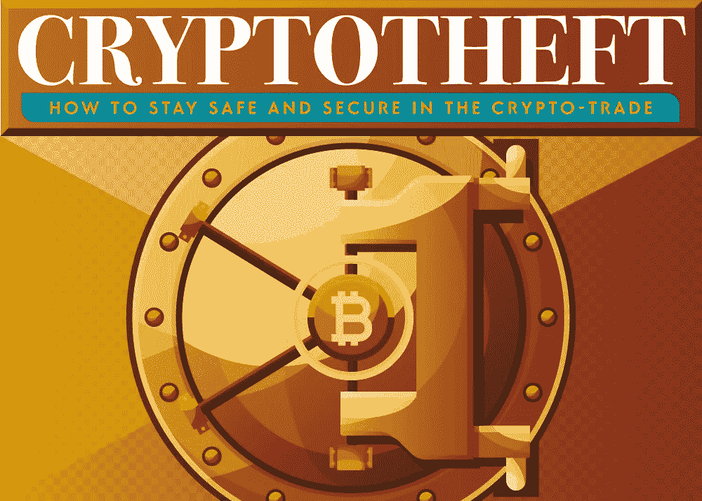
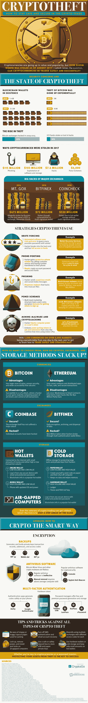

# 如何保护您的密码免受黑客攻击，盗窃和意外

> 原文：<https://medium.com/hackernoon/how-to-protect-your-crypto-from-hacks-theft-and-the-unexpected-b6c6b27398f5>

每周，crypto 都会上头条。这是一个蓬勃发展的行业，有大量的钱可以赚，在加密的波涛汹涌的水域中航行起初可能会令人生畏。随着数不清的网络犯罪紧随交换平台和区块链钱包之后，盗窃是一个非常真实和活跃的威胁，可能会让你损失数千美元。

网络钓鱼黑客或庞氏骗局等经典骗局仍然是网络罪犯最常用的方法。由于被盗密码有如此大的潜力，这些犯罪分子正在加强他们的盗窃活动——而且这是有回报的。2017 年，价值 1.15 亿美元的被盗密码归因于网络钓鱼诈骗，1.03 亿美元归因于软件和存储的利用。

加密、杀毒软件、多因素识别只会让你的资产安全到一个点；关键是预防措施和简单的常识。一些简单的技巧，如关闭短信和电子邮件认证以恢复帐户，使用保险箱存储 USB 和敏感数据，以及注意您输入信息的页面，对于您的加密资产来说，可能意味着一个不同的世界。

每年，比特币盗窃呈指数级增长；从 2013 年的 300 万美元到 2016 年的 9500 万美元。随着加密货币的价值和受欢迎程度的增长，这些数字也会增长。请看这张信息图，了解如何在这个不可预测的市场中保护您的加密资产、安全交易和明智投资。

