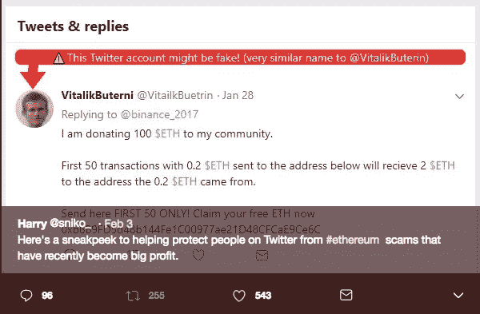

# 如何保护自己免受加密货币诈骗

> 原文：<https://medium.com/hackernoon/how-to-protect-yourself-from-cryptocurrency-scams-2cea7841d444>

## 简单的过滤器可以保护你

十一二岁的时候(*不记得*)。当我收到一封写着 ***【你赢得了 500 美元】*** *的邮件时，我兴奋得跳了起来。*我的欣快并没有持续多久，因为一个刻薄的朋友大喊“ ***这是个骗局，你这个白痴*** ”。

这么多年过去了，一切都没有改变。互联网上的东西永远不会死，它们只是以不同的形式回来了。自从我们有了一项使人们难以追踪的创新以来，欺骗人们从来没有这么容易过。

# 假 ICOs

ico 允许你投资他们的公司来换取代币。我通过 Earn 的电子邮件加入了 telegram 上的几个 ICO 小组。我付钱是为了引起你的注意。如果你加入他们的电报组，他们会免费发放代币。当我加入团队时，如果他们问的第一个问题是 ***“你打算投资多少？”*** 我把他们列为骗局黑名单。这可能不是真的，但在询问我的投资之前，他们应该先谈谈他们的愿景和产品。

在投资之前，问问他们想解决什么问题。如果他们用术语把你弄糊涂了，就跑。在谷歌上查询他们，检查他们是否有关于加密货币、区块链等的内容。我根据内容的质量来判断它们。骗子很可能支付便宜的价格，获得便宜的内容或没有内容。请记住，知名人物的代言可能是伪造的。维塔利克·布特林被安排进了一个他从未听说过的 ICO 团队。

# 扮演

这是老把戏了。假扮成其他人。在社交媒体上开户几乎不需要几分钟。以太坊的创始人 Vitalik Buterin 是被模仿的热门 Twitter 账户之一。

[Original Tweet](https://twitter.com/sniko_/status/959559349734604802)

Fake Account of Ethereum Project ([Original Tweet](https://twitter.com/sniko_/status/959559349734604802))

*Lot more*

哈利开发了一个 chrome 扩展来帮助你。EtherSecurityLookup 突出显示潜在的虚假账户。

[Source](https://harrydenley.com/ethsecuritylookup-chrome-extension-release/)

他还帮助维护以太网。它收集了当前以太坊骗局和钓鱼网站。

[Etherscamdb](https://etherscamdb.info)

# 虚假兑换和钱包诈骗

没有密集使用过交易所。但这里有一些基本的过滤器。谷歌他们！如果这是一个骗局，人们会谈论它。如果交易所没有验证过程，这可能是一个骗局。我试着注册了几家有信誉的交易所，他们很重视验证过程。

我不会在任何钱包上注册，除非它被列在 [ProductHunt](http://producthunt.com) 上。我根据他们的赞成票来评判他们。你可以做的另一件事是找到开发钱包的团队。搜索他们的 Github 库。如果他们没有好的信誉，他们不可能保证你的硬币安全。

Example of a Reputed Github Profile ([MetaMask](https://metamask.io/) Team)

***拍手请*** 👏，*谢谢*😊。*关注我们，*[*HackerNoon*](https://hackernoon.com)*和我(*[*Febin John James*](https://medium.com/u/75a616711f4e?source=post_page-----2cea7841d444--------------------------------)*)了解更多故事。我想给你介绍几项服务。*[*Mentorbox*](https://mentorbox.com/partners?affiliate_id=898086&aff_sub=&aff_sub2=&nopopup=true&noautoplay=false&cookiepreview=false)*总结热门书籍，提供可操作的见解。* [*赚*](https://earn.com/febin/referral/?a=rzjbj73qc4dhiv6y) *付给你读邮件的比特币。***比特币基地是一个支持比特币、比特币现金、以太坊、莱特币的数字货币交易所。**

**