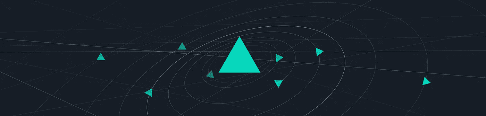
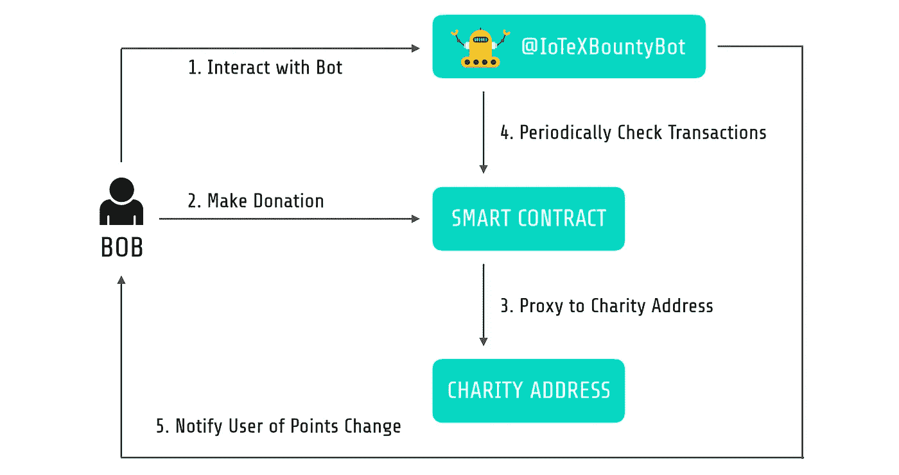

# 如何在慈善捐赠活动中代理付款

> 原文：<https://medium.com/hackernoon/how-to-proxy-payments-during-charity-donation-campaign-62a10c09330f>



感谢我们热爱的社区。慈善捐赠活动取得了巨大的成功！在活动期间，我们收到了来自社区的许多有趣的问题，涉及捐赠渠道如何运作以及为什么它如此强大。答案就在这篇博文里！

# 两个角色的故事

总的来说，在我们的渠道中，有两个主要角色需要捐助者与之互动:bot 和智能合同。具体来说:

1.  一位捐助者 Bob 开始与机器人对话，表示他打算加入活动；一旦被验证，机器人向 Bob 公开智能合同的地址；
2.  Bob 向给定的智能合同发送一定量的 ETH
3.  智能合同验证捐赠者和付款的资格，并将付款代理到慈善机构的地址；
4.  同时，机器人定期根据智能合同检索交易，并检查它们是否通过；
5.  如果是这样，机器人会奖励鲍勃分数，并通过电报通知他。



基本上，智能合同是一种计算机协议，旨在以数字方式促进、验证或执行合同的协商或履行。智能合约允许在没有第三方的情况下进行可信的交易。这些交易是可追踪和不可逆转的。智能合约是由 Nick Szabo 在 1994 年首次提出的，他创造了这个术语。[以太坊](https://www.ethereum.org/)在其区块链上实现了一种图灵完备语言，作为以去中心化方式实现智能合约的框架。IoTeX 使用运行在以太坊之上的智能合约来代理向慈善机构的以太坊钱包付款。

# **让收款变得简单**

为了确保捐赠者有良好的体验，智能支付合同流程应该尽可能简单——从任何以太坊钱包/客户端发送 ETH，无需特殊操作。为了实现这一点，IoTeX 使用了 fallback 函数，这是契约中唯一未命名的函数，如果没有其他函数与给定的函数签名匹配，则在调用契约时执行该函数。我们如下实现了它，例如，一旦向合同发送了付款，就执行回退函数，该函数又调用 donate()来完成实际的工作。

```
function () external payable {
  donate(msg.sender);
}
function donate(address _donor) public payable {
  _preValidateDonate(_donor, msg.value);
  uint GAS_LIMIT = 4000000;
  charity.call.value(msg.value).gas(GAS_LIMIT)();
  donors.push(_donor);
  Donated(msg.sender, msg.value);
}
```

为了将实际付款代理到预期的慈善机构地址，我们首先尝试使用“charity.send()”函数，如果慈善机构使用普通以太坊帐户，该函数可以很好地工作，但是如果慈善机构使用合同帐户接收捐款，该函数将会失败。这是因为“charity.send()”是可重入安全的，并且只将 2,300 gas 津贴转发给下一个合同，这使得下一个合同很容易用完 gas。在这种情况下,“charity.call.value()”函数是正确的选择，因为它将指定数量的汽油转发给下一个合同。

虽然“addr.call.value()”更强大，但它是不可重入安全的，如果使用不当，它很容易导致[可重入攻击](/@JusDev1988/reentrancy-attack-on-a-smart-contract-677eae1300f2)，就像 2016 年的 [DAO 攻击](https://www.coindesk.com/understanding-dao-hack-journalists/)一样。为了安全起见，必须在调用“addr.call.value()”的函数中获取一个互斥体，或者在调用“addr.call.value()”之前改变内部状态，例如将余额清零。在我们的例子中，可重入攻击不是一个问题，因为:a)我们的智能契约是无状态的；b)我们使用慈善机构的地址，而不是寄件人的地址。此外，我们审计了慈善机构的智能合同，以确保它没有恶意代码。

# **留意捐赠者**

“所有人都会犯错”，合同需要提防我们的捐赠者。因此，该合同旨在验证每笔付款:

*   防止非白名单捐赠者捐赠，即我们将约 2600 个批准的白名单地址导入合同，仅允许来自这些地址的付款；
*   防止白名单捐赠者在错误的时间捐赠，即合同仅在 2018 年 3 月 20 日下午 5 点太平洋时间-2018 年 3 月 21 日下午 5 点太平洋时间期间开放；
*   防止白名单捐赠者捐赠非预期金额，即合同只接受> =0.2ETH 和<=1.0ETH and turns down the rest;
*   Prevent from receiving payments from too many donors, i.e., we capped the number of donors to 2600.

In addition, we’ve embedded a pair of admin-only knobs in the smart contract, namely pause() and unpause(), which canhalt the smart contract from receiving payments under emergent circumstances, and resume that when needed.

In all, the validation condition for donation is coded as below.

```
function _preValidateDonate(address _donor, uint256 _weiAmount) internal {
  require(now >= openingTime && now <= closingTime);
  require(!paused);  
  require(donors.length <= maxNumDonors);
  require(whitelist[_donor]);
  require(_donor != address(0));
  require(minWeiAmount <= _weiAmount && _weiAmount <= maxWeiAmount);
}
```

The development of this contract follows the standard software engineering flow strictly:

1.  High coverage by local unit tests;
2.  Functional and load testing in Kovan testnet of Ethereum;
3.  Canaried in the mainnet of Ethereum and dogfooded by the team;
4.  Released for the campaign.

**的付款最后，我们在**[**GitHub**](https://github.com/iotexproject/IOTX-charity-contracts)**上开源了我们的智能合同。如果您看到改进的方法，请随时向我们发送拉请求！**

# 关于 IoTeX

IoTeX 致力于打造下一代面向物联网的区块链平台。尖端的区块链区块链架构将解决与物联网 DApps 和生态系统增长相关的可扩展性、隐私性、隔离性和可开发性问题。通过将象征性激励与我们充满活力的全球社区相结合，我们相信我们可以众包顶级行业和社区人才，推动区块链 3.0 的发展。


*电报组:*[*【https://t.me/IoTeXGroup】*](https://t.me/IoTeXGroup)

*电报通知渠道:*[*https://t.me/iotexchannel*](https://t.me/iotexchannel)

*推特:*[*https://twitter.com/iotex_io*](https://twitter.com/iotex_io)

*加入我们:*[【https://iotex.io/careers】T21](https://iotex.io/careers)