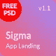

# 如何在 Themeforest 上发布你的 HTML 或 Wordpress 网站模板？

> 原文：<https://medium.com/hackernoon/how-to-publish-your-html-or-wordpress-website-template-on-themeforest-a9844a04deda>

## 关于如何在 Themeforest 上准备和发布 HTML 或 Wordpress 网站模板的初学者简短指南。


Themeforest 是网页开发者和网页设计师获得被动收入的好方法。在过去的两年里，我们在发布和推广模板的过程中积累了经验，我们准备在本文中与您分享。

为了方便起见，整个指南分为几个部分，并提供了示例。

# 1.出版过程

## 1.1.添加新模板

首先，您需要登录您的帐户。然后，你应该去 [*作者仪表板*](https://themeforest.net/author_dashboard) 页面。

接下来，你应该找到*上传项目*部分，并在适当的下拉菜单中选择模板类别(例如 *PSD 模板*、*站点模板*或 *WordPress* )。之后点击*下一个*按钮。

## 1.2.添加模板名称和描述

您应该在模板编辑页面上找到*名称&描述*部分，以填写*名称*和*描述*文本字段。

## 1.2.1.标题

模板的标题应该是唯一的，包含名称和简短描述。例如*超级创意代理 PSD 模板*。

请注意，名称中的每个单词都用大写字母书写(介词和连词除外)，并且使用破折号作为名称和简短描述之间的分隔符。名称的最大长度为 100 个符号。

## 1.2.2.关键特征

只有 3 个文本字段可用。此处放置的文本将显示在搜索结果列表中*预览图像*旁边的模板卡上。

你应该在这里放置你的模板的关键特征。例如，使用什么类型的网格，你设计的总页数，你的模板有详细的文档等等。

## 1.2.3.描述

为了给你的模板创建描述，我们推荐[使用这个神奇的工具](http://revaxarts-themes.com/envatitor/)，它允许你查看应用了降价的文本。问题是 Themeforest 没有内置工具来用 markdown 编辑你的描述。

Themeforest 上典型的模板描述由八个块组成:*关于模板*、*小预览*、包含*文件*(或*页面包含*)、使用字体*、使用*图标*、使用*图片*变更日志*和*注释*。

关于他们每个人的更多信息:

*   *关于模板*部分描述了模板的主要特性和范围。
*   *小预览*部分由一个长的促销图片组成，其主要目的是激励顾客购买。
*   包含的*文件*(或包含的*页面*)部分代表客户购买后将获得的主要文件列表。
*   章节*使用的字体*、*使用的图标* и *使用的图像*只是使用的字体、图标和图像的列表。
*   *变更日志*部分显示所有模板版本和变更。
*   *注释*部分只是对客户的提醒。它说模板中的所有图像仅用于预览，不包括在最终可购买的包中。

典型的模板描述如下所示:

```
<h3>About Template:</h3>
<p>Name — cool and fresh PSD template for lorem ipsum. The layout designed in Adobe Photoshop CC 2015 with a highly professional process to make it easy to use for redesign. Use of smart and vector objects allows to easily change the design according to your requirements. Placeholders will let you easily identify the image container and change an image version. Template files are based on Bootstrap 3 with 1170px grid.
</p>
<h3>Small Preview:</h3>

<h3>Files included:</h3>
<ul>
  <li>00_SUPER_Styleguide.psd</li>
  <li>01_SUPER_Homepage.psd</li>
  <li>02_SUPER_Blog.psd</li>
  <li>03_SUPER_Post.psd</li>
  <li>04_SUPER_Services.psd</li>
  <li>05_SUPER_Item.psd</li>
  <li>06_SUPER_Gallery.psd</li>
  <li>07_SUPER_Contacts.psd</li>
  <li>Documentation.pdf</li>
</ul>
<h3>Fonts used:</h3>
<ul>
  <li><a href-"https://fonts.google.com/specimen/Montserrat">Montserrat</a></li>
</ul>
<h3>Images used:</h3>
<ul>
  <li><a href-"http://ru.depositphotos.com/home.html">DepositPhotos</a></li>
</ul>
<h3>Icons used:</h3>
<ul>
  <li><a href-"http://materialdesignicons.com/">Material Design Icons</a></li>
</ul>
<h3>Changelog:</h3>
<pre>
  Version 1.1 | 12-October-2017
  Added:  Small Styleguide
  Updated:  Preview Images and Texts     
  Version 1.0 | 21-September-2017
  Initial Release
</pre>
<h3>Notes:</h3>
<p><b>Note</b>: All images and icons are used for preview only and not included in the final purchase pack.</p>
<p>If you have any questions about customization, please contact me via e-mail or through my profile page. I’ll help you as soon as possible.</p>
```

请注意，所有文本都应正确书写，不得有任何错误。为此，我们建议你向文案或营销人员寻求帮助。

## 1.2.4.图形描述

模板图形描述应该醒目，以激励客户购买。

这样的图像可能包括很酷的模型中最漂亮的页面，带有 UI 元素动画的 gif 等等。简而言之，在这里你可以说明你的模板特性。


Example of template graphical description (author: @swiftdesign)

将你的图片描述分成几部分是很重要的，因为有时候森林会错误地加载如此长的图片。

一幅图形图像的宽度通常为 590 px 或 616 px，长度小于 2000 px。

👉你可以[在这里](https://drive.google.com/drive/folders/1v3hGZMEF6v1nG_HGKA4lj10h5BYo8fum)下载我们免费的 PSD-图形描述模板。

## 1.3.添加模板文件

你应该在模板编辑页面上找到*文件*部分来填充*缩略图*、*主题预览*、*主文件* и(可选) *WordPress 主题*字段。

## 1.3.1.缩略图图像

*缩略图*用于在推荐列表中吸引客户对您的模板的注意。这就是为什么你要让它引人注目。



Example of Thumbnail (author: @swiftdesign)

它可以由两部分组成:模板徽标和类别(如车间)。

最终的*缩略图*应该保存为 PNG，大小为 80x80 px，命名为*Thumbnail.PNG*。

👉你可以[这里](https://drive.google.com/drive/folders/1v3hGZMEF6v1nG_HGKA4lj10h5BYo8fum)下载我们免费的*缩略图*PSD 模板。

## 1.3.2.预览图像

主预览图像(*预览*)应该放在*主题预览* ZIP-archive 中。

主预览图像用于吸引客户对您在搜索结果列表中的模板的注意。客户基于该图像决定是否更详细地查看模板。这就是为什么你要让它更吸引眼球。

我们强烈建议您适当关注*预览*，因为它可能会增加您的模板销售。


Example of Preview (author: @swiftdesign)

典型的预览图像由四个部分组成:模板徽标、类别(如 Workshop)、主要功能的简短列表(如您使用的网格类型、您设计的页面总数、您的模板是否有详细的文档等)和宣传片(如 cool mockup 中的一些页面)。

最终预览应保存为 JPEG 格式，大小为 590x300 px，并命名为 *01_preview。JPEG* 。预览图像应该放在一个*主题预览* ZIP-archive。

👉你可以[在这里](https://drive.google.com/drive/folders/1v3hGZMEF6v1nG_HGKA4lj10h5BYo8fum)下载我们免费的*预览*PSD 模板。

## 1.3.3.主题预览压缩-存档

*主题预览* ZIP-archive 只是一个存档，包含模板预览图片(截图)和主预览图片(*预览*)。

所有预览图像应保存为 PNG，并命名如下所示。

预览图像的最大尺寸为 900x900 px。此外，您应该注意，这些图像可能会被裁剪以显示在搜索结果列表中。

*主题预览* ZIP-archive 结构应该是这样的:


## 1.3.4.证明文件

*文档*是你的模板中非常重要的一部分，因为没有它，Themeforest 不会批准任何出售的模板。

一般来说，文档可以以任何方便的格式呈现。它可以是 PDF、DOCX、TXT 甚至 HTML 文件。

👉你可以在这里[下载我们免费的*文档模板*。](https://drive.google.com/drive/folders/1v3hGZMEF6v1nG_HGKA4lj10h5BYo8fum)

## 1.3.5.主文件压缩存档

模板文件(*主文件*)是你的模板最重要的部分，因为你的客户会在购买模板后得到这些文件。

*主文件* ZIP-archive 只是一个归档文件，包含模板文件(*模板*文件夹)和文档文件(*文档文件*文件夹)。

例如，*主文件*PSD-template 的 ZIP-archive 结构应该如下所示:


如果是 HTML-template，您应该将项目文件放在*模板*文件夹中。

如果是 Wordpress-template，你应该将 ZIP-archive 重命名为 *WordPress 主题*。

如果是 HTML 文档，您应该将所有必要的文件放在*文档*文件夹中。

请注意，所有内容(照片、插图等)仅用于预览，不应包含在最终的可购买包中。

## 1.4.选择类别和属性

您应该在模板编辑页面上找到*类别&属性*部分来填充字段。

这里最重要的字段是*类别*。请注意，如果您选择了错误的类别，您的模板将无法通过审核过程。

此外，不要忘记在*演示 URL* 字段中粘贴一个演示页面的链接。没有它，Themeforest 不会批准 HTML 和 Wordpress 模板出售。

其余字段(*兼容浏览器*、*文件包括*、*列*等)您可以自行填写。

## 1.5.添加标签

您应该在模板编辑页面上找到*标签*部分，以填充*标签*字段。

您应该注意这个字段，因为客户可以根据这个关键字找到您的模板。正确选择标签有助于增加你的销售额。

如果您不知道如何正确选择标签，我们建议您从竞争对手模板中复制一些标签。

## 1.6.项目支持

您应该在模板编辑页面上找到支持您的项目的*部分，并回答问题*项目将被支持？*。*

请注意，正面回答意味着您将回答问题并帮助您的客户定制您的模板。

## 1.7.选择价格

您应该在模板编辑页面上找到*设置您的价格*部分，并自行设置价格。

选择价格时，我们建议您从平均竞争对手模板价格开始。

## 1.8.*给评审者的信息*

你应该在模板编辑页面的部分找到*给审核者的消息，然后再写一个类似 *Hello 的东西！*在*注释*字段。*

另外，不要忘记勾选*注释*字段下的复选框。

## 1.9.上传模板

找到并点击模板编辑页面末端的*上传*按钮即可。

# 2.更新过程

有两种类型的模板更新:描述和价格更新以及文件和标签更新。

您只能更新说明和价格，而不能更新模板文件。在这种情况下，所有更改都将立即应用。

此外，您可以只更新文件和标签，而不更新模板描述或价格。在这种情况下，所有更改将在审核过程后应用。

如果您更新模板描述、价格、文件和标签，则描述和价格更改将立即应用，而文件和标签更改将在审阅过程后应用。

## 2.1.编辑方式

你应该找到并点击模板页面上*预览*图片下的*编辑*标签。

## 2.2.描述和价格更新

您应该在模板更新页面上找到*更新描述&价格*部分，并更改描述和/或价格。

之后点击*保存更改*按钮。

## 2.3.文件和标签更新

您应该在模板更新页面上找到*更新描述&价格*部分，并更改模板文件和/或标签。

之后只需点击*保存修改*按钮。别忘了勾选复选框*通知买家*。

# 3.删除过程

立正！删除后，您将无法恢复模板。

## 3.1.编辑方式

您应该找到并点击模板页面上*预览*图像下的*编辑*选项卡。

## 3.2.删除模板

你应该在模板更新页面上找到*删除项目*部分，并写一个关于删除原因的简短评论。

之后只需点击*删除此项*按钮。

# 下一步是什么？

如果你对森林上典型的作者账户感兴趣，你可以在这里找到它👇。

[](https://themeforest.net/user/aspirity) [## Aspirity 在 ThemeForest 上的个人资料

### 我们是以西伯利亚为基地的专业团队，他们梦想创造出色的设计，将网络带到最新的…

themeforest.net](https://themeforest.net/user/aspirity) [](http://themes.aspirity.com/) [## Aspirity 模板

### 来自 Aspirity 团队的现代 HTML 模板

themes.aspirity.com](http://themes.aspirity.com/) 

我们将很高兴听到你的意见💬并获得掌声👏。

1.  网址:[aspirity.com/brief](https://aspirity.com/brief)
2.  主题和模板网站:[themes.aspirity.com](http://themes.aspirity.com)
3.  facebook.com/aspiritytemplates
4.  关于森林主题的电报聊天:[t.me/joinchat/envato](http://t.me/joinchat/AESbpkJtlabf0CWPXzEvjg)